# Novelty Evaluation: Conformal Inference

## Run Metadata

**Run context**

| Field | Value |
|-------|-------|
| Timestamp | 2026-03-18T02:39:30Z |
| Branch | copilot/remove-report-prefix-in-filename |
| Commit | [`2503e42`](https://github.com/yulinl2/Open-Idea-Sourcing/commit/2503e42ac53e29dc3ff9aecd8bec4b9b503db75a) |
| CI Run | [Run #23226486850](https://github.com/yulinl2/Open-Idea-Sourcing/actions/runs/23226486850) |

**Configuration**

| Field | Value |
|-------|-------|
| Model | gpt-4o |
| Input | https://arxiv.org/abs/2006.06138 |
| Code version | 1.0.0 |

**Performance**

| Field | Value |
|-------|-------|
| Total runtime | 19.3s |
| └─ parsing | 4.7s |
| └─ similarity | 0.0s |
| └─ evaluation | 13.7s |

## Pipeline Job Log

```mermaid
gantt
    title Pipeline Run — Conformal Inference
    dateFormat x
    axisFormat %S.%Ls
    section PaperParser
    Parse paper :done, 0, 4720ms
    section SimilaritySearch
    Similarity search :done, 4720, 1ms
    section LLM (gpt-4o)
    Duplication check :done, 5642, 3291ms
    Combination check :done, 8933, 4257ms
    Equivalence check :done, 13191, 2950ms
    Synthesis :done, 16140, 3188ms
```

| # | Job | Agent | Start (s) | Duration (s) | Input | Output |
|---|-----|-------|----------:|-------------:|-------|--------|
| 1 | Parse paper | PaperParser | 0.00 | 4.72 | 2006.06138.pdf | "Conformal Inference", 111859 chars |
| 2 | Similarity search | SimilaritySearch | 4.72 | 0.00 | paper key content | top-0 match(es) |
| 3 | Duplication check | LLM (gpt-4o) | 5.64 | 3.29 | paper content + 0 reference paper(s) | verdict=LOW |
| 4 | Combination check | LLM (gpt-4o) | 8.93 | 4.26 | paper content + 0 reference paper(s) | verdict=LOW |
| 5 | Equivalence check | LLM (gpt-4o) | 13.19 | 2.95 | paper content + 0 reference paper(s) | verdict=MEDIUM |
| 6 | Synthesis | LLM (gpt-4o) | 16.14 | 3.19 | 3 dimension results | verdict=NOVEL, confidence=HIGH |

**Overall verdict:** ✅ **NOVEL** (confidence: HIGH)

## Summary

The paper "Conformal Inference" presents a novel contribution to the field of causal inference by integrating conformal inference techniques into the estimation of counterfactuals and individual treatment effects. While conformal inference and causal inference methodologies are well-established individually, their combination to address the critical issue of reliable uncertainty quantification in treatment effect heterogeneity is innovative. The paper effectively addresses a significant gap in the literature by providing a method that ensures reliable interval estimates with guaranteed coverage, which is a substantial advancement over existing methods. The originality of the approach and its potential impact on sensitive decision-making contexts justify a high confidence in its novelty.

## Detailed Analysis

### Direct Duplication

**Risk level:** 🟢 LOW

The submitted paper introduces a novel approach to conformal inference for counterfactuals and individual treatment effects, which is not a direct duplicate of any known or referenced work. The paper addresses the limitations of existing methods in uncertainty quantification for treatment effect heterogeneity and proposes a conformal inference-based method that offers reliable interval estimates. This approach is distinct in its application to both randomized experiments and observational studies, and it claims to achieve desired coverage with shorter intervals compared to existing methods. The focus on conformal inference for individual treatment effects under the potential outcome framework appears to be an original contribution, as no reference papers were provided to suggest otherwise.

### Simple Combination

**Risk level:** 🟢 LOW

The submitted paper presents a novel approach by integrating conformal inference techniques into the estimation of counterfactuals and individual treatment effects (ITE) within the potential outcome framework. The components of this work draw from existing literature on causal inference, particularly the estimation of average treatment effects (ATE) and conditional average treatment effects (CATE), as well as the application of machine learning algorithms for these purposes. However, the paper addresses a significant gap in the current literature: the lack of reliable uncertainty quantification in these estimates. By leveraging conformal inference, the authors provide a method that ensures reliable interval estimates with guaranteed average coverage, which is a substantial advancement over existing methods that suffer from coverage deficits. This integration of conformal inference into causal inference for ITE estimation is not merely a combination of existing works but rather a meaningful contribution that addresses a critical need for uncertainty quantification in sensitive decision-making contexts.

### Methodological Equivalence

**Risk level:** 🟡 MEDIUM

The submitted paper proposes a conformal inference-based approach for estimating counterfactuals and individual treatment effects (ITE) under the potential outcome framework. Conformal inference is a well-established method for constructing prediction intervals with guaranteed coverage properties. The novelty claimed in the paper lies in applying conformal inference to causal inference problems, specifically for counterfactuals and ITEs. This application leverages the conformal prediction framework to provide interval estimates with coverage guarantees, which is a known strength of conformal methods. The paper also discusses the doubly robust property, which is a concept already established in causal inference literature, particularly in the context of estimating treatment effects where either the propensity score or the outcome model needs to be correctly specified for consistent estimation. The combination of conformal inference with causal inference concepts like doubly robust estimation is a novel application, but the underlying methodologies themselves are well-established.
