# Novelty Evaluation: Conformal Inference

## Run Metadata

**Run context**

| Field | Value |
|-------|-------|
| Timestamp | 2026-03-18T06:47:20Z |
| Branch | copilot/fix-blank-report |
| Commit | [`c2aa9af`](https://github.com/yulinl2/Open-Idea-Sourcing/commit/c2aa9afa6e68aafd247be9b313c4d54a2ca8a65b) |
| CI Run | [Run #23232579928](https://github.com/yulinl2/Open-Idea-Sourcing/actions/runs/23232579928) |

**Configuration**

| Field | Value |
|-------|-------|
| Model | gpt-4o |
| Input | https://arxiv.org/abs/2006.06138 |
| Code version | 1.1.0 |

**Performance**

| Field | Value |
|-------|-------|
| Total runtime | 17.7s |
| └─ parsing | 5.4s |
| └─ similarity | 0.0s |
| └─ evaluation | 11.6s |

## Pipeline Job Log

```mermaid
gantt
    title Pipeline Run — Conformal Inference
    dateFormat x
    axisFormat %S.%Ls
    section PaperParser
    Parse paper :done, 0, 5430ms
    section SimilaritySearch
    Similarity search :done, 5430, 1ms
    section LLM (gpt-4o)
    Duplication check :done, 6138, 3093ms
    Combination check :done, 9231, 2352ms
    Equivalence check :done, 11583, 4109ms
    Synthesis :done, 15693, 2008ms
```

| # | Job | Agent | Start (s) | Duration (s) | Input | Output |
|---|-----|-------|----------:|-------------:|-------|--------|
| 1 | Parse paper | PaperParser | 0.00 | 5.43 | 2006.06138.pdf | "Conformal Inference", 111859 chars |
| 2 | Similarity search | SimilaritySearch | 5.43 | 0.00 | paper key content | top-0 match(es) |
| 3 | Duplication check | LLM (gpt-4o) | 6.14 | 3.09 | paper content + 0 reference paper(s) | verdict=LOW |
| 4 | Combination check | LLM (gpt-4o) | 9.23 | 2.35 | paper content + 0 reference paper(s) | verdict=LOW |
| 5 | Equivalence check | LLM (gpt-4o) | 11.58 | 4.11 | paper content + 0 reference paper(s) | verdict=MEDIUM |
| 6 | Synthesis | LLM (gpt-4o) | 15.69 | 2.01 | 3 dimension results | verdict=MARGINAL, confidence=MEDIUM |

**Overall verdict:** ⚠️ **MARGINAL** (confidence: MEDIUM)

## Summary

The paper presents a novel application of conformal inference to the domain of causal inference, specifically targeting counterfactuals and individual treatment effects. While the integration of conformal inference in this context is innovative and addresses a significant gap in uncertainty quantification, the underlying methodology of conformal inference itself is well-established and has been applied to similar problems in recent literature. The contribution is more about the specific application and empirical validation rather than a groundbreaking methodological advancement, leading to a verdict of marginal novelty.

## Detailed Analysis

### Direct Duplication

**Risk level:** 🟢 LOW

The submitted paper presents a novel approach to conformal inference for counterfactuals and individual treatment effects, focusing on providing reliable interval estimates under the potential outcome framework. The paper addresses the limitations of existing methods in terms of uncertainty quantification, particularly in the context of causal inference. The authors propose a method that guarantees average coverage in finite samples for randomized experiments and observational studies, which is a significant advancement over existing methods that suffer from coverage deficits. The paper's emphasis on conformal inference and its application to individual treatment effects, along with the doubly robust property, suggests that it is not a direct duplicate of any known or referenced work. The absence of reference papers further supports the originality of the submitted work.

### Simple Combination

**Risk level:** 🟢 LOW

The submitted paper presents a novel approach by integrating conformal inference with the estimation of counterfactuals and individual treatment effects (ITE) within the potential outcome framework. The concept of conformal inference is a well-established statistical method used for constructing prediction intervals with guaranteed coverage, but its application to causal inference, particularly in estimating ITEs and counterfactuals, is innovative. The paper addresses a significant gap in the literature by focusing on uncertainty quantification in causal inference, which is often overlooked in existing methods that primarily emphasize point estimation. The authors propose a method that provides reliable interval estimates with guaranteed average coverage, even in finite samples, which is a substantial advancement over traditional approaches that struggle with coverage deficits. This integration of conformal inference into the causal inference domain, especially with a focus on individual treatment effects, constitutes a genuine insight and a valuable contribution to the field.

### Methodological Equivalence

**Risk level:** 🟡 MEDIUM

The submitted paper proposes a conformal inference-based approach to produce reliable interval estimates for counterfactuals and individual treatment effects (ITE) under the potential outcome framework. The novelty claimed by the authors lies in the application of conformal inference to causal inference problems, specifically for estimating ITEs. Conformal inference is a well-established statistical method that provides distribution-free prediction intervals with guaranteed coverage. It has been widely used in various domains for uncertainty quantification. The application of conformal inference to causal inference, particularly for ITE estimation, is a relatively recent development but not entirely novel. The concept of using conformal prediction in causal inference has been explored in recent literature, where it is used to provide valid prediction intervals for potential outcomes and treatment effects. The paper's contribution seems to be more about the specific application and empirical demonstration rather than a fundamentally new methodological development. Therefore, while the framing and application domain differ, the underlying methodology is not entirely novel.

## Run Metadata

| Field | Value |
|-------|-------|
| Timestamp | 2026-03-18T06:47:20Z |
| Model | gpt-4o |
| Input | https://arxiv.org/abs/2006.06138 |
| Code version | 1.1.0 |
| Total runtime | 17.7s |
|   parsing | 5.4s |
|   similarity | 0.0s |
|   evaluation | 11.6s |
