# Novelty Evaluation: Conformal Inference

## Run Metadata

**Run context**

| Field | Value |
|-------|-------|
| Timestamp | 2026-03-18T06:53:20Z |
| Branch | main |
| Commit | [`392ef05`](https://github.com/yulinl2/Open-Idea-Sourcing/commit/392ef0572e7ece111f68ff9f33561b627dce6661) |
| CI Run | [Run #23232739361](https://github.com/yulinl2/Open-Idea-Sourcing/actions/runs/23232739361) |

**Configuration**

| Field | Value |
|-------|-------|
| Model | gpt-4o |
| Input | https://arxiv.org/abs/2006.06138 |
| Code version | 1.1.0 |

**Performance**

| Field | Value |
|-------|-------|
| Total runtime | 17.1s |
| └─ parsing | 5.5s |
| └─ similarity | 0.0s |
| └─ evaluation | 11.0s |

## Pipeline Job Log

```mermaid
gantt
    title Pipeline Run — Conformal Inference
    dateFormat x
    axisFormat %S.%Ls
    section PaperParser
    Parse paper :done, 0, 5480ms
    section SimilaritySearch
    Similarity search :done, 5480, 1ms
    section LLM (gpt-4o)
    Duplication check :done, 6068, 2888ms
    Combination check :done, 8957, 2833ms
    Equivalence check :done, 11790, 3386ms
    Synthesis :done, 15176, 1922ms
```

| # | Job | Agent | Start (s) | Duration (s) | Input | Output |
|---|-----|-------|----------:|-------------:|-------|--------|
| 1 | Parse paper | PaperParser | 0.00 | 5.48 | 2006.06138.pdf | "Conformal Inference", 111859 chars |
| 2 | Similarity search | SimilaritySearch | 5.48 | 0.00 | paper key content | top-0 match(es) |
| 3 | Duplication check | LLM (gpt-4o) | 6.07 | 2.89 | paper content + 0 reference paper(s) | verdict=LOW |
| 4 | Combination check | LLM (gpt-4o) | 8.96 | 2.83 | paper content + 0 reference paper(s) | verdict=LOW |
| 5 | Equivalence check | LLM (gpt-4o) | 11.79 | 3.39 | paper content + 0 reference paper(s) | verdict=MEDIUM |
| 6 | Synthesis | LLM (gpt-4o) | 15.18 | 1.92 | 3 dimension results | verdict=MARGINAL, confidence=MEDIUM |

**Overall verdict:** ⚠️ **MARGINAL** (confidence: MEDIUM)

## Summary

The paper presents a novel application of conformal inference to the domain of causal inference, specifically for counterfactuals and individual treatment effects. While the approach addresses a significant gap in uncertainty quantification and offers a doubly robust property, the core methodology of conformal inference is well-established. The novelty lies in the application rather than in the development of new methodological principles, leading to a verdict of marginal novelty. The confidence in this assessment is medium, given the innovative integration of existing methods into a new application area.

## Detailed Analysis

### Direct Duplication

**Risk level:** 🟢 LOW

The submitted paper presents a novel approach to conformal inference for counterfactuals and individual treatment effects, which is not a direct duplicate of any known or referenced work. The paper addresses the limitations of existing methods in uncertainty quantification for treatment effect heterogeneity and proposes a conformal inference-based method that guarantees average coverage in finite samples. This approach is distinct in its application to both randomized experiments and observational studies, offering a doubly robust property. The focus on reliable interval estimates for counterfactuals and individual treatment effects under the potential outcome framework appears to be a novel contribution, particularly in the context of addressing the coverage deficits of existing methods. Without any reference papers provided, there is no evidence to suggest that the core ideas, methods, or results are identical to prior art.

### Simple Combination

**Risk level:** 🟢 LOW

The submitted paper presents a novel approach by integrating conformal inference with the estimation of counterfactuals and individual treatment effects (ITE) under the potential outcome framework. While conformal inference and causal inference are established fields, the paper's contribution lies in applying conformal inference to provide reliable interval estimates for ITEs, addressing a significant gap in uncertainty quantification for causal inference. The paper's approach ensures average coverage in finite samples for randomized experiments and demonstrates a doubly robust property for observational studies. This combination is not merely a simple amalgamation of existing methods but rather a meaningful advancement that addresses the limitations of current machine learning methods in causal inference, particularly in terms of uncertainty quantification. The application of conformal inference to this domain is innovative and provides a unifying contribution that enhances decision-making in fields requiring individualized treatment assessments.

### Methodological Equivalence

**Risk level:** 🟡 MEDIUM

The paper proposes a method for conformal inference in the context of counterfactuals and individual treatment effects (ITE). Conformal inference is a well-established statistical technique used to create prediction intervals with guaranteed coverage properties. The novelty claimed by the authors lies in applying conformal inference to the domain of causal inference, specifically for estimating counterfactuals and ITEs. While the application domain is different, the underlying methodology of conformal inference remains the same. The paper frames the problem in the context of causal inference, but the core idea of using conformal prediction to obtain intervals with coverage guarantees is not new. The concept of using conformal prediction for uncertainty quantification in machine learning and statistical models is well-documented in the literature. The paper's contribution is more about the application of an existing method to a new domain rather than a fundamentally new methodological development.

## Run Metadata

| Field | Value |
|-------|-------|
| Timestamp | 2026-03-18T06:53:20Z |
| Model | gpt-4o |
| Input | https://arxiv.org/abs/2006.06138 |
| Code version | 1.1.0 |
| Total runtime | 17.1s |
|   parsing | 5.5s |
|   similarity | 0.0s |
|   evaluation | 11.0s |
