# Novelty Evaluation: Conformal Inference

## Run Metadata

**Run context**

| Field | Value |
|-------|-------|
| Timestamp | 2026-03-18 03:46:17 EDT |
| Branch | copilot/skip-site-build |
| Commit | [`ee38096`](https://github.com/yulinl2/Open-Idea-Sourcing/commit/ee38096291c5eaafa977c5760faaa74f910d9e52) |
| CI Run | [Run #23234310004](https://github.com/yulinl2/Open-Idea-Sourcing/actions/runs/23234310004) |

**Configuration**

| Field | Value |
|-------|-------|
| Model | gpt-4o |
| Input | https://arxiv.org/abs/2006.06138 |
| Code version | 1.1.0 |

**Performance**

| Field | Value |
|-------|-------|
| Total runtime | 20.9s |
| └─ parsing | 4.7s |
| └─ similarity | 0.0s |
| └─ evaluation | 15.6s |

## Pipeline Job Log

```mermaid
gantt
    title Pipeline Run — Conformal Inference
    dateFormat x
    axisFormat %S.%Ls
    section PaperParser
    Parse paper :done, 0, 4710ms
    section SimilaritySearch
    Similarity search :done, 4710, 1ms
    section LLM (gpt-4o)
    Duplication check :done, 5332, 3102ms
    Combination check :done, 8434, 3356ms
    Equivalence check :done, 11790, 5715ms
    Synthesis :done, 17505, 3412ms
```

| # | Job | Agent | Start (s) | Duration (s) | Input | Output |
|---|-----|-------|----------:|-------------:|-------|--------|
| 1 | Parse paper | PaperParser | 0.00 | 4.71 | 2006.06138.pdf | "Conformal Inference", 111859 chars |
| 2 | Similarity search | SimilaritySearch | 4.71 | 0.00 | paper key content | top-0 match(es) |
| 3 | Duplication check | LLM (gpt-4o) | 5.33 | 3.10 | paper content + 0 reference paper(s) | verdict=LOW |
| 4 | Combination check | LLM (gpt-4o) | 8.43 | 3.36 | paper content + 0 reference paper(s) | verdict=LOW |
| 5 | Equivalence check | LLM (gpt-4o) | 11.79 | 5.71 | paper content + 0 reference paper(s) | verdict=MEDIUM |
| 6 | Synthesis | LLM (gpt-4o) | 17.50 | 3.41 | 3 dimension results | verdict=MARGINAL, confidence=MEDIUM |

**Overall verdict:** ⚠️ **MARGINAL** (confidence: MEDIUM)

## Summary

The paper presents a novel application of conformal inference to the domain of causal inference, specifically for estimating counterfactuals and individual treatment effects. While the integration of conformal inference with causal inference methodologies represents a meaningful advancement, the core methodology of conformal prediction is not new and has been applied in various contexts. The contribution lies primarily in the adaptation of existing techniques to a new problem area, rather than the development of a fundamentally new statistical method. The novelty is thus considered marginal, with a medium level of confidence due to the innovative application in a less-explored domain.

## Detailed Analysis

### Direct Duplication

**Risk level:** 🟢 LOW

The submitted paper titled "Conformal Inference of Counterfactuals and Individual Treatment Effects" by Lihua Lei and Emmanuel J. Candès presents a novel approach to uncertainty quantification in causal inference using conformal inference methods. The paper addresses the limitations of existing methods in providing reliable interval estimates for counterfactuals and individual treatment effects, particularly in randomized experiments and observational studies. While the paper builds on existing concepts in causal inference, such as the conditional average treatment effect (CATE) and individual treatment effects (ITE), it introduces a new methodology that guarantees average coverage in finite samples and demonstrates a doubly robust property. The focus on conformal inference as a tool for uncertainty quantification in this context appears to be a novel contribution, and there is no indication that the core ideas, methods, or results are directly duplicated from any known or referenced work.

### Simple Combination

**Risk level:** 🟢 LOW

The submitted paper presents a novel approach by integrating conformal inference with the estimation of counterfactuals and individual treatment effects (ITE) under the potential outcome framework. While conformal inference is a well-established method for constructing prediction intervals with guaranteed coverage, its application to causal inference, specifically for counterfactuals and ITE, represents a significant innovation. The paper addresses a critical gap in the literature by providing reliable interval estimates for ITE, which is crucial for decision-making in fields like medicine and public policy. The authors also introduce a doubly robust property for randomized experiments and observational studies, which ensures coverage if either the propensity score or the conditional quantiles can be accurately estimated. This combination of conformal inference with causal inference methodologies is not merely a simple combination of existing works but rather a meaningful advancement that addresses the limitations of current methods in uncertainty quantification for treatment effects.

### Methodological Equivalence

**Risk level:** 🟡 MEDIUM

The submitted paper proposes a conformal inference-based approach to produce reliable interval estimates for counterfactuals and individual treatment effects (ITE) under the potential outcome framework. The novelty claimed by the authors lies in the application of conformal inference to causal inference problems, specifically for estimating ITEs. However, the concept of using conformal prediction for uncertainty quantification is not new and has been applied in various domains, including regression and classification tasks. Conformal prediction is a well-established method that provides distribution-free prediction intervals with guaranteed coverage, which aligns with the paper's claim of providing intervals with guaranteed average coverage in finite samples.

The paper's approach can be seen as an adaptation of conformal prediction to the causal inference setting, particularly focusing on ITEs. While the application to causal inference might be less common, the underlying methodology of conformal prediction remains the same. The paper also discusses the doubly robust property, which is a concept already present in causal inference literature, particularly in the context of estimating treatment effects where either the propensity score or the outcome model needs to be correctly specified for consistent estimation.

The paper's contribution appears to be more of a novel application of existing conformal prediction techniques to a specific problem in causal inference rather than a fundamentally new methodology. Therefore, the equivalence is subtle and lies in the adaptation of conformal prediction to a new domain rather than the development of a new statistical method.
