# Novelty Evaluation: Conformal Inference

## Run Metadata

**Run context**

| Field | Value |
|-------|-------|
| Timestamp (America/New_York) | 2026-03-18 11:06:45 -0400 America/New_York (UTC: 2026-03-18T15:06:45Z) |
| Branch | copilot/skip-site-build |
| Commit | [`de575ab`](https://github.com/yulinl2/Open-Idea-Sourcing/commit/de575abfea410be0bd61d1d9053f72f87e94b178) |
| CI Run | [Run #23251549282](https://github.com/yulinl2/Open-Idea-Sourcing/actions/runs/23251549282) |

**Configuration**

| Field | Value |
|-------|-------|
| Model | gpt-4o |
| Input | https://arxiv.org/abs/2006.06138 |
| Code version | 1.1.0 |

**Performance**

| Field | Value |
|-------|-------|
| Total runtime | 40.0s |
| └─ parsing | 4.9s |
| └─ similarity | 0.0s |
| └─ evaluation | 34.6s |

## Pipeline Job Log

```mermaid
gantt
    title Pipeline Run — Conformal Inference
    dateFormat x
    axisFormat %S.%Ls
    section PaperParser
    Parse paper :done, 0, 4900ms
    section SimilaritySearch
    Similarity search :done, 4900, 1ms
    section LLM (gpt-4o)
    Duplication check :done, 5460, 6276ms
    Combination check :done, 11736, 15274ms
    Equivalence check :done, 27010, 7222ms
    Synthesis :done, 34232, 5809ms
```

| # | Job | Agent | Start (s) | Duration (s) | Input | Output |
|---|-----|-------|----------:|-------------:|-------|--------|
| 1 | Parse paper | PaperParser | 0.00 | 4.90 | 2006.06138.pdf | "Conformal Inference", 111859 chars |
| 2 | Similarity search | SimilaritySearch | 4.90 | 0.00 | paper key content | top-0 match(es) |
| 3 | Duplication check | LLM (gpt-4o) | 5.46 | 6.28 | paper content + 0 reference paper(s) | verdict=LOW |
| 4 | Combination check | LLM (gpt-4o) | 11.74 | 15.27 | paper content + 0 reference paper(s) | verdict=LOW |
| 5 | Equivalence check | LLM (gpt-4o) | 27.01 | 7.22 | paper content + 0 reference paper(s) | verdict=MEDIUM |
| 6 | Synthesis | LLM (gpt-4o) | 34.23 | 5.81 | 3 dimension results | verdict=MARGINAL, confidence=MEDIUM |

**Overall verdict:** ⚠️ **MARGINAL** (confidence: MEDIUM)

## Summary

The paper presents a novel application of conformal inference to the domain of causal inference, specifically for counterfactuals and individual treatment effects, which is a unique contribution. However, the underlying methodology of conformal inference remains unchanged, and the paper primarily adapts existing techniques to a new context rather than introducing fundamentally new methods. While the integration of conformal inference with causal inference is innovative, the paper re-derives known concepts such as double robustness, limiting its overall novelty. The contribution is valuable but more incremental, warranting a verdict of marginal novelty.

## Detailed Analysis

### Direct Duplication

**Risk level:** 🟢 LOW

The submitted paper introduces a novel approach to conformal inference for counterfactuals and individual treatment effects, which is distinct from existing literature. The focus on using conformal inference to provide reliable interval estimates in the context of treatment effect heterogeneity is a unique contribution. The paper addresses the limitations of current methods in uncertainty quantification and proposes a solution that guarantees average coverage in finite samples. This approach is particularly relevant for randomized experiments and observational studies, offering a doubly robust property. The paper's emphasis on practical applications and empirical demonstrations further distinguishes it from prior work, which often lacks reliable coverage in simple models. Without any reference papers provided, there is no direct evidence of duplication.

### Simple Combination

**Risk level:** 🟢 LOW

The submitted paper presents a novel approach by integrating conformal inference with the estimation of counterfactuals and individual treatment effects (ITE) under the potential outcome framework. While conformal inference and causal inference are established fields, the combination of these methodologies to address the challenge of uncertainty quantification in estimating ITE is innovative. The paper identifies a gap in current methods, which often fail to provide reliable interval estimates for ITE, and proposes a solution with theoretical guarantees of coverage. This integration is not a straightforward combination of existing techniques but rather a thoughtful synthesis that addresses a critical issue in causal inference, particularly in sensitive applications like medicine and public policy. The paper's contribution lies in its ability to offer reliable uncertainty quantification, which is crucial for decision-making in these fields.

### Methodological Equivalence

**Risk level:** 🟡 MEDIUM

The submitted paper proposes a conformal inference-based approach for estimating counterfactuals and individual treatment effects (ITE) within the potential outcome framework. Conformal inference is a well-established methodology in the field of statistical learning, primarily used for constructing prediction intervals with guaranteed coverage. The novelty claimed in the paper is the application of conformal inference to causal inference problems, specifically for counterfactuals and ITEs. While the application domain (causal inference) and the framing (counterfactuals and ITEs) are specific, the underlying methodology of conformal inference remains unchanged. The paper's approach can be seen as an adaptation of conformal prediction techniques to a new domain rather than a fundamentally new method. The doubly robust property mentioned in the paper is also a well-known concept in causal inference, where either the propensity score or the outcome model needs to be correctly specified for consistent estimation. This suggests that the paper is re-deriving known concepts (conformal inference and double robustness) in the context of causal inference, rather than introducing a novel methodology.
