# Novelty Evaluation: Conformal Inference

## Run Metadata

**Run context**

| Field | Value |
|-------|-------|
| Timestamp (America/New_York) | 2026-03-18 11:16:33 -0400 America/New_York (UTC: 2026-03-18T15:16:33Z) |
| Branch | main |
| Commit | [`099cf15`](https://github.com/yulinl2/Open-Idea-Sourcing/commit/099cf156f28154d18b4f4266fe54288028947196) |
| CI Run | [Run #23252020441](https://github.com/yulinl2/Open-Idea-Sourcing/actions/runs/23252020441) |

**Configuration**

| Field | Value |
|-------|-------|
| Model | gpt-4o |
| Input | https://arxiv.org/abs/2006.06138 |
| Code version | 1.1.0 |

**Performance**

| Field | Value |
|-------|-------|
| Total runtime | 20.9s |
| └─ parsing | 5.2s |
| └─ similarity | 0.0s |
| └─ evaluation | 15.0s |

## Pipeline Job Log

```mermaid
gantt
    title Pipeline Run — Conformal Inference
    dateFormat x
    axisFormat %S.%Ls
    section PaperParser
    Parse paper :done, 0, 5230ms
    section SimilaritySearch
    Similarity search :done, 5230, 1ms
    section LLM (gpt-4o)
    Duplication check :done, 5925, 3152ms
    Combination check :done, 9077, 2790ms
    Equivalence check :done, 11867, 7060ms
    Synthesis :done, 18927, 2001ms
```

| # | Job | Agent | Start (s) | Duration (s) | Input | Output |
|---|-----|-------|----------:|-------------:|-------|--------|
| 1 | Parse paper | PaperParser | 0.00 | 5.23 | 2006.06138.pdf | "Conformal Inference", 111859 chars |
| 2 | Similarity search | SimilaritySearch | 5.23 | 0.00 | paper key content | top-0 match(es) |
| 3 | Duplication check | LLM (gpt-4o) | 5.92 | 3.15 | paper content + 0 reference paper(s) | verdict=LOW |
| 4 | Combination check | LLM (gpt-4o) | 9.08 | 2.79 | paper content + 0 reference paper(s) | verdict=LOW |
| 5 | Equivalence check | LLM (gpt-4o) | 11.87 | 7.06 | paper content + 0 reference paper(s) | verdict=MEDIUM |
| 6 | Synthesis | LLM (gpt-4o) | 18.93 | 2.00 | 3 dimension results | verdict=MARGINAL, confidence=MEDIUM |

**Overall verdict:** ⚠️ **MARGINAL** (confidence: MEDIUM)

## Summary

The paper "Conformal Inference of Counterfactuals and Individual Treatment Effects" presents a novel application of conformal inference to the domain of causal inference, specifically for estimating individual treatment effects. While the approach addresses a significant gap in the literature by providing reliable interval estimates, the underlying methodology of conformal inference is well-established and has been previously explored in similar contexts. The contribution lies more in the specific application and empirical validation rather than introducing a fundamentally new methodology, leading to a verdict of marginal novelty.

## Detailed Analysis

### Direct Duplication

**Risk level:** 🟢 LOW

The submitted paper titled "Conformal Inference of Counterfactuals and Individual Treatment Effects" by Lihua Lei and Emmanuel J. Candès presents a novel approach to uncertainty quantification in causal inference using conformal inference methods. The paper focuses on providing reliable interval estimates for counterfactuals and individual treatment effects, which is a significant departure from traditional methods that primarily focus on estimating conditional average treatment effects (CATE). The authors address the limitations of existing machine learning methods in terms of uncertainty quantification and propose a method that guarantees average coverage in finite samples. This approach is particularly relevant in fields like medicine and public policy, where decision-making under uncertainty is crucial. The paper does not appear to be a direct duplicate of any known or referenced work, as it introduces new methodologies and addresses specific gaps in the existing literature on causal inference.

**Cited references:** `none.`

### Simple Combination

**Risk level:** 🟢 LOW

The submitted paper presents a novel approach by integrating conformal inference with the estimation of counterfactuals and individual treatment effects (ITE) within the potential outcome framework. While conformal inference and causal inference are established fields, their combination to address the specific problem of uncertainty quantification in ITE is innovative. The paper addresses a significant gap in the literature by providing reliable interval estimates for ITE, which is crucial for decision-making in fields like medicine and public policy. The authors highlight the limitations of existing methods in terms of coverage and demonstrate the effectiveness of their approach through empirical studies. This work is not merely a combination of existing methods but rather a meaningful advancement that addresses a critical issue in causal inference.

### Methodological Equivalence

**Risk level:** 🟡 MEDIUM

The submitted paper proposes a conformal inference-based approach for constructing reliable interval estimates for counterfactuals and individual treatment effects (ITE) within the potential outcome framework. The novelty claimed by the authors lies in the application of conformal inference to causal inference problems, specifically for ITE estimation. Conformal inference is a well-established statistical technique used for constructing prediction intervals with guaranteed coverage properties, regardless of the underlying data distribution. The method has been extensively used in various domains, including regression and classification tasks, to provide distribution-free prediction intervals.

The application of conformal inference to causal inference, particularly for estimating ITEs, is an interesting extension but not entirely novel. The concept of using conformal prediction for uncertainty quantification in causal inference has been explored in recent literature. The paper's contribution seems to be more about the specific application and empirical demonstration of conformal inference in the context of ITEs rather than introducing a fundamentally new methodology. The doubly robust property mentioned, which ensures coverage if either the propensity score or the conditional quantiles are accurately estimated, aligns with existing ideas in causal inference literature, where doubly robust estimators are a common approach to handle model misspecification.

While the framing and application domain differ, the underlying methodology of conformal inference remains consistent with established techniques. Therefore, the paper's contribution is more of an adaptation and application of existing methods rather than a novel methodological advancement.
