# Novelty Evaluation: Conformal Inference

## Run Metadata

**Run context**

| Field | Value |
|-------|-------|
| Timestamp (America/New_York) | 2026-03-18 11:26:59 -0400 America/New_York (UTC: 2026-03-18T15:26:59Z) |
| Branch | copilot/add-online-reference-search |
| Commit | [`2229998`](https://github.com/yulinl2/Open-Idea-Sourcing/commit/2229998ff4511fb08c26b374f9b31c3c5c2823d9) |
| CI Run | [Run #23252496986](https://github.com/yulinl2/Open-Idea-Sourcing/actions/runs/23252496986) |

**Configuration**

| Field | Value |
|-------|-------|
| Model | gpt-4o |
| Input | https://arxiv.org/abs/2006.06138 |
| Code version | 1.1.0 |

**Performance**

| Field | Value |
|-------|-------|
| Total runtime | 19.4s |
| └─ parsing | 5.4s |
| └─ online_search | 0.3s |
| └─ similarity | 0.0s |
| └─ evaluation | 13.2s |

## Pipeline Job Log

```mermaid
gantt
    title Pipeline Run — Conformal Inference
    dateFormat x
    axisFormat %S.%Ls
    section PaperParser
    Parse paper :done, 0, 5380ms
    section SemanticScholar API
    Online reference search :done, 5380, 270ms
    section SimilaritySearch
    Similarity search :done, 5650, 1ms
    section LLM (gpt-4o)
    Duplication check :done, 6267, 3648ms
    Combination check :done, 9915, 2944ms
    Equivalence check :done, 12859, 4043ms
    Synthesis :done, 16902, 2517ms
```

| # | Job | Agent | Start (s) | Duration (s) | Input | Output |
|---|-----|-------|----------:|-------------:|-------|--------|
| 1 | Parse paper | PaperParser | 0.00 | 5.38 | 2006.06138.pdf | "Conformal Inference", 111859 chars |
| 2 | Online reference search | SemanticScholar API | 5.38 | 0.27 | title="Conformal Inference" | 0 paper(s) fetched |
| 3 | Similarity search | SimilaritySearch | 5.65 | 0.00 | paper key content | top-0 match(es) |
| 4 | Duplication check | LLM (gpt-4o) | 6.27 | 3.65 | paper content + 0 reference paper(s) | verdict=LOW |
| 5 | Combination check | LLM (gpt-4o) | 9.91 | 2.94 | paper content + 0 reference paper(s) | verdict=LOW |
| 6 | Equivalence check | LLM (gpt-4o) | 12.86 | 4.04 | paper content + 0 reference paper(s) | verdict=MEDIUM |
| 7 | Synthesis | LLM (gpt-4o) | 16.90 | 2.52 | 3 dimension results | verdict=MARGINAL, confidence=MEDIUM |

**Overall verdict:** ⚠️ **MARGINAL** (confidence: MEDIUM)

## Summary

The paper presents a novel application of conformal inference to causal inference, specifically for estimating individual treatment effects and counterfactuals. While the integration of these methodologies is innovative and addresses a critical gap in the literature, the underlying techniques are adaptations of existing conformal prediction and doubly robust estimation methods. The novelty primarily lies in the application rather than the development of new methodologies, which leads to a verdict of marginal novelty. The confidence in this assessment is medium due to the paper's potential impact in practical fields like medicine and public policy, despite its methodological equivalence to established techniques.

## Detailed Analysis

### Direct Duplication

**Risk level:** 🟢 LOW

The submitted paper titled "Conformal Inference of Counterfactuals and Individual Treatment Effects" presents a novel approach to uncertainty quantification in causal inference using conformal inference methods. The paper addresses the limitations of existing methods in providing reliable interval estimates for counterfactuals and individual treatment effects, particularly in randomized experiments and observational studies. The authors propose a method that guarantees average coverage in finite samples and demonstrates a doubly robust property under certain conditions. This approach appears to be a novel contribution to the field of causal inference, as it focuses on improving the reliability of interval estimates, which is a critical aspect of decision-making in sensitive environments. The paper does not seem to duplicate any known or referenced work, as it introduces new theoretical insights and empirical evidence supporting the proposed method's effectiveness.

### Simple Combination

**Risk level:** 🟢 LOW

The submitted paper presents a novel approach to uncertainty quantification in causal inference by integrating conformal inference with the estimation of individual treatment effects (ITE) and counterfactuals. While the concept of conformal inference is not new, its application to the domain of causal inference, particularly in the context of ITE and counterfactuals, represents a significant and innovative contribution. The paper addresses a critical gap in the existing literature by providing reliable interval estimates that are robust to the unknown data-generating mechanism, a feature not commonly found in traditional methods. This approach is particularly valuable in fields like medicine and public policy, where decision-making under uncertainty is crucial. The combination of conformal inference with causal inference methodologies is not merely a straightforward amalgamation of existing techniques but rather a thoughtful integration that offers genuine insights and practical benefits.

### Methodological Equivalence

**Risk level:** 🟡 MEDIUM

The submitted paper proposes a conformal inference-based approach for producing interval estimates for counterfactuals and individual treatment effects (ITE) under the potential outcome framework. The novelty claimed in the paper lies in the application of conformal inference to the domain of causal inference, specifically for ITE estimation. Conformal inference is a well-established method for constructing prediction intervals with finite-sample coverage guarantees. The application of conformal inference to causal inference problems, particularly for uncertainty quantification in ITE, is a novel framing but not entirely new in terms of methodology. The paper's approach can be seen as an adaptation of conformal prediction techniques to the causal inference domain, which is a subtle re-derivation of existing conformal methods rather than a completely new methodology. The doubly robust property mentioned in the paper is also a well-known concept in causal inference, where estimators are robust to misspecification of either the propensity score model or the outcome model. Therefore, while the application to ITE is novel, the underlying methods are equivalent to established conformal prediction and doubly robust estimation techniques.
