# Novelty Evaluation: Conformal Inference

## Run Metadata

**Run context**

| Field | Value |
|-------|-------|
| Timestamp (America/New_York) | 2026-03-18 12:04:22 -0400 America/New_York (UTC: 2026-03-18T16:04:22Z) |
| Branch | copilot/add-online-reference-search |
| Commit | [`1878af6`](https://github.com/yulinl2/Open-Idea-Sourcing/commit/1878af6035eb33c0b1b30fe436f934dedeb298bc) |
| CI Run | [Run #23254257683](https://github.com/yulinl2/Open-Idea-Sourcing/actions/runs/23254257683) |

**Configuration**

| Field | Value |
|-------|-------|
| Model | gpt-4o |
| Input | https://arxiv.org/abs/2006.06138 |
| Code version | 1.1.0 |

**Performance**

| Field | Value |
|-------|-------|
| Total runtime | 35.2s |
| └─ parsing | 5.3s |
| └─ online_search | 0.3s |
| └─ similarity | 0.0s |
| └─ evaluation | 28.8s |

## Pipeline Job Log

```mermaid
gantt
    title Pipeline Run — Conformal Inference
    dateFormat x
    axisFormat %S.%Ls
    section PaperParser
    Parse paper :done, 0, 5290ms
    section SemanticScholar API
    Online reference search :done, 5290, 340ms
    section SimilaritySearch
    Similarity search :done, 5630, 1ms
    section LLM (gpt-4o)
    Duplication check :done, 6382, 9244ms
    Combination check :done, 15626, 11094ms
    Equivalence check :done, 26720, 4926ms
    Synthesis :done, 31646, 3519ms
```

| # | Job | Agent | Start (s) | Duration (s) | Input | Output |
|---|-----|-------|----------:|-------------:|-------|--------|
| 1 | Parse paper | PaperParser | 0.00 | 5.29 | 2006.06138.pdf | "Conformal Inference", 111859 chars |
| 2 | Online reference search | SemanticScholar API | 5.29 | 0.34 | title="Conformal Inference" | 0 paper(s) fetched |
| 3 | Similarity search | SimilaritySearch | 5.63 | 0.00 | paper key content | top-0 match(es) |
| 4 | Duplication check | LLM (gpt-4o) | 6.38 | 9.24 | paper content + 0 reference paper(s) | verdict=LOW |
| 5 | Combination check | LLM (gpt-4o) | 15.63 | 11.09 | paper content + 0 reference paper(s) | verdict=LOW |
| 6 | Equivalence check | LLM (gpt-4o) | 26.72 | 4.93 | paper content + 0 reference paper(s) | verdict=MEDIUM |
| 7 | Synthesis | LLM (gpt-4o) | 31.65 | 3.52 | 3 dimension results | verdict=NOVEL, confidence=MEDIUM |

**Overall verdict:** ✅ **NOVEL** (confidence: MEDIUM)

## Summary

The paper "Conformal Inference of Counterfactuals and Individual Treatment Effects" presents a novel application of conformal inference to the domain of causal inference, specifically targeting the estimation of individual treatment effects and counterfactuals. While the core technique of conformal inference is well-established, its integration with causal inference to address uncertainty quantification is innovative and addresses a significant gap in the literature. The approach's ability to provide reliable interval estimates with a doubly robust property enhances its contribution to the field. Despite the medium equivalence verdict, the originality in application and combination justifies a novel overall verdict.

## Detailed Analysis

### Direct Duplication

**Risk level:** 🟢 LOW

The submitted paper titled "Conformal Inference of Counterfactuals and Individual Treatment Effects" presents a novel approach to uncertainty quantification in causal inference using conformal inference methods. The paper addresses the limitations of existing methods in providing reliable interval estimates for counterfactuals and individual treatment effects, particularly in randomized experiments and observational studies. The authors propose a method that guarantees average coverage in finite samples and demonstrates a doubly robust property under certain conditions. This approach appears to be a novel contribution to the field, as it specifically targets the issue of coverage deficits in existing methods and provides a new solution using conformal inference. Without reference papers provided, there is no indication that the core ideas, methods, or results are duplicated from prior work.

### Simple Combination

**Risk level:** 🟢 LOW

The submitted paper presents a novel approach by integrating conformal inference with the estimation of individual treatment effects (ITE) and counterfactuals, which is not a simple combination of existing works. Conformal inference is a statistical technique used for creating prediction intervals with guaranteed coverage, and it has been primarily applied in the context of prediction problems. The paper extends this methodology to the domain of causal inference, specifically for estimating ITEs and counterfactuals, which is a significant advancement. The authors address a critical gap in the current literature by focusing on uncertainty quantification in the estimation of treatment effects, an area where traditional machine learning methods often fall short. This integration provides a robust framework for producing reliable interval estimates in randomized experiments and observational studies, offering a doubly robust property that enhances its applicability. The combination of conformal inference with causal inference techniques to address the challenges of uncertainty quantification in ITE estimation constitutes a genuine insight and a valuable contribution to the field.

### Methodological Equivalence

**Risk level:** 🟡 MEDIUM

The submitted paper proposes a conformal inference-based approach to produce reliable interval estimates for counterfactuals and individual treatment effects (ITE) under the potential outcome framework. While the paper frames this as a novel application to causal inference, the underlying methodology of conformal inference is not new. Conformal prediction is a well-established method for creating prediction intervals with guaranteed coverage, introduced by Vladimir Vovk and others in the early 2000s. The novelty here lies in the application of conformal inference to the specific problem of estimating ITEs and counterfactuals, rather than in the development of a new statistical method. The paper also discusses the doubly robust property, which is a concept already present in causal inference literature, particularly in the context of estimating treatment effects using propensity scores and outcome models. The combination of these existing methodologies in the context of causal inference is innovative, but the core techniques themselves are well-established.
