# Novelty Evaluation: Conformal Inference

## Run Metadata

**Run context**

| Field | Value |
|-------|-------|
| Timestamp (America/New_York) | 2026-03-18 12:08:07 -0400 America/New_York (UTC: 2026-03-18T16:08:07Z) |
| Branch | copilot/algo-iterative-search-decomposition |
| Commit | [`c4775b7`](https://github.com/yulinl2/Open-Idea-Sourcing/commit/c4775b731a05dbc5d3ff0c25ddf9fba1ab35fe76) |
| CI Run | [Run #23254448429](https://github.com/yulinl2/Open-Idea-Sourcing/actions/runs/23254448429) |

**Configuration**

| Field | Value |
|-------|-------|
| Model | gpt-4o |
| Input | https://arxiv.org/abs/2006.06138 |
| Code version | 1.1.0 |

**Performance**

| Field | Value |
|-------|-------|
| Total runtime | 40.1s |
| └─ parsing | 5.5s |
| └─ similarity | 4.3s |
| └─ evaluation | 30.1s |

## Pipeline Job Log

```mermaid
gantt
    title Pipeline Run — Conformal Inference
    dateFormat x
    axisFormat %S.%Ls
    section PaperParser
    Parse paper :done, 0, 5540ms
    section LLM (gpt-4o)
    Idea decomposition :done, 5540, 4280ms
    Duplication check :done, 10103, 9888ms
    Combination check :done, 19991, 2585ms
    Equivalence check :done, 22576, 10561ms
    Synthesis :done, 33137, 7013ms
```

| # | Job | Agent | Start (s) | Duration (s) | Input | Output |
|---|-----|-------|----------:|-------------:|-------|--------|
| 1 | Parse paper | PaperParser | 0.00 | 5.54 | 2006.06138.pdf | "Conformal Inference", 111859 chars |
| 2 | Idea decomposition | LLM (gpt-4o) | 5.54 | 4.28 | paper key content | 5 idea(s) → 0 unique ref(s) |
| 3 | Duplication check | LLM (gpt-4o) | 10.10 | 9.89 | paper content + 0 reference paper(s) | verdict=LOW |
| 4 | Combination check | LLM (gpt-4o) | 19.99 | 2.58 | paper content + 0 reference paper(s) | verdict=LOW |
| 5 | Equivalence check | LLM (gpt-4o) | 22.58 | 10.56 | paper content + 0 reference paper(s) | verdict=MEDIUM |
| 6 | Synthesis | LLM (gpt-4o) | 33.14 | 7.01 | 3 dimension results | verdict=MARGINAL, confidence=MEDIUM |

**Overall verdict:** ⚠️ **MARGINAL** (confidence: MEDIUM)

## Summary

The paper "Conformal Inference" presents a novel application of conformal inference to the estimation of counterfactuals and individual treatment effects within the causal inference framework. While the approach is innovative in its application to treatment effect heterogeneity, the underlying methodology of conformal inference remains consistent with established techniques. The paper's contribution is primarily in adapting existing methods to a new domain rather than introducing fundamentally new techniques. The originality is recognized in the novel context and practical implications, but the equivalence to existing methods tempers the overall novelty assessment.

## Detailed Analysis

### Direct Duplication

**Risk level:** 🟢 LOW

The submitted paper presents a novel approach to conformal inference for counterfactuals and individual treatment effects, which is distinct from existing literature. While the paper builds on established concepts in causal inference, such as average treatment effects (ATE) and conditional average treatment effects (CATE), it introduces a new method for producing reliable interval estimates under the potential outcome framework. The emphasis on conformal inference and its application to treatment effect heterogeneity, particularly in randomized experiments and observational studies, appears to be an original contribution. The paper addresses the limitations of current methods in uncertainty quantification and proposes a solution with guaranteed average coverage, which is not a direct duplication of known works.

### Simple Combination

**Risk level:** 🟢 LOW

The submitted paper presents a novel approach by integrating conformal inference with the estimation of counterfactuals and individual treatment effects (ITE) within the potential outcome framework. While conformal inference and causal inference methodologies are well-established fields, the paper's contribution lies in the innovative application of conformal inference to provide reliable interval estimates for ITEs, which addresses a significant gap in uncertainty quantification in causal inference. The authors propose a method that guarantees average coverage in finite samples for randomized experiments and demonstrates a doubly robust property for observational studies. This approach is not a mere combination of existing methods but rather a significant advancement that offers practical solutions to the challenges of assessing treatment effect heterogeneity, particularly in sensitive fields like medicine and public policy. The paper's empirical results further validate the effectiveness of the proposed method over existing techniques, highlighting its novelty and value.

### Methodological Equivalence

**Risk level:** 🟡 MEDIUM

The submitted paper proposes a conformal inference-based approach for producing reliable interval estimates for counterfactuals and individual treatment effects (ITE) under the potential outcome framework. Conformal inference is a well-established methodology in the field of statistical learning, known for providing distribution-free prediction intervals with guaranteed coverage. The novelty claimed in the paper is the application of conformal inference to the estimation of counterfactuals and ITEs, particularly in the context of causal inference. While the application domain and framing are specific to causal inference, the underlying methodology of conformal inference remains consistent with established techniques. The paper's contribution lies in adapting conformal inference to a new application area rather than introducing a fundamentally new method. The doubly robust property mentioned in the paper is also a known concept in causal inference, where it is used to ensure robustness against model misspecification by relying on either the propensity score or the outcome model. Therefore, the paper's methods are subtly equivalent to existing conformal inference techniques, albeit applied in a novel context.
