# Novelty Evaluation: Conformal Inference

## Run Metadata

**Run context**

| Field | Value |
|-------|-------|
| Timestamp (America/New_York) | 2026-03-18 12:08:08 -0400 America/New_York (UTC: 2026-03-18T16:08:08Z) |
| Branch | copilot/algo-evaluator-reconstruction-test |
| Commit | [`641b9c3`](https://github.com/yulinl2/Open-Idea-Sourcing/commit/641b9c3f892cec6ae264e3027c0e34eb328a9579) |
| CI Run | [Run #23254441856](https://github.com/yulinl2/Open-Idea-Sourcing/actions/runs/23254441856) |

**Configuration**

| Field | Value |
|-------|-------|
| Model | gpt-4o |
| Input | https://arxiv.org/abs/2006.06138 |
| Code version | 1.1.0 |

**Performance**

| Field | Value |
|-------|-------|
| Total runtime | 45.9s |
| └─ parsing | 5.4s |
| └─ similarity | 0.0s |
| └─ evaluation | 39.8s |

## Pipeline Job Log

```mermaid
gantt
    title Pipeline Run — Conformal Inference
    dateFormat x
    axisFormat %S.%Ls
    section PaperParser
    Parse paper :done, 0, 5430ms
    section SimilaritySearch
    Similarity search :done, 5430, 1ms
    section LLM (gpt-4o)
    Duplication check :done, 6057, 2219ms
    Combination check :done, 8277, 17353ms
    Equivalence check :done, 25630, 6756ms
    Reconstruction check :done, 32384, 1958ms
    Synthesis :done, 34343, 11523ms
```

| # | Job | Agent | Start (s) | Duration (s) | Input | Output |
|---|-----|-------|----------:|-------------:|-------|--------|
| 1 | Parse paper | PaperParser | 0.00 | 5.43 | 2006.06138.pdf | "Conformal Inference", 111859 chars |
| 2 | Similarity search | SimilaritySearch | 5.43 | 0.00 | paper key content | top-0 match(es) |
| 3 | Duplication check | LLM (gpt-4o) | 6.06 | 2.22 | paper content + 0 reference paper(s) | verdict=LOW |
| 4 | Combination check | LLM (gpt-4o) | 8.28 | 17.35 | paper content + 0 reference paper(s) | verdict=LOW |
| 5 | Equivalence check | LLM (gpt-4o) | 25.63 | 6.76 | paper content + 0 reference paper(s) | verdict=MEDIUM |
| 6 | Reconstruction check | LLM (gpt-4o) | 32.38 | 1.96 | paper content + 0 reference paper(s) | verdict=LOW |
| 7 | Synthesis | LLM (gpt-4o) | 34.34 | 11.52 | 4 dimension results | verdict=NOVEL, confidence=MEDIUM |

**Overall verdict:** ✅ **NOVEL** (confidence: MEDIUM)

## Summary

The paper "Conformal Inference of Counterfactuals and Individual Treatment Effects" presents a novel application of conformal inference to the domain of causal inference, specifically targeting counterfactuals and individual treatment effects. While the underlying methodologies of conformal prediction and doubly robust estimation are well-established, the integration of these methods into a new context represents a meaningful advancement. The approach addresses significant gaps in uncertainty quantification for individual treatment effects, offering practical benefits in fields requiring robust decision-making under uncertainty. Despite the medium confidence due to the established nature of the underlying methods, the paper's innovative application and integration justify a verdict of novelty.

## Detailed Analysis

### Direct Duplication

**Risk level:** 🟢 LOW

The submitted paper titled "Conformal Inference of Counterfactuals and Individual Treatment Effects" by Lihua Lei and Emmanuel J. Candès presents a novel approach to uncertainty quantification in causal inference using conformal inference methods. The paper addresses the limitations of existing methods in providing reliable interval estimates for counterfactuals and individual treatment effects, particularly in the context of randomized experiments and observational studies. The authors propose a method that guarantees average coverage in finite samples and demonstrates a doubly robust property under certain conditions. This approach appears to be an original contribution to the field of causal inference, particularly in its application of conformal inference to individual treatment effects, which is not commonly addressed in existing literature. The absence of reference papers provided for comparison further supports the assessment that this paper is not a direct duplicate of known works.

### Simple Combination

**Risk level:** 🟢 LOW

The submitted paper presents a novel approach to conformal inference for counterfactuals and individual treatment effects (ITE) within the potential outcome framework. While the paper builds on existing concepts such as causal inference, treatment effect heterogeneity, and conformal inference, it introduces a new methodology that addresses the significant gap in uncertainty quantification for ITE. The authors propose a conformal inference-based approach that ensures reliable interval estimates with guaranteed average coverage in finite samples, regardless of the data-generating mechanism. This approach is particularly valuable in fields like medicine and public policy, where decision-making under uncertainty is crucial. The paper's contribution lies in its ability to provide robust interval estimates for ITE, a significant advancement over existing methods that often suffer from coverage deficits. The combination of conformal inference with causal inference principles in this context is not merely a simple combination of existing works but rather a meaningful integration that offers genuine insights and practical benefits.

### Methodological Equivalence

**Risk level:** 🟡 MEDIUM

The submitted paper proposes a conformal inference-based approach to produce reliable interval estimates for counterfactuals and individual treatment effects (ITE) under the potential outcome framework. The novelty claimed by the authors lies in the application of conformal inference to causal inference problems, specifically for counterfactuals and ITE. However, the concept of using conformal prediction for uncertainty quantification is not entirely new. Conformal prediction is a well-established method for constructing prediction intervals with guaranteed coverage, and it has been applied in various domains, including regression and classification tasks. The application to causal inference, while a novel domain-specific application, does not fundamentally alter the underlying methodology of conformal prediction.

The paper also discusses the doubly robust property, which is a concept already well-established in the causal inference literature. Doubly robust estimators are those that remain consistent if either the model for the treatment assignment (propensity score) or the model for the outcome is correctly specified. This property is not unique to the proposed method and is a common feature in causal inference methodologies, such as targeted maximum likelihood estimation (TMLE) and augmented inverse probability weighting (AIPW).

Thus, while the application of conformal inference to ITE and counterfactuals is a novel framing, the underlying methodologies—conformal prediction and doubly robust estimation—are well-established in the literature.

### Intellectual Contribution (Reconstruction Test)

**Risk level:** 🟢 LOW

The paper introduces a novel approach using conformal inference to provide reliable interval estimates for counterfactuals and individual treatment effects, which is a significant departure from traditional methods focused on point estimates or conditional average treatment effects. The integration of conformal inference into the causal inference framework, particularly for individual treatment effects, represents a creative leap that is not an obvious next step from the existing literature. This approach addresses the critical issue of uncertainty quantification in a way that is not readily apparent from the problem setup alone, suggesting a high level of intellectual novelty.
