# Novelty Evaluation: Conformal Inference

## Run Metadata

**Run context**

| Field | Value |
|-------|-------|
| Timestamp (America/New_York) | 2026-03-18 12:08:26 -0400 America/New_York (UTC: 2026-03-18T16:08:26Z) |
| Branch | copilot/feat-enriched-sourcing-report |
| Commit | [`a1a3424`](https://github.com/yulinl2/Open-Idea-Sourcing/commit/a1a342470a3f097ac3f3e1878cf471d65c3c9d0e) |
| CI Run | [Run #23254457938](https://github.com/yulinl2/Open-Idea-Sourcing/actions/runs/23254457938) |

**Configuration**

| Field | Value |
|-------|-------|
| Model | gpt-4o |
| Input | https://arxiv.org/abs/2006.06138 |
| Code version | 1.1.0 |

**Performance**

| Field | Value |
|-------|-------|
| Total runtime | 78.6s |
| └─ parsing | 5.3s |
| └─ similarity | 0.0s |
| └─ evaluation | 72.6s |

## Pipeline Job Log

```mermaid
gantt
    title Pipeline Run — Conformal Inference
    dateFormat x
    axisFormat %S.%Ls
    section PaperParser
    Parse paper :done, 0, 5310ms
    section SimilaritySearch
    Similarity search :done, 5310, 1ms
    section LLM (gpt-4o)
    Duplication check :done, 5981, 10361ms
    Combination check :done, 16341, 5606ms
    Equivalence check :done, 21948, 12114ms
    Synthesis :done, 34062, 10650ms
    Idea decomposition :done, 44711, 2898ms
    Domain references :done, 47609, 30961ms
```

| # | Job | Agent | Start (s) | Duration (s) | Input | Output |
|---|-----|-------|----------:|-------------:|-------|--------|
| 1 | Parse paper | PaperParser | 0.00 | 5.31 | 2006.06138.pdf | "Conformal Inference", 111859 chars |
| 2 | Similarity search | SimilaritySearch | 5.31 | 0.00 | paper key content | top-0 match(es) |
| 3 | Duplication check | LLM (gpt-4o) | 5.98 | 10.36 | paper content + 0 reference paper(s) | verdict=LOW |
| 4 | Combination check | LLM (gpt-4o) | 16.34 | 5.61 | paper content + 0 reference paper(s) | verdict=LOW |
| 5 | Equivalence check | LLM (gpt-4o) | 21.95 | 12.11 | paper content + 0 reference paper(s) | verdict=MEDIUM |
| 6 | Synthesis | LLM (gpt-4o) | 34.06 | 10.65 | 3 dimension results | verdict=MARGINAL, confidence=MEDIUM |
| 7 | Idea decomposition | LLM (gpt-4o) | 44.71 | 2.90 | paper content | 0 sub-idea(s) |
| 8 | Domain references | LLM (gpt-4o) | 47.61 | 30.96 | paper content + 0 reference paper(s) | 5 domain reference(s) |

**Overall verdict:** ⚠️ **MARGINAL** (confidence: MEDIUM)

## Summary

The paper "Conformal Inference of Counterfactuals and Individual Treatment Effects" presents a novel application of conformal inference to the domain of causal inference, specifically for estimating counterfactuals and individual treatment effects. While the integration of conformal inference with causal inference is innovative and addresses existing gaps in uncertainty quantification, the underlying methodologies are well-established in their respective fields. The novelty primarily lies in the application and combination of these methods rather than in the development of new theoretical concepts. Therefore, the contribution is considered marginally novel, with a medium level of confidence due to the established nature of the individual components.

## Detailed Analysis

### Direct Duplication

**Risk level:** 🟢 LOW

The submitted paper titled "Conformal Inference of Counterfactuals and Individual Treatment Effects" presents a novel approach to addressing the challenge of uncertainty quantification in estimating individual treatment effects (ITE) using conformal inference. The paper emphasizes the limitations of existing methods in providing reliable interval estimates for counterfactuals and ITE, particularly in randomized experiments and observational studies. The authors propose a method that guarantees average coverage in finite samples and demonstrates a doubly robust property under certain conditions. This approach appears to be a novel contribution to the field of causal inference, particularly in the context of treatment effect heterogeneity, as it addresses gaps in existing methods related to uncertainty quantification and coverage deficits. The paper does not appear to be a direct duplicate of any known or referenced work, as it introduces new theoretical insights and empirical validations that are not commonly found in the existing literature.

**Cited references:** `none.`

### Simple Combination

**Risk level:** 🟢 LOW

The submitted paper presents a novel approach by integrating conformal inference with the estimation of counterfactuals and individual treatment effects (ITE) within the potential outcome framework. While conformal inference and causal inference are established fields, the combination of these methodologies to address the challenge of uncertainty quantification in ITE estimation is innovative. The paper addresses a critical gap in existing methods, which often fail to provide reliable interval estimates for ITEs, especially in randomized and observational studies. By ensuring average coverage in finite samples and introducing a doubly robust property, the authors offer a significant advancement over traditional methods that struggle with coverage deficits. This integration is not a mere combination of existing works but rather a meaningful contribution that enhances the reliability of causal inference in practical applications.

### Methodological Equivalence

**Risk level:** 🟡 MEDIUM

The submitted paper proposes a conformal inference-based approach to produce reliable interval estimates for counterfactuals and individual treatment effects. Conformal inference is a well-established methodology in the field of statistical learning, particularly for constructing prediction intervals with guaranteed coverage. The novelty claimed in the paper seems to be the application of conformal inference to the domain of causal inference, specifically for counterfactuals and individual treatment effects. While this application may be novel, the underlying methodology of conformal inference itself is not new. The paper's approach appears to be a re-derivation of conformal prediction techniques within the context of causal inference, leveraging the potential outcomes framework and assumptions like strong ignorability. The doubly robust property mentioned in the paper is also a concept that has been explored in causal inference literature, where estimators are robust to misspecification of either the propensity score model or the outcome model.

## Idea Decomposition

**Core concept:** **CORE_CONCEPT:**  
The paper introduces a conformal inference-based approach to provide reliable interval estimates for counterfactuals and individual treatment effects, addressing the challenge of uncertainty quantification in causal inference.

**SUB_IDEAS:**  
1. The paper highlights the inadequacy of average treatment effects (ATE) and conditional average treatment effects (CATE) in capturing treatment effect heterogeneity, advocating for a focus on individual treatment effects (ITE).
2. It proposes a conformal inference framework that guarantees average coverage in finite samples for randomized experiments with perfect compliance and offers a doubly robust property for experiments with ignorable compliance and observational studies.
3. Empirical studies demonstrate that existing methods suffer from significant coverage deficits, whereas the proposed method achieves desired coverage with reasonably short intervals.

**ASSUMPTIONS:**  
1. The method assumes the potential outcome framework for causal inference.
2. For the doubly robust property, it assumes that either the propensity score or the conditional quantiles of potential outcomes can be estimated accurately.

**LIMITATIONS:**  
1. The method's applicability might be limited by the assumptions of perfect compliance in randomized experiments or the strong ignorability assumption in observational studies.
2. The paper acknowledges that existing machine learning methods for uncertainty quantification often rely on strong, non-verifiable assumptions and asymptotic regimes that may not hold in practice.

### Idea Mind Map

## Main Domain References

| Title | Authors | Year | Relevance |
|-------|---------|------|-----------|
| "Estimating Causal Effects of Treatments in Randomized and Nonrandomized Studies" | Donald B. Rubin | 1974 | This seminal paper introduced the Rubin Causal Model, which is foundational for understanding causal inference and treatment effects, providing the framework for potential outcomes and counterfactuals. |
| "Causal Diagrams for Empirical Research" | Judea Pearl | 1995 | Pearl's work on causal diagrams and the development of the do-calculus has been crucial in the field of causal inference, offering tools to model and reason about causal relationships, which are essential for understanding treatment effects. |
| "Doubly Robust Estimation for Missing Data and Causal Inference Models" | James M. Robins, Andrea Rotnitzky, and Lue Ping Zhao | 1994 | This paper introduces the concept of doubly robust estimation, which is relevant to the submitted paper's discussion on achieving reliable inference under certain assumptions, such as the strong ignorability assumption. |
| "The Central Role of the Propensity Score in Observational Studies for Causal Effects" | Paul R. Rosenbaum and Donald B. Rubin | 1983 | This paper is foundational in the use of propensity scores to estimate causal effects in observational studies, a key component in the methodology discussed in the submitted paper. |
| "Conformal Prediction" | Vladimir Vovk, Alexander Gammerman, and Glenn Shafer | 2005 | This book introduces conformal prediction, a statistical methodology that provides a framework for making predictions with a measure of confidence, directly relevant to the conformal inference approach proposed in the submitted paper. |
