# Novelty Evaluation: Conformal Inference

## Run Metadata

**Run context**

| Field | Value |
|-------|-------|
| Timestamp (America/New_York) | 2026-03-18 12:11:05 -0400 America/New_York (UTC: 2026-03-18T16:11:05Z) |
| Branch | copilot/algo-top-down-search-decomposition |
| Commit | [`afa8b5d`](https://github.com/yulinl2/Open-Idea-Sourcing/commit/afa8b5d4885014c3c1e94d49a36d32f6781e5a9f) |
| CI Run | [Run #23254586581](https://github.com/yulinl2/Open-Idea-Sourcing/actions/runs/23254586581) |

**Configuration**

| Field | Value |
|-------|-------|
| Model | gpt-4o |
| Input | https://arxiv.org/abs/2006.06138 |
| Code version | 1.1.0 |

**Performance**

| Field | Value |
|-------|-------|
| Total runtime | 50.0s |
| └─ parsing | 5.4s |
| └─ similarity | 0.0s |
| └─ evaluation | 44.0s |

## Pipeline Job Log

```mermaid
gantt
    title Pipeline Run — Conformal Inference
    dateFormat x
    axisFormat %S.%Ls
    section PaperParser
    Parse paper :done, 0, 5380ms
    section SimilaritySearch
    Similarity search :done, 5380, 1ms
    section LLM (gpt-4o)
    Duplication check :done, 5942, 16867ms
    Combination check :done, 22808, 1802ms
    Equivalence check :done, 24610, 22636ms
    Synthesis :done, 47245, 2717ms
```

| # | Job | Agent | Start (s) | Duration (s) | Input | Output |
|---|-----|-------|----------:|-------------:|-------|--------|
| 1 | Parse paper | PaperParser | 0.00 | 5.38 | 2006.06138.pdf | "Conformal Inference", 111859 chars |
| 2 | Similarity search | SimilaritySearch | 5.38 | 0.00 | paper key content | top-0 match(es) |
| 3 | Duplication check | LLM (gpt-4o) | 5.94 | 16.87 | paper content + 0 reference paper(s) | verdict=LOW |
| 4 | Combination check | LLM (gpt-4o) | 22.81 | 1.80 | paper content + 0 reference paper(s) | verdict=LOW |
| 5 | Equivalence check | LLM (gpt-4o) | 24.61 | 22.64 | paper content + 0 reference paper(s) | verdict=MEDIUM |
| 6 | Synthesis | LLM (gpt-4o) | 47.24 | 2.72 | 3 dimension results | verdict=MARGINAL, confidence=MEDIUM |

**Overall verdict:** ⚠️ **MARGINAL** (confidence: MEDIUM)

## Summary

The paper "Conformal Inference" presents a novel application of conformal inference methods to the domain of causal inference, specifically for estimating counterfactuals and individual treatment effects (ITE). While the approach addresses a significant gap in the literature and offers practical advancements, it primarily adapts existing conformal prediction techniques and doubly robust estimation methods to a new context. The originality lies in the specific application and guarantees provided, rather than in the development of fundamentally new methodologies. The combination of established techniques in a novel context justifies a verdict of marginal novelty, with medium confidence due to the lack of direct comparison with existing works.

## Detailed Analysis

### Direct Duplication

**Risk level:** 🟢 LOW

The submitted paper titled "Conformal Inference of Counterfactuals and Individual Treatment Effects" introduces a novel approach to uncertainty quantification in causal inference using conformal inference methods. The paper addresses a significant gap in the existing literature by focusing on the reliability of interval estimates for counterfactuals and individual treatment effects (ITE), particularly in randomized experiments and observational studies. The authors emphasize the importance of moving beyond average treatment effects (ATE) and conditional average treatment effects (CATE) to provide more robust decision-making tools in fields like medicine and public policy. The novelty lies in the proposed conformal inference-based approach, which guarantees average coverage in finite samples and demonstrates a doubly robust property. This approach appears to be distinct from existing methods, which often suffer from coverage deficits. The paper's focus on practical applications and empirical validation further supports its originality. Without any reference papers provided for comparison, there is no indication that this work is a direct duplicate of any known or referenced work.

### Simple Combination

**Risk level:** 🟢 LOW

The submitted paper presents a novel approach to uncertainty quantification in causal inference by integrating conformal inference methods with the estimation of counterfactuals and individual treatment effects (ITE). While the concept of conformal inference is not new, its application to causal inference, particularly in the context of ITE and counterfactual estimation, represents a significant advancement. The paper addresses a critical gap in the existing literature, where traditional methods often fail to provide reliable uncertainty quantification for ITE. By ensuring average coverage in finite samples and introducing a doubly robust property, the authors offer a method that is both theoretically sound and practically applicable. This approach is not merely a combination of existing techniques but rather a thoughtful integration that addresses specific shortcomings in the field of causal inference.

### Methodological Equivalence

**Risk level:** 🟡 MEDIUM

The submitted paper proposes a conformal inference-based approach to produce reliable interval estimates for counterfactuals and individual treatment effects (ITE) under the potential outcome framework. The novelty claimed by the authors lies in the application of conformal inference to causal inference problems, specifically for estimating ITEs with guaranteed coverage properties. Conformal inference is a well-established methodology in the field of statistics and machine learning, primarily used for constructing prediction intervals with finite-sample validity. The application of conformal inference to causal inference, particularly for ITEs, is a novel framing but not a fundamentally new method. The paper's approach can be seen as an adaptation of conformal prediction techniques to the domain of causal inference, leveraging the existing properties of conformal methods to address the challenges of uncertainty quantification in estimating treatment effects. The doubly robust property mentioned in the paper is reminiscent of existing doubly robust estimators in causal inference, which combine propensity score models and outcome models to achieve robustness against model misspecification. While the application to ITEs and the specific guarantees provided may be novel, the underlying methodology is closely related to established conformal prediction techniques and doubly robust estimation methods.
