# Novelty Evaluation: Conformal Inference

## Run Metadata

**Run context**

| Field | Value |
|-------|-------|
| Timestamp (America/New_York) | 2026-03-18 14:06:17 -0400 America/New_York (UTC: 2026-03-18T18:06:17Z) |
| Branch | copilot/feat-enriched-sourcing-report |
| Commit | [`27a68c7`](https://github.com/yulinl2/Open-Idea-Sourcing/commit/27a68c73e63c9749d9b5edfc90a3d1a79a13db83) |
| CI Run | [Run #23259668331](https://github.com/yulinl2/Open-Idea-Sourcing/actions/runs/23259668331) |

**Configuration**

| Field | Value |
|-------|-------|
| Model | gpt-4o |
| Input | https://arxiv.org/abs/2006.06138 |
| Code version | 1.1.0 |

**Performance**

| Field | Value |
|-------|-------|
| Total runtime | 43.5s |
| └─ parsing | 5.3s |
| └─ similarity | 0.0s |
| └─ evaluation | 37.5s |

## Pipeline Job Log

```mermaid
gantt
    title Pipeline Run — Conformal Inference
    dateFormat x
    axisFormat %S.%Ls
    section PaperParser
    Parse paper :done, 0, 5270ms
    section SimilaritySearch
    Similarity search :done, 5270, 1ms
    section LLM (gpt-4o)
    Duplication check :done, 6032, 5916ms
    Combination check :done, 11948, 5728ms
    Equivalence check :done, 17676, 3942ms
    Synthesis :done, 21619, 2702ms
    Idea decomposition :done, 24320, 9076ms
    Domain references :done, 33396, 10150ms
```

| # | Job | Agent | Start (s) | Duration (s) | Input | Output |
|---|-----|-------|----------:|-------------:|-------|--------|
| 1 | Parse paper | PaperParser | 0.00 | 5.27 | 2006.06138.pdf | "Conformal Inference", 111859 chars |
| 2 | Similarity search | SimilaritySearch | 5.27 | 0.00 | paper key content | top-1 match(es) |
| 3 | Duplication check | LLM (gpt-4o) | 6.03 | 5.92 | paper content + 1 reference paper(s) | verdict=LOW |
| 4 | Combination check | LLM (gpt-4o) | 11.95 | 5.73 | paper content + 1 reference paper(s) | verdict=LOW |
| 5 | Equivalence check | LLM (gpt-4o) | 17.68 | 3.94 | paper content + 1 reference paper(s) | verdict=MEDIUM |
| 6 | Synthesis | LLM (gpt-4o) | 21.62 | 2.70 | 3 dimension results | verdict=NOVEL, confidence=MEDIUM |
| 7 | Idea decomposition | LLM (gpt-4o) | 24.32 | 9.08 | paper content | 0 sub-idea(s) |
| 8 | Domain references | LLM (gpt-4o) | 33.40 | 10.15 | paper content + 1 reference paper(s) | 5 domain reference(s) |

**Overall verdict:** ✅ **NOVEL** (confidence: MEDIUM)

## Summary

The paper "Conformal Inference of Counterfactuals and Individual Treatment Effects" is deemed novel due to its innovative application of conformal inference to the domain of causal inference, specifically for estimating counterfactuals and individual treatment effects. While the core methodology of conformal inference is established, its integration into causal inference represents a significant advancement, addressing a critical gap in the literature. The introduction of a doubly robust property further enhances its contribution, providing new insights and practical solutions for decision-making in fields such as medicine and public policy. Despite the medium confidence due to the adaptation of existing methods, the paper's novel application and theoretical advancements justify its novelty.

## Detailed Analysis

### Direct Duplication

**Risk level:** 🟢 LOW

The submitted paper titled "Conformal Inference of Counterfactuals and Individual Treatment Effects" by Lihua Lei and Emmanuel J. Candès presents a novel approach to uncertainty quantification in causal inference using conformal inference methods. The paper focuses on providing reliable interval estimates for counterfactuals and individual treatment effects, which is a significant departure from the traditional focus on average treatment effects. The reference paper provided, "Measuring the Effects of Data Parallelism on Neural Network Training," is unrelated in terms of content and methodology, as it deals with neural network training and data parallelism, which are entirely different topics from causal inference and treatment effect estimation. There is no indication of direct duplication in terms of core ideas, methods, or results between the submitted paper and the reference paper.

### Simple Combination

**Risk level:** 🟢 LOW

The submitted paper presents a novel application of conformal inference to the estimation of counterfactuals and individual treatment effects (ITE) within the potential outcomes framework. While conformal inference itself is a well-established statistical method, its application to causal inference, particularly in the context of ITE, represents a significant and innovative contribution. The paper addresses a critical gap in the literature by providing reliable interval estimates for ITE, which is crucial for decision-making in fields like medicine and public policy. The authors also introduce a doubly robust property for their intervals, which is a novel theoretical advancement that enhances the reliability of causal inference in randomized and observational studies. This combination of conformal inference with causal inference methodologies is not merely a simple aggregation of existing works but rather a thoughtful integration that provides new insights and practical solutions to existing challenges in the field.

### Methodological Equivalence

**Risk level:** 🟡 MEDIUM

The submitted paper proposes a conformal inference-based approach to produce reliable interval estimates for counterfactuals and individual treatment effects. Conformal inference is a well-established statistical method that provides distribution-free prediction intervals and has been applied in various domains, including regression and classification problems. The novelty claimed in the paper seems to lie in the application of conformal inference to the specific context of causal inference, particularly for counterfactuals and individual treatment effects. However, the core methodology of using conformal inference for uncertainty quantification is not new. The paper frames this application in the context of causal inference, which is a different domain from where conformal inference is traditionally applied, but the underlying statistical technique remains the same. The paper does not introduce a fundamentally new statistical method but rather adapts an existing one to a new application area.

## Most Similar Reference Papers

| Score | Title | Year |
|-------|-------|------|
| 0.21 | Measuring the Effects of Data Parallelism on Neural Network Training | 2019 |

## Idea Decomposition

**Core concept:** **CORE_CONCEPT:** The paper introduces a conformal inference-based approach to provide reliable interval estimates for counterfactuals and individual treatment effects, addressing the challenge of uncertainty quantification in treatment effect heterogeneity.

**SUB_IDEAS:**
1. The approach guarantees average coverage in finite samples for randomized experiments with perfect compliance, independent of the unknown data-generating mechanism.
2. For randomized experiments with ignorable compliance and general observational studies, the method satisfies a doubly robust property, ensuring approximate average coverage if either the propensity score or conditional quantiles of potential outcomes are accurately estimated.
3. The paper highlights the inadequacy of existing methods in providing satisfactory coverage for confidence intervals in causal inference and demonstrates the effectiveness of the proposed method through numerical studies on synthetic and real datasets.

**ASSUMPTIONS:**
1. The method assumes the potential outcome framework, which is fundamental to causal inference.
2. The approach relies on the strong ignorability assumption for observational studies, which requires that all confounding variables are observed and accounted for.

**LIMITATIONS:**
1. The method's performance is contingent on the accurate estimation of either the propensity score or the conditional quantiles, which may not always be feasible in practice.
2. The paper primarily addresses the issue of coverage in confidence intervals, potentially overlooking other aspects of causal inference such as model interpretability or computational efficiency.

### Idea Mind Map

## Main Domain References

| Title | Authors | Year | Relevance |
|-------|---------|------|-----------|
| Estimating Causal Effects of Treatments in Randomized and Nonrandomized Studies | Donald B. Rubin | 1974 | This seminal paper introduced the Rubin Causal Model, which is foundational for understanding causal inference and treatment effect estimation, providing the groundwork for later developments in individual treatment effects and counterfactual reasoning. |
| Causality: Models, Reasoning, and Inference | Judea Pearl | 2000 | Judea Pearl's work on causality has been instrumental in formalizing the concepts of causal inference, including the potential outcomes framework and counterfactuals, which are critical for understanding the context of conformal inference in causal studies. |
| Conformal Prediction | Vladimir Vovk, Alexander Gammerman, Glenn Shafer | 2005 | This book provides a comprehensive introduction to conformal prediction, a statistical framework that underpins the conformal inference methods discussed in the submitted paper, particularly in the context of uncertainty quantification. |
| Doubly Robust Estimation for Missing Data and Causal Inference Models | James M. Robins, Andrea Rotnitzky, Lue Ping Zhao | 1994 | This paper introduces the concept of doubly robust estimation, which is a key feature of the proposed conformal inference approach in the submitted paper, ensuring reliable interval estimates under certain conditions. |
| Heterogeneous Treatment Effects and the Double Machine Learning Framework | Victor Chernozhukov, Denis Chetverikov, Mert Demirer, Esther Duflo, Christian Hansen, Whitney Newey, James Robins | 2018 | This work explores the estimation of heterogeneous treatment effects using machine learning, providing a modern context for the challenges and advancements in estimating individual treatment effects, which the submitted paper addresses through conformal inference. |
