# Novelty Evaluation: Conformal Inference

## Run Metadata

**Run context**

| Field | Value |
|-------|-------|
| Timestamp (America/New_York) | 2026-03-19 00:01:22 -0400 America/New_York (UTC: 2026-03-19T04:01:22Z) |
| Branch | copilot/add-online-reference-search |
| Commit | [`34665c5`](https://github.com/yulinl2/Open-Idea-Sourcing/commit/34665c566df9dc1367c5b4a3ba755dd7383beb8d) |
| CI Run | [Run #23279168247](https://github.com/yulinl2/Open-Idea-Sourcing/actions/runs/23279168247) |

**Configuration**

| Field | Value |
|-------|-------|
| Model | gpt-4o |
| Input | https://arxiv.org/abs/2006.06138 |
| Code version | 1.2.0 |

**Performance**

| Field | Value |
|-------|-------|
| Total runtime | 27.6s |
| └─ parsing | 5.3s |
| └─ online_search | 0.4s |
| └─ similarity | 0.0s |
| └─ evaluation | 20.7s |

## Pipeline Job Log

```mermaid
gantt
    title Pipeline Run — Conformal Inference
    dateFormat x
    axisFormat %S.%Ls
    section PaperParser
    Parse paper :done, 0, 5300ms
    section SemanticScholar API
    Online reference search :done, 5300, 370ms
    section SimilaritySearch
    Similarity search :done, 5670, 1ms
    section LLM (gpt-4o)
    Duplication check :done, 6834, 5138ms
    Combination check :done, 11972, 7638ms
    Equivalence check :done, 19611, 5853ms
    Synthesis :done, 25464, 2083ms
```

| # | Job | Agent | Start (s) | Duration (s) | Input | Output |
|---|-----|-------|----------:|-------------:|-------|--------|
| 1 | Parse paper | PaperParser | 0.00 | 5.30 | 2006.06138.pdf | "Conformal Inference", 111859 chars |
| 2 | Online reference search | SemanticScholar API | 5.30 | 0.37 | title="Conformal Inference" | 0 paper(s) fetched |
| 3 | Similarity search | SimilaritySearch | 5.67 | 0.00 | paper key content | top-0 match(es) |
| 4 | Duplication check | LLM (gpt-4o) | 6.83 | 5.14 | paper content + 0 reference paper(s) | verdict=LOW |
| 5 | Combination check | LLM (gpt-4o) | 11.97 | 7.64 | paper content + 0 reference paper(s) | verdict=LOW |
| 6 | Equivalence check | LLM (gpt-4o) | 19.61 | 5.85 | paper content + 0 reference paper(s) | verdict=MEDIUM |
| 7 | Synthesis | LLM (gpt-4o) | 25.46 | 2.08 | 3 dimension results | verdict=MARGINAL, confidence=MEDIUM |

**Overall verdict:** ⚠️ **MARGINAL** (confidence: MEDIUM)

## Summary

The paper "Conformal Inference of Counterfactuals and Individual Treatment Effects" presents a novel application of conformal inference to the domain of causal inference, specifically targeting counterfactuals and individual treatment effects. While the approach is innovative in its application, the underlying methodologies of conformal inference and doubly robust properties are well-established. The contribution lies in the integration and adaptation of these existing methods to a new context, which fills a gap in the literature but does not constitute a fundamentally new methodological development. The overall novelty is therefore considered marginal, with medium confidence due to the clear application focus and the established nature of the methods used.

## Detailed Analysis

### Direct Duplication

**Risk level:** 🟢 LOW

The submitted paper titled "Conformal Inference of Counterfactuals and Individual Treatment Effects" by Lihua Lei and Emmanuel J. Candès does not appear to be a direct duplicate of any known or referenced work. The paper introduces a novel approach to uncertainty quantification in causal inference using conformal inference methods, specifically targeting the estimation of counterfactuals and individual treatment effects (ITE). While the paper builds upon existing literature in causal inference and treatment effect heterogeneity, it proposes a unique method that addresses the coverage deficits of existing methods, particularly in randomized experiments and observational studies. The focus on conformal inference for reliable interval estimates under the potential outcome framework is a distinct contribution that does not replicate the core ideas, methods, or results of prior art.

### Simple Combination

**Risk level:** 🟢 LOW

The submitted paper presents a novel approach by integrating conformal inference with the estimation of counterfactuals and individual treatment effects (ITE) within the potential outcome framework. While conformal inference is a well-established method for creating prediction intervals with guaranteed coverage, its application to causal inference, particularly in the context of ITE and counterfactuals, represents a significant advancement. The paper addresses a critical gap in the literature by focusing on uncertainty quantification in causal inference, which is often overlooked in traditional machine learning approaches. The authors propose a method that ensures reliable interval estimates for ITEs, which is crucial for decision-making in fields like medicine and public policy. This integration of conformal inference with causal inference methodologies is not merely a combination of existing techniques but rather a meaningful contribution that enhances the reliability and applicability of causal inference in practice.

### Methodological Equivalence

**Risk level:** 🟡 MEDIUM

The submitted paper proposes a conformal inference-based approach for estimating counterfactuals and individual treatment effects (ITE) with reliable interval estimates. Conformal inference is a well-established statistical method used for constructing prediction intervals with finite-sample guarantees. The novelty claimed in the paper lies in applying conformal inference to the causal inference domain, specifically for counterfactuals and ITEs. While the application to causal inference might be novel, the underlying methodology of conformal inference is not new. The paper's approach can be seen as an adaptation of conformal prediction methods to the context of causal inference, which involves re-framing the problem rather than introducing a fundamentally new method. The doubly robust property mentioned in the paper is also a well-known concept in causal inference, where either the propensity score or the outcome model needs to be correctly specified for consistent estimation. Therefore, the paper's contribution is more about the application of existing methods to a new domain rather than developing a new methodology.
