# Novelty Evaluation: Conformal Inference

## Run Metadata

**Run context**

| Field | Value |
|-------|-------|
| Timestamp (America/New_York) | 2026-03-19 04:50:22 -0400 America/New_York (UTC: 2026-03-19T08:50:22Z) |
| Branch | copilot/add-online-reference-search |
| Commit | [`c9d2a7d`](https://github.com/yulinl2/Open-Idea-Sourcing/commit/c9d2a7d82f406ce67c1cfd5dd93aa0f240e3abe2) |
| CI Run | [Run #23286953289](https://github.com/yulinl2/Open-Idea-Sourcing/actions/runs/23286953289) |

**Configuration**

| Field | Value |
|-------|-------|
| Model | gpt-4o |
| Input | https://arxiv.org/abs/2006.06138 |
| Code version | 1.2.0 |

**Performance**

| Field | Value |
|-------|-------|
| Total runtime | 25.1s |
| └─ parsing | 5.2s |
| └─ online_search | 0.5s |
| └─ similarity | 0.0s |
| └─ evaluation | 18.3s |

## Pipeline Job Log

```mermaid
gantt
    title Pipeline Run — Conformal Inference
    dateFormat x
    axisFormat %S.%Ls
    section PaperParser
    Parse paper :done, 0, 5240ms
    section SemanticScholar API
    Online reference search :done, 5240, 540ms
    section SimilaritySearch
    Similarity search :done, 5780, 10ms
    section LLM (gpt-4o)
    Duplication check :done, 6798, 4027ms
    Combination check :done, 10825, 5136ms
    Equivalence check :done, 15961, 4789ms
    Synthesis :done, 20750, 4378ms
```

| # | Job | Agent | Start (s) | Duration (s) | Input | Output |
|---|-----|-------|----------:|-------------:|-------|--------|
| 1 | Parse paper | PaperParser | 0.00 | 5.24 | 2006.06138.pdf | "Conformal Inference", 111859 chars |
| 2 | Online reference search | SemanticScholar API | 5.24 | 0.54 | arXiv:2006.06138 | 10 paper(s) fetched |
| 3 | Similarity search | SimilaritySearch | 5.78 | 0.01 | paper key content | top-5 match(es) |
| 4 | Duplication check | LLM (gpt-4o) | 6.80 | 4.03 | paper content + 5 reference paper(s) | verdict=LOW |
| 5 | Combination check | LLM (gpt-4o) | 10.82 | 5.14 | paper content + 5 reference paper(s) | verdict=LOW |
| 6 | Equivalence check | LLM (gpt-4o) | 15.96 | 4.79 | paper content + 5 reference paper(s) | verdict=HIGH |
| 7 | Synthesis | LLM (gpt-4o) | 20.75 | 4.38 | 3 dimension results | verdict=MARGINAL, confidence=MEDIUM |

**Overall verdict:** ⚠️ **MARGINAL** (confidence: MEDIUM)

## Summary

The paper "Conformal Inference of Counterfactuals and Individual Treatment Effects" presents a novel application of conformal inference to causal inference, specifically for counterfactuals and individual treatment effects. While it offers a unique contribution by addressing coverage deficits and proposing a doubly robust property, the equivalence analysis suggests that the methodological approach is conceptually similar to existing conformal prediction methods. The paper's novelty lies in its specific application and enhancements rather than in groundbreaking methodological innovation, warranting a verdict of marginal novelty with medium confidence.

## Detailed Analysis

### Direct Duplication

**Risk level:** 🟢 LOW

The submitted paper titled "Conformal Inference of Counterfactuals and Individual Treatment Effects" by Lihua Lei and Emmanuel J. Candès presents a novel approach to uncertainty quantification in causal inference using conformal inference methods. The paper focuses on providing reliable interval estimates for counterfactuals and individual treatment effects, which is a significant departure from the traditional focus on average treatment effects. While there are existing works that discuss conformal prediction and treatment effect heterogeneity, the submitted paper appears to offer a unique contribution by addressing the coverage deficits of existing methods and proposing a doubly robust property for randomized experiments. The referenced papers, although related in terms of subject matter, do not present the same core ideas, methods, or results as the submitted paper. Therefore, the submitted paper is not a direct duplicate of any known or referenced work.

### Simple Combination

**Risk level:** 🟢 LOW

The submitted paper presents a novel approach by integrating conformal inference with the estimation of counterfactuals and individual treatment effects (ITE) under the potential outcome framework. While conformal inference has been previously explored in the context of prediction intervals and treatment effects (as seen in reference paper 1), this work extends its application to provide reliable interval estimates specifically for counterfactuals and ITEs. The paper addresses a significant gap in the literature by focusing on uncertainty quantification, which is often overlooked in existing machine learning methods for causal inference. The authors propose a method that guarantees average coverage in finite samples for randomized experiments and demonstrates a doubly robust property for observational studies. This contribution is not merely a combination of existing works but rather an innovative application that enhances the reliability of causal inference methods, particularly in sensitive decision-making contexts.

**Cited references:** `3ac4c34cf075f786a70ca0fc540e0df52db1ef3e`

### Methodological Equivalence

**Risk level:** 🔴 HIGH

The submitted paper proposes a conformal inference-based approach to produce reliable interval estimates for counterfactuals and individual treatment effects (ITE) under the potential outcome framework. This approach is conceptually and methodologically equivalent to existing conformal prediction methods applied to causal inference, specifically for estimating individual treatment effects. The paper's focus on providing interval estimates with guaranteed coverage aligns closely with the conformal prediction intervals for ITE discussed in the reference paper [3ac4c34cf075f786a70ca0fc540e0df52db1ef3e]. Both approaches aim to address the challenge of uncertainty quantification in causal inference by leveraging conformal inference techniques, which are well-established for constructing prediction intervals with coverage guarantees. The submitted paper's emphasis on average coverage in finite samples and doubly robust properties further mirrors the objectives of conformal prediction methods in ensuring reliable interval estimates under various assumptions.

**Cited references:** `3ac4c34cf075f786a70ca0fc540e0df52db1ef3e`

## Most Similar Reference Papers

| Score | Title | Year |
|-------|-------|------|
| 0.25 | Conformal prediction intervals for the individual treatment effect | 2020 |
| 0.19 | Assessing Treatment Effect Variation in Observational Studies: Results from a Data Challenge | 2019 |
| 0.17 | Towards optimal doubly robust estimation of heterogeneous causal effects | 2020 |
| 0.17 | Classification with Valid and Adaptive Coverage | 2020 |
| 0.16 | Inference on finite-population treatment effects under limited overlap | 2019 |
