# Novelty Evaluation: Conformal Inference

## Run Metadata

**Run context**

| Field | Value |
|-------|-------|
| Timestamp (America/New_York) | 2026-03-20 00:32:50 -0400 America/New_York (UTC: 2026-03-20T04:32:50Z) |
| Branch | copilot/add-online-reference-search |
| Commit | [`3b3f3ef`](https://github.com/yulinl2/Open-Idea-Sourcing/commit/3b3f3effea78de91fd079b1ceb5a9021ee1a9178) |
| CI Run | [Run #23329143484](https://github.com/yulinl2/Open-Idea-Sourcing/actions/runs/23329143484) |

**Configuration**

| Field | Value |
|-------|-------|
| Model | gpt-4o |
| Input | https://arxiv.org/abs/2006.06138 |
| Code version | 1.2.0 |

**Performance**

| Field | Value |
|-------|-------|
| Total runtime | 24.4s |
| └─ parsing | 5.2s |
| └─ online_search | 1.2s |
| └─ similarity | 0.0s |
| └─ evaluation | 14.2s |

## Pipeline Job Log

```mermaid
gantt
    title Pipeline Run — Conformal Inference
    dateFormat x
    axisFormat %S.%Ls
    section PaperParser
    Parse paper :done, 0, 5230ms
    section SemanticScholar API
    Online reference search :done, 5230, 1250ms
    section SimilaritySearch
    Similarity search :done, 6480, 1ms
    section LLM (gpt-4o)
    Duplication check :done, 10194, 3986ms
    Combination check :done, 14180, 2862ms
    Equivalence check :done, 17042, 4144ms
    Synthesis :done, 21187, 3223ms
```

| # | Job | Agent | Start (s) | Duration (s) | Input | Output |
|---|-----|-------|----------:|-------------:|-------|--------|
| 1 | Parse paper | PaperParser | 0.00 | 5.23 | 2006.06138.pdf | "Conformal Inference", 111859 chars |
| 2 | Online reference search | SemanticScholar API | 5.23 | 1.25 | arXiv:2006.06138 + 4 LLM queries | 0 paper(s) fetched |
| 3 | Similarity search | SimilaritySearch | 6.48 | 0.00 | paper key content | top-0 match(es) |
| 4 | Duplication check | LLM (gpt-4o) | 10.19 | 3.99 | paper content + 0 reference paper(s) | verdict=LOW |
| 5 | Combination check | LLM (gpt-4o) | 14.18 | 2.86 | paper content + 0 reference paper(s) | verdict=LOW |
| 6 | Equivalence check | LLM (gpt-4o) | 17.04 | 4.14 | paper content + 0 reference paper(s) | verdict=MEDIUM |
| 7 | Synthesis | LLM (gpt-4o) | 21.19 | 3.22 | 3 dimension results | verdict=MARGINAL, confidence=MEDIUM |

**Overall verdict:** ⚠️ **MARGINAL** (confidence: MEDIUM)

## Summary

The paper presents a novel application of conformal inference to the estimation of individual treatment effects and counterfactuals, which is a valuable contribution to the field of causal inference. While the combination of conformal inference with causal inference is not trivial and addresses important gaps, the underlying methodology of conformal inference is well-established. The novelty primarily lies in the adaptation of existing methods to a new context rather than the introduction of a fundamentally new methodology. The paper's contribution is significant but should be viewed as an extension of existing techniques rather than a groundbreaking innovation.

## Detailed Analysis

### Direct Duplication

**Risk level:** 🟢 LOW

The submitted paper presents a novel approach to conformal inference for counterfactuals and individual treatment effects, which is distinct from existing literature. The authors focus on addressing the shortcomings of current methods in uncertainty quantification for treatment effect heterogeneity, particularly in the context of randomized experiments and observational studies. The paper introduces a conformal inference-based approach that guarantees average coverage in finite samples and demonstrates a doubly robust property for certain experimental conditions. This approach appears to be an original contribution to the field, as it addresses specific gaps in the reliability of interval estimates for counterfactuals and individual treatment effects, which are not adequately covered by existing methods. The lack of reference papers provided for comparison further supports the conclusion that this work is not a direct duplicate of any known or referenced work.

### Simple Combination

**Risk level:** 🟢 LOW

The submitted paper presents a novel approach by integrating conformal inference with the estimation of individual treatment effects (ITE) and counterfactuals under the potential outcomes framework. While conformal inference and causal inference are established fields, their combination in this context is not trivial and addresses a significant gap in the literature. The paper highlights the limitations of existing methods in providing reliable uncertainty quantification for ITE and proposes a method that guarantees average coverage in finite samples. This approach is particularly valuable in fields like medicine and public policy, where decision-making under uncertainty is critical. The paper's contribution lies in its ability to provide robust interval estimates for ITE, which is a non-trivial advancement over existing methods that often fail to offer satisfactory coverage.

### Methodological Equivalence

**Risk level:** 🟡 MEDIUM

The submitted paper proposes a conformal inference-based approach to produce interval estimates for counterfactuals and individual treatment effects (ITE) under the potential outcome framework. Conformal inference is a well-established method in the field of statistical learning for constructing prediction intervals with finite-sample coverage guarantees. The novelty claimed in the paper lies in applying conformal inference to the domain of causal inference, specifically for estimating ITEs. While the application to causal inference might be novel, the underlying methodology of conformal inference itself is not new. The paper's approach can be seen as an adaptation or extension of conformal prediction methods to the context of causal inference, rather than a fundamentally new methodology. The concept of using conformal prediction to provide reliable uncertainty quantification is well-documented in the literature, and the paper appears to reframe this existing method within the specific context of causal inference.
