# Novelty Evaluation: Conformal Inference

## Run Metadata

**Run context**

| Field | Value |
|-------|-------|
| Timestamp (America/New_York) | 2026-03-20 01:13:41 -0400 America/New_York (UTC: 2026-03-20T05:13:41Z) |
| Branch | copilot/add-online-reference-search |
| Commit | [`3b3f3ef`](https://github.com/yulinl2/Open-Idea-Sourcing/commit/3b3f3effea78de91fd079b1ceb5a9021ee1a9178) |
| CI Run | [Run #23330038867](https://github.com/yulinl2/Open-Idea-Sourcing/actions/runs/23330038867) |

**Configuration**

| Field | Value |
|-------|-------|
| Model | gpt-4o |
| Input | https://arxiv.org/abs/2006.06138 |
| Code version | 1.2.0 |

**Performance**

| Field | Value |
|-------|-------|
| Total runtime | 22.1s |
| └─ parsing | 5.3s |
| └─ online_search | 0.5s |
| └─ similarity | 0.0s |
| └─ evaluation | 13.0s |

## Pipeline Job Log

```mermaid
gantt
    title Pipeline Run — Conformal Inference
    dateFormat x
    axisFormat %S.%Ls
    section PaperParser
    Parse paper :done, 0, 5290ms
    section SemanticScholar API
    Online reference search :done, 5290, 460ms
    section SimilaritySearch
    Similarity search :done, 5750, 10ms
    section LLM (gpt-4o)
    Duplication check :done, 9038, 2769ms
    Combination check :done, 11807, 3376ms
    Equivalence check :done, 15183, 4192ms
    Synthesis :done, 19375, 2688ms
```

| # | Job | Agent | Start (s) | Duration (s) | Input | Output |
|---|-----|-------|----------:|-------------:|-------|--------|
| 1 | Parse paper | PaperParser | 0.00 | 5.29 | 2006.06138.pdf | "Conformal Inference", 111859 chars |
| 2 | Online reference search | SemanticScholar API | 5.29 | 0.46 | arXiv:2006.06138 + 4 LLM queries | 10 paper(s) fetched |
| 3 | Similarity search | SimilaritySearch | 5.75 | 0.01 | paper key content | top-5 match(es) |
| 4 | Duplication check | LLM (gpt-4o) | 9.04 | 2.77 | paper content + 5 reference paper(s) | verdict=LOW |
| 5 | Combination check | LLM (gpt-4o) | 11.81 | 3.38 | paper content + 5 reference paper(s) | verdict=UNCLEAR |
| 6 | Equivalence check | LLM (gpt-4o) | 15.18 | 4.19 | paper content + 5 reference paper(s) | verdict=UNCLEAR |
| 7 | Synthesis | LLM (gpt-4o) | 19.38 | 2.69 | 3 dimension results | verdict=MARGINAL, confidence=MEDIUM |

**Overall verdict:** ⚠️ **MARGINAL** (confidence: MEDIUM)

## Summary

The paper "Conformal Inference of Counterfactuals and Individual Treatment Effects" presents a novel integration of conformal inference with treatment effect estimation, offering finite-sample coverage guarantees and a doubly robust property. While the duplication analysis suggests a low level of overlap with existing works, the combination and equivalence analyses indicate that similar methodologies have been explored, albeit in different contexts. The paper's contribution is significant in its specific application to causal inference, but the underlying methodology shows some equivalence to prior research. Therefore, the novelty is considered marginal, with medium confidence due to the lack of clarity in the combination and equivalence analyses.

## Detailed Analysis

### Direct Duplication

**Risk level:** 🟢 LOW

The submitted paper titled "Conformal Inference of Counterfactuals and Individual Treatment Effects" presents a novel approach to uncertainty quantification in treatment effect estimation using conformal inference. While the paper shares some thematic similarities with existing works on treatment effect heterogeneity and conformal prediction methods, it introduces a unique methodology that combines conformal inference with the potential outcome framework to provide reliable interval estimates for counterfactuals and individual treatment effects. The referenced papers, although related in the broader context of causal inference and treatment effect estimation, do not present the same core ideas, methods, or results as the submitted paper. The submitted work's focus on achieving guaranteed average coverage in finite samples and its doubly robust property under specific conditions are distinct contributions that are not duplicated in the referenced works.

### Simple Combination

**Risk level:** ❓ UNCLEAR

**VERDICT: LOW**

**EXPLANATION:** The submitted paper presents a novel approach by integrating conformal inference with the estimation of counterfactuals and individual treatment effects (ITE) under the potential outcome framework. While conformal inference and the estimation of treatment effects are established areas of research, the paper's contribution lies in its application of conformal inference to provide reliable interval estimates for ITEs, addressing the coverage deficits of existing methods. This approach is particularly innovative in its ability to offer finite-sample coverage guarantees and a doubly robust property in randomized and observational studies. The paper's focus on uncertainty quantification in causal inference, especially in sensitive applications like medicine and public policy, represents a significant advancement over existing methods that often lack reliable coverage. The combination of these components results in a genuine insight that enhances the reliability and applicability of causal inference methods in practical settings.

**REFERENCES:** none

### Methodological Equivalence

**Risk level:** ❓ UNCLEAR

**VERDICT: MEDIUM**

**EXPLANATION:** The submitted paper proposes a conformal inference-based approach to produce reliable interval estimates for counterfactuals and individual treatment effects (ITE) under the potential outcome framework. This approach is claimed to provide guaranteed average coverage in finite samples for randomized experiments and a doubly robust property for observational studies. The concept of using conformal inference for constructing prediction intervals is not entirely novel, as it has been explored in the context of individual treatment effects in previous works. Specifically, the paper [3ac4c34cf075f786a70ca0fc540e0df52db1ef3e] discusses conformal prediction intervals for ITE with coverage guarantees in non-parametric regression settings. The submitted paper's framing and application domain may differ slightly, focusing on counterfactuals and treatment effect heterogeneity, but the underlying methodology of using conformal inference for interval estimation in causal inference settings shows equivalence to existing methods.

**REFERENCES:** 3ac4c34cf075f786a70ca0fc540e0df52db1ef3e

## Most Similar Reference Papers

| Score | Title | Year |
|-------|-------|------|
| 0.25 | Conformal prediction intervals for the individual treatment effect | 2020 |
| 0.19 | Assessing Treatment Effect Variation in Observational Studies: Results from a Data Challenge | 2019 |
| 0.17 | Towards optimal doubly robust estimation of heterogeneous causal effects | 2020 |
| 0.17 | Classification with Valid and Adaptive Coverage | 2020 |
| 0.16 | Inference on finite-population treatment effects under limited overlap | 2019 |
