# Novelty Evaluation: Conformal Inference

> **Source:** [https://arxiv.org/abs/2006.06138](https://arxiv.org/abs/2006.06138)

## Run Metadata

**Run context**

| Field | Value |
|-------|-------|
| Timestamp (America/New_York) | 2026-03-20 01:14:42 -0400 America/New_York (UTC: 2026-03-20T05:14:42Z) |
| Branch | copilot/feat-enriched-sourcing-report |
| Commit | [`7f68b94`](https://github.com/yulinl2/Open-Idea-Sourcing/commit/7f68b94e1c9a3bca1a442e2529d38211ce90589a) |
| CI Run | [Run #23330062931](https://github.com/yulinl2/Open-Idea-Sourcing/actions/runs/23330062931) |

**Configuration**

| Field | Value |
|-------|-------|
| Model | gpt-4o |
| Input | https://arxiv.org/abs/2006.06138 |
| Code version | 1.1.0 |

**Performance**

| Field | Value |
|-------|-------|
| Total runtime | 28.8s |
| └─ parsing | 5.3s |
| └─ similarity | 0.0s |
| └─ evaluation | 22.6s |

## Pipeline Job Log

```mermaid
gantt
    title Pipeline Run — Conformal Inference
    dateFormat x
    axisFormat %S.%Ls
    section PaperParser
    Parse paper :done, 0, 5330ms
    section SimilaritySearch
    Similarity search :done, 5330, 1ms
    section LLM (gpt-4o)
    Duplication check :done, 6203, 3350ms
    Combination check :done, 9553, 2148ms
    Equivalence check :done, 11701, 2971ms
    Synthesis :done, 14672, 1630ms
    Idea decomposition :done, 16302, 4332ms
    Domain references :done, 20635, 6320ms
    Reference annotation :done, 26955, 1824ms
```

**PaperParser**

| # | Job | Start (s) | Duration (s) | Input | Output |
|---|-----|----------:|-------------:|-------|--------|
| 1 | Parse paper | 0.00 | 5.33 | 2006.06138.pdf | "Conformal Inference", 111859 chars |

**SimilaritySearch**

| # | Job | Start (s) | Duration (s) | Input | Output |
|---|-----|----------:|-------------:|-------|--------|
| 2 | Similarity search | 5.33 | 0.00 | TF-IDF cosine on 2 ref(s); query: «Title: Conformal Inference Conformal Inference of Counterfactuals and Individual Treatment Effects Lihua Lei DepartmentofStatistics,StanfordUniversity E-mail:…» | top-2: 0.21×Measuring the Effects of Data Paral…; 0.00×A custom reference paper |

**LLM (gpt-4o)**

| # | Job | Start (s) | Duration (s) | Input | Output |
|---|-----|----------:|-------------:|-------|--------|
| 3 | Duplication check | 6.20 | 3.35 | paper content + 1 reference paper(s) | verdict=LOW |
| 4 | Combination check | 9.55 | 2.15 | paper content + 1 reference paper(s) | verdict=LOW |
| 5 | Equivalence check | 11.70 | 2.97 | paper content + 1 reference paper(s) | verdict=MEDIUM |
| 6 | Synthesis | 14.67 | 1.63 | 3 dimension results | verdict=MARGINAL, confidence=MEDIUM |
| 7 | Idea decomposition | 16.30 | 4.33 | paper content | 0 sub-idea(s) |
| 8 | Domain references | 20.64 | 6.32 | paper content + 1 reference paper(s) | 5 domain reference(s) |
| 9 | Reference annotation | 26.95 | 1.82 | paper + 1 similar paper(s) | 1 annotation(s) |

**Overall verdict:** ⚠️ **MARGINAL** (confidence: MEDIUM)

## Summary

The paper "Conformal Inference of Counterfactuals and Individual Treatment Effects" presents a novel application of conformal inference to causal inference, specifically for estimating individual treatment effects and counterfactuals. While the integration of these methodologies addresses a significant gap in the literature and offers practical contributions, the underlying use of conformal prediction for uncertainty quantification is not entirely new. The novelty lies more in the application domain rather than in the methodological innovation, leading to a verdict of marginal novelty.

## Detailed Analysis

### Direct Duplication

<strong>Risk level:</strong> 🟢 LOW

The submitted paper titled "Conformal Inference of Counterfactuals and Individual Treatment Effects" by Lihua Lei and Emmanuel J. Candes presents a novel approach to uncertainty quantification in causal inference using conformal inference methods. The paper focuses on providing reliable interval estimates for counterfactuals and individual treatment effects, addressing the limitations of existing methods in terms of coverage and interval length. The core ideas and methods discussed in the paper, such as the application of conformal inference to causal inference problems and the doubly robust property for interval coverage, do not appear to be direct duplicates of any known or referenced work. The reference paper provided, [arxiv-1904.06019], is unrelated in content and focuses on data parallelism in neural network training, which is a different domain and topic altogether.

### Simple Combination

<strong>Risk level:</strong> 🟢 LOW

The submitted paper presents a novel approach by integrating conformal inference with the estimation of individual treatment effects (ITE) and counterfactuals within the potential outcome framework. While conformal inference and causal inference are established fields, the combination of these methodologies to address the challenge of uncertainty quantification in treatment effect heterogeneity is innovative. The paper addresses a significant gap in the literature by providing reliable interval estimates for ITEs, which is crucial for decision-making in fields like medicine and public policy. The authors demonstrate that their method achieves desired coverage with reasonably short intervals, which existing methods fail to provide. This integration of conformal inference into causal inference for ITEs represents a genuine insight and contribution to the field.

### Methodological Equivalence

<strong>Risk level:</strong> 🟡 MEDIUM

The submitted paper proposes a conformal inference-based approach for estimating counterfactuals and individual treatment effects (ITE) with reliable interval estimates. The novelty claimed is in providing guaranteed average coverage in finite samples and a doubly robust property for randomized experiments with ignorable compliance and observational studies. However, the concept of using conformal prediction for uncertainty quantification is not entirely new. Conformal prediction is a well-established method in statistical learning for constructing prediction intervals with finite-sample guarantees. The application of conformal prediction to causal inference, particularly for estimating treatment effects, is a natural extension of its use in predictive modeling. The paper's framing of conformal inference in the context of causal inference and treatment effect estimation is innovative in its application domain, but the underlying methodology is closely related to existing conformal prediction techniques.

## Most Similar Reference Papers

> **Scoring method:** TF-IDF cosine similarity (0–1). Higher scores indicate greater textual overlap between the paper's key content and the reference.

| Score | Title | Year |
|-------|-------|------|
| 0.21 | [Measuring the Effects of Data Parallelism on Neural Network Training](https://arxiv.org/abs/1904.06019) | 2019 |

### Reference Annotations

**[0.21] [Measuring the Effects of Data Parallelism on Neural Network Training](https://arxiv.org/abs/1904.06019) (2019)**

Comparative annotation

**Overlap:** Both the submitted paper and this reference explore the theme of improving methodological approaches in their respective fields, with a focus on quantifying effects—treatment effects in the submitted paper and data parallelism effects in the reference.

**Differences:** The submitted paper focuses on conformal inference for counterfactuals and individual treatment effects in causal inference, whereas the reference paper investigates the impact of data parallelism on neural network training efficiency.

**Derivation:** None identified.

## Idea Decomposition

**Core concept:** **CORE_CONCEPT:** The paper introduces a conformal inference-based approach to provide reliable interval estimates for counterfactuals and individual treatment effects, addressing the challenge of uncertainty quantification in treatment effect heterogeneity.

**SUB_IDEAS:**
1. The paper emphasizes the inadequacy of average treatment effects (ATE) and conditional average treatment effects (CATE) in capturing individual treatment effect variability, advocating for a focus on individual treatment effects (ITE).
2. It proposes a conformal inference method that guarantees average coverage of interval estimates in finite samples for randomized experiments, regardless of the unknown data-generating mechanism.
3. The approach is doubly robust for randomized experiments with ignorable compliance and observational studies under the strong ignorability assumption, ensuring coverage if either the propensity score or conditional quantiles of potential outcomes are accurately estimated.
4. Empirical studies demonstrate that existing methods often fail to provide satisfactory coverage, whereas the proposed method achieves desired coverage with reasonably short intervals.

**ASSUMPTIONS:**
1. The method assumes a potential outcome framework for evaluating treatment effects.
2. It relies on the strong ignorability assumption for observational studies to ensure the doubly robust property.
3. The approach presumes the ability to accurately estimate either the propensity score or the conditional quantiles of potential outcomes.

**LIMITATIONS:**
1. The method's performance is contingent on the accuracy of estimating propensity scores or conditional quantiles, which may not always be feasible.
2. The paper acknowledges that existing machine learning methods often lack reliable uncertainty quantification, which may limit their application in sensitive causal inference problems.
3. The approach may face challenges in scenarios where the covariates do not sufficiently explain the variability in individual treatment effects.

## Main Domain References

| Title | Authors | Year | Relevance |
|-------|---------|------|-----------|
| "Estimating Causal Effects of Treatments in Randomized and Nonrandomized Studies" | Donald B. Rubin | 1974 | This seminal paper introduced the Rubin Causal Model (RCM), which is foundational for understanding causal inference, including the estimation of treatment effects in both randomized and observational studies. The potential outcomes framework discussed in this paper is crucial for the conformal inference approach to counterfactuals and individual treatment effects. |
| "Causality: Models, Reasoning, and Inference" | Judea Pearl | 2000 | Pearl's work on causality provides a comprehensive framework for understanding causal inference, including the use of graphical models and the concept of strong ignorability. These concepts are essential for the development of methods that estimate individual treatment effects and assess treatment effect heterogeneity. |
| "Doubly Robust Estimation for Missing Data and Causal Inference Models" | James M. Robins, Andrea Rotnitzky, and Lue Ping Zhao | 1994 | This paper introduces the concept of doubly robust estimation, which is a key property of the conformal inference approach proposed in the submitted paper. It allows for consistent estimation of treatment effects even when some model assumptions are violated, provided that either the propensity score or the outcome model is correctly specified. |
| "The Central Role of the Propensity Score in Observational Studies for Causal Effects" | Paul R. Rosenbaum and Donald B. Rubin | 1983 | This paper is foundational for understanding the role of propensity scores in causal inference, particularly in observational studies. The concept of propensity scores is crucial for the conformal inference method's ability to handle observational data under the strong ignorability assumption. |
| "Conformal Prediction" | Vladimir Vovk, Alexander Gammerman, and Glenn Shafer | 2005 | This book introduces the concept of conformal prediction, which is the basis for the conformal inference approach used in the submitted paper. Conformal prediction provides a framework for creating prediction intervals with guaranteed coverage, which is applied to counterfactuals and individual treatment effects in the submitted work. |
