# Novelty Evaluation: Conformal Inference

> **Source:** [https://arxiv.org/abs/2006.06138](https://arxiv.org/abs/2006.06138)

## Run Metadata

**Run context**

| Field | Value |
|-------|-------|
| Timestamp (America/New_York) | 2026-03-20 02:07:03 -0400 America/New_York (UTC: 2026-03-20T06:07:03Z) |
| Branch | copilot/feat-enriched-sourcing-report |
| Commit | [`d723afd`](https://github.com/yulinl2/Open-Idea-Sourcing/commit/d723afd2e14a7eea2505023380390acd64aa0c60) |
| CI Run | [Run #23331228530](https://github.com/yulinl2/Open-Idea-Sourcing/actions/runs/23331228530) |

**Configuration**

| Field | Value |
|-------|-------|
| Model | gpt-4o |
| Input | https://arxiv.org/abs/2006.06138 |
| Code version | 1.1.0 |

**Performance**

| Field | Value |
|-------|-------|
| Total runtime | 36.6s |
| └─ parsing | 5.3s |
| └─ similarity | 0.0s |
| └─ evaluation | 30.6s |

## Pipeline Job Log

```mermaid
gantt
    title Pipeline Run — Conformal Inference
    dateFormat x
    axisFormat %S.%Ls
    section PaperParser
    Parse paper :done, 0, 5260ms
    section SimilaritySearch
    Similarity search :done, 5260, 1ms
    section LLM (gpt-4o)
    Idea decomposition :done, 5946, 5190ms
    Duplication check :done, 11135, 2929ms
    Combination check :done, 14064, 6267ms
    Equivalence check :done, 20331, 3551ms
    Synthesis :done, 23882, 2369ms
    Domain references :done, 26251, 7916ms
    Reference annotation :done, 34167, 2391ms
```

**PaperParser**

| # | Job | Start (s) | Duration (s) | Input | Output |
|---|-----|----------:|-------------:|-------|--------|
| 1 | Parse paper | 0.00 | 5.26 | 2006.06138.pdf | "Conformal Inference", 111859 chars |

**SimilaritySearch**

| # | Job | Start (s) | Duration (s) | Input | Output |
|---|-----|----------:|-------------:|-------|--------|
| 2 | Similarity search | 5.26 | 0.00 | TF-IDF cosine on 2 ref(s); query: «Title: Conformal Inference Conformal Inference of Counterfactuals and Individual Treatment Effects Lihua Lei DepartmentofStatistics,StanfordUniversity E-mail:…» | top-2: 0.21×Measuring the Effects of Data Paral…; 0.00×A custom reference paper |

**LLM (gpt-4o)**

| # | Job | Start (s) | Duration (s) | Input | Output |
|---|-----|----------:|-------------:|-------|--------|
| 3 | Idea decomposition | 5.95 | 5.19 | paper content | 0 sub-idea(s) |
| 4 | Duplication check | 11.13 | 2.93 | paper content + 1 reference paper(s) | verdict=LOW |
| 5 | Combination check | 14.06 | 6.27 | paper content + 1 reference paper(s) | verdict=LOW |
| 6 | Equivalence check | 20.33 | 3.55 | paper content + 1 reference paper(s) | verdict=MEDIUM |
| 7 | Synthesis | 23.88 | 2.37 | 3 dimension results | verdict=MARGINAL, confidence=MEDIUM |
| 8 | Domain references | 26.25 | 7.92 | paper content + 1 reference paper(s) | 6 domain reference(s) |
| 9 | Reference annotation | 34.17 | 2.39 | paper + 1 similar paper(s) | 1 annotation(s) |

## Idea Decomposition

**Core concept:** **CORE_CONCEPT:** The paper introduces a conformal inference-based approach to provide reliable interval estimates for counterfactuals and individual treatment effects, addressing the challenge of uncertainty quantification in treatment effect heterogeneity.

**SUB_IDEAS:**
1. The paper critiques the current focus on estimating conditional average treatment effects (CATE) using machine learning, highlighting their inadequacy in uncertainty quantification.
2. It proposes using conformal inference to achieve reliable interval estimates for individual treatment effects (ITE) under the potential outcome framework.
3. The approach guarantees average coverage in finite samples for randomized experiments and offers a doubly robust property for observational studies, ensuring coverage if either the propensity score or conditional quantiles are accurately estimated.
4. Empirical studies demonstrate that existing methods often fail to provide satisfactory coverage, whereas the proposed method achieves desired coverage with reasonably short intervals.

**ASSUMPTIONS:**
1. The method assumes a potential outcome framework for causal inference.
2. For observational studies, the strong ignorability assumption is required, meaning that all confounders are observed.
3. The approach assumes that either the propensity score or the conditional quantiles of potential outcomes can be estimated accurately.

**LIMITATIONS:**
1. The method's performance is contingent on the accuracy of either the propensity score or conditional quantile estimates, which may not always be feasible in practice.
2. The approach may face challenges in complex real-world scenarios where the assumptions of strong ignorability or perfect compliance do not hold.

**Overall verdict:** ⚠️ **MARGINAL** (confidence: MEDIUM)

## Summary

The paper "Conformal Inference of Counterfactuals and Individual Treatment Effects" by Lihua Lei and Emmanuel J. Candès presents a novel application of conformal inference to the domain of causal inference, specifically for counterfactuals and individual treatment effects. While the approach addresses a significant gap in the literature by providing reliable interval estimates with theoretical guarantees, the core methodology of conformal inference is not new. The paper's contribution is primarily in its innovative application rather than the development of a new statistical method, which leads to a verdict of marginal novelty. The confidence in this assessment is medium, given the clear distinction from existing works but reliance on established methods.

## Detailed Analysis

### Direct Duplication

<strong>Risk level:</strong> 🟢 LOW

The submitted paper titled "Conformal Inference of Counterfactuals and Individual Treatment Effects" by Lihua Lei and Emmanuel J. Candes does not appear to be a direct duplicate of any known or referenced work. The paper introduces a novel approach to uncertainty quantification in causal inference using conformal inference methods, specifically focusing on counterfactuals and individual treatment effects. The core ideas and methods presented, such as the conformal inference-based approach for reliable interval estimates under the potential outcome framework, are distinct and not found in the reference paper provided. The reference paper, "Measuring the Effects of Data Parallelism on Neural Network Training," deals with a completely different topic related to neural network training and data parallelism, which is unrelated to causal inference or treatment effect estimation.

### Simple Combination

<strong>Risk level:</strong> 🟢 LOW

The submitted paper "Conformal Inference of Counterfactuals and Individual Treatment Effects" by Lihua Lei and Emmanuel J. Candès presents a novel approach to uncertainty quantification in causal inference using conformal inference methods. The paper addresses a significant gap in the existing literature, which primarily focuses on estimating conditional average treatment effects (CATE) using machine learning algorithms but often neglects reliable uncertainty quantification. The authors propose a method that provides reliable interval estimates for counterfactuals and individual treatment effects (ITE) with guaranteed average coverage in finite samples, even under complex experimental conditions. This approach is not a simple combination of existing works but rather a significant advancement in the field of causal inference, offering a robust solution to a well-recognized problem. The paper's contribution lies in its ability to provide theoretical guarantees and empirical evidence of improved coverage performance compared to existing methods, which is crucial for decision-making in sensitive areas like medicine and public policy.

### Methodological Equivalence

<strong>Risk level:</strong> 🟡 MEDIUM

The submitted paper proposes a conformal inference-based approach for producing reliable interval estimates for counterfactuals and individual treatment effects (ITE) under the potential outcome framework. The novelty claimed in the paper is the application of conformal inference to causal inference problems, specifically for ITE. Conformal inference is a well-established method in the field of predictive inference, known for providing distribution-free prediction intervals with guaranteed coverage. The paper extends this methodology to the domain of causal inference, which is a novel application but not a fundamentally new method. The concept of using conformal inference for uncertainty quantification in predictive models is well-documented, and the adaptation to causal inference, while innovative, does not constitute a new methodological development. The paper's contribution lies in the application and demonstration of conformal inference's utility in a new context rather than the introduction of a new statistical method.

## Most Similar Reference Papers

> **Scoring method:** TF-IDF cosine similarity (0–1). Higher scores indicate greater textual overlap between the paper's key content and the reference.

| Score | Title | Year |
|-------|-------|------|
| 0.21 | [Measuring the Effects of Data Parallelism on Neural Network Training](https://arxiv.org/abs/1904.06019) | 2019 |

### Reference Annotations

**[0.21] [Measuring the Effects of Data Parallelism on Neural Network Training](https://arxiv.org/abs/1904.06019) (2019)**

Comparative annotation

**Overlap:** Both the submitted paper and this reference paper discuss the importance of methodological rigor in evaluating complex systems, whether in causal inference or neural network training. They emphasize the need for reliable measures to ensure effective outcomes.

**Differences:** The submitted paper focuses on conformal inference for causal analysis, particularly in estimating treatment effects, while the reference paper examines the impact of data parallelism on neural network training efficiency. The domains and specific methodologies are distinct, with the former centered on statistical inference and the latter on computational efficiency in machine learning.

**Derivation:** None identified.

## Main Domain References

| Title | Authors | Year | Relevance |
|-------|---------|------|-----------|
| Estimating Causal Effects of Treatments in Randomized and Nonrandomized Studies | Donald B. Rubin | 1974 | This seminal paper introduced the Rubin Causal Model, which provides a formal framework for causal inference using potential outcomes. It is foundational for understanding treatment effect estimation and the assumptions required for causal inference. |
| Causality: Models, Reasoning, and Inference | Judea Pearl | 2000 | Judea Pearl's work on causality, particularly the introduction of graphical models and the do-calculus, has been instrumental in advancing the field of causal inference. This book is a cornerstone for understanding the theoretical underpinnings of causal reasoning and treatment effect estimation. |
| Doubly Robust Estimation in Missing Data and Causal Inference Models | James M. Robins, Andrea Rotnitzky, and Lue Ping Zhao | 1994 | This paper introduces the concept of doubly robust estimation, which is crucial for understanding methods that provide valid inference under model misspecification. It is particularly relevant for the doubly robust property discussed in the submitted paper. |
| Conformal Prediction | Vladimir Vovk, Alexander Gammerman, and Glenn Shafer | 2005 | Conformal prediction provides a framework for creating prediction intervals with guaranteed coverage properties. This methodology is directly related to the conformal inference approach proposed in the submitted paper for uncertainty quantification in treatment effect estimation. |
| The Central Role of the Propensity Score in Observational Studies for Causal Effects | Paul R. Rosenbaum and Donald B. Rubin | 1983 | This paper introduces the propensity score, a key concept in causal inference for reducing bias in observational studies. Understanding propensity scores is essential for the application of the strong ignorability assumption mentioned in the submitted paper. |
| Statistical Inference for Average Treatment Effects Estimated by Machine Learning | Susan Athey and Guido W. Imbens | 2016 | This paper discusses the use of machine learning for estimating average treatment effects and addresses issues of statistical inference and uncertainty quantification. It provides context for the challenges and limitations of machine learning methods in causal inference, as highlighted in the submitted paper. |
