# Novelty Evaluation: Conformal Inference

## Run Metadata

**Run context**

| Field | Value |
|-------|-------|
| Timestamp (America/New_York) | 2026-03-20 02:22:32 -0400 America/New_York (UTC: 2026-03-20T06:22:32Z) |
| Branch | copilot/add-online-reference-search |
| Commit | [`5f98720`](https://github.com/yulinl2/Open-Idea-Sourcing/commit/5f9872075af2e2de0b0eb2b5853fdaffc009f9b6) |
| CI Run | [Run #23331588639](https://github.com/yulinl2/Open-Idea-Sourcing/actions/runs/23331588639) |

**Configuration**

| Field | Value |
|-------|-------|
| Model | gpt-4o |
| Input | https://arxiv.org/abs/2006.06138 |
| Code version | 1.2.0 |

**Performance**

| Field | Value |
|-------|-------|
| Total runtime | 22.2s |
| └─ parsing | 5.6s |
| └─ online_search | 1.1s |
| └─ similarity | 0.0s |
| └─ evaluation | 12.7s |

## Pipeline Job Log

```mermaid
gantt
    title Pipeline Run — Conformal Inference
    dateFormat x
    axisFormat %S.%Ls
    section PaperParser
    Parse paper :done, 0, 5570ms
    section SemanticScholar API
    Online reference search :done, 5570, 1070ms
    section SimilaritySearch
    Similarity search :done, 6640, 10ms
    section LLM (gpt-4o)
    Duplication check :done, 9512, 3187ms
    Combination check :done, 12699, 3816ms
    Equivalence check :done, 16515, 3356ms
    Synthesis :done, 19871, 2309ms
```

| # | Job | Agent | Start (s) | Duration (s) | Input | Output |
|---|-----|-------|----------:|-------------:|-------|--------|
| 1 | Parse paper | PaperParser | 0.00 | 5.57 | 2006.06138.pdf | "Conformal Inference", 111859 chars |
| 2 | Online reference search | SemanticScholar API | 5.57 | 1.07 | arXiv:2006.06138 + 4 LLM queries: "individual treatment effect uncertainty"; "conformal inference treatment effects"; "Bayesian treatment effect estimation"; "machine learning conditional treatment effects" | 10 paper(s) fetched |
| 3 | Similarity search | SimilaritySearch | 6.64 | 0.01 | paper key content | top-5 match(es) |
| 4 | Duplication check | LLM (gpt-4o) | 9.51 | 3.19 | paper content + 5 reference paper(s) | verdict=LOW |
| 5 | Combination check | LLM (gpt-4o) | 12.70 | 3.82 | paper content + 5 reference paper(s) | verdict=UNCLEAR |
| 6 | Equivalence check | LLM (gpt-4o) | 16.52 | 3.36 | paper content + 5 reference paper(s) | verdict=MEDIUM |
| 7 | Synthesis | LLM (gpt-4o) | 19.87 | 2.31 | 3 dimension results | verdict=MARGINAL, confidence=MEDIUM |

**Overall verdict:** ⚠️ **MARGINAL** (confidence: MEDIUM)

## Summary

The paper "Conformal Inference of Counterfactuals and Individual Treatment Effects" presents a novel integration of conformal inference with causal inference to address uncertainty quantification for individual treatment effects, which is a meaningful advancement over traditional methods. However, while the approach is innovative in its application to counterfactuals and individual treatment effects, the core concept of using conformal inference for treatment effect estimation is not entirely unique, as similar methodologies exist. The originality lies in the specific methodological advancements and the application context, but the overlap with existing work tempers the overall novelty.

## Detailed Analysis

### Direct Duplication

**Risk level:** 🟢 LOW

The submitted paper "Conformal Inference of Counterfactuals and Individual Treatment Effects" by Lihua Lei and Emmanuel J. Candès presents a novel approach to uncertainty quantification in causal inference using conformal inference methods. The paper focuses on providing reliable interval estimates for counterfactuals and individual treatment effects, which is a significant departure from the traditional focus on average treatment effects. While the paper references existing literature on causal inference and treatment effect heterogeneity, the core contribution of applying conformal inference to this problem domain appears to be original. The reference papers, although related in terms of subject matter, do not present the same methodological approach or results, indicating that the submitted paper is not a direct duplicate of any known or referenced work.

### Simple Combination

**Risk level:** ❓ UNCLEAR

**VERDICT: LOW**

**EXPLANATION:** The submitted paper presents a novel approach to conformal inference for counterfactuals and individual treatment effects (ITE), which is not merely a simple combination of existing works. While conformal inference and treatment effect heterogeneity are well-studied topics individually, this paper uniquely integrates these concepts to address the challenge of uncertainty quantification in causal inference. The authors propose a method that guarantees average coverage in finite samples for randomized experiments and observational studies, which is a significant advancement over existing methods that often suffer from coverage deficits. The paper's contribution lies in its ability to provide reliable interval estimates for ITEs, which is crucial for decision-making in fields like medicine and public policy. This integration of conformal inference with causal inference to address specific limitations in uncertainty quantification represents a genuine insight and advancement in the field.

**REFERENCES:** none

### Methodological Equivalence

**Risk level:** 🟡 MEDIUM

The submitted paper proposes a conformal inference-based approach for producing reliable interval estimates for counterfactuals and individual treatment effects. This method is positioned within the potential outcomes framework and claims to offer guaranteed average coverage in finite samples for certain experimental conditions. The concept of using conformal inference for constructing prediction intervals is not entirely novel, as it has been explored in other contexts, including treatment effect estimation. Specifically, the paper's approach bears resemblance to existing methodologies that apply conformal prediction techniques to estimate individual treatment effects, as seen in the reference paper [3ac4c34cf075f786a70ca0fc540e0df52db1ef3e]. Both approaches aim to provide coverage guarantees for treatment effect estimation, albeit with different framing and specific methodological details. The submitted paper's emphasis on doubly robust properties and its application to counterfactuals and individual treatment effects may offer some novelty, but the core idea of using conformal inference for treatment effect estimation is not unique.

**Cited references:** `3ac4c34cf075f786a70ca0fc540e0df52db1ef3e`

## Most Similar Reference Papers

| Score | Title | Year |
|-------|-------|------|
| 0.25 | Conformal prediction intervals for the individual treatment effect | 2020 |
| 0.19 | Assessing Treatment Effect Variation in Observational Studies: Results from a Data Challenge | 2019 |
| 0.17 | Towards optimal doubly robust estimation of heterogeneous causal effects | 2020 |
| 0.17 | Classification with Valid and Adaptive Coverage | 2020 |
| 0.16 | Inference on finite-population treatment effects under limited overlap | 2019 |
