# Novelty Evaluation: Conformal Inference

> **Source:** [https://arxiv.org/abs/2006.06138](https://arxiv.org/abs/2006.06138)

## Run Metadata

**Run context**

| Field | Value |
|-------|-------|
| Timestamp (America/New_York) | 2026-03-23 21:15:32 -0400 America/New_York (UTC: 2026-03-24T01:15:32Z) |
| Branch | copilot/port-online-search-feature-v1-2-0 |
| Commit | [`49fb085`](https://github.com/yulinl2/Open-Idea-Sourcing/commit/49fb085626f305bfcf909c03fd11ea8c6e261d67) |
| CI Run | [Run #23468285796](https://github.com/yulinl2/Open-Idea-Sourcing/actions/runs/23468285796) |

**Configuration**

| Field | Value |
|-------|-------|
| Model | gpt-4o |
| Input | https://arxiv.org/abs/2006.06138 |
| Code version | 1.3.0 |

**Performance**

| Field | Value |
|-------|-------|
| Total runtime | 46.5s |
| └─ parsing | 5.4s |
| └─ online_search | 1.3s |
| └─ similarity | 0.0s |
| └─ domain_references | 7.9s |
| └─ evaluation | 28.1s |

## Pipeline Job Log

```mermaid
gantt
    title Pipeline Run — Conformal Inference
    dateFormat x
    axisFormat %S.%Ls
    section PaperParser
    Parse paper :done, 0, 5390ms
    section SemanticScholar API
    Online reference search :done, 5390, 1330ms
    section SimilaritySearch
    Similarity search :done, 6720, 10ms
    section LLM (gpt-4o)
    Domain references :done, 6730, 7860ms
    Idea decomposition :done, 18425, 5311ms
    Duplication check :done, 23736, 4415ms
    Combination check :done, 28151, 3131ms
    Equivalence check :done, 31282, 4027ms
    Synthesis :done, 35309, 2706ms
    Reference annotation :done, 38015, 8480ms
```

**PaperParser**

| # | Job | Start (s) | Duration (s) | Input | Output |
|---|-----|----------:|-------------:|-------|--------|
| 1 | Parse paper | 0.00 | 5.39 | 2006.06138.pdf | "Conformal Inference", 111859 chars |

**SemanticScholar API**

| # | Job | Start (s) | Duration (s) | Input | Output |
|---|-----|----------:|-------------:|-------|--------|
| 2 | Online reference search | 5.39 | 1.33 | arXiv:2006.06138 + 4 LLM queries: "individual treatment effect uncertainty"; "conformal inference for treatment effects"; "Bayesian treatment effect estimation"; "machine learning conditional treatment effects" | 10 paper(s) fetched |

**SimilaritySearch**

| # | Job | Start (s) | Duration (s) | Input | Output |
|---|-----|----------:|-------------:|-------|--------|
| 3 | Similarity search | 6.72 | 0.01 | TF-IDF cosine on 12 ref(s); query: «Title: Conformal Inference Conformal Inference of Counterfactuals and Individual Treatment Effects Lihua Lei DepartmentofStatistics,StanfordUniversity E-mail:…» | top-5: 0.25×Conformal prediction intervals for …; 0.20×Assessing Treatment Effect Variatio…; 0.18×Towards optimal doubly robust estim…; +2 more |

**LLM (gpt-4o)**

| # | Job | Start (s) | Duration (s) | Input | Output |
|---|-----|----------:|-------------:|-------|--------|
| 4 | Domain references | 6.73 | 7.86 | paper content + 5 similar paper(s) | 5 domain reference(s) |
| 5 | Idea decomposition | 18.43 | 5.31 | paper content | 0 sub-idea(s) |
| 6 | Duplication check | 23.74 | 4.42 | paper content + 5 reference paper(s) | verdict=LOW |
| 7 | Combination check | 28.15 | 3.13 | paper content + 5 reference paper(s) | verdict=UNCLEAR |
| 8 | Equivalence check | 31.28 | 4.03 | paper content + 5 reference paper(s) | verdict=MEDIUM |
| 9 | Synthesis | 35.31 | 2.71 | 3 dimension results | verdict=MARGINAL, confidence=MEDIUM |
| 10 | Reference annotation | 38.02 | 8.48 | paper + 5 similar paper(s) | 5 annotation(s) |

## Idea Decomposition

**Core concept:** **CORE_CONCEPT:**  
The paper introduces a conformal inference-based approach to provide reliable interval estimates for counterfactuals and individual treatment effects, ensuring robust uncertainty quantification in causal inference.

**SUB_IDEAS:**  
1. The approach guarantees average coverage in finite samples for completely randomized or stratified randomized experiments with perfect compliance, regardless of the unknown data-generating mechanism.  
2. For randomized experiments with ignorable compliance and general observational studies, the method satisfies a doubly robust property, maintaining average coverage if either the propensity score or the conditional quantiles of potential outcomes are accurately estimated.  
3. The paper highlights the inadequacy of existing methods in providing satisfactory coverage for interval estimates and demonstrates the effectiveness of the proposed method through numerical studies on synthetic and real datasets.

**ASSUMPTIONS:**  
1. The method assumes the strong ignorability condition for general observational studies to hold for the doubly robust property to be applicable.  
2. It assumes the availability of either accurate propensity score estimates or conditional quantiles of potential outcomes for maintaining coverage in observational studies.

**LIMITATIONS:**  
1. The approach may still rely on strong assumptions like ignorability, which might not always be verifiable in practical scenarios.  
2. The method's performance and applicability might be limited by the complexity of accurately estimating propensity scores or conditional quantiles in real-world datasets.

**Overall verdict:** ⚠️ **MARGINAL** (confidence: MEDIUM)

## Summary

The paper "Conformal Inference of Counterfactuals and Individual Treatment Effects" presents a novel application of conformal inference to the estimation of counterfactuals and individual treatment effects, which is a noteworthy contribution to the field of causal inference. However, while the integration of conformal inference with treatment effect heterogeneity is innovative, the core methodology of using conformal prediction for uncertainty quantification in treatment effects is not entirely new. The novelty primarily lies in the specific application and the introduction of a doubly robust property, but given the existing literature on similar applications, the overall contribution is considered marginal. The confidence in this assessment is medium due to the lack of clear differentiation from existing works in some aspects.

## Detailed Analysis

### Direct Duplication

<strong>Risk level:</strong> 🟢 LOW

The submitted paper titled "Conformal Inference of Counterfactuals and Individual Treatment Effects" by Lihua Lei and Emmanuel J. Candès presents a novel approach to uncertainty quantification in causal inference using conformal inference methods. The paper focuses on providing reliable interval estimates for counterfactuals and individual treatment effects, which is a significant departure from traditional methods that primarily focus on point estimation of conditional average treatment effects (CATE). The referenced papers, while related in the broader context of treatment effect estimation and conformal inference, do not duplicate the core ideas, methods, or results of the submitted paper. The most similar paper, "Conformal prediction intervals for the individual treatment effect," shares some conceptual overlap in using conformal prediction for treatment effects but does not address the specific methodological contributions or the doubly robust properties highlighted in the submitted work.

### Simple Combination

<strong>Risk level:</strong> ❓ UNCLEAR

**VERDICT: LOW**

**EXPLANATION:** The submitted paper presents a novel approach by integrating conformal inference with the estimation of counterfactuals and individual treatment effects (ITE) within the potential outcome framework. While conformal inference and the study of treatment effect heterogeneity are established areas, the paper's contribution lies in its application of conformal inference to provide reliable interval estimates for ITEs, which is not a straightforward combination of existing works. The paper addresses the limitations of current methods in uncertainty quantification and offers a doubly robust property for randomized experiments and observational studies, which is a significant advancement. The referenced papers discuss related topics such as conformal prediction intervals and treatment effect variation, but none appear to combine these elements in the same way or address the specific challenges tackled by this paper.

**REFERENCES:** none

### Methodological Equivalence

<strong>Risk level:</strong> 🟡 MEDIUM

The submitted paper proposes a conformal inference-based approach for constructing reliable interval estimates for counterfactuals and individual treatment effects (ITE) under the potential outcome framework. This approach is presented as novel in its application to causal inference, particularly in the context of treatment effect heterogeneity. However, the concept of using conformal inference to provide prediction intervals with guaranteed coverage is not entirely new. Conformal inference has been previously applied to similar problems, such as constructing prediction intervals for individual treatment effects, as seen in the reference paper [3ac4c34cf075f786a70ca0fc540e0df52db1ef3e]. The novelty in the submitted paper may lie in the specific application to counterfactuals and the doubly robust property under certain assumptions, but the core methodology of using conformal prediction for uncertainty quantification in treatment effects has been explored before.

**Cited references:** `3ac4c34cf075f786a70ca0fc540e0df52db1ef3e`

## Most Similar Reference Papers

> **Scoring method:** TF-IDF cosine similarity (0–1). Higher scores indicate greater textual overlap between the paper's key content and the reference.

| Score | Title | Year |
|-------|-------|------|
| 0.25 | [Conformal prediction intervals for the individual treatment effect](https://www.semanticscholar.org/paper/3ac4c34cf075f786a70ca0fc540e0df52db1ef3e) | 2020 |
| 0.20 | [Assessing Treatment Effect Variation in Observational Studies: Results from a Data Challenge](https://www.semanticscholar.org/paper/76855e59d6c8a12194693985a38f461891c2ad8e) | 2019 |
| 0.18 | [Towards optimal doubly robust estimation of heterogeneous causal effects](https://www.semanticscholar.org/paper/ac1984f94c4284278adf1cb36b607ef9bdd7bced) | 2020 |
| 0.17 | [Classification with Valid and Adaptive Coverage](https://www.semanticscholar.org/paper/00215f32433e4e69ddb5a678b3f02568334d67ca) | 2020 |
| 0.16 | [Inference on finite-population treatment effects under limited overlap](https://www.semanticscholar.org/paper/32fe794f68c9d8bae5b0ed2bf63c48bca7fed8c4) | 2019 |

### Reference Annotations

**[0.25] [Conformal prediction intervals for the individual treatment effect](https://www.semanticscholar.org/paper/3ac4c34cf075f786a70ca0fc540e0df52db1ef3e) (2020)**

Comparative annotation

**Overlap:** Both the submitted paper and this reference focus on constructing prediction intervals for individual treatment effects (ITE) using conformal inference methods, emphasizing coverage guarantees in finite samples.

**Differences:** The submitted paper extends the application of conformal inference to counterfactuals and individual treatment effects under various experimental conditions, while the reference primarily addresses non-parametric regression settings with heteroskedasticity and non-Gaussianity.

**Derivation:** The submitted paper's approach to using conformal inference for ITE prediction intervals appears inspired by the methodologies discussed in this reference.

**[0.20] [Assessing Treatment Effect Variation in Observational Studies: Results from a Data Challenge](https://www.semanticscholar.org/paper/76855e59d6c8a12194693985a38f461891c2ad8e) (2019)**

Comparative annotation

**Overlap:** Both papers address the challenge of assessing treatment effect variation in observational studies, highlighting the importance of reliable uncertainty quantification.

**Differences:** The submitted paper introduces a conformal inference-based approach for interval estimation, whereas the reference focuses on a data challenge to evaluate existing methods for treatment effect variation.

**Derivation:** None identified.

**[0.18] [Towards optimal doubly robust estimation of heterogeneous causal effects](https://www.semanticscholar.org/paper/ac1984f94c4284278adf1cb36b607ef9bdd7bced) (2020)**

Comparative annotation

**Overlap:** Both papers discuss the estimation of heterogeneous causal effects and the importance of robust methodologies in causal inference.

**Differences:** The submitted paper emphasizes conformal inference for counterfactuals and ITE, while the reference paper focuses on doubly robust estimation techniques for conditional average treatment effects (CATE).

**Derivation:** The doubly robust property discussed in the submitted paper may be inspired by the optimal doubly robust estimation techniques explored in this reference.

**[0.17] [Classification with Valid and Adaptive Coverage](https://www.semanticscholar.org/paper/00215f32433e4e69ddb5a678b3f02568334d67ca) (2020)**

Comparative annotation

**Overlap:** Both papers utilize conformal inference methods to construct prediction sets with guaranteed coverage, applicable to various machine learning algorithms.

**Differences:** The submitted paper specifically targets causal inference for treatment effects, whereas the reference develops conformal inference techniques for classification tasks with valid and adaptive coverage.

**Derivation:** None identified.

**[0.16] [Inference on finite-population treatment effects under limited overlap](https://www.semanticscholar.org/paper/32fe794f68c9d8bae5b0ed2bf63c48bca7fed8c4) (2019)**

Comparative annotation

**Overlap:** Both papers deal with inference on treatment effects, with a focus on addressing challenges related to limited overlap or strong ignorability assumptions.

**Differences:** The submitted paper proposes conformal inference methods for individual treatment effects and counterfactuals, while the reference investigates finite-population treatment effects under limited overlap conditions.

**Derivation:** None identified.

## Main Domain References

| Title | Authors | Year | Relevance |
|-------|---------|------|-----------|
| "Estimating Causal Effects of Treatments in Randomized and Nonrandomized Studies" | Donald B. Rubin | 1974 | This seminal paper introduced the Rubin Causal Model (RCM), which is foundational for understanding causal inference and treatment effects, providing the framework for potential outcomes and counterfactuals. |
| "Causality: Models, Reasoning, and Inference" | Judea Pearl | 2000 | Pearl's work is crucial for causal inference, introducing graphical models and the do-calculus, which are essential for understanding the identification and estimation of causal effects, including individual treatment effects. |
| "Doubly Robust Estimation for Missing Data and Causal Inference Models" | James M. Robins, Andrea Rotnitzky, and Lue Ping Zhao | 1994 | This paper introduces doubly robust estimation techniques, which are important for causal inference in observational studies, particularly when dealing with treatment effect heterogeneity and ensuring robustness against model misspecification. |
| "Conformal Prediction" | Vladimir Vovk, Alexander Gammerman, and Glenn Shafer | 2005 | This book is foundational for understanding conformal inference, providing the theoretical basis for constructing prediction intervals with guaranteed coverage, which is directly relevant to the conformal inference approach discussed in the submitted paper. |
| "The Central Role of the Propensity Score in Observational Studies for Causal Effects" | Paul R. Rosenbaum and Donald B. Rubin | 1983 | This paper introduces the concept of the propensity score, which is critical for estimating causal effects in observational studies and is relevant for understanding the assumptions and methods used in the submitted paper for handling observational data. |
