# Novelty Evaluation: Conformal Inference

## Run Metadata

| Field | Value |
|-------|-------|
| Timestamp | 2026-03-16T23:53:53Z |
| Model | gpt-4o |
| Input | https://arxiv.org/abs/2006.06138 |
| Code version | 1.0.0 |
| Total runtime | 18.8s |
|   parsing | 5.3s |
|   similarity | 0.0s |
|   evaluation | 12.9s |

```mermaid
gantt
    title Pipeline Runtime (input: https://arxiv.org/abs/2006.06138, model: gpt-4o, total: 18.8s)
    dateFormat x
    axisFormat %Ss
    section Stages
    parsing (5.3s) :done, 0, 5320
    similarity (0.0s) :done, 5320, 5320
    evaluation (12.9s) :done, 5320, 18270
```

**Overall verdict:** ⚠️ **MARGINAL** (confidence: MEDIUM)

## Summary

The paper presents a novel application of conformal inference to the estimation of counterfactuals and individual treatment effects, which is a significant contribution to the field of causal inference. However, while the application domain and framing are innovative, the core methodologies employed are not entirely new, as they are based on established concepts in statistical learning and causal inference. The originality lies primarily in the combination and application of these methods to a new problem area, rather than in the development of fundamentally new techniques. Therefore, the paper's contribution is considered marginally novel, with a medium level of confidence due to the innovative application but reliance on existing methodologies.

## Detailed Analysis

### Direct Duplication

**Risk level:** 🟢 LOW

The submitted paper presents a novel approach to conformal inference for counterfactuals and individual treatment effects, which is distinct from existing literature. The focus on providing reliable interval estimates for counterfactuals and individual treatment effects under the potential outcome framework, with guaranteed average coverage in finite samples, is a significant contribution. The paper addresses the limitations of current methods in uncertainty quantification, particularly in the context of causal inference, which is a critical area in fields like medicine and public policy. The emphasis on the doubly robust property and the empirical demonstration of improved coverage compared to existing methods further supports the originality of the work. Without reference papers provided, there is no evidence of direct duplication of core ideas, methods, or results.

### Simple Combination

**Risk level:** 🟢 LOW

The submitted paper presents a novel application of conformal inference to the estimation of counterfactuals and individual treatment effects (ITE) within the potential outcome framework. While conformal inference is an established method for uncertainty quantification, its application to causal inference, particularly for ITE, is not a straightforward combination of existing works. The paper addresses a significant gap in the literature by providing reliable interval estimates for ITE, which is crucial for decision-making in fields like medicine and public policy. The authors highlight the limitations of current machine learning approaches in uncertainty quantification and propose a method that offers guaranteed average coverage in finite samples for randomized experiments. This approach is innovative as it combines conformal inference with causal inference methodologies, offering a doubly robust property that enhances its applicability in observational studies. The combination of these elements constitutes a genuine insight, as it addresses the critical issue of uncertainty quantification in causal inference, which has been underexplored in existing literature.

### Methodological Equivalence

**Risk level:** 🟡 MEDIUM

The submitted paper proposes a conformal inference-based approach for constructing reliable interval estimates for counterfactuals and individual treatment effects (ITE) under the potential outcome framework. The novelty claimed by the authors lies in the application of conformal inference to causal inference problems, specifically for ITE estimation. Conformal inference is a well-established methodology in the field of statistical learning, known for providing distribution-free prediction intervals with guaranteed coverage. The application of conformal inference to causal inference, particularly for ITE, is a novel framing, but the underlying methodology is not new. The paper essentially re-derives conformal prediction intervals in the context of causal inference, which could be seen as a conceptual renaming or reframing of existing methods. The doubly robust property mentioned in the paper is also a well-known concept in causal inference literature, where estimators are robust to misspecification of either the propensity score model or the outcome model. Therefore, while the application domain and framing are novel, the core methodologies are subtly equivalent to established methods in statistical learning and causal inference.
