# Novelty Evaluation: Conformal Inference

## Run Metadata

| Field | Value |
|-------|-------|
| Timestamp | 2026-03-16T23:51:39Z |
| Model | gpt-4o |
| Input | https://arxiv.org/abs/2006.06138 |
| Code version | 1.0.0 |
| Total runtime | 18.8s |
|   parsing | 4.8s |
|   similarity | 0.0s |
|   evaluation | 13.4s |

**Overall verdict:** ⚠️ **MARGINAL** (confidence: MEDIUM)

## Summary

The paper "Conformal Inference of Counterfactuals and Individual Treatment Effects" presents a novel application of conformal inference to causal inference, specifically for counterfactuals and individual treatment effects. While the application is innovative and addresses a significant gap in the literature, the core methodologies employed, such as conformal prediction and the doubly robust property, are well-established in existing literature. The novelty primarily lies in the specific application and integration of these methods rather than in the development of entirely new techniques. Therefore, the contribution is considered marginally novel, with a medium level of confidence due to the innovative application context.

## Detailed Analysis

### Direct Duplication

**Risk level:** 🟢 LOW

The submitted paper titled "Conformal Inference of Counterfactuals and Individual Treatment Effects" by Lihua Lei and Emmanuel J. Candès presents a novel approach to uncertainty quantification in causal inference using conformal inference methods. The paper addresses the limitations of existing methods in providing reliable interval estimates for counterfactuals and individual treatment effects, particularly in randomized experiments and observational studies. The authors propose a method that guarantees average coverage in finite samples and satisfies a doubly robust property under certain conditions. This approach is distinct from existing literature, which often focuses on point estimation of conditional average treatment effects (CATE) without adequately addressing the variability and uncertainty in these estimates. The paper's emphasis on conformal inference for causal inference and its application to individual treatment effects appears to be a novel contribution, and there is no indication of direct duplication of core ideas, methods, or results from prior work.

### Simple Combination

**Risk level:** 🟢 LOW

The submitted paper presents a novel approach to uncertainty quantification in causal inference by integrating conformal inference techniques with the estimation of counterfactuals and individual treatment effects (ITE). While the concept of conformal inference is not new and has been applied in various statistical contexts, its application to causal inference, particularly in the context of ITE, represents a novel contribution. The paper addresses a significant gap in the literature by providing reliable interval estimates for ITE, which is crucial for decision-making in fields like medicine and public policy. The authors also introduce a doubly robust property for randomized experiments and observational studies, which is a meaningful advancement over existing methods that often suffer from coverage deficits. This combination of conformal inference with causal inference techniques to improve uncertainty quantification is not merely a simple aggregation of existing works but rather a significant unifying contribution that enhances the reliability of causal inference methods.

### Methodological Equivalence

**Risk level:** 🟡 MEDIUM

The submitted paper proposes a conformal inference-based approach to provide reliable interval estimates for counterfactuals and individual treatment effects (ITE) under the potential outcome framework. While the paper frames this as a novel approach, the use of conformal inference for uncertainty quantification is not entirely new. Conformal prediction is a well-established method in statistics and machine learning for constructing prediction intervals with guaranteed coverage probabilities. The novelty here seems to lie in the application of conformal inference to the specific context of counterfactuals and ITEs, which is a relatively recent area of interest in causal inference. However, the underlying methodology of using conformal prediction to achieve coverage guarantees is a re-derivation of existing conformal prediction techniques. The paper also mentions a "doubly robust property," which is a concept already present in causal inference literature, particularly in the context of estimating treatment effects where either the propensity score or the outcome model needs to be correctly specified for consistent estimation. Therefore, while the application domain and specific framing may be novel, the core methodologies have precedents in existing literature.

## Pipeline Job Log

```mermaid
gantt
    title Pipeline Run — Conformal Inference
    dateFormat x
    axisFormat %S.%Ls
    section PaperParser
    Parse paper :done, 0, 4800ms
    section SimilaritySearch
    Similarity search :done, 4800, 1ms
    section LLM (gpt-4o)
    Duplication check :done, 5390, 3940ms
    Combination check :done, 9330, 3116ms
    Equivalence check :done, 12446, 3431ms
    Synthesis :done, 15877, 2880ms
```

| # | Job | Agent | Start (s) | Duration (s) | Input | Output |
|---|-----|-------|----------:|-------------:|-------|--------|
| 1 | Parse paper | PaperParser | 0.00 | 4.80 | 2006.06138.pdf | "Conformal Inference", 111859 chars |
| 2 | Similarity search | SimilaritySearch | 4.80 | 0.00 | paper key content | top-0 match(es) |
| 3 | Duplication check | LLM (gpt-4o) | 5.39 | 3.94 | paper content + 0 reference paper(s) | verdict=LOW |
| 4 | Combination check | LLM (gpt-4o) | 9.33 | 3.12 | paper content + 0 reference paper(s) | verdict=LOW |
| 5 | Equivalence check | LLM (gpt-4o) | 12.45 | 3.43 | paper content + 0 reference paper(s) | verdict=MEDIUM |
| 6 | Synthesis | LLM (gpt-4o) | 15.88 | 2.88 | 3 dimension results | verdict=MARGINAL, confidence=MEDIUM |
