# Novelty Evaluation: Conformal Inference

## Run Metadata

| Field | Value |
|-------|-------|
| Timestamp | 2026-03-18T02:34:29Z |
| Model | gpt-4o |
| Input | https://arxiv.org/abs/2006.06138 |
| Code version | 1.0.0 |
| Total runtime | 18.0s |
|   parsing | 5.3s |
|   similarity | 0.0s |
|   evaluation | 12.2s |

**Overall verdict:** ✅ **NOVEL** (confidence: MEDIUM)

## Summary

The paper "Conformal Inference" is deemed novel due to its unique application of conformal inference to the estimation of counterfactuals and individual treatment effects within the potential outcomes framework. While conformal prediction is a well-established method, its integration with causal inference to address uncertainty quantification in individual treatment effect estimation represents a significant advancement. The paper's contributions, including the introduction of a doubly robust property and empirical demonstrations, provide meaningful theoretical and practical insights, distinguishing it from existing literature. However, the medium confidence reflects the recognition that the foundational method of conformal prediction is not new, but its novel application in this context is noteworthy.

## Detailed Analysis

### Direct Duplication

**Risk level:** 🟢 LOW

The submitted paper presents a novel approach to conformal inference for counterfactuals and individual treatment effects, which is distinct from existing literature. The focus on using conformal inference to provide reliable interval estimates for counterfactuals and individual treatment effects under the potential outcome framework is a unique contribution. The paper addresses the limitations of current methods in terms of uncertainty quantification and proposes a solution that guarantees average coverage in finite samples for randomized experiments. This approach is not a direct duplication of any known work, as it introduces new theoretical insights and empirical demonstrations that highlight the deficiencies of existing methods and the advantages of the proposed method.

### Simple Combination

**Risk level:** 🟢 LOW

The submitted paper presents a novel approach by integrating conformal inference with the estimation of counterfactuals and individual treatment effects (ITE) within the potential outcomes framework. While conformal inference is a well-established method for constructing prediction intervals with guaranteed coverage, its application to causal inference, particularly in the context of ITE and counterfactuals, is not straightforward and represents a significant advancement. The paper addresses a critical gap in the literature by providing reliable interval estimates for ITE, which is crucial for decision-making in fields like medicine and public policy. The authors also introduce a doubly robust property, which ensures coverage under certain conditions, further enhancing the method's applicability. This combination of conformal inference with causal inference techniques to address uncertainty quantification in ITE estimation is not a mere combination of existing works but rather a meaningful contribution that offers practical and theoretical insights.

### Methodological Equivalence

**Risk level:** 🟡 MEDIUM

The submitted paper proposes a method for conformal inference to produce reliable interval estimates for counterfactuals and individual treatment effects (ITE) under the potential outcome framework. The novelty claimed by the authors is the application of conformal inference to causal inference problems, specifically for estimating ITEs with guaranteed coverage properties. However, the concept of using conformal prediction for uncertainty quantification is not new. Conformal prediction is a well-established method in the machine learning community for constructing prediction intervals with finite-sample coverage guarantees. The application of conformal prediction to causal inference, particularly for estimating treatment effects, can be seen as an extension or adaptation of existing conformal prediction techniques rather than a fundamentally new methodology. The paper's contribution lies in the specific application to causal inference and the demonstration of its utility in this context, but the underlying method of conformal prediction is well-known.

## Pipeline Job Log

```mermaid
gantt
    title Pipeline Run — Conformal Inference
    dateFormat x
    axisFormat %S.%Ls
    section PaperParser
    Parse paper :done, 0, 5260ms
    section SimilaritySearch
    Similarity search :done, 5260, 1ms
    section LLM (gpt-4o)
    Duplication check :done, 5806, 3095ms
    Combination check :done, 8901, 3255ms
    Equivalence check :done, 12156, 3014ms
    Synthesis :done, 15170, 2789ms
```

| # | Job | Agent | Start (s) | Duration (s) | Input | Output |
|---|-----|-------|----------:|-------------:|-------|--------|
| 1 | Parse paper | PaperParser | 0.00 | 5.26 | 2006.06138.pdf | "Conformal Inference", 111859 chars |
| 2 | Similarity search | SimilaritySearch | 5.26 | 0.00 | paper key content | top-0 match(es) |
| 3 | Duplication check | LLM (gpt-4o) | 5.81 | 3.10 | paper content + 0 reference paper(s) | verdict=LOW |
| 4 | Combination check | LLM (gpt-4o) | 8.90 | 3.25 | paper content + 0 reference paper(s) | verdict=LOW |
| 5 | Equivalence check | LLM (gpt-4o) | 12.16 | 3.01 | paper content + 0 reference paper(s) | verdict=MEDIUM |
| 6 | Synthesis | LLM (gpt-4o) | 15.17 | 2.79 | 3 dimension results | verdict=NOVEL, confidence=MEDIUM |
