# Novelty Evaluation: Conformal Inference

> **Source:** [https://arxiv.org/abs/2006.06138](https://arxiv.org/abs/2006.06138)

## Run Metadata

**Run context**

| Field | Value |
|-------|-------|
| Timestamp (America/New_York) | 2026-03-23 22:38:27 -0400 America/New_York (UTC: 2026-03-24T02:38:27Z) |
| Branch | copilot/port-online-search-feature-v1-2-0 |
| Commit | [`e207f92`](https://github.com/yulinl2/Open-Idea-Sourcing/commit/e207f92e9943cde8f17d0d16a0ee3b413bd10fb1) |
| CI Run | [Run #23470415519](https://github.com/yulinl2/Open-Idea-Sourcing/actions/runs/23470415519) |

**Configuration**

| Field | Value |
|-------|-------|
| Model | gpt-4o |
| Input | https://arxiv.org/abs/2006.06138 |
| Code version | 1.3.0 |

**Performance**

| Field | Value |
|-------|-------|
| Total runtime | 44.4s |
| └─ parsing | 5.3s |
| └─ online_search | 4.0s |
| └─ similarity | 0.0s |
| └─ domain_references | 7.2s |
| └─ evaluation | 27.2s |

## Pipeline Job Log

```mermaid
gantt
    title Pipeline Run — Conformal Inference
    dateFormat x
    axisFormat %S.%Ls
    section PaperParser
    Parse paper :done, 0, 5270ms
    section SemanticScholar API
    Online reference search :done, 5270, 4050ms
    section SimilaritySearch
    Similarity search :done, 9320, 10ms
    section LLM (gpt-4o)
    Domain references :done, 9330, 7210ms
    Idea decomposition :done, 17229, 4689ms
    Duplication check :done, 21918, 2984ms
    Combination check :done, 24902, 4586ms
    Equivalence check :done, 29488, 3904ms
    Synthesis :done, 33392, 3623ms
    Reference annotation :done, 37015, 7413ms
```

**PaperParser**

| # | Job | Start (s) | Duration (s) | Input | Output |
|---|-----|----------:|-------------:|-------|--------|
| 1 | Parse paper | 0.00 | 5.27 | 2006.06138.pdf | "Conformal Inference", 111859 chars |

**SemanticScholar API**

| # | Job | Start (s) | Duration (s) | Input | Output |
|---|-----|----------:|-------------:|-------|--------|
| 2 | Online reference search | 5.27 | 4.05 | arXiv:2006.06138 + 4 LLM queries: "uncertainty in treatment effects"; "conformal inference for ITE"; "Bayesian treatment effect estimation"; "machine learning CATE estimation" | 10 paper(s) fetched |

**SimilaritySearch**

| # | Job | Start (s) | Duration (s) | Input | Output |
|---|-----|----------:|-------------:|-------|--------|
| 3 | Similarity search | 9.32 | 0.01 | TF-IDF cosine on 12 ref(s); query: «Title: Conformal Inference Conformal Inference of Counterfactuals and Individual Treatment Effects Lihua Lei DepartmentofStatistics,StanfordUniversity E-mail:…» | top-5: 0.25×Conformal prediction intervals for …; 0.20×Assessing Treatment Effect Variatio…; 0.18×Towards optimal doubly robust estim…; +2 more |

**LLM (gpt-4o)**

| # | Job | Start (s) | Duration (s) | Input | Output |
|---|-----|----------:|-------------:|-------|--------|
| 4 | Domain references | 9.33 | 7.21 | paper content + 5 similar paper(s) | 6 domain reference(s) |
| 5 | Idea decomposition | 17.23 | 4.69 | paper content | 0 sub-idea(s) |
| 6 | Duplication check | 21.92 | 2.98 | paper content + 5 reference paper(s) | verdict=LOW |
| 7 | Combination check | 24.90 | 4.59 | paper content + 5 reference paper(s) | verdict=UNCLEAR |
| 8 | Equivalence check | 29.49 | 3.90 | paper content + 5 reference paper(s) | verdict=MEDIUM |
| 9 | Synthesis | 33.39 | 3.62 | 3 dimension results | verdict=MARGINAL, confidence=MEDIUM |
| 10 | Reference annotation | 37.02 | 7.41 | paper + 5 similar paper(s) | 5 annotation(s) |

## Idea Decomposition

**Core concept:** **CORE_CONCEPT:**  
The paper introduces a conformal inference-based approach to provide reliable interval estimates for counterfactuals and individual treatment effects, addressing the challenge of uncertainty quantification in causal inference.

**SUB_IDEAS:**  
1. The paper critiques the current focus on estimating conditional average treatment effects (CATE) using machine learning, highlighting their inadequacy in uncertainty quantification.  
2. It proposes a conformal inference method that ensures reliable interval estimates with guaranteed average coverage in finite samples for randomized experiments with perfect compliance.  
3. The method also offers a doubly robust property for randomized experiments with ignorable compliance and observational studies, ensuring approximate control of average coverage if either the propensity score or the conditional quantiles of potential outcomes are accurately estimated.  
4. Empirical studies demonstrate that existing methods often suffer from significant coverage deficits, whereas the proposed method achieves desired coverage with reasonably short intervals.

**ASSUMPTIONS:**  
1. The method assumes a potential outcome framework for causal inference.  
2. It assumes the strong ignorability condition for observational studies to ensure the validity of the doubly robust property.  
3. The approach presumes the ability to accurately estimate either the propensity score or the conditional quantiles of potential outcomes for achieving approximate coverage.

**LIMITATIONS:**  
1. The method's performance may depend on the accuracy of estimating propensity scores or conditional quantiles, which can be challenging in practice.  
2. The approach may not fully address the variability in individual treatment effects if the covariates do not explain most of the variation.  
3. The paper acknowledges that existing methods, including the proposed one, might still face challenges in practical applications due to the complexity of real-world data and assumptions.

**Overall verdict:** ⚠️ **MARGINAL** (confidence: MEDIUM)

## Summary

The paper "Conformal Inference" presents a novel application of conformal inference to counterfactuals and individual treatment effects, which is a significant contribution to the field of causal inference. However, while the paper introduces methodological advancements and specific applications, the core idea of using conformal inference for treatment effect estimation is not entirely new, as similar concepts have been explored in previous works. The paper's novelty lies more in its specific implementation and theoretical guarantees rather than in the foundational concept itself. Therefore, the contribution is considered marginally novel, with medium confidence due to the existing literature on related topics.

## Detailed Analysis

### Direct Duplication

<strong>Risk level:</strong> 🟢 LOW

The submitted paper titled "Conformal Inference of Counterfactuals and Individual Treatment Effects" by Lihua Lei and Emmanuel J. Candès presents a novel approach to uncertainty quantification in causal inference using conformal inference methods. The paper focuses on providing reliable interval estimates for counterfactuals and individual treatment effects, which is a significant departure from the traditional focus on conditional average treatment effects (CATE) and average treatment effects (ATE). The referenced papers, while related in the broader context of treatment effect estimation and conformal inference, do not duplicate the core ideas or methods presented in this submission. The most similar paper, "Conformal prediction intervals for the individual treatment effect," shares some thematic overlap but does not cover the same methodological innovations or theoretical guarantees as the submitted work. Therefore, the submitted paper is not a direct duplicate of any known or referenced work.

### Simple Combination

<strong>Risk level:</strong> ❓ UNCLEAR

**VERDICT: LOW**

**EXPLANATION:** The submitted paper presents a novel approach by integrating conformal inference with the estimation of counterfactuals and individual treatment effects (ITE) under the potential outcome framework. While conformal inference has been previously applied in various contexts, such as constructing prediction intervals with guaranteed coverage (as seen in reference paper 1), its application to counterfactuals and ITE in the context of causal inference represents a significant advancement. The paper addresses a critical gap in the literature by providing reliable interval estimates for ITEs, which are crucial for decision-making in fields like medicine and public policy. This approach is particularly valuable because it offers finite-sample coverage guarantees and a doubly robust property, which are not commonly found in existing methods. The combination of these elements results in a comprehensive framework that enhances the reliability of causal inference in practical applications, thus constituting a genuine insight rather than a mere combination of existing works.

**REFERENCES:** 3ac4c34cf075f786a70ca0fc540e0df52db1ef3e, none

### Methodological Equivalence

<strong>Risk level:</strong> 🟡 MEDIUM

The submitted paper proposes a conformal inference-based approach for estimating counterfactuals and individual treatment effects (ITE) with guaranteed coverage properties. The method is framed within the potential outcomes framework and emphasizes the importance of reliable uncertainty quantification in causal inference. The novelty claimed by the authors lies in the application of conformal inference to ITE estimation, particularly under randomized experiments and observational studies with strong ignorability assumptions. However, the concept of using conformal prediction for treatment effect estimation is not entirely new. The reference paper [3ac4c34cf075f786a70ca0fc540e0df52db1ef3e] already discusses conformal prediction intervals for ITE, providing finite-sample or asymptotic coverage guarantees in a non-parametric regression setting. While the submitted paper may offer specific methodological advancements or applications, the core idea of applying conformal inference to ITE estimation has been explored previously.

**Cited references:** `3ac4c34cf075f786a70ca0fc540e0df52db1ef3e`

## Most Similar Reference Papers

> **Scoring method:** TF-IDF cosine similarity (0–1). Higher scores indicate greater textual overlap between the paper's key content and the reference.

| Score | Title | Year |
|-------|-------|------|
| 0.25 | [Conformal prediction intervals for the individual treatment effect](https://www.semanticscholar.org/paper/3ac4c34cf075f786a70ca0fc540e0df52db1ef3e) | 2020 |
| 0.20 | [Assessing Treatment Effect Variation in Observational Studies: Results from a Data Challenge](https://www.semanticscholar.org/paper/76855e59d6c8a12194693985a38f461891c2ad8e) | 2019 |
| 0.18 | [Towards optimal doubly robust estimation of heterogeneous causal effects](https://www.semanticscholar.org/paper/ac1984f94c4284278adf1cb36b607ef9bdd7bced) | 2020 |
| 0.17 | [Classification with Valid and Adaptive Coverage](https://www.semanticscholar.org/paper/00215f32433e4e69ddb5a678b3f02568334d67ca) | 2020 |
| 0.16 | [Inference on finite-population treatment effects under limited overlap](https://www.semanticscholar.org/paper/32fe794f68c9d8bae5b0ed2bf63c48bca7fed8c4) | 2019 |

### Reference Annotations

**[0.25] [Conformal prediction intervals for the individual treatment effect](https://www.semanticscholar.org/paper/3ac4c34cf075f786a70ca0fc540e0df52db1ef3e) (2020)**

Comparative annotation

**Overlap:** Both the submitted paper and this reference focus on using conformal inference to construct prediction intervals for individual treatment effects, emphasizing finite-sample coverage guarantees.

**Differences:** The submitted paper extends the application of conformal inference to counterfactuals and individual treatment effects under various experimental conditions, including randomized experiments with ignorable compliance, whereas the reference primarily addresses non-parametric regression settings.

**Derivation:** The submitted paper's approach to constructing reliable interval estimates for individual treatment effects appears inspired by the conformal prediction intervals discussed in this reference.

**[0.20] [Assessing Treatment Effect Variation in Observational Studies: Results from a Data Challenge](https://www.semanticscholar.org/paper/76855e59d6c8a12194693985a38f461891c2ad8e) (2019)**

Comparative annotation

**Overlap:** Both papers address the challenge of assessing treatment effect variation in observational studies, highlighting the importance of understanding heterogeneity in treatment effects.

**Differences:** The submitted paper focuses on conformal inference methods to provide interval estimates with coverage guarantees, while the reference discusses a broader range of methods evaluated during a data challenge workshop.

**Derivation:** None identified.

**[0.18] [Towards optimal doubly robust estimation of heterogeneous causal effects](https://www.semanticscholar.org/paper/ac1984f94c4284278adf1cb36b607ef9bdd7bced) (2020)**

Comparative annotation

**Overlap:** Both papers are concerned with the estimation of heterogeneous causal effects and the importance of accurate uncertainty quantification in causal inference.

**Differences:** The submitted paper specifically employs conformal inference to achieve coverage guarantees, whereas the reference focuses on doubly robust estimation techniques for CATEs without emphasizing conformal methods.

**Derivation:** The doubly robust property discussed in the submitted paper may be inspired by the optimal doubly robust estimation techniques explored in this reference.

**[0.17] [Classification with Valid and Adaptive Coverage](https://www.semanticscholar.org/paper/00215f32433e4e69ddb5a678b3f02568334d67ca) (2020)**

Comparative annotation

**Overlap:** Both papers utilize conformal inference methods to construct prediction sets with guaranteed coverage, applicable to various machine learning algorithms.

**Differences:** The submitted paper applies conformal inference to causal inference problems, specifically for counterfactuals and individual treatment effects, while the reference focuses on classification tasks with valid and adaptive coverage.

**Derivation:** The use of conformal inference to ensure coverage guarantees in the submitted paper is likely inspired by the general conformal inference techniques discussed in this reference.

**[0.16] [Inference on finite-population treatment effects under limited overlap](https://www.semanticscholar.org/paper/32fe794f68c9d8bae5b0ed2bf63c48bca7fed8c4) (2019)**

Comparative annotation

**Overlap:** Both papers deal with treatment effect estimation under challenging conditions, such as limited overlap or strong ignorability assumptions.

**Differences:** The submitted paper employs conformal inference to address uncertainty quantification in treatment effect estimation, while the reference focuses on finite-population treatment effects under limited overlap without specific emphasis on conformal methods.

**Derivation:** None identified.

## Main Domain References

| Title | Authors | Year | Relevance |
|-------|---------|------|-----------|
| "Estimating causal effects of treatments in randomized and nonrandomized studies" | Donald B. Rubin | 1974 | This seminal paper introduced the Rubin Causal Model, which is foundational for understanding causal inference, including the estimation of treatment effects and the potential outcomes framework used in the submitted paper. |
| "Causal Diagrams for Empirical Research" | Judea Pearl | 1995 | Pearl's work on causal diagrams and structural causal models provides a critical framework for understanding and identifying causal relationships, which underpins the methodology for estimating treatment effects and counterfactuals. |
| "Conformal Prediction" | Vladimir Vovk, Alexander Gammerman, and Glenn Shafer | 2005 | This book introduces the concept of conformal prediction, which is central to the conformal inference approach proposed in the submitted paper for constructing reliable interval estimates. |
| "Doubly Robust Estimation for Missing Data and Causal Inference Models" | James M. Robins, Andrea Rotnitzky, and Lue Ping Zhao | 1994 | The concept of doubly robust estimation is crucial for the submitted paper's methodology, as it ensures reliable inference even when some model components are misspecified. |
| "The Central Role of the Propensity Score in Observational Studies for Causal Effects" | Paul R. Rosenbaum and Donald B. Rubin | 1983 | This paper introduces the propensity score, a key concept in causal inference, especially in observational studies, which is relevant for understanding the assumptions and methods used in the submitted paper. |
| "Heterogeneous Treatment Effects in Randomized Experiments" | Guido W. Imbens and Donald B. Rubin | 2015 | This book provides comprehensive coverage of methods for estimating heterogeneous treatment effects, which is directly related to the focus on individual treatment effects in the submitted paper. |
