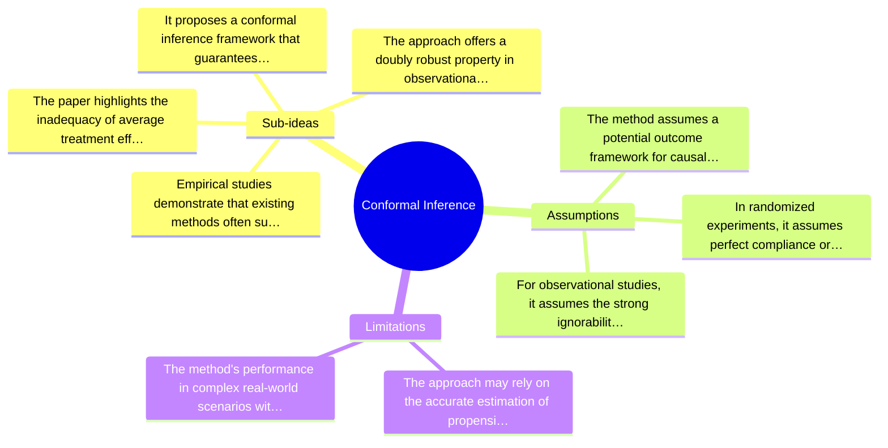

# Novelty Evaluation: Conformal Inference

## Run Metadata

**Run context**

| Field | Value |
|-------|-------|
| Timestamp (America/New_York) | 2026-03-24 03:49:46 -0400 America/New_York (UTC: 2026-03-24T07:49:46Z) |
| Branch | copilot/port-online-search-feature-v1-2-0 |
| Commit | [`5349f4d`](https://github.com/yulinl2/Open-Idea-Sourcing/commit/5349f4de94e5ef0bff09396befc0767ffcf84973) |
| CI Run | [Run #23478667966](https://github.com/yulinl2/Open-Idea-Sourcing/actions/runs/23478667966) |

**Configuration**

| Field | Value |
|-------|-------|
| Model | gpt-4o |
| Input | https://arxiv.org/abs/2006.06138 |
| Code version | 1.3.0 |

**Performance**

| Field | Value |
|-------|-------|
| Total runtime | 44.4s |
| └─ parsing | 5.4s |
| └─ online_search | 4.3s |
| └─ similarity | 0.0s |
| └─ domain_references | 13.3s |
| └─ evaluation | 20.7s |

## Pipeline Job Log

```mermaid
gantt
    title Pipeline Run — Conformal Inference
    dateFormat x
    axisFormat %S.%Ls
    section PaperParser
    Parse paper :done, 0, 5360ms
    section SemanticScholar API
    Online reference search :done, 5360, 4270ms
    section SimilaritySearch
    Similarity search :done, 9630, 1ms
    section LLM (gpt-4o)
    Domain references :done, 9630, 13260ms
    Idea decomposition :done, 23641, 4888ms
    Duplication check :done, 28529, 3451ms
    Combination check :done, 31980, 3203ms
    Equivalence check :done, 35184, 3946ms
    Synthesis :done, 39130, 2093ms
    Reference annotation :done, 41223, 3160ms
```



**PaperParser**

| # | Job | Start (s) | Duration (s) | Input | Output |
|---|-----|----------:|-------------:|-------|--------|
| 1 | Parse paper | 0.00 | 5.36 | 2006.06138.pdf | "Conformal Inference", 111859 chars |

<details>
<summary>📋 Parse paper — details</summary>

**Title:** Conformal Inference

**Abstract:** *(not extracted)*

**Sections (69):**
- Conformal Inference
- Lihua Lei
- From Average Effects To Individual Effects
- From Point Estimates To Interval Estimates
- ITE
- ITE
- From Observables To Counterfactuals
- X X
- X X
- X r
- X X
- X X
- Inferential type ATE ATT ATC General
- X X
- X X
- X X
- CF X-learner BART CQR CF X-learner BART CQR
- Causal Forest
- Causal Forest
- Causal Forest

</details>

**SemanticScholar API**

| # | Job | Start (s) | Duration (s) | Input | Output |
|---|-----|----------:|-------------:|-------|--------|
| 2 | Online reference search | 5.36 | 4.27 | arXiv:2006.06138 + 4 LLM queries | 0 paper(s) fetched |

<details>
<summary>📋 Online reference search — details</summary>

**Queries used:**
1. uncertainty in treatment effects
2. conformal inference for counterfactuals
3. Bayesian treatment effect estimation
4. machine learning for CATE

**Fetched papers (0):**
*(none fetched)*

</details>

**SimilaritySearch**

| # | Job | Start (s) | Duration (s) | Input | Output |
|---|-----|----------:|-------------:|-------|--------|
| 3 | Similarity search | 9.63 | 0.00 | TF-IDF cosine on 2 ref(s) | top-2: 0.21×Measuring the Effects of Data Paral…; 0.00×A custom reference paper |

<details>
<summary>📋 Similarity search — details</summary>

**Query (key content excerpt):**
```
Title: Conformal Inference

Conformal Inference
of Counterfactuals and Individual Treatment Effects
Lihua Lei
DepartmentofStatistics,StanfordUniversity
E-mail: lihualei@stanford.edu
Emmanuel J. Cande`s
DepartmentofStatisticsandDepartmentofMathematics,StanfordUniversity
E-mail: candes@stanford.edu
Su…
```

**All matches (2):**
| Score | Title | Year |
|------:|-------|------|
| 0.214 | Measuring the Effects of Data Parallelism on Neural Network Training | 2019 |
| 0.000 | A custom reference paper | 2022 |

</details>

**LLM (gpt-4o)**

| # | Job | Start (s) | Duration (s) | Input | Output |
|---|-----|----------:|-------------:|-------|--------|
| 4 | Domain references | 9.63 | 13.26 | paper content + 2 similar paper(s) | 5 domain reference(s) |
| 5 | Idea decomposition | 23.64 | 4.89 | paper content | 4 sub-idea(s) |
| 6 | Duplication check | 28.53 | 3.45 | paper content + 1 reference paper(s) | verdict=LOW |
| 7 | Combination check | 31.98 | 3.20 | paper content + 1 reference paper(s) | verdict=LOW |
| 8 | Equivalence check | 35.18 | 3.95 | paper content + 1 reference paper(s) | verdict=MEDIUM |
| 9 | Synthesis | 39.13 | 2.09 | 3 dimension results | verdict=MARGINAL, confidence=MEDIUM |
| 10 | Reference annotation | 41.22 | 3.16 | paper + 1 similar paper(s) | 1 annotation(s) |

## Idea Decomposition

**Core concept:** The paper introduces a conformal inference-based approach to provide reliable interval estimates for counterfactuals and individual treatment effects, addressing the challenge of uncertainty quantification in causal inference.

**Sub-ideas:**

- The paper highlights the inadequacy of average treatment effects (ATE) and conditional average treatment effects (CATE) in capturing treatment effect heterogeneity, emphasizing the need for individual treatment effects (ITE) for informed decision-making.
- It proposes a conformal inference framework that guarantees average coverage of interval estimates for counterfactuals and ITEs in randomized experiments, regardless of the unknown data-generating mechanism.
- The approach offers a doubly robust property in observational studies, ensuring approximate coverage if either the propensity score or conditional quantiles of potential outcomes are accurately estimated.
- Empirical studies demonstrate that existing methods often suffer from significant coverage deficits, while the proposed method achieves desired coverage with reasonably short intervals.

**Assumptions:**

- The method assumes a potential outcome framework for causal inference.
- In randomized experiments, it assumes perfect compliance or ignorable compliance.
- For observational studies, it assumes the strong ignorability condition.

**Limitations:**

- The approach may rely on the accurate estimation of propensity scores or conditional quantiles, which can be challenging in practice.
- The method's performance in complex real-world scenarios with high-dimensional covariates or non-standard data structures is not fully explored.

### Idea Mind Map



**Overall verdict:** ⚠️ **MARGINAL** (confidence: MEDIUM)

## Summary

The paper "Conformal Inference" presents a novel application of conformal inference techniques to the domain of causal inference, specifically for estimating individual treatment effects, which is a noteworthy contribution. However, while the application is innovative, the underlying methodology of conformal inference is well-established, and the paper primarily reframes existing methods rather than introducing fundamentally new concepts. The combination of conformal inference with causal inference frameworks is valuable, but the novelty is somewhat limited by the reliance on established techniques.

## Detailed Analysis

### Direct Duplication

<details>
<summary><strong>Risk level:</strong> 🟢 LOW</summary>

The submitted paper titled "Conformal Inference" by Lihua Lei and Emmanuel J. Candès presents a novel approach to uncertainty quantification in causal inference using conformal inference methods. The paper focuses on providing reliable interval estimates for counterfactuals and individual treatment effects, which is a significant departure from traditional methods that emphasize point estimation of conditional average treatment effects. The paper's emphasis on conformal inference for causal inference, particularly in the context of treatment effect heterogeneity, appears to be a novel contribution. The referenced paper, [arxiv-1904.06019], is unrelated in terms of content and focus, as it deals with data parallelism in neural network training, which is a completely different domain and topic. Therefore, the submitted paper does not appear to be a direct duplicate of any known or referenced work.

</details>

### Simple Combination

<details>
<summary><strong>Risk level:</strong> 🟢 LOW</summary>

The submitted paper presents a novel approach to uncertainty quantification in causal inference by leveraging conformal inference techniques to produce reliable interval estimates for counterfactuals and individual treatment effects (ITE). This is not a simple combination of existing works but rather an innovative application of conformal inference to a new domain. The paper addresses a significant gap in the current literature, where existing methods for estimating conditional average treatment effects (CATE) often fail to provide satisfactory uncertainty quantification. By ensuring average coverage in finite samples and introducing a doubly robust property, the authors offer a substantial advancement over traditional methods. The paper's contribution is particularly valuable in fields like medicine and public policy, where reliable decision-making is crucial. The combination of conformal inference with causal inference frameworks is a genuine insight that enhances the robustness and applicability of treatment effect estimation.

</details>

### Methodological Equivalence

<details>
<summary><strong>Risk level:</strong> 🟡 MEDIUM</summary>

The paper proposes a conformal inference-based approach to produce reliable interval estimates for counterfactuals and individual treatment effects (ITE) under the potential outcome framework. Conformal inference is a well-established method in the field of statistical learning for constructing prediction intervals with finite-sample coverage guarantees. The novelty claimed in the paper lies in applying conformal inference to the domain of causal inference, specifically for estimating ITEs. While the application to causal inference might be novel, the underlying methodology of conformal inference itself is not new. The paper re-derives the conformal inference method in the context of causal inference, which could be seen as a conceptual renaming or reframing of existing methods rather than a fundamentally new approach. The doubly robust property mentioned in the paper is also a well-known concept in causal inference, where estimators are robust to model misspecification if either the propensity score or the outcome model is correctly specified.

</details>

## Most Similar Reference Papers

> **Scoring method:** TF-IDF cosine similarity (0–1). Higher scores indicate greater textual overlap between the paper's key content and the reference.

| Score | Title | Year |
|-------|-------|------|
| 0.21 | [Measuring the Effects of Data Parallelism on Neural Network Training](https://arxiv.org/abs/1904.06019) | 2019 |

### Reference Annotations

**[0.21] [Measuring the Effects of Data Parallelism on Neural Network Training](https://arxiv.org/abs/1904.06019) (2019)**

| Dimension | Notes |
|-----------|-------|
| **Overlap** | Both the submitted paper and this reference paper involve statistical analysis and the use of advanced methodologies to improve outcomes in their respective fields. They share a focus on optimizing processes—whether it's treatment effect estimation or neural network training. |
| **Differences** | The submitted paper focuses on causal inference and the estimation of treatment effects using conformal inference, while the reference paper is centered on the effects of data parallelism in neural network training, specifically examining the relationship between batch size and training speed. |
| **Derivation** | None identified. The methodologies and applications in the submitted paper do not appear to be directly derived from or inspired by the concepts discussed in this reference paper. |

## Main Domain References

1. **[Estimating Causal Effects of Treatments in Randomized and Nonrandomized Studies](https://www.semanticscholar.org/search?q=Estimating+Causal+Effects+of+Treatments+in+Randomized+and+Nonrandomized+Studies&sort=Relevance)**, 1974
   *Donald B. Rubin*
   <details>
   <summary>Why this matters</summary>

   This seminal paper introduced the Rubin Causal Model, which is foundational for understanding causal inference, including the estimation of treatment effects and the potential outcomes framework used in the submitted paper.

   </details>

2. **[Causality: Models, Reasoning, and Inference](https://www.semanticscholar.org/search?q=Causality%3A+Models%2C+Reasoning%2C+and+Inference&sort=Relevance)**, 2000
   *Judea Pearl*
   <details>
   <summary>Why this matters</summary>

   Pearl's work on causality provides a comprehensive framework for causal inference, including the use of graphical models and counterfactual reasoning, which are essential for understanding individual treatment effects and the assumptions underlying causal inference methods.

   </details>

3. **[Doubly Robust Estimation for Causal Inference](https://www.semanticscholar.org/search?q=Doubly+Robust+Estimation+for+Causal+Inference&sort=Relevance)**, 1994
   *James M. Robins, Andrea Rotnitzky, and Lue Ping Zhao*
   <details>
   <summary>Why this matters</summary>

   This paper introduces the concept of doubly robust estimation, which is crucial for the submitted paper's approach to achieving reliable interval estimates under certain assumptions. It is a key method in causal inference for dealing with model misspecification.

   </details>

4. **[A Unified Approach to Valid Post-Selection Inference](https://www.semanticscholar.org/search?q=A+Unified+Approach+to+Valid+Post-Selection+Inference&sort=Relevance)**, 2018
   *Emmanuel J. Candès, Yingying Fan, Lucas Janson, and Jinchi Lv*
   <details>
   <summary>Why this matters</summary>

   This paper discusses the conformal inference framework, which is directly related to the methodology proposed in the submitted paper for constructing reliable interval estimates. It provides a foundation for understanding the statistical guarantees of conformal inference.

   </details>

5. **[The Central Role of the Propensity Score in Observational Studies for Causal Effects](https://www.semanticscholar.org/search?q=The+Central+Role+of+the+Propensity+Score+in+Observational+Studies+for+Causal+Effects&sort=Relevance)**, 1983
   *Paul R. Rosenbaum and Donald B. Rubin*
   <details>
   <summary>Why this matters</summary>

   This paper introduces the propensity score, a fundamental concept in causal inference for reducing bias in observational studies, which is relevant to the submitted paper's discussion on propensity score estimation and its role in achieving doubly robust properties.

   </details>
