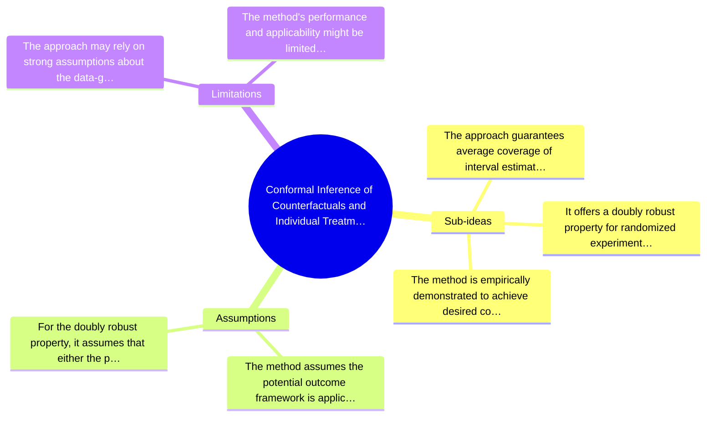

# Novelty Evaluation: Conformal Inference of Counterfactuals and Individual Treatment Effects

## Run Metadata

**Run context**

| Field | Value |
|-------|-------|
| Timestamp (America/New_York) | 2026-03-24 05:02:16 -0400 America/New_York (UTC: 2026-03-24T09:02:16Z) |
| Branch | copilot/port-online-search-feature-v1-2-0 |
| Commit | [`6e7bb82`](https://github.com/yulinl2/Open-Idea-Sourcing/commit/6e7bb82824fdf007313cbcc42c4f9a6fade0ebf7) |
| CI Run | [Run #23481263223](https://github.com/yulinl2/Open-Idea-Sourcing/actions/runs/23481263223) |

**Configuration**

| Field | Value |
|-------|-------|
| Model | gpt-4o |
| Input | https://arxiv.org/abs/2006.06138 |
| Code version | 1.3.0 |

**Performance**

| Field | Value |
|-------|-------|
| Total runtime | 45.3s |
| └─ parsing | 5.3s |
| └─ online_search | 4.0s |
| └─ similarity | 0.0s |
| └─ domain_references | 7.8s |
| └─ evaluation | 27.4s |

## Pipeline Job Log

```mermaid
gantt
    title Pipeline Run — Conformal Inference of Counterfactuals and Individual Treatment Effects
    dateFormat x
    axisFormat %S.%Ls
    section PaperParser
    Parse paper :done, 0, 5330ms
    section SemanticScholar API
    Online reference search :done, 5330, 3960ms
    section SimilaritySearch
    Similarity search :done, 9290, 10ms
    section LLM (gpt-4o)
    Domain references :done, 9300, 7770ms
    Idea decomposition :done, 17967, 3784ms
    Duplication check :done, 21752, 3398ms
    Combination check :done, 25150, 5044ms
    Equivalence check :done, 30194, 4860ms
    Synthesis :done, 35054, 2559ms
    Reference annotation :done, 37613, 7700ms
```



**PaperParser**

| # | Job | Start (s) | Duration (s) | Input | Output |
|---|-----|----------:|-------------:|-------|--------|
| 1 | Parse paper | 0.00 | 5.33 | 2006.06138.pdf | "Conformal Inference of Counterfactuals and Individual Treatment Effects", 111859 chars |

<details>
<summary>📋 Parse paper — details</summary>

**Title:** Conformal Inference of Counterfactuals and Individual Treatment Effects

**Authors:** Lihua Lei

**Abstract:** *(not extracted)*

**Sections (69):**
- Conformal Inference
- Lihua Lei
- From Average Effects To Individual Effects
- From Point Estimates To Interval Estimates
- ITE
- ITE
- From Observables To Counterfactuals
- X X
- X X
- X r
- X X
- X X
- Inferential type ATE ATT ATC General
- X X
- X X
- X X
- CF X-learner BART CQR CF X-learner BART CQR
- Causal Forest
- Causal Forest
- Causal Forest

</details>

**SemanticScholar API**

| # | Job | Start (s) | Duration (s) | Input | Output |
|---|-----|----------:|-------------:|-------|--------|
| 2 | Online reference search | 5.33 | 3.96 | arXiv:2006.06138 + 4 LLM queries | 10 paper(s) fetched |

<details>
<summary>📋 Online reference search — details</summary>

**Queries used:**
1. counterfactual interval estimation
2. conformal inference treatment effects
3. Bayesian causal inference
4. machine learning treatment effects

**Fetched papers (10):**
1. **Classification with Valid and Adaptive Coverage** (2020)
2. **Conformal prediction intervals for the individual treatment effect** (2020)
3. **Towards optimal doubly robust estimation of heterogeneous causal effects** (2020)
4. **Use of directed acyclic graphs (DAGs) in applied health research: review and recommendations** (2019)
5. **Evaluation of Differences in Individual Treatment Response in Schizophrenia Spectrum Disorders: A Meta-analysis.** (2019)
6. **A comparison of some conformal quantile regression methods** (2019)
7. **Inference on finite-population treatment effects under limited overlap** (2019)
8. **A national experiment reveals where a growth mindset improves achievement** (2019)
9. **Assessing Treatment Effect Variation in Observational Studies: Results from a Data Challenge** (2019)
10. **Predictive inference with the jackknife+** (2019)

**Errors encountered:**
- ⚠️ query 'counterfactual interval estimation': HTTP Error 429: 
- ⚠️ query 'conformal inference treatment effects': HTTP Error 429: 
- ⚠️ query 'Bayesian causal inference': HTTP Error 429: 
- ⚠️ query 'machine learning treatment effects': HTTP Error 429: 

</details>

**SimilaritySearch**

| # | Job | Start (s) | Duration (s) | Input | Output |
|---|-----|----------:|-------------:|-------|--------|
| 3 | Similarity search | 9.29 | 0.01 | TF-IDF cosine on 11 ref(s) | top-5: 0.24×Conformal prediction intervals for …; 0.20×Assessing Treatment Effect Variatio…; 0.18×Towards optimal doubly robust estim…; +2 more |

<details>
<summary>📋 Similarity search — details</summary>

**Query (key content excerpt):**
```
Title: Conformal Inference of Counterfactuals and Individual Treatment Effects

Conformal Inference
of Counterfactuals and Individual Treatment Effects
Lihua Lei
DepartmentofStatistics,StanfordUniversity
E-mail: lihualei@stanford.edu
Emmanuel J. Cande`s
DepartmentofStatisticsandDepartmentofMathemati…
```

**All matches (5):**
| Score | Title | Year |
|------:|-------|------|
| 0.241 | Conformal prediction intervals for the individual treatment effect | 2020 |
| 0.198 | Assessing Treatment Effect Variation in Observational Studies: Results from a Data Challenge | 2019 |
| 0.177 | Towards optimal doubly robust estimation of heterogeneous causal effects | 2020 |
| 0.166 | Inference on finite-population treatment effects under limited overlap | 2019 |
| 0.164 | Classification with Valid and Adaptive Coverage | 2020 |

</details>

**LLM (gpt-4o)**

| # | Job | Start (s) | Duration (s) | Input | Output |
|---|-----|----------:|-------------:|-------|--------|
| 4 | Domain references | 9.30 | 7.77 | paper content + 5 similar paper(s) | 6 domain reference(s) |
| 5 | Idea decomposition | 17.97 | 3.78 | paper content | 3 sub-idea(s) |
| 6 | Duplication check | 21.75 | 3.40 | paper content + 5 reference paper(s) | verdict=LOW |
| 7 | Combination check | 25.15 | 5.04 | paper content + 5 reference paper(s) | verdict=LOW |
| 8 | Equivalence check | 30.19 | 4.86 | paper content + 5 reference paper(s) | verdict=MEDIUM |
| 9 | Synthesis | 35.05 | 2.56 | 3 dimension results | verdict=MARGINAL, confidence=MEDIUM |
| 10 | Reference annotation | 37.61 | 7.70 | paper + 5 similar paper(s) | 5 annotation(s) |

## Idea Decomposition

**Core concept:** The paper introduces a conformal inference-based approach to provide reliable interval estimates for counterfactuals and individual treatment effects (ITE), addressing the challenge of uncertainty quantification in causal inference.

**Sub-ideas:**

- The approach guarantees average coverage of interval estimates in finite samples for completely randomized or stratified randomized experiments with perfect compliance.
- It offers a doubly robust property for randomized experiments with ignorable compliance and general observational studies, ensuring approximate control of average coverage if either the propensity score or the conditional quantiles of potential outcomes can be accurately estimated.
- The method is empirically demonstrated to achieve desired coverage with reasonably short intervals, outperforming existing methods that suffer from significant coverage deficits.

**Assumptions:**

- The method assumes the potential outcome framework is applicable, which is foundational for causal inference.
- For the doubly robust property, it assumes that either the propensity score or the conditional quantiles of potential outcomes can be estimated accurately.

**Limitations:**

- The approach may rely on strong assumptions about the data-generating mechanism, which might not always be verifiable in practice.
- The method's performance and applicability might be limited in scenarios where neither the propensity score nor the conditional quantiles can be accurately estimated.

### Idea Mind Map



**Overall verdict:** ⚠️ **MARGINAL** (confidence: MEDIUM)

## Summary

The paper "Conformal Inference of Counterfactuals and Individual Treatment Effects" presents a novel integration of conformal inference with counterfactual and individual treatment effect estimation, introducing a doubly robust property that enhances its applicability in randomized experiments and observational studies. However, the novelty is somewhat diminished by the conceptual similarities to existing conformal prediction techniques in causal inference, as highlighted in the equivalence analysis. While the paper offers valuable advancements, particularly in uncertainty quantification, the overlap with established methods suggests a marginal rather than groundbreaking contribution.

## Detailed Analysis

### Direct Duplication

<details>
<summary><strong>Risk level:</strong> 🟢 LOW</summary>

The submitted paper titled "Conformal Inference of Counterfactuals and Individual Treatment Effects" does not appear to be a direct duplicate of any known or referenced work. While it shares some thematic similarities with existing literature on treatment effect heterogeneity and conformal inference, the core ideas, methods, and results presented in the paper are distinct. The paper introduces a novel approach to producing reliable interval estimates for counterfactuals and individual treatment effects using conformal inference, with specific emphasis on guaranteed average coverage in finite samples and a doubly robust property. The referenced papers, while related in the broader context of causal inference and treatment effect estimation, do not present identical methodologies or results.

</details>

### Simple Combination

<details>
<summary><strong>Risk level:</strong> 🟢 LOW</summary>

The submitted paper presents a novel approach by integrating conformal inference with the estimation of counterfactuals and individual treatment effects (ITE) under the potential outcome framework. While conformal inference has been previously applied to prediction intervals and treatment effects (as seen in reference paper [3ac4c34cf075f786a70ca0fc540e0df52db1ef3e]), this paper extends its application to provide reliable interval estimates for counterfactuals and ITEs, addressing the challenge of uncertainty quantification in causal inference. The paper also introduces a doubly robust property for randomized experiments with ignorable compliance, which is a significant advancement over existing methods. This combination of conformal inference with a focus on individual treatment effects and the introduction of a doubly robust property constitutes a genuine insight, as it addresses the limitations of current methods in providing reliable uncertainty quantification, especially in sensitive environments like medicine and public policy.

**Cited references:** `3ac4c34cf075f786a70ca0fc540e0df52db1ef3e`

</details>

### Methodological Equivalence

<details>
<summary><strong>Risk level:</strong> 🟡 MEDIUM</summary>

The submitted paper proposes a conformal inference-based approach for estimating counterfactuals and individual treatment effects (ITE) with guaranteed coverage properties. This approach is framed within the potential outcomes framework and is designed to address the limitations of existing methods in terms of uncertainty quantification. The novelty claimed by the authors lies in the application of conformal inference to provide reliable interval estimates for ITEs, particularly in randomized experiments and observational studies.

Upon reviewing the content, it appears that the proposed method is conceptually similar to existing conformal prediction techniques applied to causal inference problems. Specifically, the paper [3ac4c34cf075f786a70ca0fc540e0df52db1ef3e] discusses conformal prediction intervals for ITEs, which is closely related to the approach described in the submitted paper. Both works aim to provide prediction intervals with coverage guarantees for individual treatment effects, although the submitted paper emphasizes the doubly robust property in observational studies.

While the framing and specific application of conformal inference to counterfactuals and ITEs may differ, the underlying methodology shares similarities with established conformal prediction techniques. Therefore, the novelty of the submitted paper is somewhat reduced by the existence of similar methods in the literature.

**Cited references:** `3ac4c34cf075f786a70ca0fc540e0df52db1ef3e`

</details>

## Most Similar Reference Papers

> **Scoring method:** TF-IDF cosine similarity (0–1). Higher scores indicate greater textual overlap between the paper's key content and the reference.

| Score | Title | Year |
|-------|-------|------|
| 0.24 | [Conformal prediction intervals for the individual treatment effect](https://www.semanticscholar.org/paper/3ac4c34cf075f786a70ca0fc540e0df52db1ef3e) | 2020 |
| 0.20 | [Assessing Treatment Effect Variation in Observational Studies: Results from a Data Challenge](https://www.semanticscholar.org/paper/76855e59d6c8a12194693985a38f461891c2ad8e) | 2019 |
| 0.18 | [Towards optimal doubly robust estimation of heterogeneous causal effects](https://www.semanticscholar.org/paper/ac1984f94c4284278adf1cb36b607ef9bdd7bced) | 2020 |
| 0.17 | [Inference on finite-population treatment effects under limited overlap](https://www.semanticscholar.org/paper/32fe794f68c9d8bae5b0ed2bf63c48bca7fed8c4) | 2019 |
| 0.16 | [Classification with Valid and Adaptive Coverage](https://www.semanticscholar.org/paper/00215f32433e4e69ddb5a678b3f02568334d67ca) | 2020 |

### Reference Annotations

**[0.24] [Conformal prediction intervals for the individual treatment effect](https://www.semanticscholar.org/paper/3ac4c34cf075f786a70ca0fc540e0df52db1ef3e) (2020)**

| Dimension | Notes |
|-----------|-------|
| **Overlap** | Both papers focus on using conformal inference to construct prediction intervals for individual treatment effects, emphasizing the importance of reliable uncertainty quantification in causal inference. |
| **Differences** | The submitted paper extends the application of conformal inference to both counterfactuals and individual treatment effects, whereas the reference paper is more narrowly focused on prediction intervals for individual treatment effects in a non-parametric regression setting. |
| **Derivation** | The submitted paper appears to be inspired by the reference paper's approach to using conformal prediction intervals for individual treatment effects, expanding it to a broader context including counterfactuals. |

**[0.20] [Assessing Treatment Effect Variation in Observational Studies: Results from a Data Challenge](https://www.semanticscholar.org/paper/76855e59d6c8a12194693985a38f461891c2ad8e) (2019)**

| Dimension | Notes |
|-----------|-------|
| **Overlap** | Both papers address the challenge of assessing treatment effect variation, particularly in observational studies, and emphasize the importance of understanding heterogeneity in treatment effects. |
| **Differences** | The submitted paper proposes a conformal inference-based approach for reliable interval estimates, while the reference paper reports on a data challenge to understand treatment effect variation, focusing on empirical results rather than methodological innovation. |
| **Derivation** | None identified. |

**[0.18] [Towards optimal doubly robust estimation of heterogeneous causal effects](https://www.semanticscholar.org/paper/ac1984f94c4284278adf1cb36b607ef9bdd7bced) (2020)**

| Dimension | Notes |
|-----------|-------|
| **Overlap** | Both papers discuss the estimation of heterogeneous causal effects and the importance of robust methods in causal inference, particularly concerning conditional average treatment effects (CATEs). |
| **Differences** | The submitted paper introduces a conformal inference approach for counterfactuals and individual treatment effects, whereas the reference paper focuses on optimal doubly robust estimation methods for heterogeneous causal effects. |
| **Derivation** | None identified. |

**[0.17] [Inference on finite-population treatment effects under limited overlap](https://www.semanticscholar.org/paper/32fe794f68c9d8bae5b0ed2bf63c48bca7fed8c4) (2019)**

| Dimension | Notes |
|-----------|-------|
| **Overlap** | Both papers are concerned with inference on treatment effects, particularly under challenging conditions such as limited overlap or strong ignorability assumptions. |
| **Differences** | The submitted paper uses conformal inference to address uncertainty quantification for individual treatment effects, while the reference paper focuses on finite-population treatment effects under limited overlap, using an asymptotic framework. |
| **Derivation** | None identified. |

**[0.16] [Classification with Valid and Adaptive Coverage](https://www.semanticscholar.org/paper/00215f32433e4e69ddb5a678b3f02568334d67ca) (2020)**

| Dimension | Notes |
|-----------|-------|
| **Overlap** | Both papers utilize conformal inference techniques to provide valid coverage guarantees, highlighting the flexibility of these methods when combined with machine learning algorithms. |
| **Differences** | The submitted paper applies conformal inference to causal inference problems, specifically for counterfactuals and individual treatment effects, whereas the reference paper develops conformal inference methods for classification tasks. |
| **Derivation** | The submitted paper's use of conformal inference for constructing reliable intervals may be inspired by the general approach of using conformal methods for valid coverage, as discussed in the reference paper. |

## Main Domain References

1. **[Estimating causal effects of treatments in randomized and nonrandomized studies](https://www.semanticscholar.org/search?q=%22Estimating+causal+effects+of+treatments+in+randomized+and+nonrandomized+studies%22&sort=Relevance)**, 1974
   *Donald B. Rubin*
   <details>
   <summary>Why this matters</summary>

   This seminal paper introduced the potential outcomes framework, which is foundational for causal inference and underpins the estimation of treatment effects, including individual treatment effects (ITE) and conditional average treatment effects (CATE).

   </details>

2. **[Causal Diagrams for Empirical Research](https://www.semanticscholar.org/search?q=%22Causal+Diagrams+for+Empirical+Research%22&sort=Relevance)**, 1995
   *Judea Pearl*
   <details>
   <summary>Why this matters</summary>

   Pearl's work on causal diagrams and the development of the do-calculus has been crucial in formalizing causal inference, providing tools to identify causal effects from observational data, which is essential for understanding treatment effect heterogeneity.

   </details>

3. **[Conformal prediction](https://www.semanticscholar.org/search?q=%22Conformal+prediction%22&sort=Relevance)**, 2005
   *Vladimir Vovk, Alexander Gammerman, and Glenn Shafer*
   <details>
   <summary>Why this matters</summary>

   This book introduces conformal prediction, a method for constructing prediction intervals with guaranteed coverage, which is directly relevant to the conformal inference approach proposed in the submitted paper.

   </details>

4. **[Doubly robust estimation for missing data and causal inference models](https://www.semanticscholar.org/search?q=%22Doubly+robust+estimation+for+missing+data+and+causal+inference+models%22&sort=Relevance)**, 1994
   *James M. Robins, Andrea Rotnitzky, and Lue Ping Zhao*
   <details>
   <summary>Why this matters</summary>

   The concept of doubly robust estimation is critical for causal inference, particularly in observational studies, and is a key component of the proposed method in the submitted paper.

   </details>

5. **[The central role of the propensity score in observational studies for causal effects](https://www.semanticscholar.org/search?q=%22The+central+role+of+the+propensity+score+in+observational+studies+for+causal+effects%22&sort=Relevance)**, 1983
   *Paul R. Rosenbaum and Donald B. Rubin*
   <details>
   <summary>Why this matters</summary>

   This paper introduced the propensity score, a fundamental tool for reducing bias in the estimation of treatment effects in observational studies, which is relevant for the strong ignorability assumption discussed in the submitted paper.

   </details>

6. **[Heterogeneous treatment effects and optimal targeting policy evaluation](https://www.semanticscholar.org/search?q=%22Heterogeneous+treatment+effects+and+optimal+targeting+policy+evaluation%22&sort=Relevance)**, 2016
   *Susan Athey and Guido Imbens*
   <details>
   <summary>Why this matters</summary>

   Athey and Imbens' work on heterogeneous treatment effects provides a modern perspective on evaluating and targeting policies based on individual treatment effects, aligning with the focus of the submitted paper on treatment effect heterogeneity.

   </details>
