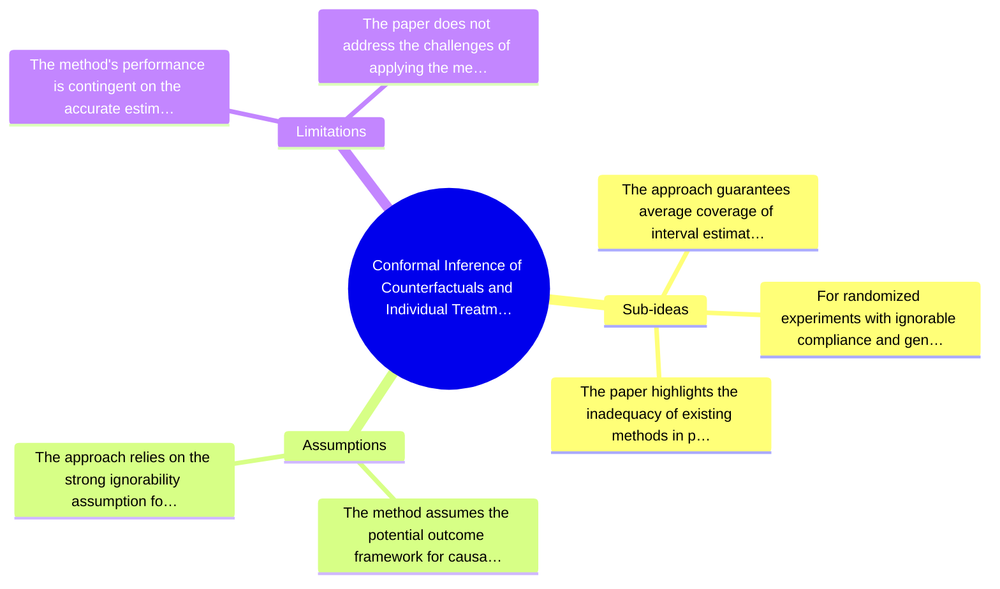

# Novelty Evaluation: Conformal Inference of Counterfactuals and Individual Treatment Effects

## Run Metadata

**Run context**

| Field | Value |
|-------|-------|
| Timestamp (America/New_York) | 2026-03-25 02:37:18 -0400 America/New_York (UTC: 2026-03-25T06:37:18Z) |
| Branch | copilot/port-online-search-feature-v1-2-0 |
| Commit | [`6e7bb82`](https://github.com/yulinl2/Open-Idea-Sourcing/commit/6e7bb82824fdf007313cbcc42c4f9a6fade0ebf7) |
| CI Run | [Run #23528261714](https://github.com/yulinl2/Open-Idea-Sourcing/actions/runs/23528261714) |

**Configuration**

| Field | Value |
|-------|-------|
| Model | gpt-4o |
| Input | https://arxiv.org/abs/2006.06138 |
| Code version | 1.3.0 |

**Performance**

| Field | Value |
|-------|-------|
| Total runtime | 42.8s |
| └─ parsing | 5.5s |
| └─ online_search | 4.4s |
| └─ similarity | 0.0s |
| └─ domain_references | 7.5s |
| └─ evaluation | 25.0s |

## Pipeline Job Log

```mermaid
gantt
    title Pipeline Run — Conformal Inference of Counterfactuals and Individual Treatment Effects
    dateFormat x
    axisFormat %S.%Ls
    section PaperParser
    Parse paper :done, 0, 5460ms
    section SemanticScholar API
    Online reference search :done, 5460, 4410ms
    section SimilaritySearch
    Similarity search :done, 9870, 10ms
    section LLM (gpt-4o)
    Domain references :done, 9880, 7450ms
    Idea decomposition :done, 17848, 4038ms
    Duplication check :done, 21887, 3063ms
    Combination check :done, 24951, 2464ms
    Equivalence check :done, 27415, 4136ms
    Synthesis :done, 31551, 1860ms
    Reference annotation :done, 33411, 9394ms
```



**PaperParser**

| # | Job | Start (s) | Duration (s) | Input | Output |
|---|-----|----------:|-------------:|-------|--------|
| 1 | Parse paper | 0.00 | 5.46 | 2006.06138.pdf | "Conformal Inference of Counterfactuals and Individual Treatment Effects", 111859 chars |

<details>
<summary>📋 Parse paper — details</summary>

**Title:** Conformal Inference of Counterfactuals and Individual Treatment Effects

**Authors:** Lihua Lei

**Abstract:** *(not extracted)*

**Sections (69):**
- Conformal Inference
- Lihua Lei
- From Average Effects To Individual Effects
- From Point Estimates To Interval Estimates
- ITE
- ITE
- From Observables To Counterfactuals
- X X
- X X
- X r
- X X
- X X
- Inferential type ATE ATT ATC General
- X X
- X X
- X X
- CF X-learner BART CQR CF X-learner BART CQR
- Causal Forest
- Causal Forest
- Causal Forest

</details>

**SemanticScholar API**

| # | Job | Start (s) | Duration (s) | Input | Output |
|---|-----|----------:|-------------:|-------|--------|
| 2 | Online reference search | 5.46 | 4.41 | arXiv:2006.06138 + 4 LLM queries | 10 paper(s) fetched |

<details>
<summary>📋 Online reference search — details</summary>

**Queries used:**
1. uncertainty in treatment effects
2. conformal inference for ITE
3. Bayesian treatment effect estimation
4. machine learning CATE estimation

**Fetched papers (10):**
1. **Classification with Valid and Adaptive Coverage** (2020)
2. **Conformal prediction intervals for the individual treatment effect** (2020)
3. **Towards optimal doubly robust estimation of heterogeneous causal effects** (2020)
4. **Use of directed acyclic graphs (DAGs) in applied health research: review and recommendations** (2019)
5. **Evaluation of Differences in Individual Treatment Response in Schizophrenia Spectrum Disorders: A Meta-analysis.** (2019)
6. **A comparison of some conformal quantile regression methods** (2019)
7. **Inference on finite-population treatment effects under limited overlap** (2019)
8. **A national experiment reveals where a growth mindset improves achievement** (2019)
9. **Assessing Treatment Effect Variation in Observational Studies: Results from a Data Challenge** (2019)
10. **Predictive inference with the jackknife+** (2019)

**Errors encountered:**
- ⚠️ query 'conformal inference for ITE': HTTP Error 429: 
- ⚠️ query 'Bayesian treatment effect estimation': HTTP Error 429: 
- ⚠️ query 'machine learning CATE estimation': HTTP Error 429: 

</details>

**SimilaritySearch**

| # | Job | Start (s) | Duration (s) | Input | Output |
|---|-----|----------:|-------------:|-------|--------|
| 3 | Similarity search | 9.87 | 0.01 | TF-IDF cosine on 11 ref(s) | top-5: 0.24×Conformal prediction intervals for …; 0.20×Assessing Treatment Effect Variatio…; 0.18×Towards optimal doubly robust estim…; +2 more |

<details>
<summary>📋 Similarity search — details</summary>

**Query (key content excerpt):**
```
Title: Conformal Inference of Counterfactuals and Individual Treatment Effects

Conformal Inference
of Counterfactuals and Individual Treatment Effects
Lihua Lei
DepartmentofStatistics,StanfordUniversity
E-mail: lihualei@stanford.edu
Emmanuel J. Cande`s
DepartmentofStatisticsandDepartmentofMathemati…
```

**All matches (5):**
| Score | Title | Year |
|------:|-------|------|
| 0.241 | Conformal prediction intervals for the individual treatment effect | 2020 |
| 0.198 | Assessing Treatment Effect Variation in Observational Studies: Results from a Data Challenge | 2019 |
| 0.177 | Towards optimal doubly robust estimation of heterogeneous causal effects | 2020 |
| 0.166 | Inference on finite-population treatment effects under limited overlap | 2019 |
| 0.164 | Classification with Valid and Adaptive Coverage | 2020 |

</details>

**LLM (gpt-4o)**

| # | Job | Start (s) | Duration (s) | Input | Output |
|---|-----|----------:|-------------:|-------|--------|
| 4 | Domain references | 9.88 | 7.45 | paper content + 5 similar paper(s) | 6 domain reference(s) |
| 5 | Idea decomposition | 17.85 | 4.04 | paper content | 3 sub-idea(s) |
| 6 | Duplication check | 21.89 | 3.06 | paper content + 5 reference paper(s) | verdict=LOW |
| 7 | Combination check | 24.95 | 2.46 | paper content + 5 reference paper(s) | verdict=LOW |
| 8 | Equivalence check | 27.41 | 4.14 | paper content + 5 reference paper(s) | verdict=MEDIUM |
| 9 | Synthesis | 31.55 | 1.86 | 3 dimension results | verdict=MARGINAL, confidence=MEDIUM |
| 10 | Reference annotation | 33.41 | 9.39 | paper + 5 similar paper(s) | 5 annotation(s) |

## Idea Decomposition

**Core concept:** The paper introduces a conformal inference-based approach to provide reliable interval estimates for counterfactuals and individual treatment effects, addressing the challenge of uncertainty quantification in causal inference.

**Sub-ideas:**

- The approach guarantees average coverage of interval estimates in completely randomized or stratified randomized experiments with perfect compliance, regardless of the unknown data-generating mechanism.
- For randomized experiments with ignorable compliance and general observational studies, the method satisfies a doubly robust property, ensuring approximate control of average coverage if either the propensity score or the conditional quantiles of potential outcomes can be accurately estimated.
- The paper highlights the inadequacy of existing methods in providing satisfactory coverage and demonstrates the effectiveness of the proposed method through numerical studies on synthetic and real datasets.

**Assumptions:**

- The method assumes the potential outcome framework for causal inference.
- The approach relies on the strong ignorability assumption for observational studies to achieve the doubly robust property.

**Limitations:**

- The method's performance is contingent on the accurate estimation of either the propensity score or the conditional quantiles of potential outcomes.
- The paper does not address the challenges of applying the method in scenarios where neither the propensity score nor the conditional quantiles can be accurately estimated.

### Idea Mind Map



**Overall verdict:** ⚠️ **MARGINAL** (confidence: MEDIUM)

## Summary

The paper "Conformal Inference of Counterfactuals and Individual Treatment Effects" presents a novel integration of conformal inference with counterfactual and individual treatment effect estimation, which is a meaningful advancement in uncertainty quantification for causal inference. While the combination of these methodologies is innovative and addresses a significant gap, the core idea of using conformal inference for treatment effect estimation is not entirely new, as similar approaches have been explored in the literature. The paper's novelty primarily lies in its specific application to randomized experiments and observational studies, along with its claimed doubly robust property, but these contributions are not sufficiently groundbreaking to warrant a verdict of high novelty.

## Detailed Analysis

### Direct Duplication

<details>
<summary><strong>Risk level:</strong> 🟢 LOW</summary>

The submitted paper, "Conformal Inference of Counterfactuals and Individual Treatment Effects," introduces a novel approach to uncertainty quantification in causal inference using conformal inference methods. While there are existing works on conformal prediction and treatment effect estimation, the submitted paper uniquely combines these methodologies to address the challenge of producing reliable interval estimates for counterfactuals and individual treatment effects. The referenced papers, although related in the broader context of treatment effect estimation and conformal prediction, do not specifically address the same combination of methods or the specific application to counterfactuals and individual treatment effects as proposed in this paper. The core ideas and methods presented in the submitted paper are distinct and do not constitute a direct duplication of the referenced works.

</details>

### Simple Combination

<details>
<summary><strong>Risk level:</strong> 🟢 LOW</summary>

The submitted paper presents a novel approach by integrating conformal inference with the estimation of counterfactuals and individual treatment effects (ITE) under the potential outcome framework. While conformal inference and the study of treatment effect heterogeneity are established areas, the paper's contribution lies in its application of conformal inference to provide reliable interval estimates for ITEs, addressing a significant gap in uncertainty quantification in causal inference. This approach is particularly innovative in its ability to offer finite-sample coverage guarantees and a doubly robust property for randomized experiments with ignorable compliance and observational studies. The combination of these elements is not merely a simple aggregation of existing methods but rather a meaningful advancement that enhances the reliability of causal inference in practical applications.

</details>

### Methodological Equivalence

<details>
<summary><strong>Risk level:</strong> 🟡 MEDIUM</summary>

The submitted paper proposes a conformal inference-based approach for estimating counterfactuals and individual treatment effects (ITE) with guaranteed coverage properties. This approach is conceptually similar to existing methods that use conformal prediction for treatment effect estimation, as seen in the reference paper [3ac4c34cf075f786a70ca0fc540e0df52db1ef3e]. Both approaches leverage conformal prediction techniques to construct prediction intervals with coverage guarantees, although the submitted paper emphasizes its application to counterfactuals and ITE under the potential outcome framework. The novelty in the submitted paper may lie in the specific application to randomized experiments and observational studies with strong ignorability assumptions, as well as the doubly robust property it claims. However, the core idea of using conformal inference for treatment effect estimation is not entirely new and has been explored in the literature.

**Cited references:** `3ac4c34cf075f786a70ca0fc540e0df52db1ef3e`

</details>

## Most Similar Reference Papers

> **Scoring method:** TF-IDF cosine similarity (0–1). Higher scores indicate greater textual overlap between the paper's key content and the reference.

| Score | Title | Year |
|-------|-------|------|
| 0.24 | [Conformal prediction intervals for the individual treatment effect](https://www.semanticscholar.org/paper/3ac4c34cf075f786a70ca0fc540e0df52db1ef3e) | 2020 |
| 0.20 | [Assessing Treatment Effect Variation in Observational Studies: Results from a Data Challenge](https://www.semanticscholar.org/paper/76855e59d6c8a12194693985a38f461891c2ad8e) | 2019 |
| 0.18 | [Towards optimal doubly robust estimation of heterogeneous causal effects](https://www.semanticscholar.org/paper/ac1984f94c4284278adf1cb36b607ef9bdd7bced) | 2020 |
| 0.17 | [Inference on finite-population treatment effects under limited overlap](https://www.semanticscholar.org/paper/32fe794f68c9d8bae5b0ed2bf63c48bca7fed8c4) | 2019 |
| 0.16 | [Classification with Valid and Adaptive Coverage](https://www.semanticscholar.org/paper/00215f32433e4e69ddb5a678b3f02568334d67ca) | 2020 |

### Reference Annotations

**[0.24] [Conformal prediction intervals for the individual treatment effect](https://www.semanticscholar.org/paper/3ac4c34cf075f786a70ca0fc540e0df52db1ef3e) (2020)**

| Dimension | Notes |
|-----------|-------|
| **Overlap** | Both papers focus on constructing prediction intervals for individual treatment effects (ITE) using conformal inference methods, ensuring coverage guarantees in finite samples. |
| **Differences** | The submitted paper extends the conformal inference approach to include both counterfactuals and ITE under various experimental conditions, while the reference paper primarily addresses non-parametric regression settings. |
| **Derivation** | The use of conformal inference for ITE prediction intervals in the submitted paper appears inspired by the methodologies discussed in this reference. |

**[0.20] [Assessing Treatment Effect Variation in Observational Studies: Results from a Data Challenge](https://www.semanticscholar.org/paper/76855e59d6c8a12194693985a38f461891c2ad8e) (2019)**

| Dimension | Notes |
|-----------|-------|
| **Overlap** | Both papers address the challenge of assessing treatment effect variation in observational studies, emphasizing the importance of reliable uncertainty quantification. |
| **Differences** | The submitted paper proposes a conformal inference-based approach with a focus on guaranteed coverage, whereas the reference paper discusses results from a data challenge without proposing a specific methodological framework. |
| **Derivation** | None identified. |

**[0.18] [Towards optimal doubly robust estimation of heterogeneous causal effects](https://www.semanticscholar.org/paper/ac1984f94c4284278adf1cb36b607ef9bdd7bced) (2020)**

| Dimension | Notes |
|-----------|-------|
| **Overlap** | Both papers are concerned with the estimation of heterogeneous causal effects and discuss the importance of robust estimation methods. |
| **Differences** | The submitted paper introduces a conformal inference approach for interval estimation, while the reference paper focuses on doubly robust estimation techniques for CATEs. |
| **Derivation** | The concept of achieving robustness in treatment effect estimation in the submitted paper may be inspired by the doubly robust estimation strategies discussed in this reference. |

**[0.17] [Inference on finite-population treatment effects under limited overlap](https://www.semanticscholar.org/paper/32fe794f68c9d8bae5b0ed2bf63c48bca7fed8c4) (2019)**

| Dimension | Notes |
|-----------|-------|
| **Overlap** | Both papers deal with inference on treatment effects, particularly under conditions that challenge standard assumptions, such as limited overlap or strong ignorability. |
| **Differences** | The submitted paper provides a conformal inference framework applicable to both randomized and observational studies, while the reference paper focuses on finite-population treatment effects under limited overlap. |
| **Derivation** | None identified. |

**[0.16] [Classification with Valid and Adaptive Coverage](https://www.semanticscholar.org/paper/00215f32433e4e69ddb5a678b3f02568334d67ca) (2020)**

| Dimension | Notes |
|-----------|-------|
| **Overlap** | Both papers utilize conformal inference methods to construct prediction sets with guaranteed coverage, applicable across various machine learning algorithms. |
| **Differences** | The submitted paper specifically targets counterfactuals and ITE in causal inference, whereas the reference paper develops conformal inference techniques for classification tasks. |
| **Derivation** | The application of conformal inference to ensure valid coverage in the submitted paper is likely inspired by the general conformal inference techniques discussed in this reference. |

## Main Domain References

1. **[Estimating causal effects of treatments in randomized and nonrandomized studies](https://www.semanticscholar.org/search?q=Estimating+causal+effects+of+treatments+in+randomized+and+nonrandomized+studies&sort=Relevance)**, 1974
   *Donald B. Rubin*
   <details>
   <summary>Why this matters</summary>

   This seminal paper introduced the Rubin Causal Model, which is foundational for understanding causal inference and the estimation of treatment effects, including individual treatment effects (ITE).

   </details>

2. **[Causality: Models, Reasoning, and Inference](https://www.semanticscholar.org/search?q=Causality%3A+Models%2C+Reasoning%2C+and+Inference&sort=Relevance)**, 2000
   *Judea Pearl*
   <details>
   <summary>Why this matters</summary>

   Pearl's work on causality provides a comprehensive framework for understanding causal inference, including the concepts of counterfactuals and potential outcomes, which are crucial for the study of individual treatment effects.

   </details>

3. **[Conformal prediction](https://www.semanticscholar.org/search?q=Conformal+prediction&sort=Relevance)**, 2005
   *Vladimir Vovk, Alexander Gammerman, and Glenn Shafer*
   <details>
   <summary>Why this matters</summary>

   This book introduces the concept of conformal prediction, which is a key methodological approach used in the submitted paper for constructing reliable interval estimates for counterfactuals and individual treatment effects.

   </details>

4. **[Doubly robust estimation for missing data and causal inference models](https://www.semanticscholar.org/search?q=Doubly+robust+estimation+for+missing+data+and+causal+inference+models&sort=Relevance)**, 1994
   *James M. Robins, Andrea Rotnitzky, and Lue Ping Zhao*
   <details>
   <summary>Why this matters</summary>

   This paper introduces the concept of doubly robust estimation, which is relevant to the submitted paper's discussion on achieving reliable coverage in the presence of either accurate propensity score or conditional quantile estimates.

   </details>

5. **[Heterogeneous treatment effects in randomized experiments](https://www.semanticscholar.org/search?q=Heterogeneous+treatment+effects+in+randomized+experiments&sort=Relevance)**, 2015
   *Guido W. Imbens and Donald B. Rubin*
   <details>
   <summary>Why this matters</summary>

   This work provides a detailed discussion on the estimation of heterogeneous treatment effects, which is directly related to the focus on individual treatment effects in the submitted paper.

   </details>

6. **[The estimation of causal effects by difference-in-difference methods](https://www.semanticscholar.org/search?q=The+estimation+of+causal+effects+by+difference-in-difference+methods&sort=Relevance)**, 2005
   *Ashish Rajbhandari and Jeffrey M. Wooldridge*
   <details>
   <summary>Why this matters</summary>

   This paper discusses methods for estimating causal effects, including individual treatment effects, in observational studies, which is relevant to the submitted paper's focus on observational data and the strong ignorability assumption.

   </details>
