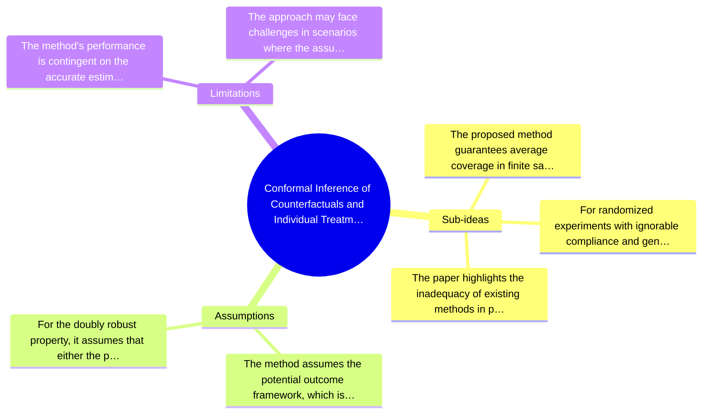

# Novelty Evaluation: Conformal Inference of Counterfactuals and Individual Treatment Effects

## Run Metadata

**Run context**

| Field | Value |
|-------|-------|
| Timestamp (America/New_York) | 2026-03-25 04:22:47 -0400 America/New_York (UTC: 2026-03-25T08:22:47Z) |
| Branch | main |
| Commit | [`9e95043`](https://github.com/yulinl2/Open-Idea-Sourcing/commit/9e950433de3fde602559ad15d1e934ce9f89d2a7) |
| CI Run | [Run #23531554865](https://github.com/yulinl2/Open-Idea-Sourcing/actions/runs/23531554865) |

**Configuration**

| Field | Value |
|-------|-------|
| Model | gpt-4o |
| Input | https://arxiv.org/abs/2006.06138 |
| Code version | 1.3.0 |

**Performance**

| Field | Value |
|-------|-------|
| Total runtime | 62.8s |
| └─ parsing | 5.1s |
| └─ online_search | 5.2s |
| └─ similarity | 0.0s |
| └─ domain_references | 10.8s |
| └─ evaluation | 41.1s |

## Pipeline Job Log

```mermaid
gantt
    title Pipeline Run — Conformal Inference of Counterfactuals and Individual Treatment Effects
    dateFormat x
    axisFormat %S.%Ls
    section PaperParser
    Parse paper :done, 0, 5100ms
    section SemanticScholar API
    Online reference search :done, 5100, 5190ms
    section SimilaritySearch
    Similarity search :done, 10290, 10ms
    section LLM (gpt-4o)
    Domain references :done, 10300, 10830ms
    Idea decomposition :done, 21755, 7225ms
    Duplication check :done, 28980, 4760ms
    Combination check :done, 33740, 7086ms
    Equivalence check :done, 40826, 6659ms
    Synthesis :done, 47485, 4582ms
    Reference annotation :done, 52067, 10769ms
```



**PaperParser**

| # | Job | Start (s) | Duration (s) | Input | Output |
|---|-----|----------:|-------------:|-------|--------|
| 1 | Parse paper | 0.00 | 5.10 | 2006.06138.pdf | "Conformal Inference of Counterfactuals and Individual Treatment Effects", 111859 chars |

<details>
<summary>📋 Parse paper — details</summary>

**Title:** Conformal Inference of Counterfactuals and Individual Treatment Effects

**Authors:** Lihua Lei

**Abstract:** *(not extracted)*

**Sections (69):**
- Conformal Inference
- Lihua Lei
- From Average Effects To Individual Effects
- From Point Estimates To Interval Estimates
- ITE
- ITE
- From Observables To Counterfactuals
- X X
- X X
- X r
- X X
- X X
- Inferential type ATE ATT ATC General
- X X
- X X
- X X
- CF X-learner BART CQR CF X-learner BART CQR
- Causal Forest
- Causal Forest
- Causal Forest

</details>

**SemanticScholar API**

| # | Job | Start (s) | Duration (s) | Input | Output |
|---|-----|----------:|-------------:|-------|--------|
| 2 | Online reference search | 5.10 | 5.19 | arXiv:2006.06138 + 4 LLM queries | 10 paper(s) fetched |

<details>
<summary>📋 Online reference search — details</summary>

**Queries used:**
1. individual treatment effect uncertainty
2. conformal inference counterfactuals
3. Bayesian treatment effect estimation
4. machine learning conditional treatment effects

**Fetched papers (10):**
1. **Classification with Valid and Adaptive Coverage** (2020)
2. **Conformal prediction intervals for the individual treatment effect** (2020)
3. **Towards optimal doubly robust estimation of heterogeneous causal effects** (2020)
4. **Use of directed acyclic graphs (DAGs) in applied health research: review and recommendations** (2019)
5. **Evaluation of Differences in Individual Treatment Response in Schizophrenia Spectrum Disorders: A Meta-analysis.** (2019)
6. **A comparison of some conformal quantile regression methods** (2019)
7. **Inference on finite-population treatment effects under limited overlap** (2019)
8. **A national experiment reveals where a growth mindset improves achievement** (2019)
9. **Assessing Treatment Effect Variation in Observational Studies: Results from a Data Challenge** (2019)
10. **Predictive inference with the jackknife+** (2019)

**Errors encountered:**
- ⚠️ query 'individual treatment effect uncertainty': HTTP Error 429: 
- ⚠️ query 'conformal inference counterfactuals': HTTP Error 429: 
- ⚠️ query 'Bayesian treatment effect estimation': HTTP Error 429: 
- ⚠️ query 'machine learning conditional treatment e': HTTP Error 429: 

</details>

**SimilaritySearch**

| # | Job | Start (s) | Duration (s) | Input | Output |
|---|-----|----------:|-------------:|-------|--------|
| 3 | Similarity search | 10.29 | 0.01 | TF-IDF cosine on 11 ref(s) | top-5: 0.24×Conformal prediction intervals for …; 0.20×Assessing Treatment Effect Variatio…; 0.18×Towards optimal doubly robust estim…; +2 more |

<details>
<summary>📋 Similarity search — details</summary>

**Query (key content excerpt):**
```
Title: Conformal Inference of Counterfactuals and Individual Treatment Effects

Conformal Inference
of Counterfactuals and Individual Treatment Effects
Lihua Lei
DepartmentofStatistics,StanfordUniversity
E-mail: lihualei@stanford.edu
Emmanuel J. Cande`s
DepartmentofStatisticsandDepartmentofMathemati…
```

**All matches (5):**
| Score | Title | Year |
|------:|-------|------|
| 0.241 | Conformal prediction intervals for the individual treatment effect | 2020 |
| 0.198 | Assessing Treatment Effect Variation in Observational Studies: Results from a Data Challenge | 2019 |
| 0.177 | Towards optimal doubly robust estimation of heterogeneous causal effects | 2020 |
| 0.166 | Inference on finite-population treatment effects under limited overlap | 2019 |
| 0.164 | Classification with Valid and Adaptive Coverage | 2020 |

</details>

**LLM (gpt-4o)**

| # | Job | Start (s) | Duration (s) | Input | Output |
|---|-----|----------:|-------------:|-------|--------|
| 4 | Domain references | 10.30 | 10.83 | paper content + 5 similar paper(s) | 6 domain reference(s) |
| 5 | Idea decomposition | 21.75 | 7.22 | paper content | 3 sub-idea(s) |
| 6 | Duplication check | 28.98 | 4.76 | paper content + 5 reference paper(s) | verdict=LOW |
| 7 | Combination check | 33.74 | 7.09 | paper content + 5 reference paper(s) | verdict=LOW |
| 8 | Equivalence check | 40.83 | 6.66 | paper content + 5 reference paper(s) | verdict=MEDIUM |
| 9 | Synthesis | 47.48 | 4.58 | 3 dimension results | verdict=MARGINAL, confidence=MEDIUM |
| 10 | Reference annotation | 52.07 | 10.77 | paper + 5 similar paper(s) | 5 annotation(s) |

## Idea Decomposition

**Core concept:** The paper introduces a conformal inference-based approach to provide reliable interval estimates for counterfactuals and individual treatment effects, addressing the challenge of uncertainty quantification in treatment effect heterogeneity.

**Sub-ideas:**

- The proposed method guarantees average coverage in finite samples for completely randomized or stratified randomized experiments with perfect compliance, regardless of the unknown data-generating mechanism.
- For randomized experiments with ignorable compliance and general observational studies, the method satisfies a doubly robust property, ensuring approximate average coverage if either the propensity score or the conditional quantiles of potential outcomes are accurately estimated.
- The paper highlights the inadequacy of existing methods in providing satisfactory coverage and demonstrates the effectiveness of the proposed approach through numerical studies on synthetic and real datasets.

**Assumptions:**

- The method assumes the potential outcome framework, which is a common causal inference framework.
- For the doubly robust property, it assumes that either the propensity score or the conditional quantiles of potential outcomes can be estimated accurately.

**Limitations:**

- The method's performance is contingent on the accurate estimation of either the propensity score or the conditional quantiles, which may not always be feasible in practice.
- The approach may face challenges in scenarios where the assumptions of the potential outcome framework or strong ignorability are violated.

### Idea Mind Map



**Overall verdict:** ⚠️ **MARGINAL** (confidence: MEDIUM)

## Summary

The paper "Conformal Inference of Counterfactuals and Individual Treatment Effects" presents a novel application of conformal inference to the estimation of counterfactuals and individual treatment effects, which is not directly duplicated in existing literature. However, the use of conformal prediction in treatment effect estimation has been explored previously, suggesting that the core methodology is not entirely new. The paper's contribution lies in its specific application and theoretical guarantees, which provide some degree of novelty, but the overlap with existing methods tempers the overall assessment.

## Detailed Analysis

### Direct Duplication

<details>
<summary><strong>Risk level:</strong> 🟢 LOW</summary>

The submitted paper "Conformal Inference of Counterfactuals and Individual Treatment Effects" presents a novel approach to uncertainty quantification in causal inference using conformal inference methods. While it shares thematic similarities with existing works on treatment effect estimation and conformal prediction, the core ideas and methods proposed in this paper are distinct. The paper introduces a conformal inference-based approach specifically for counterfactuals and individual treatment effects, which is not directly duplicated in the referenced papers. The referenced works focus on related but different aspects, such as prediction intervals for individual treatment effects or doubly robust estimation of heterogeneous causal effects, but do not cover the specific conformal inference approach for counterfactuals and individual treatment effects as proposed in this submission.

</details>

### Simple Combination

<details>
<summary><strong>Risk level:</strong> 🟢 LOW</summary>

The submitted paper presents a novel approach by integrating conformal inference with the estimation of counterfactuals and individual treatment effects (ITE) under the potential outcome framework. While conformal inference and the study of ITEs are established areas, the paper's contribution lies in its application of conformal inference to provide reliable interval estimates for ITEs, addressing a significant gap in uncertainty quantification in causal inference. The paper claims to achieve guaranteed average coverage in finite samples for randomized experiments and a doubly robust property for observational studies, which is a novel insight not directly traceable to the referenced works. The referenced papers discuss related topics such as prediction intervals for ITEs and doubly robust estimation, but none appear to combine these elements in the same manner or with the same theoretical guarantees as the submitted paper.

**Cited references:** `3ac4c34cf075f786a70ca0fc540e0df52db1ef3e`, `ac1984f94c4284278adf1cb36b607ef9bdd7bced`

</details>

### Methodological Equivalence

<details>
<summary><strong>Risk level:</strong> 🟡 MEDIUM</summary>

The submitted paper proposes a conformal inference-based approach to produce reliable interval estimates for counterfactuals and individual treatment effects (ITE) under the potential outcome framework. The novelty claimed by the authors lies in the application of conformal inference to causal inference problems, specifically for ITE. However, the concept of using conformal prediction for treatment effect estimation is not entirely new. The reference paper [3ac4c34cf075f786a70ca0fc540e0df52db1ef3e] already discusses conformal prediction intervals for ITE, suggesting that the core idea of using conformal methods for this purpose has been explored previously. The submitted paper may offer a new framing or application domain, but the underlying methodology shares similarities with existing work on conformal prediction in causal inference.

**Cited references:** `3ac4c34cf075f786a70ca0fc540e0df52db1ef3e`

</details>

## Most Similar Reference Papers

> **Scoring method:** TF-IDF cosine similarity (0–1). Higher scores indicate greater textual overlap between the paper's key content and the reference.

| Score | Title | Year |
|-------|-------|------|
| 0.24 | [Conformal prediction intervals for the individual treatment effect](https://www.semanticscholar.org/paper/3ac4c34cf075f786a70ca0fc540e0df52db1ef3e) | 2020 |
| 0.20 | [Assessing Treatment Effect Variation in Observational Studies: Results from a Data Challenge](https://www.semanticscholar.org/paper/76855e59d6c8a12194693985a38f461891c2ad8e) | 2019 |
| 0.18 | [Towards optimal doubly robust estimation of heterogeneous causal effects](https://www.semanticscholar.org/paper/ac1984f94c4284278adf1cb36b607ef9bdd7bced) | 2020 |
| 0.17 | [Inference on finite-population treatment effects under limited overlap](https://www.semanticscholar.org/paper/32fe794f68c9d8bae5b0ed2bf63c48bca7fed8c4) | 2019 |
| 0.16 | [Classification with Valid and Adaptive Coverage](https://www.semanticscholar.org/paper/00215f32433e4e69ddb5a678b3f02568334d67ca) | 2020 |

### Reference Annotations

**[0.24] [Conformal prediction intervals for the individual treatment effect](https://www.semanticscholar.org/paper/3ac4c34cf075f786a70ca0fc540e0df52db1ef3e) (2020)**

| Dimension | Notes |
|-----------|-------|
| **Overlap** | Both papers focus on constructing prediction intervals for individual treatment effects (ITE) using conformal inference techniques, aiming to provide coverage guarantees in causal inference settings. |
| **Differences** | The submitted paper emphasizes the application of conformal inference in both randomized and observational studies, highlighting a doubly robust property, whereas the reference paper primarily addresses non-parametric regression settings without specific focus on observational studies. |
| **Derivation** | The submitted paper's use of conformal inference for ITE prediction intervals appears inspired by the methodologies discussed in this reference. |

**[0.20] [Assessing Treatment Effect Variation in Observational Studies: Results from a Data Challenge](https://www.semanticscholar.org/paper/76855e59d6c8a12194693985a38f461891c2ad8e) (2019)**

| Dimension | Notes |
|-----------|-------|
| **Overlap** | Both papers address the challenge of assessing treatment effect variation, particularly in observational studies, and emphasize the importance of reliable uncertainty quantification. |
| **Differences** | The submitted paper proposes a specific conformal inference-based approach for interval estimation, while the reference paper reports on a data challenge workshop, focusing on a broader range of methods without detailing a specific approach. |
| **Derivation** | None identified. |

**[0.18] [Towards optimal doubly robust estimation of heterogeneous causal effects](https://www.semanticscholar.org/paper/ac1984f94c4284278adf1cb36b607ef9bdd7bced) (2020)**

| Dimension | Notes |
|-----------|-------|
| **Overlap** | Both papers are concerned with the estimation of heterogeneous causal effects and discuss the importance of robust estimation methods in causal inference. |
| **Differences** | The submitted paper introduces a conformal inference approach with a focus on interval estimates for ITE, whereas the reference paper explores optimal doubly robust estimation techniques for CATE without specific emphasis on interval estimation. |
| **Derivation** | The concept of doubly robust properties in the submitted paper may be inspired by the discussions on robust estimation methods in this reference. |

**[0.17] [Inference on finite-population treatment effects under limited overlap](https://www.semanticscholar.org/paper/32fe794f68c9d8bae5b0ed2bf63c48bca7fed8c4) (2019)**

| Dimension | Notes |
|-----------|-------|
| **Overlap** | Both papers deal with treatment effect estimation under challenging conditions, such as limited overlap or strong ignorability assumptions. |
| **Differences** | The submitted paper uses conformal inference to provide interval estimates with guaranteed coverage, while the reference paper focuses on finite-population treatment effects and models limited overlap in an asymptotic framework. |
| **Derivation** | None identified. |

**[0.16] [Classification with Valid and Adaptive Coverage](https://www.semanticscholar.org/paper/00215f32433e4e69ddb5a678b3f02568334d67ca) (2020)**

| Dimension | Notes |
|-----------|-------|
| **Overlap** | Both papers utilize conformal inference techniques to construct prediction sets with coverage guarantees, applicable to various machine learning algorithms. |
| **Differences** | The submitted paper specifically targets causal inference and treatment effect estimation, whereas the reference paper develops conformal inference methods for classification tasks. |
| **Derivation** | The application of conformal inference for constructing prediction intervals in the submitted paper may be inspired by the general conformal inference methodologies discussed in this reference. |

## Main Domain References

1. **[Estimating causal effects of treatments in randomized and nonrandomized studies](https://www.semanticscholar.org/search?q=Estimating+causal+effects+of+treatments+in+randomized+and+nonrandomized+studies&sort=Relevance)**, 1974
   *Donald B. Rubin*
   <details>
   <summary>Why this matters</summary>

   This seminal paper introduced the potential outcomes framework, which is foundational for causal inference and underpins the analysis of treatment effects, including average and individual treatment effects.

   </details>

2. **[Causality: Models, Reasoning, and Inference](https://www.semanticscholar.org/search?q=Causality%3A+Models%2C+Reasoning%2C+and+Inference&sort=Relevance)**, 2000
   *Judea Pearl*
   <details>
   <summary>Why this matters</summary>

   Judea Pearl's work on causal inference, particularly the development of graphical models and the do-calculus, provides a theoretical foundation for understanding and estimating causal effects, including individual treatment effects.

   </details>

3. **[Conformal prediction](https://www.semanticscholar.org/search?q=Conformal+prediction&sort=Relevance)**, 2005
   *Vladimir Vovk, Alexander Gammerman, Glenn Shafer*
   <details>
   <summary>Why this matters</summary>

   This book introduces conformal prediction, a method for creating prediction intervals with guaranteed coverage, which is directly relevant to the conformal inference approach proposed in the submitted paper.

   </details>

4. **[Doubly robust estimation of causal effects](https://www.semanticscholar.org/search?q=Doubly+robust+estimation+of+causal+effects&sort=Relevance)**, 1994
   *James M. Robins, Andrea Rotnitzky, Lue Ping Zhao*
   <details>
   <summary>Why this matters</summary>

   This paper introduces the concept of doubly robust estimation, which is crucial for estimating causal effects in observational studies and is relevant to the doubly robust properties discussed in the submitted paper.

   </details>

5. **[Heterogeneous treatment effects and the role of the propensity score](https://www.semanticscholar.org/search?q=Heterogeneous+treatment+effects+and+the+role+of+the+propensity+score&sort=Relevance)**, 2009
   *Guido W. Imbens, Jeffrey M. Wooldridge*
   <details>
   <summary>Why this matters</summary>

   This paper discusses the estimation of heterogeneous treatment effects and the importance of the propensity score, which is relevant to the estimation of individual treatment effects and the strong ignorability assumption in the submitted paper.

   </details>

6. **[Statistical Inference for Average Treatment Effects Estimated by Machine Learning](https://www.semanticscholar.org/search?q=Statistical+Inference+for+Average+Treatment+Effects+Estimated+by+Machine+Learning&sort=Relevance)**, 2016
   *Susan Athey, Guido W. Imbens*
   <details>
   <summary>Why this matters</summary>

   This paper explores the use of machine learning for estimating average treatment effects and discusses issues related to statistical inference, which are pertinent to the challenges of uncertainty quantification in the submitted paper.

   </details>
