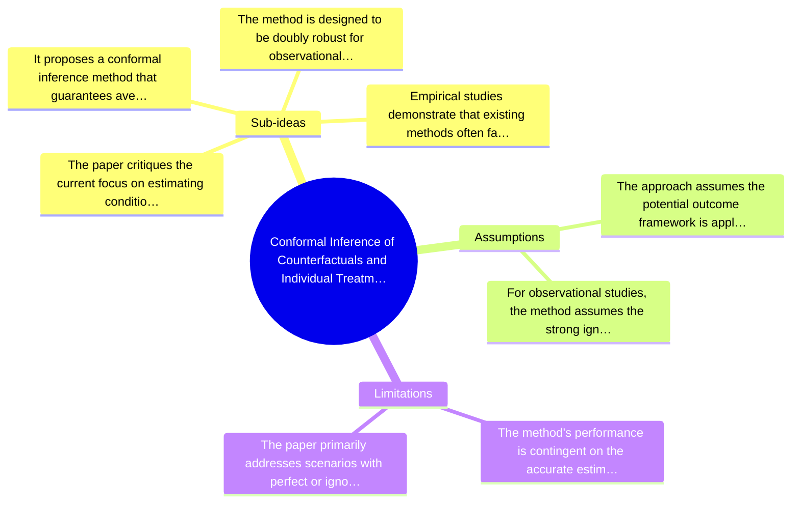

# Novelty Evaluation: Conformal Inference of Counterfactuals and Individual Treatment Effects

## Run Metadata

**Run context**

| Field | Value |
|-------|-------|
| Timestamp (America/New_York) | 2026-03-25 20:08:00 -0400 America/New_York (UTC: 2026-03-26T00:08:00Z) |
| Branch | main |
| Commit | [`9e39253`](https://github.com/yulinl2/Open-Idea-Sourcing/commit/9e39253e0127d5c3ebbe74dbc343200dd4a911c2) |
| CI Run | [Run #23570580688](https://github.com/yulinl2/Open-Idea-Sourcing/actions/runs/23570580688) |

**Configuration**

| Field | Value |
|-------|-------|
| Model | gpt-4o |
| Input | https://arxiv.org/abs/2006.06138 |
| Code version | 1.3.0 |

**Performance**

| Field | Value |
|-------|-------|
| Total runtime | 51.9s |
| └─ parsing | 5.5s |
| └─ online_search | 4.5s |
| └─ similarity | 0.0s |
| └─ domain_references | 8.2s |
| └─ evaluation | 33.0s |

## Pipeline Job Log

```mermaid
gantt
    title Pipeline Run — Conformal Inference of Counterfactuals and Individual Treatment Effects
    dateFormat x
    axisFormat %S.%Ls
    section PaperParser
    Parse paper :done, 0, 5470ms
    section SemanticScholar API
    Online reference search :done, 5470, 4530ms
    section SimilaritySearch
    Similarity search :done, 10000, 10ms
    section LLM (gpt-4o)
    Domain references :done, 10010, 8150ms
    Idea decomposition :done, 18858, 5928ms
    Duplication check :done, 24787, 4820ms
    Combination check :done, 29606, 3502ms
    Equivalence check :done, 33108, 6152ms
    Synthesis :done, 39260, 3290ms
    Reference annotation :done, 42550, 9297ms
```



**PaperParser**

| # | Job | Start (s) | Duration (s) | Input | Output |
|---|-----|----------:|-------------:|-------|--------|
| 1 | Parse paper | 0.00 | 5.47 | 2006.06138.pdf | "Conformal Inference of Counterfactuals and Individual Treatment Effects", 111859 chars |

<details>
<summary>📋 Parse paper — details</summary>

**Title:** Conformal Inference of Counterfactuals and Individual Treatment Effects

**Authors:** Lihua Lei

**Abstract:** *(not extracted)*

**Sections (69):**
- Conformal Inference
- Lihua Lei
- From Average Effects To Individual Effects
- From Point Estimates To Interval Estimates
- ITE
- ITE
- From Observables To Counterfactuals
- X X
- X X
- X r
- X X
- X X
- Inferential type ATE ATT ATC General
- X X
- X X
- X X
- CF X-learner BART CQR CF X-learner BART CQR
- Causal Forest
- Causal Forest
- Causal Forest

</details>

**SemanticScholar API**

| # | Job | Start (s) | Duration (s) | Input | Output |
|---|-----|----------:|-------------:|-------|--------|
| 2 | Online reference search | 5.47 | 4.53 | arXiv:2006.06138 + 4 LLM queries | 10 paper(s) fetched |

<details>
<summary>📋 Online reference search — details</summary>

**Queries used:**
1. counterfactual inference methods
2. conformal inference for treatment effects
3. Bayesian causal inference
4. doubly robust causal estimation

**Fetched papers (10):**
1. **Classification with Valid and Adaptive Coverage** (2020)
2. **Conformal prediction intervals for the individual treatment effect** (2020)
3. **Towards optimal doubly robust estimation of heterogeneous causal effects** (2020)
4. **Use of directed acyclic graphs (DAGs) in applied health research: review and recommendations** (2019)
5. **Evaluation of Differences in Individual Treatment Response in Schizophrenia Spectrum Disorders: A Meta-analysis.** (2019)
6. **A comparison of some conformal quantile regression methods** (2019)
7. **Inference on finite-population treatment effects under limited overlap** (2019)
8. **A national experiment reveals where a growth mindset improves achievement** (2019)
9. **Assessing Treatment Effect Variation in Observational Studies: Results from a Data Challenge** (2019)
10. **Predictive inference with the jackknife+** (2019)

**Errors encountered:**
- ⚠️ query 'counterfactual inference methods': HTTP Error 429: 
- ⚠️ query 'conformal inference for treatment effect': HTTP Error 429: 
- ⚠️ query 'Bayesian causal inference': HTTP Error 429: 

</details>

**SimilaritySearch**

| # | Job | Start (s) | Duration (s) | Input | Output |
|---|-----|----------:|-------------:|-------|--------|
| 3 | Similarity search | 10.00 | 0.01 | TF-IDF cosine on 11 ref(s) | top-5: 0.24×Conformal prediction intervals for …; 0.20×Assessing Treatment Effect Variatio…; 0.18×Towards optimal doubly robust estim…; +2 more |

<details>
<summary>📋 Similarity search — details</summary>

**Query (key content excerpt):**
```
Title: Conformal Inference of Counterfactuals and Individual Treatment Effects

Conformal Inference
of Counterfactuals and Individual Treatment Effects
Lihua Lei
DepartmentofStatistics,StanfordUniversity
E-mail: lihualei@stanford.edu
Emmanuel J. Cande`s
DepartmentofStatisticsandDepartmentofMathemati…
```

**All matches (5):**
| Score | Title | Year |
|------:|-------|------|
| 0.241 | Conformal prediction intervals for the individual treatment effect | 2020 |
| 0.198 | Assessing Treatment Effect Variation in Observational Studies: Results from a Data Challenge | 2019 |
| 0.177 | Towards optimal doubly robust estimation of heterogeneous causal effects | 2020 |
| 0.166 | Inference on finite-population treatment effects under limited overlap | 2019 |
| 0.164 | Classification with Valid and Adaptive Coverage | 2020 |

</details>

**LLM (gpt-4o)**

| # | Job | Start (s) | Duration (s) | Input | Output |
|---|-----|----------:|-------------:|-------|--------|
| 4 | Domain references | 10.01 | 8.15 | paper content + 5 similar paper(s) | 6 domain reference(s) |
| 5 | Idea decomposition | 18.86 | 5.93 | paper content | 4 sub-idea(s) |
| 6 | Duplication check | 24.79 | 4.82 | paper content + 5 reference paper(s) | verdict=LOW |
| 7 | Combination check | 29.61 | 3.50 | paper content + 5 reference paper(s) | verdict=LOW |
| 8 | Equivalence check | 33.11 | 6.15 | paper content + 5 reference paper(s) | verdict=MEDIUM |
| 9 | Synthesis | 39.26 | 3.29 | 3 dimension results | verdict=MARGINAL, confidence=MEDIUM |
| 10 | Reference annotation | 42.55 | 9.30 | paper + 5 similar paper(s) | 5 annotation(s) |

## Idea Decomposition

**Core concept:** The paper introduces a conformal inference-based approach to provide reliable interval estimates for counterfactuals and individual treatment effects, ensuring average coverage in finite samples for randomized experiments and offering a doubly robust property for observational studies.

**Sub-ideas:**

- The paper critiques the current focus on estimating conditional average treatment effects (CATE) using machine learning, highlighting their inadequacy in uncertainty quantification.
- It proposes a conformal inference method that guarantees average coverage for interval estimates in completely randomized or stratified randomized experiments.
- The method is designed to be doubly robust for observational studies, maintaining coverage if either the propensity score or the conditional quantiles of potential outcomes are accurately estimated.
- Empirical studies demonstrate that existing methods often fail to provide satisfactory coverage, whereas the proposed method achieves desired coverage with reasonably short intervals.

**Assumptions:**

- The approach assumes the potential outcome framework is applicable to the data being analyzed.
- For observational studies, the method assumes the strong ignorability condition holds, allowing for the doubly robust property.

**Limitations:**

- The method's performance is contingent on the accurate estimation of either the propensity score or the conditional quantiles, which may not always be feasible.
- The paper primarily addresses scenarios with perfect or ignorable compliance, potentially limiting its applicability to more complex real-world settings with non-ignorable compliance issues.

### Idea Mind Map



**Overall verdict:** ⚠️ **MARGINAL** (confidence: MEDIUM)

## Summary

The paper "Conformal Inference of Counterfactuals and Individual Treatment Effects" presents a novel application of conformal inference to the estimation of counterfactuals and individual treatment effects, addressing a notable gap in uncertainty quantification within causal inference. While the integration of conformal inference with these specific applications is innovative and offers valuable contributions, particularly in terms of the doubly robust property and finite sample guarantees, the underlying methodology of conformal inference is not entirely new. The novelty primarily lies in the specific application and enhancements rather than in fundamental methodological innovation, leading to a verdict of marginal novelty with medium confidence.

## Detailed Analysis

### Direct Duplication

<details>
<summary><strong>Risk level:</strong> 🟢 LOW</summary>

The submitted paper "Conformal Inference of Counterfactuals and Individual Treatment Effects" by Lihua Lei and Emmanuel J. Candès presents a novel approach to uncertainty quantification in causal inference using conformal inference methods. The paper focuses on providing reliable interval estimates for counterfactuals and individual treatment effects, addressing a gap in existing methods that often fail in uncertainty quantification. The referenced papers, while related in the broader context of treatment effect estimation and conformal inference, do not duplicate the core ideas, methods, or results of the submitted work. The most similar paper, "Conformal prediction intervals for the individual treatment effect," shares a thematic focus on conformal prediction but does not cover the same methodological innovations or applications as the submitted paper. Therefore, the submitted paper is not a direct duplicate of any known or referenced work.

</details>

### Simple Combination

<details>
<summary><strong>Risk level:</strong> 🟢 LOW</summary>

The submitted paper presents a novel approach by integrating conformal inference with the estimation of counterfactuals and individual treatment effects (ITE) under the potential outcome framework. While conformal inference and ITE estimation are established concepts, their combination in this context is not trivial. The paper addresses a significant gap in the literature by providing reliable interval estimates for counterfactuals and ITEs, which is crucial for uncertainty quantification in causal inference. The proposed method offers a doubly robust property, enhancing its applicability in both randomized experiments and observational studies. This integration is not merely a simple combination of existing methods but rather a meaningful advancement that addresses the limitations of current approaches in uncertainty quantification for treatment effect heterogeneity.

</details>

### Methodological Equivalence

<details>
<summary><strong>Risk level:</strong> 🟡 MEDIUM</summary>

The submitted paper proposes a conformal inference-based approach to produce interval estimates for counterfactuals and individual treatment effects (ITE) under the potential outcome framework. This approach is claimed to provide reliable interval estimates with guaranteed average coverage in finite samples, which is a significant contribution to uncertainty quantification in causal inference. However, the core idea of using conformal inference for constructing prediction intervals is not entirely novel. Conformal prediction methods have been previously applied to similar problems, such as constructing prediction intervals for individual treatment effects, as seen in the reference paper [3ac4c34cf075f786a70ca0fc540e0df52db1ef3e]. The submitted paper extends these ideas to the context of counterfactuals and ITE, emphasizing the doubly robust property and finite sample guarantees, which are valuable contributions. Nonetheless, the underlying methodology of conformal inference is well-established, and the novelty lies more in the application and specific guarantees rather than the fundamental methodological innovation.

**Cited references:** `3ac4c34cf075f786a70ca0fc540e0df52db1ef3e`

</details>

## Most Similar Reference Papers

> **Scoring method:** TF-IDF cosine similarity (0–1). Higher scores indicate greater textual overlap between the paper's key content and the reference.

| Score | Title | Year |
|-------|-------|------|
| 0.24 | [Conformal prediction intervals for the individual treatment effect](https://www.semanticscholar.org/paper/3ac4c34cf075f786a70ca0fc540e0df52db1ef3e) | 2020 |
| 0.20 | [Assessing Treatment Effect Variation in Observational Studies: Results from a Data Challenge](https://www.semanticscholar.org/paper/76855e59d6c8a12194693985a38f461891c2ad8e) | 2019 |
| 0.18 | [Towards optimal doubly robust estimation of heterogeneous causal effects](https://www.semanticscholar.org/paper/ac1984f94c4284278adf1cb36b607ef9bdd7bced) | 2020 |
| 0.17 | [Inference on finite-population treatment effects under limited overlap](https://www.semanticscholar.org/paper/32fe794f68c9d8bae5b0ed2bf63c48bca7fed8c4) | 2019 |
| 0.16 | [Classification with Valid and Adaptive Coverage](https://www.semanticscholar.org/paper/00215f32433e4e69ddb5a678b3f02568334d67ca) | 2020 |

### Reference Annotations

**[0.24] [Conformal prediction intervals for the individual treatment effect](https://www.semanticscholar.org/paper/3ac4c34cf075f786a70ca0fc540e0df52db1ef3e) (2020)**

| Dimension | Notes |
|-----------|-------|
| **Overlap** | Both the submitted paper and this reference focus on using conformal prediction methods to construct prediction intervals for individual treatment effects, emphasizing finite-sample coverage guarantees. |
| **Differences** | The submitted paper extends the application of conformal inference to both counterfactuals and individual treatment effects under various experimental conditions, while the reference primarily addresses non-parametric regression settings. |
| **Derivation** | The submitted paper appears inspired by the reference's approach to conformal prediction intervals, adapting it to a broader range of causal inference scenarios. |

**[0.20] [Assessing Treatment Effect Variation in Observational Studies: Results from a Data Challenge](https://www.semanticscholar.org/paper/76855e59d6c8a12194693985a38f461891c2ad8e) (2019)**

| Dimension | Notes |
|-----------|-------|
| **Overlap** | Both papers address the challenge of assessing treatment effect variation, particularly in observational studies. |
| **Differences** | The submitted paper introduces a conformal inference-based method for uncertainty quantification, whereas the reference focuses on results from a data challenge workshop without proposing a specific methodological framework. |
| **Derivation** | None identified. |

**[0.18] [Towards optimal doubly robust estimation of heterogeneous causal effects](https://www.semanticscholar.org/paper/ac1984f94c4284278adf1cb36b607ef9bdd7bced) (2020)**

| Dimension | Notes |
|-----------|-------|
| **Overlap** | Both papers discuss the estimation of heterogeneous causal effects and the importance of robust methods in causal inference. |
| **Differences** | The submitted paper emphasizes conformal inference for interval estimation, while the reference paper focuses on optimal doubly robust estimation techniques for CATEs. |
| **Derivation** | None identified. |

**[0.17] [Inference on finite-population treatment effects under limited overlap](https://www.semanticscholar.org/paper/32fe794f68c9d8bae5b0ed2bf63c48bca7fed8c4) (2019)**

| Dimension | Notes |
|-----------|-------|
| **Overlap** | Both papers are concerned with treatment effect estimation under challenging conditions, such as limited overlap or strong ignorability assumptions. |
| **Differences** | The submitted paper proposes conformal inference methods for individual treatment effects, whereas the reference paper deals with finite-population treatment effects under limited overlap. |
| **Derivation** | None identified. |

**[0.16] [Classification with Valid and Adaptive Coverage](https://www.semanticscholar.org/paper/00215f32433e4e69ddb5a678b3f02568334d67ca) (2020)**

| Dimension | Notes |
|-----------|-------|
| **Overlap** | Both papers utilize conformal inference techniques to provide coverage guarantees, with a focus on prediction sets. |
| **Differences** | The submitted paper applies conformal inference to causal inference problems, specifically for counterfactuals and individual treatment effects, while the reference paper focuses on classification problems with valid and adaptive coverage. |
| **Derivation** | The submitted paper may be inspired by the reference's use of conformal inference to ensure coverage guarantees, adapting the concept to causal inference contexts. |

## Main Domain References

1. **[Estimating causal effects of treatments in randomized and nonrandomized studies](https://www.semanticscholar.org/search?q=%22Estimating+causal+effects+of+treatments+in+randomized+and+nonrandomized+studies%22&sort=Relevance)**, 1974
   *Donald B. Rubin*
   <details>
   <summary>Why this matters</summary>

   This seminal paper introduced the Rubin Causal Model, which is foundational for understanding causal inference and the estimation of treatment effects, including individual treatment effects (ITE).

   </details>

2. **[Causal Diagrams for Empirical Research](https://www.semanticscholar.org/search?q=%22Causal+Diagrams+for+Empirical+Research%22&sort=Relevance)**, 1995
   *Judea Pearl*
   <details>
   <summary>Why this matters</summary>

   Pearl's work on causal diagrams and the do-calculus is crucial for understanding the structural aspects of causal inference, which underpins the estimation of treatment effects and counterfactuals.

   </details>

3. **[Conformal Prediction](https://www.semanticscholar.org/search?q=%22Conformal+Prediction%22&sort=Relevance)**, 2005
   *Vladimir Vovk, Alexander Gammerman, and Glenn Shafer*
   <details>
   <summary>Why this matters</summary>

   This book provides a comprehensive introduction to conformal prediction, a statistical framework that is central to the conformal inference approach proposed in the submitted paper.

   </details>

4. **[Doubly Robust Estimation for Missing Data and Causal Inference Models](https://www.semanticscholar.org/search?q=%22Doubly+Robust+Estimation+for+Missing+Data+and+Causal+Inference+Models%22&sort=Relevance)**, 1994
   *James M. Robins, Andrea Rotnitzky, and Lue Ping Zhao*
   <details>
   <summary>Why this matters</summary>

   This paper introduces the concept of doubly robust estimation, which is relevant for the doubly robust property discussed in the submitted paper regarding the estimation of propensity scores and conditional quantiles.

   </details>

5. **[The Central Role of the Propensity Score in Observational Studies for Causal Effects](https://www.semanticscholar.org/search?q=%22The+Central+Role+of+the+Propensity+Score+in+Observational+Studies+for+Causal+Effects%22&sort=Relevance)**, 1983
   *Paul R. Rosenbaum and Donald B. Rubin*
   <details>
   <summary>Why this matters</summary>

   This paper is foundational for understanding the use of propensity scores in causal inference, which is a key component in the estimation of treatment effects in observational studies as discussed in the submitted paper.

   </details>

6. **[Heterogeneous Treatment Effects in Randomized Experiments](https://www.semanticscholar.org/search?q=%22Heterogeneous+Treatment+Effects+in+Randomized+Experiments%22&sort=Relevance)**, 2015
   *Guido W. Imbens and Donald B. Rubin*
   <details>
   <summary>Why this matters</summary>

   This book chapter provides a detailed discussion on the estimation of heterogeneous treatment effects, which is directly related to the focus on individual treatment effects in the submitted paper.

   </details>
