# Novelty Evaluation: Conformal Inference of Counterfactuals and Individual Treatment Effects

## Run Metadata

**Run context**

| Field | Value |
|-------|-------|
| Timestamp (America/New_York) | 2026-03-25 05:25:16 -0400 America/New_York (UTC: 2026-03-25T09:25:16Z) |
| Branch | copilot/refactor-architecture-to-linear-pipeline |
| Commit | [`d64e9ef`](https://github.com/yulinl2/Open-Idea-Sourcing/commit/d64e9efa93deb74dd90b060d07f29692fa761c2b) |
| CI Run | [Run #23533840640](https://github.com/yulinl2/Open-Idea-Sourcing/actions/runs/23533840640) |

**Configuration**

| Field | Value |
|-------|-------|
| Model | gpt-4o |
| Input | https://arxiv.org/abs/2006.06138 |
| Code version | 2.0.0 |

**Performance**

| Field | Value |
|-------|-------|
| Total runtime | 43.0s |
| └─ parsing | 5.4s |
| └─ online_search | 4.9s |
| └─ similarity | 0.0s |
| └─ domain_references | 5.8s |
| └─ evaluation | 26.1s |

## Pipeline Job Log

```mermaid
gantt
    title Pipeline Run — Conformal Inference of Counterfactuals and Individual Treatment Effects
    dateFormat x
    axisFormat %S.%Ls
    section PaperParser
    Parse paper :done, 0, 5410ms
    section SemanticScholar API
    Online reference search :done, 5410, 4920ms
    section SimilaritySearch
    Similarity search :done, 10330, 10ms
    section LLM (gpt-4o)
    Domain references :done, 10340, 5790ms
    Idea decomposition :done, 16972, 5746ms
    Duplication check :done, 22717, 3535ms
    Combination check :done, 26253, 3597ms
    Equivalence check :done, 29850, 3344ms
    Synthesis :done, 33195, 2648ms
    Reference annotation :done, 35843, 7203ms
```



**PaperParser**

| # | Job | Start (s) | Duration (s) | Input | Output |
|---|-----|----------:|-------------:|-------|--------|
| 1 | Parse paper | 0.00 | 5.41 | 2006.06138.pdf | "Conformal Inference of Counterfactuals and Individual Treatment Effects", 111859 chars |

<details>
<summary>📋 Parse paper — details</summary>

**Title:** Conformal Inference of Counterfactuals and Individual Treatment Effects

**Authors:** Lihua Lei

**Abstract:** *(not extracted)*

**Sections (69):**
- Conformal Inference
- Lihua Lei
- From Average Effects To Individual Effects
- From Point Estimates To Interval Estimates
- ITE
- ITE
- From Observables To Counterfactuals
- X X
- X X
- X r
- X X
- X X
- Inferential type ATE ATT ATC General
- X X
- X X
- X X
- CF X-learner BART CQR CF X-learner BART CQR
- Causal Forest
- Causal Forest
- Causal Forest

</details>

**SemanticScholar API**

| # | Job | Start (s) | Duration (s) | Input | Output |
|---|-----|----------:|-------------:|-------|--------|
| 2 | Online reference search | 5.41 | 4.92 | arXiv:2006.06138 + 4 LLM queries | 10 paper(s) fetched |

<details>
<summary>📋 Online reference search — details</summary>

**Queries used:**
1. individual treatment effect uncertainty
2. conformal inference counterfactuals
3. Bayesian treatment effect estimation
4. machine learning conditional treatment effects

**Fetched papers (10):**
1. **Classification with Valid and Adaptive Coverage** (2020)
2. **Conformal prediction intervals for the individual treatment effect** (2020)
3. **Towards optimal doubly robust estimation of heterogeneous causal effects** (2020)
4. **Use of directed acyclic graphs (DAGs) in applied health research: review and recommendations** (2019)
5. **Evaluation of Differences in Individual Treatment Response in Schizophrenia Spectrum Disorders: A Meta-analysis.** (2019)
6. **A comparison of some conformal quantile regression methods** (2019)
7. **Inference on finite-population treatment effects under limited overlap** (2019)
8. **A national experiment reveals where a growth mindset improves achievement** (2019)
9. **Assessing Treatment Effect Variation in Observational Studies: Results from a Data Challenge** (2019)
10. **Predictive inference with the jackknife+** (2019)

**Errors encountered:**
- ⚠️ query 'individual treatment effect uncertainty': HTTP Error 429: 
- ⚠️ query 'Bayesian treatment effect estimation': HTTP Error 429: 
- ⚠️ query 'machine learning conditional treatment e': HTTP Error 429: 

</details>

**SimilaritySearch**

| # | Job | Start (s) | Duration (s) | Input | Output |
|---|-----|----------:|-------------:|-------|--------|
| 3 | Similarity search | 10.33 | 0.01 | TF-IDF cosine on 11 ref(s) | top-5: 0.24×Conformal prediction intervals for …; 0.20×Assessing Treatment Effect Variatio…; 0.18×Towards optimal doubly robust estim…; +2 more |

<details>
<summary>📋 Similarity search — details</summary>

**Query (key content excerpt):**
```
Title: Conformal Inference of Counterfactuals and Individual Treatment Effects

Conformal Inference
of Counterfactuals and Individual Treatment Effects
Lihua Lei
DepartmentofStatistics,StanfordUniversity
E-mail: lihualei@stanford.edu
Emmanuel J. Cande`s
DepartmentofStatisticsandDepartmentofMathemati…
```

**All matches (5):**
| Score | Title | Year |
|------:|-------|------|
| 0.241 | Conformal prediction intervals for the individual treatment effect | 2020 |
| 0.198 | Assessing Treatment Effect Variation in Observational Studies: Results from a Data Challenge | 2019 |
| 0.177 | Towards optimal doubly robust estimation of heterogeneous causal effects | 2020 |
| 0.166 | Inference on finite-population treatment effects under limited overlap | 2019 |
| 0.164 | Classification with Valid and Adaptive Coverage | 2020 |

</details>

**LLM (gpt-4o)**

| # | Job | Start (s) | Duration (s) | Input | Output |
|---|-----|----------:|-------------:|-------|--------|
| 4 | Domain references | 10.34 | 5.79 | paper content + 5 similar paper(s) | 5 domain reference(s) |
| 5 | Idea decomposition | 16.97 | 5.75 | paper content | 3 sub-idea(s) |
| 6 | Duplication check | 22.72 | 3.54 | paper content + 5 reference paper(s) | verdict=LOW |
| 7 | Combination check | 26.25 | 3.60 | paper content + 5 reference paper(s) | verdict=LOW |
| 8 | Equivalence check | 29.85 | 3.34 | paper content + 5 reference paper(s) | verdict=MEDIUM |
| 9 | Synthesis | 33.20 | 2.65 | 3 dimension results | verdict=MARGINAL, confidence=MEDIUM |
| 10 | Reference annotation | 35.84 | 7.20 | paper + 5 similar paper(s) | 5 annotation(s) |

## Idea Decomposition

**Core concept:** The paper proposes a conformal inference-based approach to provide reliable interval estimates for counterfactuals and individual treatment effects, ensuring average coverage in finite samples regardless of the data-generating mechanism.

### Concept Tree

```
Conformal Inference of Counterfactuals and Individual Treatment Effects
├── Problem: Reliable uncertainty quantification in treatment effect estimation
│   ├── Gap: Existing methods perform poorly in uncertainty quantification
│   └── Metric: Average coverage of interval estimates in finite samples
├── Method: Conformal inference-based approach
│   ├── Reliable interval estimates
│   │   ├── Finite sample coverage guarantee
│   │   └── Applicable to randomized experiments with perfect compliance
│   └── Doubly robust property
│       ├── Valid under strong ignorability assumption
│       └── Requires accurate estimation of propensity score or conditional quantiles
└── Evidence
    ├── Empirical: Demonstrated coverage with short intervals on synthetic and real datasets
    └── Theoretical: Guarantees average coverage regardless of data-generating mechanism
```

**Sub-ideas:**

- The use of conformal inference to achieve reliable uncertainty quantification for counterfactuals and individual treatment effects.
- The method guarantees average coverage in finite samples for randomized experiments with perfect compliance.
- The approach satisfies a doubly robust property for randomized experiments with ignorable compliance and general observational studies.

**Assumptions:**

- The potential outcome framework is applicable to the treatment effect estimation.
- The strong ignorability assumption holds in observational studies for the doubly robust property to be valid.

**Limitations:**

- The method's performance is contingent on the accurate estimation of either the propensity score or the conditional quantiles of potential outcomes.
- The approach may not address all practical scenarios where the assumptions do not hold.

**Overall verdict:** ⚠️ **MARGINAL** (confidence: MEDIUM)

## Summary

The paper "Conformal Inference of Counterfactuals and Individual Treatment Effects" presents a novel application of conformal inference to the estimation of individual treatment effects, offering reliable interval estimates with guaranteed coverage. While the approach addresses a gap in uncertainty quantification for ITEs and introduces a doubly robust property, the core concept of using conformal inference in causal inference is not entirely new. The paper provides incremental advancements by extending existing methods to ensure coverage under various experimental conditions, but the foundational ideas are already present in the literature.

## Detailed Analysis

### Direct Duplication

<details>
<summary><strong>Risk level:</strong> 🟢 LOW</summary>

The submitted paper "Conformal Inference of Counterfactuals and Individual Treatment Effects" by Lihua Lei and Emmanuel J. Candes presents a novel approach to uncertainty quantification in causal inference using conformal inference methods. While the paper shares thematic similarities with existing works on treatment effect heterogeneity and conformal prediction, it introduces a unique methodology that guarantees average coverage for counterfactuals and individual treatment effects under various experimental conditions. The referenced papers, although related in terms of exploring treatment effect variation and conformal prediction, do not duplicate the core ideas, methods, or results presented in this submission. The submitted work's focus on achieving reliable interval estimates with guaranteed coverage and its application to both synthetic and real datasets further distinguish it from the referenced works.

</details>

### Simple Combination

<details>
<summary><strong>Risk level:</strong> 🟢 LOW</summary>

The submitted paper presents a novel approach by integrating conformal inference with the estimation of individual treatment effects (ITE) under the potential outcome framework. While conformal inference and the estimation of treatment effects are established areas of research, the paper's contribution lies in its application of conformal inference to provide reliable interval estimates for counterfactuals and ITEs, particularly in randomized and observational studies. This approach addresses a significant gap in the existing literature, which often lacks robust uncertainty quantification for ITEs. The paper's doubly robust property, which ensures average coverage if either the propensity score or the conditional quantiles of potential outcomes can be accurately estimated, is a meaningful advancement. This combination of techniques is not merely a simple aggregation of existing methods but rather a thoughtful integration that enhances the reliability of causal inference in practical applications.

**Cited references:** `3ac4c34cf075f786a70ca0fc540e0df52db1ef3e`, `76855e59d6c8a12194693985a38f461891c2ad8e`, `ac1984f94c4284278adf1cb36b607ef9bdd7bced`

</details>

### Methodological Equivalence

<details>
<summary><strong>Risk level:</strong> 🟡 MEDIUM</summary>

The submitted paper introduces a conformal inference-based approach for estimating counterfactuals and individual treatment effects (ITE) with guaranteed coverage properties. The novelty claimed by the authors lies in the use of conformal inference to provide reliable interval estimates for ITEs, particularly under the potential outcome framework. However, upon closer examination, the methodology appears to be conceptually similar to existing conformal prediction methods applied to causal inference, particularly for estimating individual treatment effects. The paper [3ac4c34cf075f786a70ca0fc540e0df52db1ef3e] discusses conformal prediction intervals for ITEs, which suggests that the core idea of using conformal prediction for causal inference is not entirely novel. The submitted paper extends these ideas to ensure coverage under various experimental conditions, which may offer some incremental advancements, but the foundational concept of using conformal inference for ITEs is already established.

**Cited references:** `3ac4c34cf075f786a70ca0fc540e0df52db1ef3e`

</details>

## Most Similar Reference Papers

> **Scoring method:** TF-IDF cosine similarity (0–1). Higher scores indicate greater textual overlap between the paper's key content and the reference.

| Score | Title | Year |
|-------|-------|------|
| 0.24 | [Conformal prediction intervals for the individual treatment effect](https://www.semanticscholar.org/paper/3ac4c34cf075f786a70ca0fc540e0df52db1ef3e) | 2020 |
| 0.20 | [Assessing Treatment Effect Variation in Observational Studies: Results from a Data Challenge](https://www.semanticscholar.org/paper/76855e59d6c8a12194693985a38f461891c2ad8e) | 2019 |
| 0.18 | [Towards optimal doubly robust estimation of heterogeneous causal effects](https://www.semanticscholar.org/paper/ac1984f94c4284278adf1cb36b607ef9bdd7bced) | 2020 |
| 0.17 | [Inference on finite-population treatment effects under limited overlap](https://www.semanticscholar.org/paper/32fe794f68c9d8bae5b0ed2bf63c48bca7fed8c4) | 2019 |
| 0.16 | [Classification with Valid and Adaptive Coverage](https://www.semanticscholar.org/paper/00215f32433e4e69ddb5a678b3f02568334d67ca) | 2020 |

### Reference Annotations

**[0.24] [Conformal prediction intervals for the individual treatment effect](https://www.semanticscholar.org/paper/3ac4c34cf075f786a70ca0fc540e0df52db1ef3e) (2020)**

| Dimension | Notes |
|-----------|-------|
| **Overlap** | Both the submitted paper and this reference focus on using conformal prediction methods to provide interval estimates for individual treatment effects, emphasizing finite-sample coverage guarantees. |
| **Differences** | The submitted paper extends the application of conformal inference to both counterfactuals and individual treatment effects within randomized and observational study settings, whereas the reference primarily addresses prediction intervals in a non-parametric regression context. |
| **Derivation** | The submitted paper appears to be inspired by the reference in its use of conformal prediction to ensure coverage guarantees for individual treatment effects. |

**[0.20] [Assessing Treatment Effect Variation in Observational Studies: Results from a Data Challenge](https://www.semanticscholar.org/paper/76855e59d6c8a12194693985a38f461891c2ad8e) (2019)**

| Dimension | Notes |
|-----------|-------|
| **Overlap** | Both papers address the challenge of assessing treatment effect variation, particularly in observational studies, and emphasize the importance of reliable uncertainty quantification. |
| **Differences** | The submitted paper proposes a novel conformal inference approach for counterfactuals and individual treatment effects, while the reference focuses on evaluating existing methods through a data challenge. |
| **Derivation** | None identified. |

**[0.18] [Towards optimal doubly robust estimation of heterogeneous causal effects](https://www.semanticscholar.org/paper/ac1984f94c4284278adf1cb36b607ef9bdd7bced) (2020)**

| Dimension | Notes |
|-----------|-------|
| **Overlap** | Both papers are concerned with the estimation of heterogeneous causal effects and the importance of robust methods in causal inference. |
| **Differences** | The submitted paper introduces a conformal inference-based method for individual treatment effects, whereas the reference paper discusses optimal doubly robust estimation techniques for conditional average treatment effects. |
| **Derivation** | None identified. |

**[0.17] [Inference on finite-population treatment effects under limited overlap](https://www.semanticscholar.org/paper/32fe794f68c9d8bae5b0ed2bf63c48bca7fed8c4) (2019)**

| Dimension | Notes |
|-----------|-------|
| **Overlap** | Both papers deal with treatment effect inference under challenging conditions, such as limited overlap or strong ignorability assumptions. |
| **Differences** | The submitted paper utilizes conformal inference to address uncertainty in individual treatment effects, while the reference focuses on finite-population treatment effects under limited overlap conditions. |
| **Derivation** | None identified. |

**[0.16] [Classification with Valid and Adaptive Coverage](https://www.semanticscholar.org/paper/00215f32433e4e69ddb5a678b3f02568334d67ca) (2020)**

| Dimension | Notes |
|-----------|-------|
| **Overlap** | Both papers employ conformal inference techniques to construct prediction sets with guaranteed coverage, applicable across various machine learning algorithms. |
| **Differences** | The submitted paper specifically targets counterfactuals and individual treatment effects, whereas the reference develops conformal inference methods for classification tasks. |
| **Derivation** | The submitted paper may have drawn inspiration from the reference's use of conformal inference to ensure valid and adaptive coverage across different applications. |

## Main Domain References

1. **[Estimating causal effects of treatments in randomized and nonrandomized studies](https://www.semanticscholar.org/search?q=%22Estimating+causal+effects+of+treatments+in+randomized+and+nonrandomized+studies%22&sort=Relevance)**, 1974
   *Donald B. Rubin*
   <details>
   <summary>Why this matters</summary>

   This seminal paper introduced the potential outcomes framework, which is foundational for causal inference and underpins the estimation of treatment effects, including individual treatment effects (ITE) and average treatment effects (ATE).

   </details>

2. **[Causal Diagrams for Empirical Research](https://www.semanticscholar.org/search?q=%22Causal+Diagrams+for+Empirical+Research%22&sort=Relevance)**, 1995
   *Judea Pearl*
   <details>
   <summary>Why this matters</summary>

   Pearl's work on causal diagrams and the do-calculus provides a graphical framework for understanding and estimating causal effects, which is crucial for the development of methods to estimate ITE and CATE.

   </details>

3. **[Conformal prediction](https://www.semanticscholar.org/search?q=%22Conformal+prediction%22&sort=Relevance)**, 2005
   *Vladimir Vovk, Alexander Gammerman, and Glenn Shafer*
   <details>
   <summary>Why this matters</summary>

   This book introduces conformal prediction, a method for constructing prediction intervals with guaranteed coverage, which is directly relevant to the conformal inference approach proposed in the submitted paper.

   </details>

4. **[Doubly robust estimation for missing data and causal inference models](https://www.semanticscholar.org/search?q=%22Doubly+robust+estimation+for+missing+data+and+causal+inference+models%22&sort=Relevance)**, 1994
   *James M. Robins, Andrea Rotnitzky, and Lue Ping Zhao*
   <details>
   <summary>Why this matters</summary>

   This paper introduces the concept of doubly robust estimation, which is important for the submitted paper's approach to handling uncertainty in estimating treatment effects under the strong ignorability assumption.

   </details>

5. **[The central role of the propensity score in observational studies for causal effects](https://www.semanticscholar.org/search?q=%22The+central+role+of+the+propensity+score+in+observational+studies+for+causal+effects%22&sort=Relevance)**, 1983
   *Paul R. Rosenbaum and Donald B. Rubin*
   <details>
   <summary>Why this matters</summary>

   This paper discusses the use of propensity scores in observational studies to estimate causal effects, which is relevant for understanding the assumptions and methods used in the submitted paper for observational data analysis.

   </details>
