# Novelty Evaluation: Conformal Inference of Counterfactuals and Individual Treatment Effects

## Run Metadata

**Run context**

| Field | Value |
|-------|-------|
| Timestamp (America/New_York) | 2026-03-25 17:45:37 -0400 America/New_York (UTC: 2026-03-25T21:45:37Z) |
| Branch | copilot/rebuild-project-from-scratch |
| Commit | [`8ac509c`](https://github.com/yulinl2/Open-Idea-Sourcing/commit/8ac509cdf6e8f5e1e17ed636e7c811671bdb0afe) |
| CI Run | [Run #23565674020](https://github.com/yulinl2/Open-Idea-Sourcing/actions/runs/23565674020) |

**Configuration**

| Field | Value |
|-------|-------|
| Model | gpt-4o |
| Input | https://arxiv.org/abs/2006.06138 |
| Code version | 2.0.0 |

**Performance**

| Field | Value |
|-------|-------|
| Total runtime | 60.9s |
| └─ parsing | 5.5s |
| └─ decomposition | 10.1s |
| └─ online_search | 4.2s |
| └─ similarity | 0.0s |
| └─ domain_references | 7.2s |
| └─ evaluation | 33.2s |

## Pipeline Job Log

```mermaid
gantt
    title Pipeline Run — Conformal Inference of Counterfactuals and Individual Treatment Effects
    dateFormat x
    axisFormat %S.%Ls
    section PaperParser
    Parse paper :done, 0, 5490ms
    section LLM (gpt-4o)
    Idea decomposition :done, 5490, 10130ms
    section SemanticScholar API
    Online reference search :done, 15620, 4150ms
    section SimilaritySearch
    Similarity search :done, 19770, 10ms
    section LLM (gpt-4o)
    Domain references :done, 19780, 7210ms
    Duplication check :done, 27667, 8658ms
    Combination check :done, 36325, 4912ms
    Equivalence check :done, 41237, 4389ms
    Synthesis :done, 45626, 6645ms
    Reference annotation :done, 52271, 8604ms
```



**PaperParser**

| # | Job | Start (s) | Duration (s) | Input | Output |
|---|-----|----------:|-------------:|-------|--------|
| 1 | Parse paper | 0.00 | 5.49 | 2006.06138.pdf | "Conformal Inference of Counterfactuals and Individual Treatment Effects", 111859 chars |

<details>
<summary>📋 Parse paper — details</summary>

**Title:** Conformal Inference of Counterfactuals and Individual Treatment Effects

**Authors:** Lihua Lei

**Abstract:** *(not extracted)*

**Sections (69):**
- Conformal Inference
- Lihua Lei
- From Average Effects To Individual Effects
- From Point Estimates To Interval Estimates
- ITE
- ITE
- From Observables To Counterfactuals
- X X
- X X
- X r
- X X
- X X
- Inferential type ATE ATT ATC General
- X X
- X X
- X X
- CF X-learner BART CQR CF X-learner BART CQR
- Causal Forest
- Causal Forest
- Causal Forest

</details>

**LLM (gpt-4o)**

| # | Job | Start (s) | Duration (s) | Input | Output |
|---|-----|----------:|-------------:|-------|--------|
| 2 | Idea decomposition | 5.49 | 10.13 | paper content | concept tree, 8 step(s) |

**SemanticScholar API**

| # | Job | Start (s) | Duration (s) | Input | Output |
|---|-----|----------:|-------------:|-------|--------|
| 3 | Online reference search | 15.62 | 4.15 | arXiv:2006.06138 + 4 LLM queries | 10 paper(s) fetched |

<details>
<summary>📋 Online reference search — details</summary>

**Queries used:**
1. treatment effect heterogeneity
2. conformal inference for ITE
3. Bayesian treatment effect estimation
4. machine learning CATE

**Fetched papers (10):**
1. **Classification with Valid and Adaptive Coverage** (2020)
2. **Conformal prediction intervals for the individual treatment effect** (2020)
3. **Towards optimal doubly robust estimation of heterogeneous causal effects** (2020)
4. **Use of directed acyclic graphs (DAGs) in applied health research: review and recommendations** (2019)
5. **Evaluation of Differences in Individual Treatment Response in Schizophrenia Spectrum Disorders: A Meta-analysis.** (2019)
6. **A comparison of some conformal quantile regression methods** (2019)
7. **Inference on finite-population treatment effects under limited overlap** (2019)
8. **A national experiment reveals where a growth mindset improves achievement** (2019)
9. **Assessing Treatment Effect Variation in Observational Studies: Results from a Data Challenge** (2019)
10. **Predictive inference with the jackknife+** (2019)

**Errors encountered:**
- ⚠️ query 'treatment effect heterogeneity': HTTP Error 429: 
- ⚠️ query 'conformal inference for ITE': HTTP Error 429: 
- ⚠️ query 'Bayesian treatment effect estimation': HTTP Error 429: 

</details>

**SimilaritySearch**

| # | Job | Start (s) | Duration (s) | Input | Output |
|---|-----|----------:|-------------:|-------|--------|
| 4 | Similarity search | 19.77 | 0.01 | TF-IDF cosine on 11 ref(s) | top-5: 0.24×Conformal prediction intervals for …; 0.20×Assessing Treatment Effect Variatio…; 0.18×Towards optimal doubly robust estim…; +2 more |

<details>
<summary>📋 Similarity search — details</summary>

**Query (key content excerpt):**
```
Title: Conformal Inference of Counterfactuals and Individual Treatment Effects

Conformal Inference
of Counterfactuals and Individual Treatment Effects
Lihua Lei
DepartmentofStatistics,StanfordUniversity
E-mail: lihualei@stanford.edu
Emmanuel J. Cande`s
DepartmentofStatisticsandDepartmentofMathemati…
```

**All matches (5):**
| Score | Title | Year |
|------:|-------|------|
| 0.241 | Conformal prediction intervals for the individual treatment effect | 2020 |
| 0.198 | Assessing Treatment Effect Variation in Observational Studies: Results from a Data Challenge | 2019 |
| 0.177 | Towards optimal doubly robust estimation of heterogeneous causal effects | 2020 |
| 0.166 | Inference on finite-population treatment effects under limited overlap | 2019 |
| 0.164 | Classification with Valid and Adaptive Coverage | 2020 |

</details>

**LLM (gpt-4o)**

| # | Job | Start (s) | Duration (s) | Input | Output |
|---|-----|----------:|-------------:|-------|--------|
| 5 | Domain references | 19.78 | 7.21 | paper content + 5 similar paper(s) | 6 domain reference(s) |
| 6 | Duplication check | 27.67 | 8.66 | paper content + 5 reference paper(s) | verdict=LOW |
| 7 | Combination check | 36.33 | 4.91 | paper content + 5 reference paper(s) | verdict=LOW** |
| 8 | Equivalence check | 41.24 | 4.39 | paper content + 5 reference paper(s) | verdict=MEDIUM |
| 9 | Synthesis | 45.63 | 6.64 | 3 dimension results | verdict=MARGINAL, confidence=MEDIUM |
| 10 | Reference annotation | 52.27 | 8.60 | paper + 5 similar paper(s) | 5 annotation(s) |

## Idea Decomposition

**Core concept:** The paper introduces a conformal inference-based approach to provide reliable interval estimates for counterfactuals and individual treatment effects, ensuring average coverage in finite samples regardless of the unknown data-generating mechanism.

### Concept Tree

```
├── Core topic or problem
│   ├── Treatment effect heterogeneity
│   │   ├── Importance in decision-making
│   │   └── Limitations of average treatment effect (ATE)
│   └── Individual Treatment Effects (ITE)
│       ├── Need for personalized treatment decisions
│       └── Variability in treatment response
├── Method or approach
│   ├── Conformal inference
│   │   ├── Interval estimates for counterfactuals
│   │   └── Guaranteed average coverage
│   └── Doubly robust property
│       ├── Propensity score estimation
│       └── Conditional quantiles of potential outcomes
└── Evidence
    ├── Numerical studies
    │   ├── Synthetic datasets
    │   └── Real datasets
    └── Comparison with existing methods
        ├── Coverage deficit in existing methods
        └── Achieving desired coverage with short intervals
```

**Implementation roadmap:**

1. Define the potential outcome framework for the study, specifying the treatment and control conditions.
2. Conduct a randomized or stratified randomized experiment ensuring perfect compliance, or identify observational data that meets the strong ignorability assumption.
3. Estimate the propensity score or the conditional quantiles of potential outcomes using appropriate statistical or machine learning methods.
4. Apply the conformal inference approach to derive interval estimates for counterfactuals and individual treatment effects.
5. Validate the interval estimates by checking the average coverage in finite samples through simulation or empirical studies.
6. Compare the performance of the conformal inference method against existing methods in terms of coverage and interval length.
7. Analyze the results to ensure that the method achieves the desired coverage with reasonably short intervals.
8. Document the findings and discuss the implications for decision-making in sensitive and uncertain environments.

**Assumptions:**

- The data-generating mechanism is unknown but the method assumes it can be controlled for using either propensity scores or conditional quantiles.
- The strong ignorability assumption holds for observational studies, meaning that all confounders are observed.
- The experiments are either completely randomized or stratified with perfect compliance, or have ignorable compliance.

**Limitations:**

- The method's performance is contingent on the accurate estimation of either the propensity score or the conditional quantiles, which may not always be feasible.
- The approach may not fully address the variability in treatment effects if the covariates do not explain most of the variation.
- The method's applicability might be limited in non-standard or complex causal inference scenarios where assumptions do not hold.

**Overall verdict:** ⚠️ **MARGINAL** (confidence: MEDIUM)

## Summary

The paper presents a novel integration of conformal inference with counterfactual and individual treatment effect estimation, introducing unique elements like the doubly robust property. However, while the combination of these methodologies is innovative, the core concepts of conformal prediction and doubly robust estimation are not entirely new in the context of causal inference. The paper's contribution is meaningful but not groundbreaking, as it builds upon existing methodologies with some novel applications and enhancements. The confidence in this assessment is medium due to the presence of similar works that address related themes, albeit with different scopes and innovations.

## Detailed Analysis

### Direct Duplication

<details>
<summary><strong>Risk level:</strong> 🟢 LOW</summary>

The submitted paper presents a novel approach to conformal inference for counterfactuals and individual treatment effects, focusing on providing reliable interval estimates with guaranteed average coverage in finite samples. While the paper addresses similar themes to existing works, such as treatment effect heterogeneity and the use of conformal inference, it introduces unique elements like the doubly robust property and specific implementation steps for randomized and observational studies. The reference papers, although related in terms of subject matter, do not duplicate the core ideas, methods, or results of the submitted paper. The closest reference paper, "Conformal prediction intervals for the individual treatment effect," shares some methodological similarities but does not cover the same scope or introduce the same innovations as the submitted work.

</details>

### Simple Combination

<details>
<summary><strong>Risk level:</strong> ❓ LOW**</summary>

The submitted paper presents a novel approach by integrating conformal inference with the estimation of counterfactuals and individual treatment effects (ITE) under the potential outcome framework. While conformal inference and the study of treatment effect heterogeneity are established areas, the paper's contribution lies in its application of conformal inference to provide reliable interval estimates for ITEs, ensuring average coverage in finite samples. This approach addresses a significant gap in the existing literature, which often struggles with uncertainty quantification in causal inference. The paper also introduces a doubly robust property, which is a valuable addition to the field, as it ensures coverage control if either the propensity score or the conditional quantiles of potential outcomes are accurately estimated. This combination of methodologies is not merely a simple aggregation of existing works but rather a meaningful advancement that enhances decision-making in sensitive environments by providing robust interval estimates.

</details>

### Methodological Equivalence

<details>
<summary><strong>Risk level:</strong> 🟡 MEDIUM</summary>

The submitted paper proposes a conformal inference-based approach to provide reliable interval estimates for counterfactuals and individual treatment effects. The core novelty claimed is the use of conformal inference to ensure average coverage in finite samples, which is a significant concern in causal inference, particularly for individual treatment effects (ITE). However, the concept of using conformal prediction for treatment effect estimation is not entirely new. The paper [3ac4c34cf075f786a70ca0fc540e0df52db1ef3e] discusses conformal prediction intervals for ITEs, which suggests a similar application of conformal inference in the context of causal inference. The doubly robust property mentioned in the submitted paper is also a well-established concept in causal inference, as seen in [ac1984f94c4284278adf1cb36b607ef9bdd7bced], which discusses doubly robust estimation of heterogeneous causal effects. While the framing and specific application might differ, the underlying methodologies show equivalence to existing approaches in the literature.

**Cited references:** `3ac4c34cf075f786a70ca0fc540e0df52db1ef3e`, `ac1984f94c4284278adf1cb36b607ef9bdd7bced`

</details>

## Most Similar Reference Papers

> **Scoring method:** TF-IDF cosine similarity (0–1). Higher scores indicate greater textual overlap between the paper's key content and the reference.

| Score | Title | Year |
|-------|-------|------|
| 0.24 | [Conformal prediction intervals for the individual treatment effect](https://www.semanticscholar.org/paper/3ac4c34cf075f786a70ca0fc540e0df52db1ef3e) | 2020 |
| 0.20 | [Assessing Treatment Effect Variation in Observational Studies: Results from a Data Challenge](https://www.semanticscholar.org/paper/76855e59d6c8a12194693985a38f461891c2ad8e) | 2019 |
| 0.18 | [Towards optimal doubly robust estimation of heterogeneous causal effects](https://www.semanticscholar.org/paper/ac1984f94c4284278adf1cb36b607ef9bdd7bced) | 2020 |
| 0.17 | [Inference on finite-population treatment effects under limited overlap](https://www.semanticscholar.org/paper/32fe794f68c9d8bae5b0ed2bf63c48bca7fed8c4) | 2019 |
| 0.16 | [Classification with Valid and Adaptive Coverage](https://www.semanticscholar.org/paper/00215f32433e4e69ddb5a678b3f02568334d67ca) | 2020 |

### Reference Annotations

**[0.24] [Conformal prediction intervals for the individual treatment effect](https://www.semanticscholar.org/paper/3ac4c34cf075f786a70ca0fc540e0df52db1ef3e) (2020)**

| Dimension | Notes |
|-----------|-------|
| **Overlap** | Both papers focus on using conformal inference to construct prediction intervals for individual treatment effects, ensuring coverage guarantees in finite samples. |
| **Differences** | The submitted paper emphasizes a doubly robust property and applicability to both randomized and observational studies, whereas the reference paper primarily addresses non-parametric regression settings with heteroskedasticity and non-Gaussianity. |
| **Derivation** | The submitted paper's use of conformal inference for interval estimation of individual treatment effects appears inspired by the reference's approach to prediction intervals. |

**[0.20] [Assessing Treatment Effect Variation in Observational Studies: Results from a Data Challenge](https://www.semanticscholar.org/paper/76855e59d6c8a12194693985a38f461891c2ad8e) (2019)**

| Dimension | Notes |
|-----------|-------|
| **Overlap** | Both papers address the challenge of assessing treatment effect variation in observational studies, highlighting the importance of reliable inference methods. |
| **Differences** | The submitted paper introduces a conformal inference-based approach with a focus on interval estimates and coverage guarantees, while the reference paper discusses a broader range of methods evaluated during a data challenge. |
| **Derivation** | None identified. |

**[0.18] [Towards optimal doubly robust estimation of heterogeneous causal effects](https://www.semanticscholar.org/paper/ac1984f94c4284278adf1cb36b607ef9bdd7bced) (2020)**

| Dimension | Notes |
|-----------|-------|
| **Overlap** | Both papers are concerned with estimating heterogeneous causal effects and emphasize the importance of robust estimation methods in causal inference. |
| **Differences** | The submitted paper proposes a conformal inference approach with a doubly robust property, whereas the reference paper focuses on optimal doubly robust estimation techniques for conditional average treatment effects. |
| **Derivation** | The concept of doubly robust properties in the submitted paper may be inspired by the reference's focus on doubly robust estimation. |

**[0.17] [Inference on finite-population treatment effects under limited overlap](https://www.semanticscholar.org/paper/32fe794f68c9d8bae5b0ed2bf63c48bca7fed8c4) (2019)**

| Dimension | Notes |
|-----------|-------|
| **Overlap** | Both papers deal with inference on treatment effects, particularly in scenarios with limited overlap or challenges in treatment assignment. |
| **Differences** | The submitted paper uses conformal inference to ensure coverage in finite samples, while the reference paper models limited overlap in an asymptotic framework. |
| **Derivation** | None identified. |

**[0.16] [Classification with Valid and Adaptive Coverage](https://www.semanticscholar.org/paper/00215f32433e4e69ddb5a678b3f02568334d67ca) (2020)**

| Dimension | Notes |
|-----------|-------|
| **Overlap** | Both papers utilize conformal inference methods to construct prediction sets with guaranteed coverage, applicable to various machine learning algorithms. |
| **Differences** | The submitted paper specifically targets interval estimates for counterfactuals and individual treatment effects, whereas the reference paper develops techniques for classification with valid and adaptive coverage. |
| **Derivation** | The submitted paper's application of conformal inference to treatment effect estimation may be inspired by the general conformal inference techniques discussed in the reference. |

## Main Domain References

1. **[Estimating Causal Effects of Treatments in Randomized and Nonrandomized Studies](https://www.semanticscholar.org/search?q=Estimating+Causal+Effects+of+Treatments+in+Randomized+and+Nonrandomized+Studies&sort=Relevance)**, 1974
   *Donald B. Rubin*
   <details>
   <summary>Why this matters</summary>

   This seminal paper introduces the potential outcomes framework, which is foundational for causal inference and the estimation of treatment effects, including individual treatment effects (ITE).

   </details>

2. **[Causality: Models, Reasoning, and Inference](https://www.semanticscholar.org/search?q=Causality%3A+Models%2C+Reasoning%2C+and+Inference&sort=Relevance)**, 2000
   *Judea Pearl*
   <details>
   <summary>Why this matters</summary>

   Pearl's work on causality provides a comprehensive framework for understanding causal relationships, including the use of graphical models, which are crucial for identifying and estimating causal effects in observational studies.

   </details>

3. **[Conformal Prediction](https://www.semanticscholar.org/search?q=Conformal+Prediction&sort=Relevance)**, 2005
   *Vladimir Vovk, Alexander Gammerman, and Glenn Shafer*
   <details>
   <summary>Why this matters</summary>

   This book introduces conformal prediction, a statistical technique that provides valid prediction intervals, which is directly relevant to the conformal inference approach proposed in the submitted paper.

   </details>

4. **[Doubly Robust Estimation for Missing Data and Causal Inference Models](https://www.semanticscholar.org/search?q=Doubly+Robust+Estimation+for+Missing+Data+and+Causal+Inference+Models&sort=Relevance)**, 1994
   *James M. Robins, Andrea Rotnitzky, and Lue Ping Zhao*
   <details>
   <summary>Why this matters</summary>

   This paper introduces the concept of doubly robust estimation, which is important for ensuring valid inference in the presence of model misspecification, a key aspect of the submitted paper's methodology.

   </details>

5. **[Heterogeneous Treatment Effects in Randomized Experiments](https://www.semanticscholar.org/search?q=Heterogeneous+Treatment+Effects+in+Randomized+Experiments&sort=Relevance)**, 2016
   *Susan Athey and Guido W. Imbens*
   <details>
   <summary>Why this matters</summary>

   This paper discusses methods for estimating heterogeneous treatment effects, which are crucial for understanding individual treatment effects and are directly related to the focus of the submitted paper.

   </details>

6. **[The Central Role of the Propensity Score in Observational Studies for Causal Effects](https://www.semanticscholar.org/search?q=The+Central+Role+of+the+Propensity+Score+in+Observational+Studies+for+Causal+Effects&sort=Relevance)**, 1983
   *Paul R. Rosenbaum and Donald B. Rubin*
   <details>
   <summary>Why this matters</summary>

   This paper introduces the propensity score, a key tool for estimating causal effects in observational studies, which is relevant for the strong ignorability assumption discussed in the submitted paper.

   </details>
