# Novelty Evaluation: Conformal Inference of Counterfactuals and Individual Treatment Effects

## Run Metadata

**Run context**

| Field | Value |
|-------|-------|
| Timestamp (America/New_York) | 2026-03-25 13:02:29 -0400 America/New_York (UTC: 2026-03-25T17:02:29Z) |
| Branch | copilot/resolve-technical-debts |
| Commit | [`3eb8fa9`](https://github.com/yulinl2/Open-Idea-Sourcing/commit/3eb8fa9f588b8cad9283bafec735c1a1c8e4026f) |
| CI Run | [Run #23553584845](https://github.com/yulinl2/Open-Idea-Sourcing/actions/runs/23553584845) |

**Configuration**

| Field | Value |
|-------|-------|
| Model | gpt-4o |
| Input | https://arxiv.org/abs/2006.06138 |
| Code version | 2.1.0 |

**Performance**

| Field | Value |
|-------|-------|
| Total runtime | 44.9s |
| └─ parsing | 5.3s |
| └─ ref_load | 0.0s |
| └─ online_search | 4.5s |
| └─ similarity | 0.0s |
| └─ domain_references | 9.9s |
| └─ evaluation | 24.4s |

## Pipeline Job Log

```mermaid
gantt
    title Pipeline Run — Conformal Inference of Counterfactuals and Individual Treatment Effects
    dateFormat x
    axisFormat %S.%Ls
    section PaperParser
    Parse paper :done, 0, 5330ms
    section ReferenceStore
    Load references :done, 5330, 1ms
    section SemanticScholar API
    Online reference search :done, 5330, 4510ms
    section SimilaritySearch
    Similarity search :done, 9840, 1ms
    section LLM (gpt-4o)
    Domain references :done, 9840, 9930ms
    Idea decomposition :done, 20506, 5773ms
    Duplication check :done, 26279, 3484ms
    Combination check :done, 29763, 4561ms
    Equivalence check :done, 34324, 5194ms
    Synthesis :done, 39518, 2826ms
    Reference annotation :done, 42344, 2592ms
```



**PaperParser**

| # | Job | Start (s) | Duration (s) | Input | Output |
|---|-----|----------:|-------------:|-------|--------|
| 1 | Parse paper | 0.00 | 5.33 | 2006.06138.pdf | "Conformal Inference of Counterfactuals and Individual Treatment Effects", 111859 chars |

<details>
<summary>📋 Parse paper — details</summary>

**Title:** Conformal Inference of Counterfactuals and Individual Treatment Effects

**Authors:** Lihua Lei

**Abstract:** *(not extracted)*

**Sections (69):**
- Conformal Inference
- Lihua Lei
- From Average Effects To Individual Effects
- From Point Estimates To Interval Estimates
- ITE
- ITE
- From Observables To Counterfactuals
- X X
- X X
- X r
- X X
- X X
- Inferential type ATE ATT ATC General
- X X
- X X
- X X
- CF X-learner BART CQR CF X-learner BART CQR
- Causal Forest
- Causal Forest
- Causal Forest

</details>

**ReferenceStore**

| # | Job | Start (s) | Duration (s) | Input | Output |
|---|-----|----------:|-------------:|-------|--------|
| 2 | Load references | 5.33 | 0.00 | references.json, references.json | 1 bundled ref(s) |

<details>
<summary>📋 Load references — details</summary>

**Bundled corpus** (`references.json`): 1 ref(s)
**Custom file** (`references.json`): 0 new ref(s) (all duplicates)

**Total before online search:** 1 ref(s)

</details>

**SemanticScholar API**

| # | Job | Start (s) | Duration (s) | Input | Output |
|---|-----|----------:|-------------:|-------|--------|
| 3 | Online reference search | 5.33 | 4.51 | arXiv:2006.06138 + 4 LLM queries | 0 paper(s) fetched |

<details>
<summary>📋 Online reference search — details</summary>

**Queries used:**
1. individual treatment effect uncertainty
2. conformal inference treatment effects
3. Bayesian treatment effect estimation
4. machine learning conditional treatment effects

**Fetched papers (0):**
*(none fetched)*

**Errors encountered:**
- ⚠️ references: HTTP Error 429: 
- ⚠️ query 'individual treatment effect uncertainty': HTTP Error 429: 
- ⚠️ query 'conformal inference treatment effects': HTTP Error 429: 
- ⚠️ query 'Bayesian treatment effect estimation': HTTP Error 429: 
- ⚠️ query 'machine learning conditional treatment e': HTTP Error 429: 

</details>

**SimilaritySearch**

| # | Job | Start (s) | Duration (s) | Input | Output |
|---|-----|----------:|-------------:|-------|--------|
| 4 | Similarity search | 9.84 | 0.00 | TF-IDF cosine on 1 ref(s) | top-1: 0.40×Conformal Prediction Under Covariat… |

<details>
<summary>📋 Similarity search — details</summary>

**Query (key content excerpt):**
```
Title: Conformal Inference of Counterfactuals and Individual Treatment Effects

Conformal Inference
of Counterfactuals and Individual Treatment Effects
Lihua Lei
DepartmentofStatistics,StanfordUniversity
E-mail: lihualei@stanford.edu
Emmanuel J. Cande`s
DepartmentofStatisticsandDepartmentofMathemati…
```

**All matches (1):**
| Score | Title | Year |
|------:|-------|------|
| 0.405 | Conformal Prediction Under Covariate Shift | 2020 |

</details>

**LLM (gpt-4o)**

| # | Job | Start (s) | Duration (s) | Input | Output |
|---|-----|----------:|-------------:|-------|--------|
| 5 | Domain references | 9.84 | 9.93 | paper content + 1 similar paper(s) | 6 domain reference(s) |
| 6 | Idea decomposition | 20.51 | 5.77 | paper content | 3 sub-idea(s) |
| 7 | Duplication check | 26.28 | 3.48 | paper content + 1 reference paper(s) | verdict=LOW |
| 8 | Combination check | 29.76 | 4.56 | paper content + 1 reference paper(s) | verdict=LOW** |
| 9 | Equivalence check | 34.32 | 5.19 | paper content + 1 reference paper(s) | verdict=MEDIUM |
| 10 | Synthesis | 39.52 | 2.83 | 3 dimension results | verdict=MARGINAL, confidence=MEDIUM |
| 11 | Reference annotation | 42.34 | 2.59 | paper + 1 similar paper(s) | 1 annotation(s) |

## Idea Decomposition

**Core concept:** The paper introduces a conformal inference-based approach to provide reliable interval estimates for counterfactuals and individual treatment effects, ensuring average coverage in finite samples regardless of the unknown data-generating mechanism.

### Concept Tree

```
Conformal Inference of Counterfactuals and Individual Treatment Effects
├── Problem: Uncertainty quantification in treatment effect estimation
│   ├── Gap: Existing methods perform poorly in providing reliable interval estimates
│   └── Metric: Average coverage of interval estimates in finite samples
├── Method: Conformal inference-based approach
│   ├── Application to randomized experiments
│   │   ├── Completely randomized or stratified randomized experiments
│   │   └── Guaranteed average coverage in finite samples
│   └── Application to observational studies
│       ├── Strong ignorability assumption
│       └── Doubly robust property
└── Evidence
    ├── Empirical: Demonstrated on synthetic and real datasets
    │   ├── Existing methods show significant coverage deficit
    │   └── Proposed method achieves desired coverage with short intervals
    └── Theoretical: Guaranteed average coverage
        ├── Finite sample guarantees
        └── Doubly robust property under certain conditions
```

**Sub-ideas:**

- The use of conformal inference to address uncertainty quantification in treatment effect estimation.
- The application of the method to both randomized experiments and observational studies under the strong ignorability assumption.
- The demonstration of the method's effectiveness through empirical studies on synthetic and real datasets.

**Assumptions:**

- The potential outcome framework is applicable to the treatment effect estimation.
- The strong ignorability assumption holds for observational studies.
- Either the propensity score or the conditional quantiles of potential outcomes can be estimated accurately.

**Limitations:**

- The method's performance is contingent on the accuracy of propensity score or conditional quantile estimation.
- The approach may not address all forms of model misspecification or unmeasured confounding.

**Overall verdict:** ⚠️ **MARGINAL** (confidence: MEDIUM)

## Summary

The paper presents a novel application of conformal inference to the domain of causal inference, specifically for estimating counterfactuals and individual treatment effects (ITE). While the integration of conformal inference with causal inference represents a significant advancement in providing reliable uncertainty quantification, the core methodology of conformal prediction itself is not new. The contribution lies primarily in the adaptation and application of existing methods to a new context, rather than the development of a fundamentally new statistical approach. The novelty is therefore considered marginal, with a medium level of confidence due to the innovative application in a specific domain.

## Detailed Analysis

### Direct Duplication

<details>
<summary><strong>Risk level:</strong> 🟢 LOW</summary>

The submitted paper presents a novel approach to conformal inference for counterfactuals and individual treatment effects, which is distinct from the referenced work. While both the submitted paper and the referenced paper [arxiv-1904.06019] involve conformal prediction, the contexts and applications differ significantly. The submitted paper focuses on treatment effect heterogeneity and the potential outcome framework, providing interval estimates for counterfactuals and individual treatment effects. In contrast, the referenced paper addresses conformal prediction under covariate shift, which is a different problem setting. The core ideas, methods, and results of the submitted paper are not identical to those of the referenced work, indicating that it is not a direct duplicate.

</details>

### Simple Combination

<details>
<summary><strong>Risk level:</strong> ❓ LOW**</summary>

The submitted paper presents a novel approach by integrating conformal inference with the estimation of individual treatment effects (ITE) and counterfactuals within the potential outcomes framework. While conformal inference is a well-established method for providing reliable uncertainty quantification, its application to causal inference, specifically for ITE and counterfactuals, is not straightforward and represents a significant advancement. The paper addresses a critical gap in the causal inference literature, where existing methods often fail to provide satisfactory uncertainty quantification for ITEs. By ensuring reliable interval estimates with guaranteed average coverage, the authors offer a robust solution that is applicable to both randomized experiments and observational studies. This integration is not merely a combination of existing methods but rather a thoughtful extension that enhances the reliability of causal inference in practical applications.

</details>

### Methodological Equivalence

<details>
<summary><strong>Risk level:</strong> 🟡 MEDIUM</summary>

The submitted paper proposes a conformal inference-based approach to produce interval estimates for counterfactuals and individual treatment effects (ITE) under the potential outcome framework. The novelty claimed is in providing reliable uncertainty quantification for ITEs, which is often lacking in existing machine learning methods. However, the core idea of using conformal prediction for uncertainty quantification is not new. Conformal prediction is a well-established method for creating prediction intervals with guaranteed coverage properties, and it has been extended to various settings, including covariate shift and other non-standard conditions. The application of conformal prediction to causal inference, specifically for counterfactuals and ITEs, is a natural extension but does not constitute a fundamentally new methodology. The paper's contribution lies more in the application and adaptation of conformal prediction to a specific domain rather than the introduction of a novel statistical method.

**Cited references:** `arxiv-1904.06019`

</details>

## Most Similar Reference Papers

> **Scoring method:** TF-IDF cosine similarity (0–1). Higher scores indicate greater textual overlap between the paper's key content and the reference.

| Score | Title | Year |
|-------|-------|------|
| 0.40 | [Conformal Prediction Under Covariate Shift](https://arxiv.org/abs/1904.06019) | 2020 |

### Reference Annotations

**[0.40] [Conformal Prediction Under Covariate Shift](https://arxiv.org/abs/1904.06019) (2020)**

| Dimension | Notes |
|-----------|-------|
| **Overlap** | Both the submitted paper and this reference paper utilize conformal prediction methods to address challenges in statistical inference, particularly focusing on the reliability of interval estimates under different conditions. |
| **Differences** | The submitted paper specifically targets the estimation of counterfactuals and individual treatment effects within the potential outcome framework, whereas the reference paper addresses conformal prediction under covariate shift, which involves handling non-exchangeable data distributions. |
| **Derivation** | None identified. |

## Main Domain References

1. **[Estimating Causal Effects of Treatments in Randomized and Nonrandomized Studies](https://www.semanticscholar.org/search?q=%22Estimating+Causal+Effects+of+Treatments+in+Randomized+and+Nonrandomized+Studies%22&sort=Relevance)**, 1974
   *Donald B. Rubin*
   <details>
   <summary>Why this matters</summary>

   This seminal paper introduced the potential outcomes framework, which is foundational for causal inference and the estimation of treatment effects, including individual treatment effects.

   </details>

2. **[Causality: Models, Reasoning, and Inference](https://www.semanticscholar.org/search?q=%22Causality%3A+Models%2C+Reasoning%2C+and+Inference%22&sort=Relevance)**, 2000
   *Judea Pearl*
   <details>
   <summary>Why this matters</summary>

   Pearl's work on causality provides a comprehensive framework for understanding causal inference, including the use of graphical models and the concept of counterfactuals, which are crucial for the study of individual treatment effects.

   </details>

3. **[Conformal Prediction](https://www.semanticscholar.org/search?q=%22Conformal+Prediction%22&sort=Relevance)**, 2005
   *Vladimir Vovk, Alexander Gammerman, and Glenn Shafer*
   <details>
   <summary>Why this matters</summary>

   This book introduces conformal prediction, a method for creating prediction intervals with guaranteed coverage, which is directly relevant to the conformal inference approach proposed in the submitted paper.

   </details>

4. **[Doubly Robust Estimation for Causal Inference](https://www.semanticscholar.org/search?q=%22Doubly+Robust+Estimation+for+Causal+Inference%22&sort=Relevance)**, 1994
   *James M. Robins, Andrea Rotnitzky, and Lue Ping Zhao*
   <details>
   <summary>Why this matters</summary>

   This paper discusses doubly robust estimation methods, which are important for ensuring reliable inference in causal studies, particularly when dealing with observational data and treatment effect heterogeneity.

   </details>

5. **[The Central Role of the Propensity Score in Observational Studies for Causal Effects](https://www.semanticscholar.org/search?q=%22The+Central+Role+of+the+Propensity+Score+in+Observational+Studies+for+Causal+Effects%22&sort=Relevance)**, 1983
   *Paul R. Rosenbaum and Donald B. Rubin*
   <details>
   <summary>Why this matters</summary>

   This paper introduces the concept of the propensity score, a key tool in causal inference for reducing bias in observational studies, which is relevant for the strong ignorability assumption discussed in the submitted paper.

   </details>

6. **[Targeted Maximum Likelihood Learning](https://www.semanticscholar.org/search?q=%22Targeted+Maximum+Likelihood+Learning%22&sort=Relevance)**, 2006
   *Mark J. van der Laan and Daniel Rubin*
   <details>
   <summary>Why this matters</summary>

   This paper presents targeted maximum likelihood estimation (TMLE), a method for estimating causal effects that combines machine learning with statistical inference, relevant for understanding advanced methods in causal inference and treatment effect estimation.

   </details>
