# Novelty Evaluation: Conformal Inference of Counterfactuals and Individual Treatment Effects

## Run Metadata

**Run context**

| Field | Value |
|-------|-------|
| Timestamp (America/New_York) | 2026-03-25 13:02:46 -0400 America/New_York (UTC: 2026-03-25T17:02:46Z) |
| Branch | copilot/v2-0-0-kick-off-again |
| Commit | [`a4dbbab`](https://github.com/yulinl2/Open-Idea-Sourcing/commit/a4dbbab297ac867b9354beda484f07e2f639bcd5) |
| CI Run | [Run #23553594708](https://github.com/yulinl2/Open-Idea-Sourcing/actions/runs/23553594708) |

**Configuration**

| Field | Value |
|-------|-------|
| Model | gpt-4o |
| Input | https://arxiv.org/abs/2006.06138 |
| Code version | 2.1.0 |

**Performance**

| Field | Value |
|-------|-------|
| Total runtime | 49.6s |
| └─ parsing | 5.3s |
| └─ online_search | 5.0s |
| └─ similarity | 0.0s |
| └─ domain_references | 6.5s |
| └─ evaluation | 32.1s |

## Pipeline Job Log

```mermaid
gantt
    title Pipeline Run — Conformal Inference of Counterfactuals and Individual Treatment Effects
    dateFormat x
    axisFormat %S.%Ls
    section PaperParser
    Parse paper :done, 0, 5280ms
    section SemanticScholar API
    Online reference search :done, 5280, 5010ms
    section SimilaritySearch
    Similarity search :done, 10290, 10ms
    section LLM (gpt-4o)
    Domain references :done, 10300, 6540ms
    Idea decomposition :done, 17528, 6711ms
    Reference annotation :done, 24238, 11297ms
    Duplication check :done, 35536, 2680ms
    Combination check :done, 38215, 4329ms
    Equivalence check :done, 42544, 4563ms
    Synthesis :done, 47107, 2495ms
```



**PaperParser**

| # | Job | Start (s) | Duration (s) | Input | Output |
|---|-----|----------:|-------------:|-------|--------|
| 1 | Parse paper | 0.00 | 5.28 | 2006.06138.pdf | "Conformal Inference of Counterfactuals and Individual Treatment Effects", 111859 chars |

<details>
<summary>📋 Parse paper — details</summary>

**Title:** Conformal Inference of Counterfactuals and Individual Treatment Effects

**Authors:** Lihua Lei

**Abstract:** *(not extracted)*

**Sections (69):**
- Conformal Inference
- Lihua Lei
- From Average Effects To Individual Effects
- From Point Estimates To Interval Estimates
- ITE
- ITE
- From Observables To Counterfactuals
- X X
- X X
- X r
- X X
- X X
- Inferential type ATE ATT ATC General
- X X
- X X
- X X
- CF X-learner BART CQR CF X-learner BART CQR
- Causal Forest
- Causal Forest
- Causal Forest

</details>

**SemanticScholar API**

| # | Job | Start (s) | Duration (s) | Input | Output |
|---|-----|----------:|-------------:|-------|--------|
| 2 | Online reference search | 5.28 | 5.01 | arXiv:2006.06138 + 4 LLM queries | 10 paper(s) fetched |

<details>
<summary>📋 Online reference search — details</summary>

**Queries used:**
1. individual treatment effect uncertainty
2. conformal inference counterfactuals
3. Bayesian treatment effect estimation
4. machine learning conditional treatment effects

**Fetched papers (10):**
1. **Flexible Machine Learning Estimation of Conditional Average Treatment Effects: A Blessing and a Curse** (2022)
2. **Evaluation of conditional treatment effect of salt stress on tomato sugar content using causal machine learning: A pilot study** (2025)
3. **Debiased machine learning of conditional average treatment effects and other causal functions** (2017)
4. **Inferring Heterogeneous Treatment Effects of Crashes on Highway Traffic: A Doubly Robust Causal Machine Learning Approach** (2024)
5. **Abstract A002: A Bayesian Machine Learning Approach for Estimating Treatment Effects in Decentralized Clinical Trials** (2025)
6. **Localized Debiased Machine Learning: Efficient Estimation of Quantile Treatment Effects, Conditional Value at Risk, and Beyond** (2019)
7. **Causal machine learning for heterogeneous treatment effects in the presence of missing outcome data** (2024)
8. **Efficient estimation of longitudinal treatment effects using difference-in-differences and machine learning** (2024)
9. **Improving the Finite Sample Estimation of Average Treatment Effects using Double/Debiased Machine Learning with Propensity Score Calibration** (2024)
10. **A structured comparison of causal machine learning methods to assess heterogeneous treatment effects in spatial data** (2023)

**Errors encountered:**
- ⚠️ references: HTTP Error 429: 
- ⚠️ query 'individual treatment effect uncertainty': HTTP Error 429: 
- ⚠️ query 'conformal inference counterfactuals': HTTP Error 429: 
- ⚠️ query 'Bayesian treatment effect estimation': HTTP Error 429: 

</details>

**SimilaritySearch**

| # | Job | Start (s) | Duration (s) | Input | Output |
|---|-----|----------:|-------------:|-------|--------|
| 3 | Similarity search | 10.29 | 0.01 | TF-IDF cosine on 11 ref(s) | top-5: 0.29×Flexible Machine Learning Estimatio…; 0.19×Improving the Finite Sample Estimat…; 0.17×Efficient estimation of longitudina…; +2 more |

<details>
<summary>📋 Similarity search — details</summary>

**Query (key content excerpt):**
```
Title: Conformal Inference of Counterfactuals and Individual Treatment Effects

Conformal Inference
of Counterfactuals and Individual Treatment Effects
Lihua Lei
DepartmentofStatistics,StanfordUniversity
E-mail: lihualei@stanford.edu
Emmanuel J. Cande`s
DepartmentofStatisticsandDepartmentofMathemati…
```

**All matches (5) — retrieval score = TF-IDF cosine similarity:**
| Retrieval score | Title | Year |
|----------------:|-------|------|
| 0.290 | Flexible Machine Learning Estimation of Conditional Average Treatment Effects: A Blessing and a Curse | 2022 |
| 0.193 | Improving the Finite Sample Estimation of Average Treatment Effects using Double/Debiased Machine Learning with Propensity Score Calibration | 2024 |
| 0.166 | Efficient estimation of longitudinal treatment effects using difference-in-differences and machine learning | 2024 |
| 0.162 | Causal machine learning for heterogeneous treatment effects in the presence of missing outcome data | 2024 |
| 0.133 | Debiased machine learning of conditional average treatment effects and other causal functions | 2017 |

</details>

**LLM (gpt-4o)**

| # | Job | Start (s) | Duration (s) | Input | Output |
|---|-----|----------:|-------------:|-------|--------|
| 4 | Domain references | 10.30 | 6.54 | paper content + 5 similar paper(s) | 5 domain reference(s) |
| 5 | Idea decomposition | 17.53 | 6.71 | paper content | 3 sub-idea(s) |
| 6 | Reference annotation | 24.24 | 11.30 | paper + 5 similar paper(s) | 5 annotation(s) |
| 7 | Duplication check | 35.54 | 2.68 | paper content + 5 reference paper(s) + decomposition | verdict=LOW |
| 8 | Combination check | 38.22 | 4.33 | paper content + 5 reference paper(s) + decomposition | verdict=LOW |
| 9 | Equivalence check | 42.54 | 4.56 | paper content + 5 reference paper(s) + decomposition | verdict=LOW |
| 10 | Synthesis | 47.11 | 2.50 | 3 dimension results | verdict=NOVEL, confidence=HIGH |

## Idea Decomposition

**Core concept:** The paper introduces a conformal inference-based approach to provide reliable interval estimates for counterfactuals and individual treatment effects, addressing the challenge of uncertainty quantification in causal inference.

### Concept Tree

```
Conformal Inference of Counterfactuals and Individual Treatment Effects
├── Problem: Uncertainty quantification in treatment effect estimation
│   ├── Gap: Existing methods focus on conditional average treatment effects (CATE) but lack reliable uncertainty quantification
│   └── Goal: Provide reliable interval estimates for counterfactuals and individual treatment effects (ITE)
├── Method: Conformal inference-based approach
│   ├── Component 1: Interval estimation for counterfactuals
│   │   └── Sub-component: Works under potential outcome framework
│   ├── Component 2: Interval estimation for individual treatment effects
│   │   └── Sub-component: Applicable to randomized and observational studies
│   └── Implementation: Ensures average coverage in finite samples regardless of the data-generating mechanism
├── Theory: Theoretical guarantees for interval estimates
│   ├── Assumption: Strong ignorability assumption in observational studies
│   └── Guarantee: Doubly robust property for average coverage control
├── Evidence: Empirical validation through numerical studies
│   ├── Benchmark: Synthetic and real datasets
│   └── Result: Achieves desired coverage with shorter intervals compared to existing methods
└── Limitation: Practical constraints and assumptions
    ├── Limitation 1: Requires accurate estimation of propensity scores or conditional quantiles
    └── Limitation 2: Assumes perfect compliance in randomized experiments
```

**Overall verdict:** ✅ **NOVEL** (confidence: HIGH)

## Summary

The paper "Conformal Inference of Counterfactuals and Individual Treatment Effects" is deemed novel due to its unique application of conformal inference for interval estimation of individual treatment effects, which addresses a significant gap in the literature regarding uncertainty quantification in causal inference. The analyses indicate that while related work exists in the broader domain of treatment effect estimation using machine learning, the specific integration of conformal inference for this purpose is unprecedented. The paper's focus on theoretical guarantees and uncertainty quantification further distinguishes it from existing methodologies, supporting a high confidence in its novelty.

## Detailed Analysis

### Direct Duplication

<details>
<summary><strong>Risk level:</strong> 🟢 LOW</summary>

The submitted paper introduces a novel approach using conformal inference to provide reliable interval estimates for counterfactuals and individual treatment effects, specifically addressing the challenge of uncertainty quantification in causal inference. While there is some thematic overlap with existing literature on treatment effect estimation using machine learning, none of the referenced papers focus on the use of conformal inference for interval estimation of individual treatment effects. The referenced works primarily discuss different methodologies such as flexible machine learning for CATE, double/debiased machine learning, and handling missing data, without addressing the specific conformal inference-based approach proposed in the submitted paper. Therefore, the submitted paper is not a direct duplicate of any known or referenced work.

</details>

### Simple Combination

<details>
<summary><strong>Risk level:</strong> 🟢 LOW</summary>

The submitted paper presents a novel approach by integrating conformal inference with the estimation of counterfactuals and individual treatment effects (ITE), specifically addressing the challenge of uncertainty quantification in causal inference. While the concept of using machine learning for treatment effect estimation is not new, the application of conformal inference to provide reliable interval estimates for ITE is a unique contribution. The paper's focus on uncertainty quantification and its theoretical guarantees, such as the doubly robust property, distinguish it from existing works that primarily concentrate on point estimation or average treatment effects. The references provided, while related in terms of using machine learning for causal inference, do not specifically address the combination of conformal inference with ITE estimation, nor do they focus on the same aspects of uncertainty quantification. Therefore, the submitted paper is not merely a simple combination of existing works but rather offers a genuine insight by addressing a critical gap in the literature.

</details>

### Methodological Equivalence

<details>
<summary><strong>Risk level:</strong> 🟢 LOW</summary>

The submitted paper introduces a novel application of conformal inference to provide interval estimates for counterfactuals and individual treatment effects, focusing on uncertainty quantification. While there are overlaps with existing methods in terms of addressing treatment effect heterogeneity and employing machine learning techniques, the specific use of conformal inference for interval estimation in this context appears to be a novel contribution. The reference papers discuss related topics such as the estimation of conditional average treatment effects and the use of double-robust techniques, but none of them specifically employ conformal inference for the purpose of uncertainty quantification in individual treatment effects. Therefore, no subtle equivalence to well-established methodologies has been identified.

</details>

## Most Similar Reference Papers

> **Retrieval method:** TF-IDF cosine similarity (0–1) used to retrieve candidate references — a higher score means greater keyword overlap.  See the **Methodological Analysis** below for an LLM-based assessment of genuine methodological connections, which may differ from the retrieval order.

| Retrieval score | Title | Year |
|-----------------|-------|------|
| 0.29 | [Flexible Machine Learning Estimation of Conditional Average Treatment Effects: A Blessing and a Curse](https://www.semanticscholar.org/paper/aee7d49e14483856526e6ba2ba1237c85761b192) | 2022 |
| 0.19 | [Improving the Finite Sample Estimation of Average Treatment Effects using Double/Debiased Machine Learning with Propensity Score Calibration](https://www.semanticscholar.org/paper/ca83b98747a90ac68ee8b55f0bbb1e26561d1528) | 2024 |
| 0.17 | [Efficient estimation of longitudinal treatment effects using difference-in-differences and machine learning](https://www.semanticscholar.org/paper/25d4ac3b4b4dac0712ac785053be492ad213e623) | 2024 |
| 0.16 | [Causal machine learning for heterogeneous treatment effects in the presence of missing outcome data](https://www.semanticscholar.org/paper/64b7e2a5a158d01e00b99448ec7d10199648cefe) | 2024 |
| 0.13 | [Debiased machine learning of conditional average treatment effects and other causal functions](https://www.semanticscholar.org/paper/aca6e1046350b9db8cdeeb9b79b9bf943fb9cb98) | 2017 |

### Methodological Analysis

**[Flexible Machine Learning Estimation of Conditional Average Treatment Effects: A Blessing and a Curse](https://www.semanticscholar.org/paper/aee7d49e14483856526e6ba2ba1237c85761b192) (2022)**

| Dimension | Notes |
|-----------|-------|
| **Methodological overlap** | Both the submitted paper and this reference focus on the estimation of treatment effects using machine learning methods, with an emphasis on handling causal effect heterogeneity. They share a common interest in improving the reliability of treatment effect estimates through advanced statistical techniques. |
| **Differences** | The submitted paper specifically addresses the challenge of uncertainty quantification in individual treatment effects using conformal inference, whereas this reference primarily discusses the estimation of conditional average treatment effects (CATE) and the potential pitfalls of using flexible machine learning methods without focusing on interval estimation. |
| **Derivation** | None identified. |

**[Improving the Finite Sample Estimation of Average Treatment Effects using Double/Debiased Machine Learning with Propensity Score Calibration](https://www.semanticscholar.org/paper/ca83b98747a90ac68ee8b55f0bbb1e26561d1528) (2024)**

| Dimension | Notes |
|-----------|-------|
| **Methodological overlap** | Both papers employ double-robust techniques to improve the estimation of treatment effects, ensuring that estimates remain consistent under certain conditions even if some model components are misspecified. |
| **Differences** | The submitted paper uses conformal inference to provide interval estimates for individual treatment effects, focusing on uncertainty quantification, while this reference emphasizes improving finite sample estimation of average treatment effects using double/debiased machine learning with propensity score calibration. |
| **Derivation** | None identified. |

**[Efficient estimation of longitudinal treatment effects using difference-in-differences and machine learning](https://www.semanticscholar.org/paper/25d4ac3b4b4dac0712ac785053be492ad213e623) (2024)**

| Dimension | Notes |
|-----------|-------|
| **Methodological overlap** | Both papers are concerned with estimating treatment effects in the presence of complex data structures, utilizing machine learning methods to enhance the robustness and reliability of the estimates. |
| **Differences** | The submitted paper focuses on conformal inference for interval estimation of individual treatment effects, whereas this reference employs difference-in-differences combined with machine learning to estimate longitudinal treatment effects, relying on the parallel trends assumption. |
| **Derivation** | None identified. |

**[Causal machine learning for heterogeneous treatment effects in the presence of missing outcome data](https://www.semanticscholar.org/paper/64b7e2a5a158d01e00b99448ec7d10199648cefe) (2024)**

| Dimension | Notes |
|-----------|-------|
| **Methodological overlap** | Both papers address the estimation of heterogeneous treatment effects and consider the challenges posed by incomplete or imperfect data, using machine learning to mitigate these issues. |
| **Differences** | The submitted paper specifically uses conformal inference to provide interval estimates for individual treatment effects, focusing on uncertainty quantification, while this reference deals with the challenges of missing outcome data in the estimation of heterogeneous treatment effects. |
| **Derivation** | None identified. |

**[Debiased machine learning of conditional average treatment effects and other causal functions](https://www.semanticscholar.org/paper/aca6e1046350b9db8cdeeb9b79b9bf943fb9cb98) (2017)**

| Dimension | Notes |
|-----------|-------|
| **Methodological overlap** | Both papers utilize machine learning techniques to estimate causal functions, including conditional average treatment effects, and emphasize the importance of robust estimation methods. |
| **Differences** | The submitted paper introduces conformal inference to provide interval estimates for individual treatment effects, focusing on uncertainty quantification, whereas this reference discusses debiased machine learning methods for estimating structural functions without specifically addressing interval estimation. |
| **Derivation** | None identified. |

## Main Domain References

1. **[Estimating Causal Effects of Treatments in Randomized and Nonrandomized Studies](https://www.semanticscholar.org/search?q=Estimating+Causal+Effects+of+Treatments+in+Randomized+and+Nonrandomized+Studies&sort=Relevance)**, 1974
   *Donald B. Rubin*
   <details>
   <summary>Why this matters</summary>

   This foundational paper introduced the potential outcomes framework, which is central to causal inference and underpins the analysis of treatment effects, including individual treatment effects (ITE) and average treatment effects (ATE).

   </details>

2. **[Causality: Models, Reasoning, and Inference](https://www.semanticscholar.org/search?q=Causality%3A+Models%2C+Reasoning%2C+and+Inference&sort=Relevance)**, 2000
   *Judea Pearl*
   <details>
   <summary>Why this matters</summary>

   Pearl's work on causality provides a comprehensive framework for understanding causal inference, including the use of graphical models and the concept of strong ignorability, which are relevant to the estimation of treatment effects and counterfactuals.

   </details>

3. **[The Central Role of the Propensity Score in Observational Studies for Causal Effects](https://www.semanticscholar.org/search?q=The+Central+Role+of+the+Propensity+Score+in+Observational+Studies+for+Causal+Effects&sort=Relevance)**, 1983
   *Paul R. Rosenbaum and Donald B. Rubin*
   <details>
   <summary>Why this matters</summary>

   This paper introduced the concept of the propensity score, a key tool for addressing confounding in observational studies and essential for estimating causal effects, including individual treatment effects.

   </details>

4. **[Double/Debiased Machine Learning for Treatment and Causal Parameters](https://www.semanticscholar.org/search?q=Double%2FDebiased+Machine+Learning+for+Treatment+and+Causal+Parameters&sort=Relevance)**, 2018
   *Victor Chernozhukov, Denis Chetverikov, Mert Demirer, Esther Duflo, Christian Hansen, Whitney Newey, and James Robins*
   <details>
   <summary>Why this matters</summary>

   This paper presents a machine learning approach for estimating causal parameters with double robustness, which is relevant for improving the reliability of causal effect estimates, including those for individual treatment effects.

   </details>

5. **[Conformal Prediction](https://www.semanticscholar.org/search?q=Conformal+Prediction&sort=Relevance)**, 2005
   *Vladimir Vovk, Alexander Gammerman, and Glenn Shafer*
   <details>
   <summary>Why this matters</summary>

   Conformal prediction is a statistical technique for constructing prediction intervals with guaranteed coverage, which is directly relevant to the conformal inference approach proposed in the submitted paper for estimating counterfactuals and individual treatment effects.

   </details>
