# Novelty Evaluation: Conformal Inference of Counterfactuals and Individual Treatment Effects

## Run Metadata

**Run context**

| Field | Value |
|-------|-------|
| Timestamp (America/New_York) | 2026-03-25 18:20:40 -0400 America/New_York (UTC: 2026-03-25T22:20:40Z) |
| Branch | copilot/rebuild-project-from-scratch |
| Commit | [`dfb89b0`](https://github.com/yulinl2/Open-Idea-Sourcing/commit/dfb89b09c9fbfdca91c0065b60a9c414b3591da6) |
| CI Run | [Run #23566865892](https://github.com/yulinl2/Open-Idea-Sourcing/actions/runs/23566865892) |

**Configuration**

| Field | Value |
|-------|-------|
| Model | gpt-4o |
| Input | https://arxiv.org/abs/2006.06138 |
| Code version | 2.1.0 |

**Performance**

| Field | Value |
|-------|-------|
| Total runtime | 78.3s |
| └─ parsing | 5.3s |
| └─ decomposition | 6.5s |
| └─ online_search | 29.0s |
| └─ similarity | 0.0s |
| └─ domain_references | 5.5s |
| └─ evaluation | 31.3s |

## Pipeline Job Log

```mermaid
gantt
    title Pipeline Run — Conformal Inference of Counterfactuals and Individual Treatment Effects
    dateFormat x
    axisFormat %S.%Ls
    section PaperParser
    Parse paper :done, 0, 5320ms
    section LLM (gpt-4o)
    Idea decomposition :done, 5320, 6470ms
    section SemanticScholar API
    Online reference search :done, 11790, 29000ms
    section SimilaritySearch
    Similarity search :done, 40790, 10ms
    section LLM (gpt-4o)
    Domain references :done, 40800, 5520ms
    Duplication check :done, 46981, 3352ms
    Combination check :done, 50333, 5114ms
    Equivalence check :done, 55447, 7192ms
    Synthesis :done, 62639, 2227ms
    Reference annotation :done, 64866, 13449ms
```



**PaperParser**

| # | Job | Start (s) | Duration (s) | Input | Output |
|---|-----|----------:|-------------:|-------|--------|
| 1 | Parse paper | 0.00 | 5.32 | 2006.06138.pdf | "Conformal Inference of Counterfactuals and Individual Treatment Effects", 111859 chars |

<details>
<summary>📋 Parse paper — details</summary>

**Title:** Conformal Inference of Counterfactuals and Individual Treatment Effects

**Authors:** Lihua Lei

**Abstract:** *(not extracted)*

**Sections (69):**
- Conformal Inference
- Lihua Lei
- From Average Effects To Individual Effects
- From Point Estimates To Interval Estimates
- ITE
- ITE
- From Observables To Counterfactuals
- X X
- X X
- X r
- X X
- X X
- Inferential type ATE ATT ATC General
- X X
- X X
- X X
- CF X-learner BART CQR CF X-learner BART CQR
- Causal Forest
- Causal Forest
- Causal Forest

</details>

**LLM (gpt-4o)**

| # | Job | Start (s) | Duration (s) | Input | Output |
|---|-----|----------:|-------------:|-------|--------|
| 2 | Idea decomposition | 5.32 | 6.47 | paper content | concept tree, 7 step(s) |

**SemanticScholar API**

| # | Job | Start (s) | Duration (s) | Input | Output |
|---|-----|----------:|-------------:|-------|--------|
| 3 | Online reference search | 11.79 | 29.00 | arXiv:2006.06138 + 4 LLM queries | 40 paper(s) fetched |

<details>
<summary>📋 Online reference search — details</summary>

**Queries used:**
1. counterfactual interval estimation
2. conformal inference treatment effects
3. Bayesian treatment effect estimation
4. machine learning conditional treatment effects

**Fetched papers (40):**
1. **Classification with Valid and Adaptive Coverage** (2020)
2. **Conformal prediction intervals for the individual treatment effect** (2020)
3. **Towards optimal doubly robust estimation of heterogeneous causal effects** (2020)
4. **Use of directed acyclic graphs (DAGs) in applied health research: review and recommendations** (2019)
5. **Evaluation of Differences in Individual Treatment Response in Schizophrenia Spectrum Disorders: A Meta-analysis.** (2019)
6. **A comparison of some conformal quantile regression methods** (2019)
7. **Inference on finite-population treatment effects under limited overlap** (2019)
8. **A national experiment reveals where a growth mindset improves achievement** (2019)
9. **Assessing Treatment Effect Variation in Observational Studies: Results from a Data Challenge** (2019)
10. **Predictive inference with the jackknife+** (2019)
11. **Conformalized Quantile Regression** (2019)
12. **Conformal Prediction Under Covariate Shift** (2019)
13. **Causal Processes in Psychology Are Heterogeneous** (2019)
14. **The limits of distribution-free conditional predictive inference** (2019)
15. **Orthogonal Statistical Learning** (2019)
16. **Synthetic Difference In Differences** (2018)
17. **The Augmented Synthetic Control Method** (2018)
18. **Robust Inference Using Inverse Probability Weighting** (2018)
19. **Quantile Regression** (2018)
20. **The conditional permutation test for independence while controlling for confounders** (2018)
21. **The Book of Why: The New Science of Cause and Effect** (2018)
22. **Quasi-oracle estimation of heterogeneous treatment effects** (2017)
23. **Augmented minimax linear estimation** (2017)
24. **Balancing Out Regression Error: Efficient Treatment Effect Estimation without Smooth Propensities** (2017)
25. **Overlap in observational studies with high-dimensional covariates** (2017)
26. **Estimating Heterogeneous Treatment Effects and the Effects of Heterogeneous Treatments with Ensemble Methods** (2017)
27. **Automated versus Do-It-Yourself Methods for Causal Inference: Lessons Learned from a Data Analysis Competition** (2017)
28. **Bayesian regression tree models for causal inference: regularization, confounding, and heterogeneous effects** (2017)
29. **Metalearners for estimating heterogeneous treatment effects using machine learning** (2017)
30. **Generalized random forests** (2016)
31. **Least Ambiguous Set-Valued Classifiers With Bounded Error Levels** (2016)
32. **Distribution-Free Predictive Inference for Regression** (2016)
33. **Causal Inference for Statistics, Social, and Biomedical Sciences: An Introduction** (2016)
34. **Causal Inference in Statistics: A Primer** (2016)
35. **Transductive conformal predictors** (2015)
36. **Estimation and Inference of Heterogeneous Treatment Effects using Random Forests** (2015)
37. **Heterogeneous causal effects and sample selection bias** (2015)
38. **Causal inference by using invariant prediction: identification and confidence intervals** (2015)
39. **How Generalizable Is Your Experiment? An Index for Comparing Experimental Samples and Populations** (2014)
40. **External Validity: From Do-Calculus to Transportability Across Populations** (2014)

**Errors encountered:**
- ⚠️ query('conformal inference treatment effects'): HTTP 429 
- ⚠️ query('Bayesian treatment effect estimation'): HTTP 429 
- ⚠️ query('machine learning conditional treatment e'): HTTP 429 

</details>

**SimilaritySearch**

| # | Job | Start (s) | Duration (s) | Input | Output |
|---|-----|----------:|-------------:|-------|--------|
| 4 | Similarity search | 40.79 | 0.01 | TF-IDF cosine on 41 ref(s) | top-20: 0.21×Conformal prediction intervals for …; 0.17×Metalearners for estimating heterog…; 0.14×Bayesian regression tree models for…; +17 more |

<details>
<summary>📋 Similarity search — details</summary>

**Query (key content excerpt):**
```
Title: Conformal Inference of Counterfactuals and Individual Treatment Effects

Conformal Inference
of Counterfactuals and Individual Treatment Effects
Lihua Lei
DepartmentofStatistics,StanfordUniversity
E-mail: lihualei@stanford.edu
Emmanuel J. Cande`s
DepartmentofStatisticsandDepartmentofMathemati…
```

**All matches (20):**
| Score | Title | Year |
|------:|-------|------|
| 0.206 | Conformal prediction intervals for the individual treatment effect | 2020 |
| 0.169 | Metalearners for estimating heterogeneous treatment effects using machine learning | 2017 |
| 0.142 | Bayesian regression tree models for causal inference: regularization, confounding, and heterogeneous effects | 2017 |
| 0.141 | Assessing Treatment Effect Variation in Observational Studies: Results from a Data Challenge | 2019 |
| 0.137 | A comparison of some conformal quantile regression methods | 2019 |
| 0.136 | Estimation and Inference of Heterogeneous Treatment Effects using Random Forests | 2015 |
| 0.132 | Inference on finite-population treatment effects under limited overlap | 2019 |
| 0.130 | Classification with Valid and Adaptive Coverage | 2020 |
| 0.129 | Evaluation of Differences in Individual Treatment Response in Schizophrenia Spectrum Disorders: A Meta-analysis. | 2019 |
| 0.129 | Towards optimal doubly robust estimation of heterogeneous causal effects | 2020 |
| 0.121 | Generalized random forests | 2016 |
| 0.108 | Orthogonal Statistical Learning | 2019 |
| 0.099 | Quasi-oracle estimation of heterogeneous treatment effects | 2017 |
| 0.097 | Predictive inference with the jackknife+ | 2019 |
| 0.096 | Augmented minimax linear estimation | 2017 |
| 0.092 | Estimating Heterogeneous Treatment Effects and the Effects of Heterogeneous Treatments with Ensemble Methods | 2017 |
| 0.091 | Causal inference by using invariant prediction: identification and confidence intervals | 2015 |
| 0.090 | The limits of distribution-free conditional predictive inference | 2019 |
| 0.086 | Distribution-Free Predictive Inference for Regression | 2016 |
| 0.084 | Automated versus Do-It-Yourself Methods for Causal Inference: Lessons Learned from a Data Analysis Competition | 2017 |

</details>

**LLM (gpt-4o)**

| # | Job | Start (s) | Duration (s) | Input | Output |
|---|-----|----------:|-------------:|-------|--------|
| 5 | Domain references | 40.80 | 5.52 | paper content + 20 similar paper(s) | 5 domain reference(s) |
| 6 | Duplication check | 46.98 | 3.35 | paper content + 12 reference paper(s) | verdict=LOW |
| 7 | Combination check | 50.33 | 5.11 | paper content + 12 reference paper(s) | verdict=MEDIUM |
| 8 | Equivalence check | 55.45 | 7.19 | paper content + 12 reference paper(s) | verdict=MEDIUM |
| 9 | Synthesis | 62.64 | 2.23 | 3 dimension results | verdict=MARGINAL, confidence=MEDIUM |
| 10 | Reference annotation | 64.87 | 13.45 | paper + 12 similar paper(s) | 12 annotation(s) |

## Idea Decomposition

**Core concept:** The paper introduces a conformal inference-based approach to provide reliable interval estimates for counterfactuals and individual treatment effects, ensuring average coverage in finite samples regardless of the data-generating mechanism.

### Concept Tree

```
├── - Core contribution: Reliable interval estimates for counterfactuals and individual treatment effects
│   ├── - Problem with existing methods
│   │   ├── - Poor performance in uncertainty quantification
│   │   └── - Significant coverage deficit in existing methods
│   └── - Importance of individual treatment effects (ITE)
│       ├── - Limitations of average treatment effect (ATE)
│       └── - Need for individualized treatment decisions
└── - Method or approach: Conformal inference-based approach
    ├── - Guaranteed average coverage in finite samples
    └── - Doubly robust property for randomized experiments and observational studies
        └── - Controlled average coverage if either propensity score or conditional quantiles are accurately estimated
```

**Implementation roadmap:**

1. Define the potential outcome framework for the study.
2. Design a conformal inference method to construct interval estimates for counterfactuals and ITE.
3. Ensure the method provides guaranteed average coverage in finite samples for randomized experiments with perfect compliance.
4. Implement the doubly robust property for experiments with ignorable compliance and observational studies.
5. Validate the approach using synthetic datasets to demonstrate coverage properties.
6. Apply the method to real-world datasets to compare its performance against existing methods.
7. Analyze the intervals' length and coverage to ensure they are reasonably short and achieve desired coverage.

**Assumptions:**

- The potential outcome framework is applicable to the study.
- Randomized experiments have perfect or ignorable compliance.
- Observational studies obey the strong ignorability assumption.
- Either the propensity score or the conditional quantiles of potential outcomes can be estimated accurately.

**Limitations:**

- The method's performance may depend on the accuracy of propensity score or conditional quantile estimation.
- The approach may not address all sources of variability in individual treatment effects.
- The method's applicability may be limited to scenarios where the strong ignorability assumption holds.

**Overall verdict:** ⚠️ **MARGINAL** (confidence: MEDIUM)

## Summary

The paper presents a novel application of conformal inference to counterfactuals and individual treatment effects, particularly through the introduction of a doubly robust property and guaranteed average coverage in finite samples. While the specific combination of these elements is innovative, the core methodologies—conformal inference and the focus on individual treatment effects—are established in the literature. The paper's contribution is valuable, but it builds on existing techniques rather than introducing entirely new concepts, leading to a verdict of marginal novelty with medium confidence.

## Detailed Analysis

### Direct Duplication

<details>
<summary><strong>Risk level:</strong> 🟢 LOW</summary>

The submitted paper presents a novel approach by utilizing conformal inference to provide reliable interval estimates for counterfactuals and individual treatment effects, which is distinct from the referenced works. While there are similarities in the general area of estimating treatment effects and the use of conformal inference, the specific application to counterfactuals and the doubly robust property for randomized experiments and observational studies are unique contributions. The referenced papers, such as REF-1, discuss conformal prediction intervals for individual treatment effects, but they do not address the same methodological innovations or the specific guarantees in finite samples as proposed in the submitted paper. Therefore, the core ideas and methods of the submitted paper are not direct duplicates of the referenced works.

</details>

### Simple Combination

<details>
<summary><strong>Risk level:</strong> 🟡 MEDIUM</summary>

The submitted paper presents a novel approach by integrating conformal inference with the estimation of individual treatment effects (ITE) and counterfactuals. The core components of the paper—conformal inference and the focus on ITE—are not entirely new. Conformal inference has been previously explored in the context of treatment effects, as seen in REF-1, which discusses prediction intervals for ITE using conformal methods. The focus on individual treatment effects and the limitations of average treatment effects (ATE) are well-documented in the literature, with REF-2 and REF-6 discussing heterogeneous treatment effects and the need for personalized approaches. However, the paper's contribution lies in the specific combination of these elements to address the issue of uncertainty quantification in causal inference, particularly through the proposed doubly robust property and guaranteed average coverage in finite samples. This combination offers a potentially valuable advancement in providing reliable interval estimates in both randomized and observational studies, which is not fully addressed by existing methods.

**Cited references:** `REF-1`, `REF-2`, `REF-6`

</details>

### Methodological Equivalence

<details>
<summary><strong>Risk level:</strong> 🟡 MEDIUM</summary>

The submitted paper introduces a conformal inference-based approach to provide reliable interval estimates for counterfactuals and individual treatment effects. The core novelty claimed is the use of conformal inference to ensure average coverage in finite samples, which is a well-established technique in the field of statistical inference. Conformal inference methods have been previously applied to various problems, including prediction intervals and treatment effect estimation, as seen in REF-1 and REF-5. The doubly robust property mentioned in the paper is also a known concept in causal inference, where it is used to provide robustness against model misspecification by relying on either the propensity score or the outcome model, as discussed in REF-10. While the specific application to counterfactuals and individual treatment effects may be novel, the underlying methodologies are not entirely new.

**Cited references:** `REF-1`, `REF-5`, `REF-10`

</details>

## Most Similar Reference Papers

> **Scoring method:** TF-IDF cosine similarity (0–1). Higher scores indicate greater textual overlap between the paper's key content and the reference.

| Score | Title | Year |
|-------|-------|------|
| 0.21 | [Conformal prediction intervals for the individual treatment effect](https://www.semanticscholar.org/paper/3ac4c34cf075f786a70ca0fc540e0df52db1ef3e) | 2020 |
| 0.17 | [Metalearners for estimating heterogeneous treatment effects using machine learning](https://www.semanticscholar.org/paper/91e2b87f884b54847489d1ad156c144ce830fc25) | 2017 |
| 0.14 | [Bayesian regression tree models for causal inference: regularization, confounding, and heterogeneous effects](https://www.semanticscholar.org/paper/5c614e6db3a2d26e892a1cabb6d68ad2d75f1ec1) | 2017 |
| 0.14 | [Assessing Treatment Effect Variation in Observational Studies: Results from a Data Challenge](https://www.semanticscholar.org/paper/76855e59d6c8a12194693985a38f461891c2ad8e) | 2019 |
| 0.14 | [A comparison of some conformal quantile regression methods](https://www.semanticscholar.org/paper/14759c1a3b35a2ca545bf075c434689a5c4a688c) | 2019 |
| 0.14 | [Estimation and Inference of Heterogeneous Treatment Effects using Random Forests](https://www.semanticscholar.org/paper/c2fcb00fe4b773f9cb1682aaa69749aac59f711d) | 2015 |
| 0.13 | [Inference on finite-population treatment effects under limited overlap](https://www.semanticscholar.org/paper/32fe794f68c9d8bae5b0ed2bf63c48bca7fed8c4) | 2019 |
| 0.13 | [Classification with Valid and Adaptive Coverage](https://www.semanticscholar.org/paper/00215f32433e4e69ddb5a678b3f02568334d67ca) | 2020 |
| 0.13 | [Evaluation of Differences in Individual Treatment Response in Schizophrenia Spectrum Disorders: A Meta-analysis.](https://www.semanticscholar.org/paper/5e2ea3736bdc60d9538100a573fddd3b5bff741e) | 2019 |
| 0.13 | [Towards optimal doubly robust estimation of heterogeneous causal effects](https://www.semanticscholar.org/paper/ac1984f94c4284278adf1cb36b607ef9bdd7bced) | 2020 |
| 0.12 | [Generalized random forests](https://www.semanticscholar.org/paper/da6af72069d401e1aa20152586667ca3cab4a537) | 2016 |
| 0.11 | [Orthogonal Statistical Learning](https://www.semanticscholar.org/paper/f005dd83dd2e48c91c884c34fdfda2e570cd4ddf) | 2019 |

### Reference Annotations

**[0.21] [Conformal prediction intervals for the individual treatment effect](https://www.semanticscholar.org/paper/3ac4c34cf075f786a70ca0fc540e0df52db1ef3e) (2020)**

| Dimension | Notes |
|-----------|-------|
| **Overlap** | Both the submitted paper and this reference focus on using conformal inference to construct prediction intervals for individual treatment effects, ensuring coverage guarantees. |
| **Differences** | The submitted paper emphasizes the doubly robust property and applicability to both randomized experiments and observational studies, while the reference primarily addresses non-parametric regression settings. |
| **Derivation** | The use of conformal inference for constructing prediction intervals in the submitted paper appears inspired by the methodologies discussed in this reference. |

**[0.17] [Metalearners for estimating heterogeneous treatment effects using machine learning](https://www.semanticscholar.org/paper/91e2b87f884b54847489d1ad156c144ce830fc25) (2017)**

| Dimension | Notes |
|-----------|-------|
| **Overlap** | Both papers address the challenge of estimating heterogeneous treatment effects using advanced statistical methods. |
| **Differences** | The submitted paper introduces a conformal inference-based approach for uncertainty quantification, whereas this reference proposes a metalearner framework for estimating conditional average treatment effects. |
| **Derivation** | None identified. |

**[0.14] [Bayesian regression tree models for causal inference: regularization, confounding, and heterogeneous effects](https://www.semanticscholar.org/paper/5c614e6db3a2d26e892a1cabb6d68ad2d75f1ec1) (2017)**

| Dimension | Notes |
|-----------|-------|
| **Overlap** | Both papers deal with estimating heterogeneous treatment effects and address issues related to confounding and variability. |
| **Differences** | The submitted paper focuses on conformal inference for interval estimation, while this reference employs Bayesian regression tree models for causal inference. |
| **Derivation** | None identified. |

**[0.14] [Assessing Treatment Effect Variation in Observational Studies: Results from a Data Challenge](https://www.semanticscholar.org/paper/76855e59d6c8a12194693985a38f461891c2ad8e) (2019)**

| Dimension | Notes |
|-----------|-------|
| **Overlap** | Both papers explore methods for assessing treatment effect variation in observational studies. |
| **Differences** | The submitted paper proposes a conformal inference-based approach with guaranteed coverage, whereas this reference discusses results from a data challenge on treatment effect variation. |
| **Derivation** | None identified. |

**[0.14] [A comparison of some conformal quantile regression methods](https://www.semanticscholar.org/paper/14759c1a3b35a2ca545bf075c434689a5c4a688c) (2019)**

| Dimension | Notes |
|-----------|-------|
| **Overlap** | Both papers utilize conformal inference combined with other statistical techniques to produce valid prediction intervals. |
| **Differences** | The submitted paper focuses on counterfactuals and individual treatment effects, while this reference compares conformal quantile regression methods. |
| **Derivation** | The integration of conformal inference with other statistical methods in the submitted paper may be inspired by the approaches compared in this reference. |

**[0.14] [Estimation and Inference of Heterogeneous Treatment Effects using Random Forests](https://www.semanticscholar.org/paper/c2fcb00fe4b773f9cb1682aaa69749aac59f711d) (2015)**

| Dimension | Notes |
|-----------|-------|
| **Overlap** | Both papers aim to estimate heterogeneous treatment effects using nonparametric methods. |
| **Differences** | The submitted paper uses conformal inference for interval estimation, whereas this reference develops a causal forest approach for estimation. |
| **Derivation** | None identified. |

**[0.13] [Inference on finite-population treatment effects under limited overlap](https://www.semanticscholar.org/paper/32fe794f68c9d8bae5b0ed2bf63c48bca7fed8c4) (2019)**

| Dimension | Notes |
|-----------|-------|
| **Overlap** | Both papers address inference on treatment effects under specific conditions, such as limited overlap or strong ignorability. |
| **Differences** | The submitted paper focuses on conformal inference for individual treatment effects, while this reference studies finite-population treatment effects under limited overlap. |
| **Derivation** | None identified. |

**[0.13] [Classification with Valid and Adaptive Coverage](https://www.semanticscholar.org/paper/00215f32433e4e69ddb5a678b3f02568334d67ca) (2020)**

| Dimension | Notes |
|-----------|-------|
| **Overlap** | Both papers utilize conformal inference techniques to construct prediction sets with guaranteed coverage. |
| **Differences** | The submitted paper applies these techniques to counterfactuals and individual treatment effects, whereas this reference focuses on classification with adaptive coverage. |
| **Derivation** | None identified. |

**[0.13] [Evaluation of Differences in Individual Treatment Response in Schizophrenia Spectrum Disorders: A Meta-analysis.](https://www.semanticscholar.org/paper/5e2ea3736bdc60d9538100a573fddd3b5bff741e) (2019)**

| Dimension | Notes |
|-----------|-------|
| **Overlap** | Both papers are concerned with evaluating individual treatment responses in clinical settings. |
| **Differences** | The submitted paper proposes a statistical method for interval estimation, while this reference conducts a meta-analysis of treatment response in schizophrenia. |
| **Derivation** | None identified. |

**[0.13] [Towards optimal doubly robust estimation of heterogeneous causal effects](https://www.semanticscholar.org/paper/ac1984f94c4284278adf1cb36b607ef9bdd7bced) (2020)**

| Dimension | Notes |
|-----------|-------|
| **Overlap** | Both papers discuss doubly robust estimation methods for heterogeneous causal effects. |
| **Differences** | The submitted paper focuses on conformal inference for interval estimation, whereas this reference aims for optimal doubly robust estimation. |
| **Derivation** | The doubly robust property in the submitted paper may be inspired by the concepts discussed in this reference. |

**[0.12] [Generalized random forests](https://www.semanticscholar.org/paper/da6af72069d401e1aa20152586667ca3cab4a537) (2016)**

| Dimension | Notes |
|-----------|-------|
| **Overlap** | Both papers employ non-parametric statistical estimation methods to address causal inference problems. |
| **Differences** | The submitted paper uses conformal inference for interval estimation of treatment effects, while this reference proposes generalized random forests for statistical estimation. |
| **Derivation** | None identified. |

**[0.11] [Orthogonal Statistical Learning](https://www.semanticscholar.org/paper/f005dd83dd2e48c91c884c34fdfda2e570cd4ddf) (2019)**

| Dimension | Notes |
|-----------|-------|
| **Overlap** | Both papers deal with statistical learning and estimation in the presence of unknown models or nuisance parameters. |
| **Differences** | The submitted paper focuses on conformal inference for counterfactuals and treatment effects, whereas this reference provides excess risk guarantees for statistical learning. |
| **Derivation** | None identified. |

## Main Domain References

1. **[Estimating Causal Effects of Treatments in Randomized and Nonrandomized Studies](https://www.semanticscholar.org/search?q=%22Estimating+Causal+Effects+of+Treatments+in+Randomized+and+Nonrandomized+Studies%22&sort=Relevance)**, 1974
   *Donald B. Rubin*
   <details>
   <summary>Why this matters</summary>

   This seminal paper introduced the potential outcomes framework, which is foundational for causal inference and underpins the methodology discussed in the submitted paper.

   </details>

2. **[Causal Diagrams for Empirical Research](https://www.semanticscholar.org/search?q=%22Causal+Diagrams+for+Empirical+Research%22&sort=Relevance)**, 1995
   *Judea Pearl*
   <details>
   <summary>Why this matters</summary>

   Pearl's work on causal diagrams and structural causal models provides a crucial theoretical foundation for understanding causal inference, including the estimation of treatment effects.

   </details>

3. **[Conformal Prediction](https://www.semanticscholar.org/search?q=%22Conformal+Prediction%22&sort=Relevance)**, 2005
   *Vladimir Vovk, Alexander Gammerman, Glenn Shafer*
   <details>
   <summary>Why this matters</summary>

   This book introduces conformal prediction, a key statistical method used in the submitted paper to provide reliable interval estimates for counterfactuals and individual treatment effects.

   </details>

4. **[Metalearners for Estimating Heterogeneous Treatment Effects using Machine Learning](https://www.semanticscholar.org/search?q=%22Metalearners+for+Estimating+Heterogeneous+Treatment+Effects+using+Machine+Learning%22&sort=Relevance)**, 2017
   *Kun Zhang, James M. Robins, Eric Tchetgen Tchetgen, et al.*
   <details>
   <summary>Why this matters</summary>

   This paper presents a framework for estimating heterogeneous treatment effects, which is closely related to the individual treatment effects focus of the submitted paper.

   </details>

5. **[Generalized Random Forests](https://www.semanticscholar.org/search?q=%22Generalized+Random+Forests%22&sort=Relevance)**, 2019
   *Susan Athey, Julie Tibshirani, Stefan Wager*
   <details>
   <summary>Why this matters</summary>

   This paper introduces a method for estimating heterogeneous treatment effects using random forests, relevant for understanding the machine learning approaches to treatment effect estimation discussed in the submitted paper.

   </details>
