# Novelty Evaluation: Conformal Inference of Counterfactuals and Individual Treatment Effects

## Run Metadata

**Run context**

| Field | Value |
|-------|-------|
| Timestamp (America/New_York) | 2026-03-25 22:11:50 -0400 America/New_York (UTC: 2026-03-26T02:11:50Z) |
| Branch | copilot/resolve-technical-debts |
| Commit | [`3eb8fa9`](https://github.com/yulinl2/Open-Idea-Sourcing/commit/3eb8fa9f588b8cad9283bafec735c1a1c8e4026f) |
| CI Run | [Run #23574030552](https://github.com/yulinl2/Open-Idea-Sourcing/actions/runs/23574030552) |

**Configuration**

| Field | Value |
|-------|-------|
| Model | gpt-4o |
| Input | https://arxiv.org/abs/2006.06138 |
| Code version | 2.1.0 |

**Performance**

| Field | Value |
|-------|-------|
| Total runtime | 48.9s |
| └─ parsing | 5.5s |
| └─ ref_load | 0.0s |
| └─ online_search | 3.5s |
| └─ similarity | 0.0s |
| └─ domain_references | 8.9s |
| └─ evaluation | 26.8s |

## Pipeline Job Log

```mermaid
gantt
    title Pipeline Run — Conformal Inference of Counterfactuals and Individual Treatment Effects
    dateFormat x
    axisFormat %S.%Ls
    section PaperParser
    Parse paper :done, 0, 5480ms
    section ReferenceStore
    Load references :done, 5480, 1ms
    section SemanticScholar API
    Online reference search :done, 5480, 3500ms
    section SimilaritySearch
    Similarity search :done, 8980, 10ms
    section LLM (gpt-4o)
    Domain references :done, 8990, 8870ms
    Idea decomposition :done, 22097, 5712ms
    Duplication check :done, 27809, 4655ms
    Combination check :done, 32464, 3651ms
    Equivalence check :done, 36115, 3450ms
    Synthesis :done, 39565, 1973ms
    Reference annotation :done, 41538, 7319ms
```



**PaperParser**

| # | Job | Start (s) | Duration (s) | Input | Output |
|---|-----|----------:|-------------:|-------|--------|
| 1 | Parse paper | 0.00 | 5.48 | 2006.06138.pdf | "Conformal Inference of Counterfactuals and Individual Treatment Effects", 111859 chars |

<details>
<summary>📋 Parse paper — details</summary>

**Title:** Conformal Inference of Counterfactuals and Individual Treatment Effects

**Authors:** Lihua Lei

**Abstract:** *(not extracted)*

**Sections (69):**
- Conformal Inference
- Lihua Lei
- From Average Effects To Individual Effects
- From Point Estimates To Interval Estimates
- ITE
- ITE
- From Observables To Counterfactuals
- X X
- X X
- X r
- X X
- X X
- Inferential type ATE ATT ATC General
- X X
- X X
- X X
- CF X-learner BART CQR CF X-learner BART CQR
- Causal Forest
- Causal Forest
- Causal Forest

</details>

**ReferenceStore**

| # | Job | Start (s) | Duration (s) | Input | Output |
|---|-----|----------:|-------------:|-------|--------|
| 2 | Load references | 5.48 | 0.00 | references.json, references.json | 1 bundled ref(s) |

<details>
<summary>📋 Load references — details</summary>

**Bundled corpus** (`references.json`): 1 ref(s)
**Custom file** (`references.json`): 0 new ref(s) (all duplicates)

**Total before online search:** 11 ref(s)

</details>

**SemanticScholar API**

| # | Job | Start (s) | Duration (s) | Input | Output |
|---|-----|----------:|-------------:|-------|--------|
| 3 | Online reference search | 5.48 | 3.50 | arXiv:2006.06138 + 4 LLM queries | 10 paper(s) fetched |

<details>
<summary>📋 Online reference search — details</summary>

**Queries used:**
1. individual treatment effect uncertainty
2. conformal inference counterfactuals
3. Bayesian treatment effect estimation
4. machine learning CATE estimation

**Fetched papers (10):**
1. **Classification with Valid and Adaptive Coverage** (2020)
2. **Conformal prediction intervals for the individual treatment effect** (2020)
3. **Towards optimal doubly robust estimation of heterogeneous causal effects** (2020)
4. **Use of directed acyclic graphs (DAGs) in applied health research: review and recommendations** (2019)
5. **Evaluation of Differences in Individual Treatment Response in Schizophrenia Spectrum Disorders: A Meta-analysis.** (2019)
6. **A comparison of some conformal quantile regression methods** (2019)
7. **Inference on finite-population treatment effects under limited overlap** (2019)
8. **A national experiment reveals where a growth mindset improves achievement** (2019)
9. **Assessing Treatment Effect Variation in Observational Studies: Results from a Data Challenge** (2019)
10. **Predictive inference with the jackknife+** (2019)

**Errors encountered:**
- ⚠️ query 'individual treatment effect uncertainty': HTTP Error 429: 
- ⚠️ query 'conformal inference counterfactuals': HTTP Error 429: 
- ⚠️ query 'Bayesian treatment effect estimation': HTTP Error 429: 
- ⚠️ query 'machine learning CATE estimation': HTTP Error 429: 

</details>

**SimilaritySearch**

| # | Job | Start (s) | Duration (s) | Input | Output |
|---|-----|----------:|-------------:|-------|--------|
| 4 | Similarity search | 8.98 | 0.01 | TF-IDF cosine on 11 ref(s) | top-5: 0.24×Conformal prediction intervals for …; 0.20×Assessing Treatment Effect Variatio…; 0.18×Towards optimal doubly robust estim…; +2 more |

<details>
<summary>📋 Similarity search — details</summary>

**Query (key content excerpt):**
```
Title: Conformal Inference of Counterfactuals and Individual Treatment Effects

Conformal Inference
of Counterfactuals and Individual Treatment Effects
Lihua Lei
DepartmentofStatistics,StanfordUniversity
E-mail: lihualei@stanford.edu
Emmanuel J. Cande`s
DepartmentofStatisticsandDepartmentofMathemati…
```

**All matches (5):**
| Score | Title | Year |
|------:|-------|------|
| 0.241 | Conformal prediction intervals for the individual treatment effect | 2020 |
| 0.198 | Assessing Treatment Effect Variation in Observational Studies: Results from a Data Challenge | 2019 |
| 0.177 | Towards optimal doubly robust estimation of heterogeneous causal effects | 2020 |
| 0.166 | Inference on finite-population treatment effects under limited overlap | 2019 |
| 0.164 | Classification with Valid and Adaptive Coverage | 2020 |

</details>

**LLM (gpt-4o)**

| # | Job | Start (s) | Duration (s) | Input | Output |
|---|-----|----------:|-------------:|-------|--------|
| 5 | Domain references | 8.99 | 8.87 | paper content + 5 similar paper(s) | 5 domain reference(s) |
| 6 | Idea decomposition | 22.10 | 5.71 | paper content | 3 sub-idea(s) |
| 7 | Duplication check | 27.81 | 4.66 | paper content + 5 reference paper(s) | verdict=LOW |
| 8 | Combination check | 32.46 | 3.65 | paper content + 5 reference paper(s) | verdict=LOW |
| 9 | Equivalence check | 36.12 | 3.45 | paper content + 5 reference paper(s) | verdict=MEDIUM |
| 10 | Synthesis | 39.56 | 1.97 | 3 dimension results | verdict=NOVEL, confidence=MEDIUM |
| 11 | Reference annotation | 41.54 | 7.32 | paper + 5 similar paper(s) | 5 annotation(s) |

## Idea Decomposition

**Core concept:** The paper introduces a conformal inference-based approach to provide reliable interval estimates for counterfactuals and individual treatment effects, ensuring average coverage in finite samples regardless of the data-generating mechanism.

### Concept Tree

```
Conformal Inference of Counterfactuals and Individual Treatment Effects
├── Problem: Uncertainty quantification in individual treatment effects
│   ├── Gap: Existing methods perform poorly in providing reliable interval estimates
│   └── Metric: Average coverage of interval estimates in finite samples
├── Method: Conformal inference-based approach
│   ├── Reliable interval estimates
│   │   ├── Finite sample coverage guarantee
│   │   └── Applicable to randomized experiments with perfect compliance
│   └── Doubly robust property
│       ├── For ignorable compliance
│       └── For general observational studies
└── Evidence
    ├── Empirical: Demonstrated coverage improvement on synthetic and real datasets
    └── Theoretical: Guarantees average coverage regardless of data-generating mechanism
```

**Sub-ideas:**

- The use of conformal inference to address uncertainty quantification in estimating individual treatment effects.
- The proposal of a method that guarantees average coverage in finite samples for randomized experiments with perfect compliance.
- The introduction of a doubly robust property for randomized experiments with ignorable compliance and general observational studies.

**Assumptions:**

- The potential outcome framework is assumed for the analysis of treatment effects.
- The strong ignorability assumption is made for general observational studies.

**Limitations:**

- The method's performance is contingent on the accurate estimation of either the propensity score or the conditional quantiles of potential outcomes.
- The approach may not address all practical challenges in real-world causal inference problems, such as unmeasured confounding.

**Overall verdict:** ✅ **NOVEL** (confidence: MEDIUM)

## Summary

The paper "Conformal Inference of Counterfactuals and Individual Treatment Effects" is deemed novel due to its unique integration of conformal inference with counterfactual and individual treatment effect estimation, addressing a critical gap in uncertainty quantification within causal inference. While there is some conceptual overlap with existing conformal prediction methods, the paper's specific focus on counterfactuals and ITE, along with its methodological advancements, distinguishes it from prior work. The medium confidence reflects the recognition of its novel contributions, tempered by the similarity in foundational methodology with existing approaches.

## Detailed Analysis

### Direct Duplication

<details>
<summary><strong>Risk level:</strong> 🟢 LOW</summary>

The submitted paper titled "Conformal Inference of Counterfactuals and Individual Treatment Effects" presents a novel approach to uncertainty quantification in causal inference using conformal inference methods. The paper focuses on providing reliable interval estimates for counterfactuals and individual treatment effects, which is a significant advancement over existing methods that primarily focus on point estimates or conditional average treatment effects (CATE). The reference papers, while related in the broader context of treatment effect estimation and conformal inference, do not specifically address the combination of conformal inference with counterfactuals and individual treatment effects in the manner proposed by the submitted paper. The most similar reference paper, "Conformal prediction intervals for the individual treatment effect," also deals with prediction intervals but does not focus on the same methodological advancements or applications as the submitted work. Therefore, the submitted paper is not a direct duplicate of any known or referenced work.

</details>

### Simple Combination

<details>
<summary><strong>Risk level:</strong> 🟢 LOW</summary>

The submitted paper presents a novel approach by integrating conformal inference with the estimation of counterfactuals and individual treatment effects (ITE) under the potential outcome framework. While conformal inference is a well-established method for constructing prediction intervals with guaranteed coverage (as seen in reference paper [00215f32433e4e69ddb5a678b3f02568334d67ca]), its application to causal inference, particularly for ITE, is not straightforward and represents a significant methodological advancement. The paper addresses the critical issue of uncertainty quantification in causal inference, which is often overlooked in existing machine learning approaches. By ensuring reliable interval estimates for counterfactuals and ITEs, the authors provide a robust solution to a longstanding problem in the field. This integration is not merely a combination of existing methods but rather a unifying contribution that enhances the reliability and applicability of causal inference in sensitive domains.

**Cited references:** `00215f32433e4e69ddb5a678b3f02568334d67ca`

</details>

### Methodological Equivalence

<details>
<summary><strong>Risk level:</strong> 🟡 MEDIUM</summary>

The submitted paper proposes a conformal inference-based approach to produce interval estimates for counterfactuals and individual treatment effects (ITE) under the potential outcome framework. This approach is conceptually similar to existing methods that utilize conformal prediction for constructing prediction intervals with coverage guarantees. Specifically, the paper's method aligns with the conformal prediction intervals for ITE as discussed in the reference paper [3ac4c34cf075f786a70ca0fc540e0df52db1ef3e]. Both approaches aim to provide reliable interval estimates with finite-sample coverage guarantees, addressing the challenge of uncertainty quantification in treatment effect estimation. The novelty in the submitted paper may lie in the specific application to counterfactuals and ITE, as well as the emphasis on doubly robust properties, but the underlying methodology shares a foundation with established conformal prediction techniques.

**Cited references:** `3ac4c34cf075f786a70ca0fc540e0df52db1ef3e`

</details>

## Most Similar Reference Papers

> **Scoring method:** TF-IDF cosine similarity (0–1). Higher scores indicate greater textual overlap between the paper's key content and the reference.

| Score | Title | Year |
|-------|-------|------|
| 0.24 | [Conformal prediction intervals for the individual treatment effect](https://www.semanticscholar.org/paper/3ac4c34cf075f786a70ca0fc540e0df52db1ef3e) | 2020 |
| 0.20 | [Assessing Treatment Effect Variation in Observational Studies: Results from a Data Challenge](https://www.semanticscholar.org/paper/76855e59d6c8a12194693985a38f461891c2ad8e) | 2019 |
| 0.18 | [Towards optimal doubly robust estimation of heterogeneous causal effects](https://www.semanticscholar.org/paper/ac1984f94c4284278adf1cb36b607ef9bdd7bced) | 2020 |
| 0.17 | [Inference on finite-population treatment effects under limited overlap](https://www.semanticscholar.org/paper/32fe794f68c9d8bae5b0ed2bf63c48bca7fed8c4) | 2019 |
| 0.16 | [Classification with Valid and Adaptive Coverage](https://www.semanticscholar.org/paper/00215f32433e4e69ddb5a678b3f02568334d67ca) | 2020 |

### Reference Annotations

**[0.24] [Conformal prediction intervals for the individual treatment effect](https://www.semanticscholar.org/paper/3ac4c34cf075f786a70ca0fc540e0df52db1ef3e) (2020)**

| Dimension | Notes |
|-----------|-------|
| **Overlap** | Both the submitted paper and this reference focus on using conformal prediction methods to construct prediction intervals for individual treatment effects, emphasizing the importance of finite-sample coverage guarantees. |
| **Differences** | The submitted paper extends the application of conformal inference to counterfactuals and individual treatment effects under various experimental conditions, including randomized and observational studies, whereas the reference primarily addresses non-parametric regression settings. |
| **Derivation** | The submitted paper appears to be inspired by the reference's approach to conformal prediction intervals, adapting it to a broader causal inference framework. |

**[0.20] [Assessing Treatment Effect Variation in Observational Studies: Results from a Data Challenge](https://www.semanticscholar.org/paper/76855e59d6c8a12194693985a38f461891c2ad8e) (2019)**

| Dimension | Notes |
|-----------|-------|
| **Overlap** | Both papers address the challenge of assessing treatment effect variation in observational studies, highlighting the need for reliable methods to quantify uncertainty in treatment effect estimates. |
| **Differences** | The submitted paper proposes a conformal inference-based approach specifically for counterfactuals and individual treatment effects, while the reference focuses on a broader range of methods evaluated during a data challenge. |
| **Derivation** | None identified. |

**[0.18] [Towards optimal doubly robust estimation of heterogeneous causal effects](https://www.semanticscholar.org/paper/ac1984f94c4284278adf1cb36b607ef9bdd7bced) (2020)**

| Dimension | Notes |
|-----------|-------|
| **Overlap** | Both papers discuss the estimation of heterogeneous causal effects and emphasize the importance of theoretical guarantees in causal inference. |
| **Differences** | The submitted paper introduces a conformal inference approach for individual treatment effects with a focus on interval estimates, whereas the reference paper explores optimal doubly robust estimation methods for conditional average treatment effects. |
| **Derivation** | None identified. |

**[0.17] [Inference on finite-population treatment effects under limited overlap](https://www.semanticscholar.org/paper/32fe794f68c9d8bae5b0ed2bf63c48bca7fed8c4) (2019)**

| Dimension | Notes |
|-----------|-------|
| **Overlap** | Both papers deal with inference on treatment effects, particularly under conditions that challenge traditional assumptions, such as limited overlap or strong ignorability. |
| **Differences** | The submitted paper uses conformal inference to address uncertainty in individual treatment effects, while the reference focuses on finite-population average and local average treatment effects under limited overlap. |
| **Derivation** | None identified. |

**[0.16] [Classification with Valid and Adaptive Coverage](https://www.semanticscholar.org/paper/00215f32433e4e69ddb5a678b3f02568334d67ca) (2020)**

| Dimension | Notes |
|-----------|-------|
| **Overlap** | Both papers utilize conformal inference techniques to provide coverage guarantees, with the submitted paper applying these methods to causal inference and treatment effects. |
| **Differences** | The submitted paper specifically targets counterfactuals and individual treatment effects, whereas the reference develops conformal inference methods for classification tasks with valid and adaptive coverage. |
| **Derivation** | The submitted paper may have drawn inspiration from the reference's use of conformal inference to ensure coverage guarantees across different applications. |

## Main Domain References

1. **[Estimating Causal Effects of Treatments in Randomized and Nonrandomized Studies](https://www.semanticscholar.org/search?q=Estimating+Causal+Effects+of+Treatments+in+Randomized+and+Nonrandomized+Studies&sort=Relevance)**, 1974
   *Donald B. Rubin*
   <details>
   <summary>Why this matters</summary>

   This seminal work by Rubin introduced the potential outcomes framework, which is foundational for causal inference and underpins the estimation of treatment effects, including individual treatment effects (ITE) and conditional average treatment effects (CATE).

   </details>

2. **[Causality: Models, Reasoning, and Inference](https://www.semanticscholar.org/search?q=Causality%3A+Models%2C+Reasoning%2C+and+Inference&sort=Relevance)**, 2000
   *Judea Pearl*
   <details>
   <summary>Why this matters</summary>

   Pearl's work on causal inference, particularly the development of causal diagrams and the do-calculus, provides a crucial theoretical framework for understanding and estimating causal effects, including counterfactuals and treatment effect heterogeneity.

   </details>

3. **[Doubly Robust Estimation for Missing Data and Causal Inference Models](https://www.semanticscholar.org/search?q=Doubly+Robust+Estimation+for+Missing+Data+and+Causal+Inference+Models&sort=Relevance)**, 1994
   *James M. Robins, Andrea Rotnitzky, and Lue Ping Zhao*
   <details>
   <summary>Why this matters</summary>

   This paper introduces doubly robust estimation methods, which are important for ensuring reliable inference in causal studies, especially when dealing with issues like missing data and model misspecification, relevant to the paper's focus on uncertainty quantification.

   </details>

4. **[Conformal Prediction](https://www.semanticscholar.org/search?q=Conformal+Prediction&sort=Relevance)**, 2005
   *Vladimir Vovk, Alexander Gammerman, and Glenn Shafer*
   <details>
   <summary>Why this matters</summary>

   The concept of conformal prediction, introduced in this book, is directly related to the paper's methodology for constructing prediction intervals with guaranteed coverage, making it a key reference for understanding the conformal inference approach.

   </details>

5. **[The Central Role of the Propensity Score in Observational Studies for Causal Effects](https://www.semanticscholar.org/search?q=The+Central+Role+of+the+Propensity+Score+in+Observational+Studies+for+Causal+Effects&sort=Relevance)**, 1983
   *Paul R. Rosenbaum and Donald B. Rubin*
   <details>
   <summary>Why this matters</summary>

   This paper introduces the propensity score, a critical concept for estimating causal effects in observational studies, which is relevant for the paper's discussion on handling observational data and ensuring valid inference under the strong ignorability assumption.

   </details>
