# Novelty Evaluation: Conformal Inference of Counterfactuals and Individual Treatment Effects

## Run Metadata

**Run context**

| Field | Value |
|-------|-------|
| Timestamp (America/New_York) | 2026-03-25 20:10:40 -0400 America/New_York (UTC: 2026-03-26T00:10:40Z) |
| Branch | copilot/rebuild-project-from-scratch |
| Commit | [`d5db704`](https://github.com/yulinl2/Open-Idea-Sourcing/commit/d5db704dbba80dc61b947b3f8f0e65905e722ea8) |
| CI Run | [Run #23570531538](https://github.com/yulinl2/Open-Idea-Sourcing/actions/runs/23570531538) |

**Configuration**

| Field | Value |
|-------|-------|
| Model | gpt-4o |
| Input | https://arxiv.org/abs/2006.06138 |
| Code version | 2.2.0 |

**Performance**

| Field | Value |
|-------|-------|
| Total runtime | 71.3s |
| └─ parsing | 5.3s |
| └─ decomposition | 8.9s |
| └─ online_search | 18.3s |
| └─ similarity | 0.0s |
| └─ domain_references | 6.5s |
| └─ evaluation | 31.8s |

## Pipeline Job Log

```mermaid
gantt
    title Pipeline Run — Conformal Inference of Counterfactuals and Individual Treatment Effects
    dateFormat x
    axisFormat %S.%Ls
    section PaperParser
    Parse paper :done, 0, 5340ms
    section LLM (gpt-4o)
    Idea decomposition :done, 5340, 8860ms
    section SemanticScholar API
    Online reference search :done, 14200, 18280ms
    section SimilaritySearch
    Similarity search :done, 32479, 10ms
    section LLM (gpt-4o)
    Domain references :done, 32490, 6450ms
    Duplication check :done, 0, 3050ms
    Combination check :done, 3050, 4773ms
    Equivalence check :done, 7823, 3408ms
    Synthesis :done, 11231, 1928ms
    Reference annotation :done, 13159, 18621ms
```



**PaperParser**

| # | Job | Start (s) | Duration (s) | Input | Output |
|---|-----|----------:|-------------:|-------|--------|
| 1 | Parse paper | 0.00 | 5.34 | 2006.06138.pdf | "Conformal Inference of Counterfactuals and Individual Treatment Effects", 111859 chars |

<details>
<summary>📋 Parse paper — details</summary>

**Title:** Conformal Inference of Counterfactuals and Individual Treatment Effects

**Authors:** Lihua Lei

**Abstract:** *(not extracted)*

**Sections (69):**
- Conformal Inference
- Lihua Lei
- From Average Effects To Individual Effects
- From Point Estimates To Interval Estimates
- ITE
- ITE
- From Observables To Counterfactuals
- X X
- X X
- X r
- X X
- X X
- Inferential type ATE ATT ATC General
- X X
- X X
- X X
- CF X-learner BART CQR CF X-learner BART CQR
- Causal Forest
- Causal Forest
- Causal Forest

</details>

**LLM (gpt-4o)**

| # | Job | Start (s) | Duration (s) | Input | Output |
|---|-----|----------:|-------------:|-------|--------|
| 2 | Idea decomposition | 5.34 | 8.86 | paper content | concept tree, 7 step(s) |

**SemanticScholar API**

| # | Job | Start (s) | Duration (s) | Input | Output |
|---|-----|----------:|-------------:|-------|--------|
| 3 | Online reference search | 14.20 | 18.28 | arXiv:2006.06138 + 4 LLM queries | 40 paper(s) fetched |

<details>
<summary>📋 Online reference search — details</summary>

**Queries used:**
1. counterfactual uncertainty quantification
2. conformal inference treatment effects
3. Bayesian treatment effect estimation
4. machine learning CATE estimation

**Fetched papers (40):**
1. **Classification with Valid and Adaptive Coverage** (2020)
2. **Conformal prediction intervals for the individual treatment effect** (2020)
3. **Towards optimal doubly robust estimation of heterogeneous causal effects** (2020)
4. **Use of directed acyclic graphs (DAGs) in applied health research: review and recommendations** (2019)
5. **Evaluation of Differences in Individual Treatment Response in Schizophrenia Spectrum Disorders: A Meta-analysis.** (2019)
6. **A comparison of some conformal quantile regression methods** (2019)
7. **Inference on finite-population treatment effects under limited overlap** (2019)
8. **A national experiment reveals where a growth mindset improves achievement** (2019)
9. **Assessing Treatment Effect Variation in Observational Studies: Results from a Data Challenge** (2019)
10. **Predictive inference with the jackknife+** (2019)
11. **Conformalized Quantile Regression** (2019)
12. **Conformal Prediction Under Covariate Shift** (2019)
13. **Causal Processes in Psychology Are Heterogeneous** (2019)
14. **The limits of distribution-free conditional predictive inference** (2019)
15. **Orthogonal Statistical Learning** (2019)
16. **Synthetic Difference In Differences** (2018)
17. **The Augmented Synthetic Control Method** (2018)
18. **Robust Inference Using Inverse Probability Weighting** (2018)
19. **Quantile Regression** (2018)
20. **The conditional permutation test for independence while controlling for confounders** (2018)
21. **The Book of Why: The New Science of Cause and Effect** (2018)
22. **Quasi-oracle estimation of heterogeneous treatment effects** (2017)
23. **Augmented minimax linear estimation** (2017)
24. **Balancing Out Regression Error: Efficient Treatment Effect Estimation without Smooth Propensities** (2017)
25. **Overlap in observational studies with high-dimensional covariates** (2017)
26. **Estimating Heterogeneous Treatment Effects and the Effects of Heterogeneous Treatments with Ensemble Methods** (2017)
27. **Automated versus Do-It-Yourself Methods for Causal Inference: Lessons Learned from a Data Analysis Competition** (2017)
28. **Bayesian regression tree models for causal inference: regularization, confounding, and heterogeneous effects** (2017)
29. **Metalearners for estimating heterogeneous treatment effects using machine learning** (2017)
30. **Generalized random forests** (2016)
31. **Least Ambiguous Set-Valued Classifiers With Bounded Error Levels** (2016)
32. **Distribution-Free Predictive Inference for Regression** (2016)
33. **Causal Inference for Statistics, Social, and Biomedical Sciences: An Introduction** (2016)
34. **Causal Inference in Statistics: A Primer** (2016)
35. **Transductive conformal predictors** (2015)
36. **Estimation and Inference of Heterogeneous Treatment Effects using Random Forests** (2015)
37. **Heterogeneous causal effects and sample selection bias** (2015)
38. **Causal inference by using invariant prediction: identification and confidence intervals** (2015)
39. **How Generalizable Is Your Experiment? An Index for Comparing Experimental Samples and Populations** (2014)
40. **External Validity: From Do-Calculus to Transportability Across Populations** (2014)

**Errors encountered:**
- ⚠️ query('counterfactual uncertainty quantificatio'): HTTP 429 
- ⚠️ query('machine learning CATE estimation'): HTTP 429 

</details>

**SimilaritySearch**

| # | Job | Start (s) | Duration (s) | Input | Output |
|---|-----|----------:|-------------:|-------|--------|
| 4 | Similarity search | 32.48 | 0.01 | TF-IDF cosine on 41 ref(s) | top-20: 0.21×Conformal prediction intervals for …; 0.17×Metalearners for estimating heterog…; 0.14×Bayesian regression tree models for…; +17 more |

<details>
<summary>📋 Similarity search — details</summary>

**Query (key content excerpt):**
```
Title: Conformal Inference of Counterfactuals and Individual Treatment Effects

Conformal Inference
of Counterfactuals and Individual Treatment Effects
Lihua Lei
DepartmentofStatistics,StanfordUniversity
E-mail: lihualei@stanford.edu
Emmanuel J. Cande`s
DepartmentofStatisticsandDepartmentofMathemati…
```

### All loaded references

| Source | Count |
|--------|-------|
| Online search | 40 |
| User-provided | 1 |

**All matches (20):**
| Score | Title | Year | Source |
|------:|-------|------|--------|
| 0.206 | Conformal prediction intervals for the individual treatment effect | 2020 | online |
| 0.169 | Metalearners for estimating heterogeneous treatment effects using machine learning | 2017 | online |
| 0.142 | Bayesian regression tree models for causal inference: regularization, confounding, and heterogeneous effects | 2017 | online |
| 0.141 | Assessing Treatment Effect Variation in Observational Studies: Results from a Data Challenge | 2019 | online |
| 0.137 | A comparison of some conformal quantile regression methods | 2019 | online |
| 0.136 | Estimation and Inference of Heterogeneous Treatment Effects using Random Forests | 2015 | online |
| 0.132 | Inference on finite-population treatment effects under limited overlap | 2019 | online |
| 0.130 | Classification with Valid and Adaptive Coverage | 2020 | online |
| 0.129 | Evaluation of Differences in Individual Treatment Response in Schizophrenia Spectrum Disorders: A Meta-analysis. | 2019 | online |
| 0.129 | Towards optimal doubly robust estimation of heterogeneous causal effects | 2020 | online |
| 0.121 | Generalized random forests | 2016 | online |
| 0.108 | Orthogonal Statistical Learning | 2019 | online |
| 0.099 | Quasi-oracle estimation of heterogeneous treatment effects | 2017 | online |
| 0.097 | Predictive inference with the jackknife+ | 2019 | online |
| 0.096 | Augmented minimax linear estimation | 2017 | online |
| 0.092 | Estimating Heterogeneous Treatment Effects and the Effects of Heterogeneous Treatments with Ensemble Methods | 2017 | online |
| 0.091 | Causal inference by using invariant prediction: identification and confidence intervals | 2015 | online |
| 0.090 | The limits of distribution-free conditional predictive inference | 2019 | online |
| 0.086 | Distribution-Free Predictive Inference for Regression | 2016 | online |
| 0.084 | Automated versus Do-It-Yourself Methods for Causal Inference: Lessons Learned from a Data Analysis Competition | 2017 | online |

</details>

**LLM (gpt-4o)**

| # | Job | Start (s) | Duration (s) | Input | Output |
|---|-----|----------:|-------------:|-------|--------|
| 5 | Domain references | 32.49 | 6.45 | paper content + 20 similar paper(s) | 5 domain reference(s) |
| 6 | Duplication check | 0.00 | 3.05 | paper content + 12 reference paper(s) | verdict=LOW |
| 7 | Combination check | 3.05 | 4.77 | paper content + 12 reference paper(s) | verdict=LOW |
| 8 | Equivalence check | 7.82 | 3.41 | paper content + 12 reference paper(s) | verdict=MEDIUM |
| 9 | Synthesis | 11.23 | 1.93 | 3 dimension results | verdict=MARGINAL, confidence=MEDIUM |
| 10 | Reference annotation | 13.16 | 18.62 | paper + 12 similar paper(s) | 12 annotation(s) |

## Idea Decomposition

**Core concept:** The paper introduces a conformal inference-based approach to provide reliable interval estimates for counterfactuals and individual treatment effects, ensuring average coverage in finite samples regardless of the data-generating mechanism.

### Concept Tree

```
├── - Core contribution: Reliable interval estimates for counterfactuals and individual treatment effects
│   ├── - Problem with current methods
│   │   ├── - Poor performance in uncertainty quantification
│   │   └── - Coverage deficit in existing methods
│   └── - Proposed solution: Conformal inference-based approach
│       ├── - Guaranteed average coverage in finite samples
│       └── - Doubly robust property for randomized experiments and observational studies
└── - Method or approach
    └── - Conformal inference
        ├── - Application to counterfactuals and individual treatment effects
        └── - Ensures coverage regardless of data-generating mechanism
```

**Implementation roadmap:**

1. Define the potential outcome framework for the treatment effect analysis.
2. Apply conformal inference techniques to derive interval estimates for counterfactuals.
3. Ensure the intervals provide guaranteed average coverage in finite samples.
4. Implement the approach for completely randomized or stratified randomized experiments with perfect compliance.
5. Extend the method to handle randomized experiments with ignorable compliance and observational studies under the strong ignorability assumption.
6. Validate the approach through numerical studies on synthetic and real datasets.
7. Compare the performance of the proposed method with existing methods, focusing on coverage and interval length.

**Assumptions:**

- The potential outcome framework is applicable to the treatment effect analysis.
- The data-generating mechanism is unknown but can be handled by conformal inference.
- For observational studies, the strong ignorability assumption holds.
- Either the propensity score or the conditional quantiles of potential outcomes can be estimated accurately.

**Limitations:**

- The approach may rely on the accuracy of estimated propensity scores or conditional quantiles.
- The method's performance in extremely complex or high-dimensional settings is not explicitly addressed.
- The applicability of the approach to non-standard experimental designs or data structures is not discussed.
- The paper does not provide detailed guidance on the computational complexity or scalability of the proposed method.

**Overall verdict:** ⚠️ **MARGINAL** (confidence: MEDIUM)

## Summary

The paper presents a novel application of conformal inference to the estimation of counterfactuals and individual treatment effects, which is a meaningful contribution to the field. However, the use of conformal inference for prediction intervals and its application in causal inference contexts is not entirely new, as indicated by existing literature. While the integration of these methods with a focus on ensuring average coverage and introducing a doubly robust property is valuable, the overlap with previous works suggests that the novelty is more incremental than groundbreaking. The paper's contribution is recognized, but it is considered a marginal advancement rather than a completely novel breakthrough.

## Detailed Analysis

### Direct Duplication

<details>
<summary><strong>Risk level:</strong> 🟢 LOW</summary>

The submitted paper presents a novel approach using conformal inference to provide reliable interval estimates for counterfactuals and individual treatment effects, which is distinct from the referenced works. While there are similarities in the general area of treatment effect estimation and the use of conformal inference, the core contribution of this paper lies in its application of conformal inference to ensure average coverage in finite samples and its doubly robust property for both randomized experiments and observational studies. The referenced papers, such as REF-1, focus on prediction intervals for individual treatment effects but do not address the same specific methodological innovations or guarantees as the submitted paper. Therefore, the submitted paper is not a direct duplicate of any known or referenced work.

</details>

### Simple Combination

<details>
<summary><strong>Risk level:</strong> 🟢 LOW</summary>

The submitted paper presents a novel approach by integrating conformal inference with the estimation of counterfactuals and individual treatment effects (ITE), which is not a simple combination of existing works. While conformal inference has been explored in the context of prediction intervals (as seen in REF-1 and REF-5), its application to causal inference, particularly for ITE and counterfactuals, is a significant extension. The paper addresses the critical issue of uncertainty quantification in causal inference, which is often overlooked in existing methods. By ensuring average coverage in finite samples and introducing a doubly robust property, the authors provide a comprehensive framework that enhances the reliability of treatment effect estimation. This integration of conformal inference into the causal inference domain, particularly with a focus on ITE, represents a genuine insight and a valuable contribution to the field.

**Cited references:** `REF-1`, `REF-5`

</details>

### Methodological Equivalence

<details>
<summary><strong>Risk level:</strong> 🟡 MEDIUM</summary>

The submitted paper proposes a conformal inference-based approach to provide reliable interval estimates for counterfactuals and individual treatment effects. The core novelty claimed is the application of conformal inference to ensure average coverage in finite samples for treatment effect estimation. However, the concept of using conformal inference for constructing prediction intervals with coverage guarantees is not entirely new. REF-1 discusses conformal prediction intervals for individual treatment effects, which is closely related to the proposed method. The idea of applying conformal inference to causal inference problems, particularly in the context of treatment effects, has been explored in existing literature, suggesting that the proposed method may be a re-derivation or extension of these established methodologies. The doubly robust property mentioned in the paper also aligns with existing concepts in causal inference literature, such as those discussed in REF-10, which addresses doubly robust estimation of heterogeneous causal effects.

**Cited references:** `REF-1`, `REF-10`

</details>

## Most Similar Reference Papers

> **Scoring method:** TF-IDF cosine similarity (0–1). Higher scores indicate greater textual overlap between the paper's key content and the reference.

| Score | Title | Year |
|-------|-------|------|
| 0.21 | [Conformal prediction intervals for the individual treatment effect](https://www.semanticscholar.org/paper/3ac4c34cf075f786a70ca0fc540e0df52db1ef3e) | 2020 |
| 0.17 | [Metalearners for estimating heterogeneous treatment effects using machine learning](https://www.semanticscholar.org/paper/91e2b87f884b54847489d1ad156c144ce830fc25) | 2017 |
| 0.14 | [Bayesian regression tree models for causal inference: regularization, confounding, and heterogeneous effects](https://www.semanticscholar.org/paper/5c614e6db3a2d26e892a1cabb6d68ad2d75f1ec1) | 2017 |
| 0.14 | [Assessing Treatment Effect Variation in Observational Studies: Results from a Data Challenge](https://www.semanticscholar.org/paper/76855e59d6c8a12194693985a38f461891c2ad8e) | 2019 |
| 0.14 | [A comparison of some conformal quantile regression methods](https://www.semanticscholar.org/paper/14759c1a3b35a2ca545bf075c434689a5c4a688c) | 2019 |
| 0.14 | [Estimation and Inference of Heterogeneous Treatment Effects using Random Forests](https://www.semanticscholar.org/paper/c2fcb00fe4b773f9cb1682aaa69749aac59f711d) | 2015 |
| 0.13 | [Inference on finite-population treatment effects under limited overlap](https://www.semanticscholar.org/paper/32fe794f68c9d8bae5b0ed2bf63c48bca7fed8c4) | 2019 |
| 0.13 | [Classification with Valid and Adaptive Coverage](https://www.semanticscholar.org/paper/00215f32433e4e69ddb5a678b3f02568334d67ca) | 2020 |
| 0.13 | [Evaluation of Differences in Individual Treatment Response in Schizophrenia Spectrum Disorders: A Meta-analysis.](https://www.semanticscholar.org/paper/5e2ea3736bdc60d9538100a573fddd3b5bff741e) | 2019 |
| 0.13 | [Towards optimal doubly robust estimation of heterogeneous causal effects](https://www.semanticscholar.org/paper/ac1984f94c4284278adf1cb36b607ef9bdd7bced) | 2020 |
| 0.12 | [Generalized random forests](https://www.semanticscholar.org/paper/da6af72069d401e1aa20152586667ca3cab4a537) | 2016 |
| 0.11 | [Orthogonal Statistical Learning](https://www.semanticscholar.org/paper/f005dd83dd2e48c91c884c34fdfda2e570cd4ddf) | 2019 |

### Reference Annotations

**[0.21] [Conformal prediction intervals for the individual treatment effect](https://www.semanticscholar.org/paper/3ac4c34cf075f786a70ca0fc540e0df52db1ef3e) (2020)**

| Dimension | Notes |
|-----------|-------|
| **Overlap** | Both the submitted paper and this reference focus on using conformal inference to provide prediction intervals for individual treatment effects, ensuring coverage guarantees in finite samples. |
| **Differences** | The submitted paper extends the application of conformal inference to counterfactuals and individual treatment effects under the potential outcome framework, whereas the reference paper is more focused on non-parametric regression settings. |
| **Derivation** | The emphasis on conformal inference for treatment effect estimation in the submitted paper appears inspired by the methodologies discussed in this reference. |

**[0.17] [Metalearners for estimating heterogeneous treatment effects using machine learning](https://www.semanticscholar.org/paper/91e2b87f884b54847489d1ad156c144ce830fc25) (2017)**

| Dimension | Notes |
|-----------|-------|
| **Overlap** | Both papers address the challenge of estimating heterogeneous treatment effects using advanced statistical methods. |
| **Differences** | The submitted paper introduces a conformal inference-based approach for reliable interval estimates, while the reference paper proposes a metalearner framework for estimating conditional average treatment effects. |
| **Derivation** | None identified. |

**[0.14] [Bayesian regression tree models for causal inference: regularization, confounding, and heterogeneous effects](https://www.semanticscholar.org/paper/5c614e6db3a2d26e892a1cabb6d68ad2d75f1ec1) (2017)**

| Dimension | Notes |
|-----------|-------|
| **Overlap** | Both papers are concerned with estimating heterogeneous treatment effects and address issues of confounding and variability in causal inference. |
| **Differences** | The submitted paper uses conformal inference to ensure coverage in finite samples, whereas the reference paper employs Bayesian regression tree models to handle small effect sizes and strong confounding. |
| **Derivation** | None identified. |

**[0.14] [Assessing Treatment Effect Variation in Observational Studies: Results from a Data Challenge](https://www.semanticscholar.org/paper/76855e59d6c8a12194693985a38f461891c2ad8e) (2019)**

| Dimension | Notes |
|-----------|-------|
| **Overlap** | Both papers explore methods to assess treatment effect variation in observational studies. |
| **Differences** | The submitted paper focuses on conformal inference for counterfactuals and individual treatment effects, while the reference paper reports on a data challenge workshop aimed at understanding treatment effect variation. |
| **Derivation** | None identified. |

**[0.14] [A comparison of some conformal quantile regression methods](https://www.semanticscholar.org/paper/14759c1a3b35a2ca545bf075c434689a5c4a688c) (2019)**

| Dimension | Notes |
|-----------|-------|
| **Overlap** | Both papers utilize conformal inference techniques to produce prediction intervals with coverage guarantees. |
| **Differences** | The submitted paper applies conformal inference to counterfactuals and individual treatment effects, whereas the reference paper compares conformal quantile regression methods for prediction intervals. |
| **Derivation** | The use of conformal inference for interval estimation in the submitted paper may be inspired by the methodologies compared in this reference. |

**[0.14] [Estimation and Inference of Heterogeneous Treatment Effects using Random Forests](https://www.semanticscholar.org/paper/c2fcb00fe4b773f9cb1682aaa69749aac59f711d) (2015)**

| Dimension | Notes |
|-----------|-------|
| **Overlap** | Both papers aim to estimate heterogeneous treatment effects using advanced statistical methods. |
| **Differences** | The submitted paper employs conformal inference for interval estimation, while the reference paper develops a nonparametric causal forest for estimating treatment effects. |
| **Derivation** | None identified. |

**[0.13] [Inference on finite-population treatment effects under limited overlap](https://www.semanticscholar.org/paper/32fe794f68c9d8bae5b0ed2bf63c48bca7fed8c4) (2019)**

| Dimension | Notes |
|-----------|-------|
| **Overlap** | Both papers address inference on treatment effects under specific conditions, such as limited overlap or strong ignorability. |
| **Differences** | The submitted paper focuses on conformal inference for counterfactuals and individual treatment effects, while the reference paper studies inference under limited overlap in finite-population settings. |
| **Derivation** | None identified. |

**[0.13] [Classification with Valid and Adaptive Coverage](https://www.semanticscholar.org/paper/00215f32433e4e69ddb5a678b3f02568334d67ca) (2020)**

| Dimension | Notes |
|-----------|-------|
| **Overlap** | Both papers utilize conformal inference to construct prediction sets with guaranteed coverage. |
| **Differences** | The submitted paper applies conformal inference to counterfactuals and individual treatment effects, whereas the reference paper develops specialized techniques for categorical and unstructured data. |
| **Derivation** | None identified. |

**[0.13] [Evaluation of Differences in Individual Treatment Response in Schizophrenia Spectrum Disorders: A Meta-analysis.](https://www.semanticscholar.org/paper/5e2ea3736bdc60d9538100a573fddd3b5bff741e) (2019)**

| Dimension | Notes |
|-----------|-------|
| **Overlap** | Both papers are concerned with evaluating individual treatment responses and the variability in treatment effects. |
| **Differences** | The submitted paper introduces a conformal inference-based approach for interval estimation, while the reference paper conducts a meta-analysis of individual treatment response in schizophrenia spectrum disorders. |
| **Derivation** | None identified. |

**[0.13] [Towards optimal doubly robust estimation of heterogeneous causal effects](https://www.semanticscholar.org/paper/ac1984f94c4284278adf1cb36b607ef9bdd7bced) (2020)**

| Dimension | Notes |
|-----------|-------|
| **Overlap** | Both papers focus on estimating heterogeneous causal effects and ensuring robustness in causal inference. |
| **Differences** | The submitted paper uses conformal inference for interval estimation, whereas the reference paper discusses optimal doubly robust estimation methods for causal effects. |
| **Derivation** | None identified. |

**[0.12] [Generalized random forests](https://www.semanticscholar.org/paper/da6af72069d401e1aa20152586667ca3cab4a537) (2016)**

| Dimension | Notes |
|-----------|-------|
| **Overlap** | Both papers utilize advanced statistical methods to estimate treatment effects and address heterogeneity. |
| **Differences** | The submitted paper applies conformal inference to counterfactuals and individual treatment effects, while the reference paper proposes generalized random forests for non-parametric estimation. |
| **Derivation** | None identified. |

**[0.11] [Orthogonal Statistical Learning](https://www.semanticscholar.org/paper/f005dd83dd2e48c91c884c34fdfda2e570cd4ddf) (2019)**

| Dimension | Notes |
|-----------|-------|
| **Overlap** | Both papers explore statistical learning methods for estimating treatment effects and address issues of variability and robustness. |
| **Differences** | The submitted paper focuses on conformal inference for interval estimation, whereas the reference paper provides excess risk guarantees in a setting with a nuisance model. |
| **Derivation** | None identified. |

## Main Domain References

1. **[Estimating causal effects of treatments in randomized and nonrandomized studies](https://www.semanticscholar.org/search?q=%22Estimating+causal+effects+of+treatments+in+randomized+and+nonrandomized+studies%22&sort=Relevance)**, 1974
   *Donald B. Rubin*
   <details>
   <summary>Why this matters</summary>

   This seminal paper introduced the potential outcomes framework, which is foundational for causal inference and underpins the methodology for estimating treatment effects, including individual treatment effects (ITE).

   </details>

2. **[Causality: Models, Reasoning, and Inference](https://www.semanticscholar.org/search?q=%22Causality%3A+Models%2C+Reasoning%2C+and+Inference%22&sort=Relevance)**, 2000
   *Judea Pearl*
   <details>
   <summary>Why this matters</summary>

   Pearl's work on causal inference, particularly the development of graphical models and the do-calculus, provides a comprehensive framework for understanding and estimating causal effects, which is crucial for the study of ITE and counterfactuals.

   </details>

3. **[Conformal prediction](https://www.semanticscholar.org/search?q=%22Conformal+prediction%22&sort=Relevance)**, 2005
   *Vladimir Vovk, Alexander Gammerman, Glenn Shafer*
   <details>
   <summary>Why this matters</summary>

   This book introduces conformal prediction, a method for creating prediction intervals with guaranteed coverage, which is directly relevant to the conformal inference approach used in the submitted paper for uncertainty quantification in treatment effects.

   </details>

4. **[The central role of the propensity score in observational studies for causal effects](https://www.semanticscholar.org/search?q=%22The+central+role+of+the+propensity+score+in+observational+studies+for+causal+effects%22&sort=Relevance)**, 1983
   *Paul R. Rosenbaum, Donald B. Rubin*
   <details>
   <summary>Why this matters</summary>

   This paper introduces the concept of the propensity score, a key tool for estimating causal effects in observational studies, which is essential for understanding the strong ignorability assumption mentioned in the submitted paper.

   </details>

5. **[Doubly robust estimation for missing data and causal inference models](https://www.semanticscholar.org/search?q=%22Doubly+robust+estimation+for+missing+data+and+causal+inference+models%22&sort=Relevance)**, 1994
   *James M. Robins, Andrea Rotnitzky, Lue Ping Zhao*
   <details>
   <summary>Why this matters</summary>

   This paper discusses doubly robust estimation techniques, which are important for ensuring reliable causal inference when either the propensity score or outcome model is correctly specified, a concept utilized in the submitted paper.

   </details>
