# Novelty Evaluation: Conformal Inference of Counterfactuals and Individual Treatment Effects

## Run Metadata

**Run context**

| Field | Value |
|-------|-------|
| Timestamp (America/New_York) | 2026-03-25 20:34:53 -0400 America/New_York (UTC: 2026-03-26T00:34:53Z) |
| Branch | copilot/rebuild-project-from-scratch |
| Commit | [`3cd1ca6`](https://github.com/yulinl2/Open-Idea-Sourcing/commit/3cd1ca69e667c64fc965be4b9cc8781946b8700d) |
| CI Run | [Run #23571241156](https://github.com/yulinl2/Open-Idea-Sourcing/actions/runs/23571241156) |

**Configuration**

| Field | Value |
|-------|-------|
| Model | gpt-4o |
| Input | https://arxiv.org/abs/2006.06138 |
| Code version | 2.3.0 |

**Performance**

| Field | Value |
|-------|-------|
| Total runtime | 72.9s |
| └─ parsing | 5.2s |
| └─ decomposition | 7.1s |
| └─ online_search | 29.8s |
| └─ similarity | 0.0s |
| └─ domain_references | 6.9s |
| └─ evaluation | 23.3s |

## Pipeline Job Log

```mermaid
gantt
    title Pipeline Run — Conformal Inference of Counterfactuals and Individual Treatment Effects
    dateFormat x
    axisFormat %S.%Ls
    section PaperParser
    Parse paper :done, 0, 5250ms
    section LLM (gpt-4o)
    Idea decomposition :done, 5250, 7110ms
    section SemanticScholar API
    Online reference search :done, 12360, 29770ms
    section SimilaritySearch
    Similarity search :done, 42130, 10ms
    section LLM (gpt-4o)
    Domain references :done, 42140, 6860ms
    Duplication check :done, 0, 2617ms
    Combination check :done, 2617, 3041ms
    Equivalence check :done, 5658, 2116ms
    Synthesis :done, 7774, 1543ms
    Reference annotation :done, 9317, 13963ms
```



**PaperParser**

| # | Job | Start (s) | Duration (s) | Input | Output |
|---|-----|----------:|-------------:|-------|--------|
| 1 | Parse paper | 0.00 | 5.25 | 2006.06138.pdf | "Conformal Inference of Counterfactuals and Individual Treatment Effects", 111859 chars |

<details>
<summary>📋 Parse paper — details</summary>

**Title:** Conformal Inference of Counterfactuals and Individual Treatment Effects

**Authors:** Lihua Lei

**Abstract:** *(not extracted)*

**Sections (69):**
- Conformal Inference
- Lihua Lei
- From Average Effects To Individual Effects
- From Point Estimates To Interval Estimates
- ITE
- ITE
- From Observables To Counterfactuals
- X X
- X X
- X r
- X X
- X X
- Inferential type ATE ATT ATC General
- X X
- X X
- X X
- CF X-learner BART CQR CF X-learner BART CQR
- Causal Forest
- Causal Forest
- Causal Forest

</details>

**LLM (gpt-4o)**

| # | Job | Start (s) | Duration (s) | Input | Output |
|---|-----|----------:|-------------:|-------|--------|
| 2 | Idea decomposition | 5.25 | 7.11 | paper content | concept tree, 7 step(s) |

**SemanticScholar API**

| # | Job | Start (s) | Duration (s) | Input | Output |
|---|-----|----------:|-------------:|-------|--------|
| 3 | Online reference search | 12.36 | 29.77 | arXiv:2006.06138 + 4 LLM queries | 40 paper(s) fetched |

<details>
<summary>📋 Online reference search — details</summary>

**Queries used:**
1. conformal inference treatment effects
2. interval estimates counterfactuals
3. Bayesian treatment effect estimation
4. machine learning conditional treatment effects

**Fetched papers (40):**
1. **Classification with Valid and Adaptive Coverage** (2020)
2. **Conformal prediction intervals for the individual treatment effect** (2020)
3. **Towards optimal doubly robust estimation of heterogeneous causal effects** (2020)
4. **Use of directed acyclic graphs (DAGs) in applied health research: review and recommendations** (2019)
5. **Evaluation of Differences in Individual Treatment Response in Schizophrenia Spectrum Disorders: A Meta-analysis.** (2019)
6. **A comparison of some conformal quantile regression methods** (2019)
7. **Inference on finite-population treatment effects under limited overlap** (2019)
8. **A national experiment reveals where a growth mindset improves achievement** (2019)
9. **Assessing Treatment Effect Variation in Observational Studies: Results from a Data Challenge** (2019)
10. **Predictive inference with the jackknife+** (2019)
11. **Conformalized Quantile Regression** (2019)
12. **Conformal Prediction Under Covariate Shift** (2019)
13. **Causal Processes in Psychology Are Heterogeneous** (2019)
14. **The limits of distribution-free conditional predictive inference** (2019)
15. **Orthogonal Statistical Learning** (2019)
16. **Synthetic Difference In Differences** (2018)
17. **The Augmented Synthetic Control Method** (2018)
18. **Robust Inference Using Inverse Probability Weighting** (2018)
19. **Quantile Regression** (2018)
20. **The conditional permutation test for independence while controlling for confounders** (2018)
21. **The Book of Why: The New Science of Cause and Effect** (2018)
22. **Quasi-oracle estimation of heterogeneous treatment effects** (2017)
23. **Augmented minimax linear estimation** (2017)
24. **Balancing Out Regression Error: Efficient Treatment Effect Estimation without Smooth Propensities** (2017)
25. **Overlap in observational studies with high-dimensional covariates** (2017)
26. **Estimating Heterogeneous Treatment Effects and the Effects of Heterogeneous Treatments with Ensemble Methods** (2017)
27. **Automated versus Do-It-Yourself Methods for Causal Inference: Lessons Learned from a Data Analysis Competition** (2017)
28. **Bayesian regression tree models for causal inference: regularization, confounding, and heterogeneous effects** (2017)
29. **Metalearners for estimating heterogeneous treatment effects using machine learning** (2017)
30. **Generalized random forests** (2016)
31. **Least Ambiguous Set-Valued Classifiers With Bounded Error Levels** (2016)
32. **Distribution-Free Predictive Inference for Regression** (2016)
33. **Causal Inference for Statistics, Social, and Biomedical Sciences: An Introduction** (2016)
34. **Causal Inference in Statistics: A Primer** (2016)
35. **Transductive conformal predictors** (2015)
36. **Estimation and Inference of Heterogeneous Treatment Effects using Random Forests** (2015)
37. **Heterogeneous causal effects and sample selection bias** (2015)
38. **Causal inference by using invariant prediction: identification and confidence intervals** (2015)
39. **How Generalizable Is Your Experiment? An Index for Comparing Experimental Samples and Populations** (2014)
40. **External Validity: From Do-Calculus to Transportability Across Populations** (2014)

**Errors encountered:**
- ⚠️ query('conformal inference treatment effects'): HTTP 429 
- ⚠️ query('interval estimates counterfactuals'): HTTP 429 
- ⚠️ query('machine learning conditional treatment e'): HTTP 429 

</details>

**SimilaritySearch**

| # | Job | Start (s) | Duration (s) | Input | Output |
|---|-----|----------:|-------------:|-------|--------|
| 4 | Similarity search | 42.13 | 0.01 | TF-IDF cosine on 41 ref(s) | top-20: 0.21×Conformal prediction intervals for …; 0.17×Metalearners for estimating heterog…; 0.14×Bayesian regression tree models for…; +17 more |

<details>
<summary>📋 Similarity search — details</summary>

**Query (key content excerpt):**
```
Title: Conformal Inference of Counterfactuals and Individual Treatment Effects

Conformal Inference
of Counterfactuals and Individual Treatment Effects
Lihua Lei
DepartmentofStatistics,StanfordUniversity
E-mail: lihualei@stanford.edu
Emmanuel J. Cande`s
DepartmentofStatisticsandDepartmentofMathemati…
```

### All loaded references

| Source | Count |
|--------|-------|
| Online search | 40 |
| User-provided | 1 |

**All matches (20):**
| Score | Title | Year | Source |
|------:|-------|------|--------|
| 0.206 | Conformal prediction intervals for the individual treatment effect | 2020 | online |
| 0.169 | Metalearners for estimating heterogeneous treatment effects using machine learning | 2017 | online |
| 0.142 | Bayesian regression tree models for causal inference: regularization, confounding, and heterogeneous effects | 2017 | online |
| 0.141 | Assessing Treatment Effect Variation in Observational Studies: Results from a Data Challenge | 2019 | online |
| 0.137 | A comparison of some conformal quantile regression methods | 2019 | online |
| 0.136 | Estimation and Inference of Heterogeneous Treatment Effects using Random Forests | 2015 | online |
| 0.132 | Inference on finite-population treatment effects under limited overlap | 2019 | online |
| 0.130 | Classification with Valid and Adaptive Coverage | 2020 | online |
| 0.129 | Evaluation of Differences in Individual Treatment Response in Schizophrenia Spectrum Disorders: A Meta-analysis. | 2019 | online |
| 0.129 | Towards optimal doubly robust estimation of heterogeneous causal effects | 2020 | online |
| 0.121 | Generalized random forests | 2016 | online |
| 0.108 | Orthogonal Statistical Learning | 2019 | online |
| 0.099 | Quasi-oracle estimation of heterogeneous treatment effects | 2017 | online |
| 0.097 | Predictive inference with the jackknife+ | 2019 | online |
| 0.096 | Augmented minimax linear estimation | 2017 | online |
| 0.092 | Estimating Heterogeneous Treatment Effects and the Effects of Heterogeneous Treatments with Ensemble Methods | 2017 | online |
| 0.091 | Causal inference by using invariant prediction: identification and confidence intervals | 2015 | online |
| 0.090 | The limits of distribution-free conditional predictive inference | 2019 | online |
| 0.086 | Distribution-Free Predictive Inference for Regression | 2016 | online |
| 0.084 | Automated versus Do-It-Yourself Methods for Causal Inference: Lessons Learned from a Data Analysis Competition | 2017 | online |

</details>

**LLM (gpt-4o)**

| # | Job | Start (s) | Duration (s) | Input | Output |
|---|-----|----------:|-------------:|-------|--------|
| 5 | Domain references | 42.14 | 6.86 | paper content + 20 similar paper(s) | 6 domain reference(s) |
| 6 | Duplication check | 0.00 | 2.62 | paper content + 12 reference paper(s) | verdict=LOW |
| 7 | Combination check | 2.62 | 3.04 | paper content + 12 reference paper(s) | verdict=LOW |
| 8 | Equivalence check | 5.66 | 2.12 | paper content + 12 reference paper(s) | verdict=LOW |
| 9 | Synthesis | 7.77 | 1.54 | 3 dimension results | verdict=NOVEL, confidence=HIGH |
| 10 | Reference annotation | 9.32 | 13.96 | paper + 12 similar paper(s) | 12 annotation(s) |

## Idea Decomposition

**Core concept:** The paper introduces a conformal inference-based approach to provide reliable interval estimates for counterfactuals and individual treatment effects, ensuring average coverage in finite samples for randomized experiments and observational studies under certain conditions.

### Concept Tree

```
├── Conformal inference for treatment effects
│   ├── Reliable interval estimates
│   │   ├── Counterfactuals
│   │   └── Individual treatment effects (ITE)
│   ├── Average coverage guarantee
│   │   ├── Completely randomized experiments
│   │   └── Stratified randomized experiments
│   └── Doubly robust property
│       ├── Randomized experiments with ignorable compliance
│       └── Observational studies with strong ignorability assumption
├── Challenges in current methods
│   ├── Poor uncertainty quantification
│   ├── Coverage deficits in existing methods
│   └── Need for confidence intervals in decision-making
└── Method or approach
    └── Conformal inference-based approach
        ├── Finite sample coverage guarantee
        └── Doubly robust property
```

**Implementation roadmap:**

1. Define the potential outcome framework for the treatment effect analysis.
2. Develop a conformal inference procedure to construct interval estimates for counterfactuals and ITE.
3. Ensure the procedure provides average coverage in finite samples for completely randomized and stratified randomized experiments.
4. Extend the approach to handle randomized experiments with ignorable compliance and observational studies under the strong ignorability assumption.
5. Validate the method through numerical studies on synthetic datasets to demonstrate coverage properties.
6. Apply the method to real datasets to empirically assess its performance compared to existing methods.
7. Analyze the results to confirm that the proposed intervals achieve the desired coverage with reasonably short lengths.

**Assumptions:**

- The potential outcome framework is applicable to the treatment effect analysis.
- The data comes from completely randomized or stratified randomized experiments, or from observational studies satisfying the strong ignorability assumption.
- Either the propensity score or the conditional quantiles of potential outcomes can be accurately estimated for the doubly robust property to hold.

**Limitations:**

- The method's performance may depend on the accuracy of estimating propensity scores or conditional quantiles.
- The approach may not be directly applicable to settings with non-ignorable compliance or violations of the strong ignorability assumption.
- The method's effectiveness in highly complex models or with limited data might be constrained.
- The paper does not address computational complexity or scalability issues of the proposed approach.

**Overall verdict:** ✅ **NOVEL** (confidence: HIGH)

## Summary

The paper "Conformal Inference of Counterfactuals and Individual Treatment Effects" is deemed novel due to its unique integration of conformal inference with counterfactual and individual treatment effect estimation, addressing specific challenges in uncertainty quantification and finite sample coverage. The analyses consistently highlight the paper's distinct approach, particularly its doubly robust property and applicability to both randomized and observational studies, setting it apart from existing works. The synthesis of methodologies is not a mere combination but a meaningful advancement that fills existing gaps, warranting a high confidence in its novelty.

## Detailed Analysis

### Direct Duplication

<details>
<summary><strong>Risk level:</strong> 🟢 LOW</summary>

The submitted paper presents a novel approach to conformal inference for counterfactuals and individual treatment effects, focusing on providing reliable interval estimates with guaranteed average coverage in finite samples. While the paper shares thematic similarities with existing works on treatment effect estimation and conformal inference, it introduces a unique method that combines these elements to address specific challenges in uncertainty quantification and coverage deficits. The reference papers, such as REF-1, discuss related topics like conformal prediction intervals for individual treatment effects, but they do not duplicate the core ideas, methods, or results of the submitted paper. The submitted work's emphasis on a conformal inference-based approach with a doubly robust property and its application to both randomized and observational studies under certain assumptions distinguishes it from the referenced works.

</details>

### Simple Combination

<details>
<summary><strong>Risk level:</strong> 🟢 LOW</summary>

The submitted paper presents a novel approach by integrating conformal inference with the estimation of counterfactuals and individual treatment effects (ITE), focusing on providing reliable interval estimates with guaranteed average coverage in finite samples. While the paper shares thematic similarities with existing works on treatment effect estimation and conformal inference, such as those discussed in REF-1 and REF-5, it introduces a unique method that combines these elements to address specific challenges in uncertainty quantification and coverage deficits. The paper's emphasis on a conformal inference-based approach with a doubly robust property, applicable to both randomized and observational studies under certain assumptions, distinguishes it from the referenced works. This combination of methodologies is not merely a simple aggregation of existing techniques but rather a meaningful synthesis that addresses gaps in current methods, particularly in terms of uncertainty quantification and finite sample coverage guarantees.

**Cited references:** `REF-1`, `REF-5`

</details>

### Methodological Equivalence

<details>
<summary><strong>Risk level:</strong> 🟢 LOW</summary>

The submitted paper introduces a novel approach to conformal inference for counterfactuals and individual treatment effects, focusing on providing reliable interval estimates with guaranteed average coverage in finite samples. While there are thematic similarities with existing works on treatment effect estimation and conformal inference, the paper presents a unique method that combines these elements to address specific challenges in uncertainty quantification and coverage deficits. The emphasis on a conformal inference-based approach with a doubly robust property, applicable to both randomized and observational studies under certain assumptions, distinguishes it from the referenced works. The combination of methodologies is not merely a simple aggregation of existing techniques but rather a meaningful synthesis that addresses gaps in current methods, particularly in terms of uncertainty quantification and finite sample coverage guarantees.

</details>

## Most Similar Reference Papers

> **Scoring method:** TF-IDF cosine similarity (0–1). Higher scores indicate greater textual overlap between the paper's key content and the reference.

| Score | Title | Year |
|-------|-------|------|
| 0.21 | [Conformal prediction intervals for the individual treatment effect](https://www.semanticscholar.org/paper/3ac4c34cf075f786a70ca0fc540e0df52db1ef3e) | 2020 |
| 0.17 | [Metalearners for estimating heterogeneous treatment effects using machine learning](https://www.semanticscholar.org/paper/91e2b87f884b54847489d1ad156c144ce830fc25) | 2017 |
| 0.14 | [Bayesian regression tree models for causal inference: regularization, confounding, and heterogeneous effects](https://www.semanticscholar.org/paper/5c614e6db3a2d26e892a1cabb6d68ad2d75f1ec1) | 2017 |
| 0.14 | [Assessing Treatment Effect Variation in Observational Studies: Results from a Data Challenge](https://www.semanticscholar.org/paper/76855e59d6c8a12194693985a38f461891c2ad8e) | 2019 |
| 0.14 | [A comparison of some conformal quantile regression methods](https://www.semanticscholar.org/paper/14759c1a3b35a2ca545bf075c434689a5c4a688c) | 2019 |
| 0.14 | [Estimation and Inference of Heterogeneous Treatment Effects using Random Forests](https://www.semanticscholar.org/paper/c2fcb00fe4b773f9cb1682aaa69749aac59f711d) | 2015 |
| 0.13 | [Inference on finite-population treatment effects under limited overlap](https://www.semanticscholar.org/paper/32fe794f68c9d8bae5b0ed2bf63c48bca7fed8c4) | 2019 |
| 0.13 | [Classification with Valid and Adaptive Coverage](https://www.semanticscholar.org/paper/00215f32433e4e69ddb5a678b3f02568334d67ca) | 2020 |
| 0.13 | [Evaluation of Differences in Individual Treatment Response in Schizophrenia Spectrum Disorders: A Meta-analysis.](https://www.semanticscholar.org/paper/5e2ea3736bdc60d9538100a573fddd3b5bff741e) | 2019 |
| 0.13 | [Towards optimal doubly robust estimation of heterogeneous causal effects](https://www.semanticscholar.org/paper/ac1984f94c4284278adf1cb36b607ef9bdd7bced) | 2020 |
| 0.12 | [Generalized random forests](https://www.semanticscholar.org/paper/da6af72069d401e1aa20152586667ca3cab4a537) | 2016 |
| 0.11 | [Orthogonal Statistical Learning](https://www.semanticscholar.org/paper/f005dd83dd2e48c91c884c34fdfda2e570cd4ddf) | 2019 |

### Reference Annotations

**[0.21] [Conformal prediction intervals for the individual treatment effect](https://www.semanticscholar.org/paper/3ac4c34cf075f786a70ca0fc540e0df52db1ef3e) (2020)**

| Dimension | Notes |
|-----------|-------|
| **Overlap** | Both papers focus on using conformal inference to construct prediction intervals for individual treatment effects, emphasizing finite-sample coverage guarantees. |
| **Differences** | The submitted paper extends the conformal inference approach to account for counterfactuals and incorporates a doubly robust property for randomized and observational studies, which is not addressed in the reference. |
| **Derivation** | The use of conformal inference for individual treatment effects in the submitted paper appears inspired by the methodologies discussed in this reference. |

**[0.17] [Metalearners for estimating heterogeneous treatment effects using machine learning](https://www.semanticscholar.org/paper/91e2b87f884b54847489d1ad156c144ce830fc25) (2017)**

| Dimension | Notes |
|-----------|-------|
| **Overlap** | Both papers address the estimation of heterogeneous treatment effects and the challenges associated with it. |
| **Differences** | The submitted paper specifically focuses on conformal inference for uncertainty quantification, while the reference paper introduces a metalearner framework for CATE estimation without a primary focus on interval estimation. |
| **Derivation** | None identified. |

**[0.14] [Bayesian regression tree models for causal inference: regularization, confounding, and heterogeneous effects](https://www.semanticscholar.org/paper/5c614e6db3a2d26e892a1cabb6d68ad2d75f1ec1) (2017)**

| Dimension | Notes |
|-----------|-------|
| **Overlap** | Both papers deal with estimating heterogeneous treatment effects in the presence of confounding factors. |
| **Differences** | The submitted paper uses conformal inference to provide interval estimates with coverage guarantees, whereas the reference employs Bayesian regression tree models for causal inference. |
| **Derivation** | None identified. |

**[0.14] [Assessing Treatment Effect Variation in Observational Studies: Results from a Data Challenge](https://www.semanticscholar.org/paper/76855e59d6c8a12194693985a38f461891c2ad8e) (2019)**

| Dimension | Notes |
|-----------|-------|
| **Overlap** | Both papers are concerned with assessing treatment effect variation in observational studies. |
| **Differences** | The submitted paper introduces a conformal inference approach with a doubly robust property, while the reference focuses on a data challenge to understand treatment effect variation without specific methodological innovations. |
| **Derivation** | None identified. |

**[0.14] [A comparison of some conformal quantile regression methods](https://www.semanticscholar.org/paper/14759c1a3b35a2ca545bf075c434689a5c4a688c) (2019)**

| Dimension | Notes |
|-----------|-------|
| **Overlap** | Both papers explore the use of conformal inference combined with other statistical methods to produce valid prediction intervals. |
| **Differences** | The submitted paper applies conformal inference to counterfactuals and individual treatment effects, whereas the reference compares conformal quantile regression methods. |
| **Derivation** | The integration of conformal inference with quantile-based approaches in the submitted paper may be inspired by the methodologies compared in this reference. |

**[0.14] [Estimation and Inference of Heterogeneous Treatment Effects using Random Forests](https://www.semanticscholar.org/paper/c2fcb00fe4b773f9cb1682aaa69749aac59f711d) (2015)**

| Dimension | Notes |
|-----------|-------|
| **Overlap** | Both papers aim to estimate heterogeneous treatment effects using advanced statistical methods. |
| **Differences** | The submitted paper focuses on conformal inference for uncertainty quantification, while the reference develops a nonparametric causal forest for treatment effect estimation. |
| **Derivation** | None identified. |

**[0.13] [Inference on finite-population treatment effects under limited overlap](https://www.semanticscholar.org/paper/32fe794f68c9d8bae5b0ed2bf63c48bca7fed8c4) (2019)**

| Dimension | Notes |
|-----------|-------|
| **Overlap** | Both papers address inference on treatment effects under specific conditions, such as limited overlap or strong ignorability. |
| **Differences** | The submitted paper provides a conformal inference approach with finite-sample coverage guarantees, whereas the reference focuses on asymptotic inference under limited overlap. |
| **Derivation** | None identified. |

**[0.13] [Classification with Valid and Adaptive Coverage](https://www.semanticscholar.org/paper/00215f32433e4e69ddb5a678b3f02568334d67ca) (2020)**

| Dimension | Notes |
|-----------|-------|
| **Overlap** | Both papers utilize conformal inference to construct prediction sets with coverage guarantees. |
| **Differences** | The submitted paper applies conformal inference to treatment effects and counterfactuals, while the reference focuses on classification with valid and adaptive coverage. |
| **Derivation** | None identified. |

**[0.13] [Evaluation of Differences in Individual Treatment Response in Schizophrenia Spectrum Disorders: A Meta-analysis.](https://www.semanticscholar.org/paper/5e2ea3736bdc60d9538100a573fddd3b5bff741e) (2019)**

| Dimension | Notes |
|-----------|-------|
| **Overlap** | Both papers are concerned with evaluating individual treatment responses in clinical settings. |
| **Differences** | The submitted paper introduces a statistical method for interval estimation of treatment effects, whereas the reference conducts a meta-analysis of treatment response variability in schizophrenia. |
| **Derivation** | None identified. |

**[0.13] [Towards optimal doubly robust estimation of heterogeneous causal effects](https://www.semanticscholar.org/paper/ac1984f94c4284278adf1cb36b607ef9bdd7bced) (2020)**

| Dimension | Notes |
|-----------|-------|
| **Overlap** | Both papers discuss doubly robust estimation methods for heterogeneous causal effects. |
| **Differences** | The submitted paper uses conformal inference to achieve doubly robust properties, while the reference focuses on optimal doubly robust estimation techniques without conformal inference. |
| **Derivation** | The concept of doubly robust properties in the submitted paper may be inspired by the theoretical discussions in this reference. |

**[0.12] [Generalized random forests](https://www.semanticscholar.org/paper/da6af72069d401e1aa20152586667ca3cab4a537) (2016)**

| Dimension | Notes |
|-----------|-------|
| **Overlap** | Both papers employ advanced statistical methods for estimating treatment effects using non-parametric approaches. |
| **Differences** | The submitted paper focuses on conformal inference for interval estimation, while the reference develops generalized random forests for statistical estimation. |
| **Derivation** | None identified. |

**[0.11] [Orthogonal Statistical Learning](https://www.semanticscholar.org/paper/f005dd83dd2e48c91c884c34fdfda2e570cd4ddf) (2019)**

| Dimension | Notes |
|-----------|-------|
| **Overlap** | Both papers address statistical learning and estimation in the presence of unknown models or nuisance parameters. |
| **Differences** | The submitted paper applies conformal inference to treatment effects, whereas the reference provides risk guarantees for statistical learning with nuisance models. |
| **Derivation** | None identified. |

## Main Domain References

1. **[Estimating causal effects of treatments in randomized and nonrandomized studies](https://www.semanticscholar.org/search?q=%22Estimating+causal+effects+of+treatments+in+randomized+and+nonrandomized+studies%22&sort=Relevance)**, 1974
   *Donald B. Rubin*
   <details>
   <summary>Why this matters</summary>

   This seminal paper introduces the Rubin Causal Model, which is foundational to the potential outcomes framework used in causal inference, including the estimation of treatment effects.

   </details>

2. **[Causal Diagrams for Empirical Research](https://www.semanticscholar.org/search?q=%22Causal+Diagrams+for+Empirical+Research%22&sort=Relevance)**, 1995
   *Judea Pearl*
   <details>
   <summary>Why this matters</summary>

   Pearl's work on causal diagrams and the do-calculus provides a graphical framework for understanding and identifying causal relationships, which is crucial for estimating treatment effects and counterfactuals.

   </details>

3. **[Conformal Prediction](https://www.semanticscholar.org/search?q=%22Conformal+Prediction%22&sort=Relevance)**, 2005
   *Vladimir Vovk, Alexander Gammerman, and Glenn Shafer*
   <details>
   <summary>Why this matters</summary>

   This book introduces conformal prediction, a method for creating prediction intervals with guaranteed coverage, which is directly related to the conformal inference approach discussed in the submitted paper.

   </details>

4. **[Metalearners for Estimating Heterogeneous Treatment Effects using Machine Learning](https://www.semanticscholar.org/search?q=%22Metalearners+for+Estimating+Heterogeneous+Treatment+Effects+using+Machine+Learning%22&sort=Relevance)**, 2017
   *Kun Zhang, Victor Veitch, and David Blei*
   <details>
   <summary>Why this matters</summary>

   This paper presents a framework for estimating heterogeneous treatment effects using machine learning, which is relevant for understanding the challenges and methodologies in estimating individual treatment effects.

   </details>

5. **[Generalized Random Forests](https://www.semanticscholar.org/search?q=%22Generalized+Random+Forests%22&sort=Relevance)**, 2016
   *Susan Athey, Julie Tibshirani, and Stefan Wager*
   <details>
   <summary>Why this matters</summary>

   This paper introduces generalized random forests, a method for non-parametric estimation of heterogeneous treatment effects, which is relevant for understanding the estimation of individual treatment effects in complex settings.

   </details>

6. **[Doubly Robust Estimation of Causal Effects](https://www.semanticscholar.org/search?q=%22Doubly+Robust+Estimation+of+Causal+Effects%22&sort=Relevance)**, 1994
   *James Robins, Andrea Rotnitzky, and Lue Ping Zhao*
   <details>
   <summary>Why this matters</summary>

   This paper introduces the concept of doubly robust estimation, which is important for ensuring valid inference in the presence of model misspecification, a concept that is relevant to the doubly robust properties discussed in the submitted paper.

   </details>
