# Novelty Evaluation: Conformal Inference of Counterfactuals and Individual Treatment Effects

## Run Metadata

**Run context**

| Field | Value |
|-------|-------|
| Timestamp (America/New_York) | 2026-03-26 03:37:28 -0400 America/New_York (UTC: 2026-03-26T07:37:28Z) |
| Branch | copilot/rebuild-project-from-scratch |
| Commit | [`1a2aaa5`](https://github.com/yulinl2/Open-Idea-Sourcing/commit/1a2aaa5c0d7321184bc2e4baf0ff55f73a5ae0b9) |
| CI Run | [Run #23582604321](https://github.com/yulinl2/Open-Idea-Sourcing/actions/runs/23582604321) |

**Configuration**

| Field | Value |
|-------|-------|
| Model | gpt-4o |
| Input | https://arxiv.org/abs/2006.06138 |
| Code version | 2.4.0 |

**Performance**

| Field | Value |
|-------|-------|
| Total runtime | 100.1s |
| └─ parsing | 7.1s |
| └─ decomposition | 6.4s |
| └─ online_search | 23.4s |
| └─ similarity | 0.0s |
| └─ domain_references | 6.4s |
| └─ evaluation | 16.4s |

## Pipeline Job Log

```mermaid
gantt
    title Pipeline Run — Conformal Inference of Counterfactuals and Individual Treatment Effects
    dateFormat x
    axisFormat %S.%Ls
    section PaperParser
    Parse paper :done, 0, 7140ms
    section LLM (gpt-4o)
    Idea decomposition :done, 7140, 6380ms
    section SemanticScholar API
    Online reference search :done, 13520, 23390ms
    section SimilaritySearch
    Similarity search :done, 36910, 10ms
    section LLM (gpt-4o)
    Domain references :done, 36920, 6370ms
    Duplication check :done, 0, 3357ms
    Combination check :done, 3357, 3518ms
    Equivalence check :done, 6875, 3605ms
    Synthesis :done, 10480, 2420ms
    Reference annotation :done, 12900, 3536ms
```



**PaperParser**

| # | Job | Start (s) | Duration (s) | Input | Output |
|---|-----|----------:|-------------:|-------|--------|
| 1 | Parse paper | 0.00 | 7.14 | 2006.06138.pdf | "Conformal Inference of Counterfactuals and Individual Treatment Effects", 111859 chars |

<details>
<summary>📋 Parse paper — details</summary>

**Title:** Conformal Inference of Counterfactuals and Individual Treatment Effects

**Authors:** Lihua Lei, Emmanuel J. Cande`s

**Abstract:** *(not extracted)*

**Sections (1):**
- From Average Effects To Individual Effects

</details>

**LLM (gpt-4o)**

| # | Job | Start (s) | Duration (s) | Input | Output |
|---|-----|----------:|-------------:|-------|--------|
| 2 | Idea decomposition | 7.14 | 6.38 | paper content | concept tree |

**SemanticScholar API**

| # | Job | Start (s) | Duration (s) | Input | Output |
|---|-----|----------:|-------------:|-------|--------|
| 3 | Online reference search | 13.52 | 23.39 | arXiv:2006.06138 + 4 LLM queries | 40 paper(s) fetched |

<details>
<summary>📋 Online reference search — details</summary>

**Queries used:**
1. uncertainty quantification causal inference
2. conformal inference treatment effects
3. Bayesian causal inference
4. machine learning conditional treatment effects

**Fetched papers (40):**
1. **Classification with Valid and Adaptive Coverage** (2020)
2. **Conformal prediction intervals for the individual treatment effect** (2020)
3. **Towards optimal doubly robust estimation of heterogeneous causal effects** (2020)
4. **Use of directed acyclic graphs (DAGs) in applied health research: review and recommendations** (2019)
5. **Evaluation of Differences in Individual Treatment Response in Schizophrenia Spectrum Disorders: A Meta-analysis.** (2019)
6. **A comparison of some conformal quantile regression methods** (2019)
7. **Inference on finite-population treatment effects under limited overlap** (2019)
8. **A national experiment reveals where a growth mindset improves achievement** (2019)
9. **Assessing Treatment Effect Variation in Observational Studies: Results from a Data Challenge** (2019)
10. **Predictive inference with the jackknife+** (2019)
11. **Conformalized Quantile Regression** (2019)
12. **Conformal Prediction Under Covariate Shift** (2019)
13. **Causal Processes in Psychology Are Heterogeneous** (2019)
14. **The limits of distribution-free conditional predictive inference** (2019)
15. **Orthogonal Statistical Learning** (2019)
16. **Synthetic Difference In Differences** (2018)
17. **The Augmented Synthetic Control Method** (2018)
18. **Robust Inference Using Inverse Probability Weighting** (2018)
19. **Quantile Regression** (2018)
20. **The conditional permutation test for independence while controlling for confounders** (2018)
21. **The Book of Why: The New Science of Cause and Effect** (2018)
22. **Quasi-oracle estimation of heterogeneous treatment effects** (2017)
23. **Augmented minimax linear estimation** (2017)
24. **Balancing Out Regression Error: Efficient Treatment Effect Estimation without Smooth Propensities** (2017)
25. **Overlap in observational studies with high-dimensional covariates** (2017)
26. **Estimating Heterogeneous Treatment Effects and the Effects of Heterogeneous Treatments with Ensemble Methods** (2017)
27. **Automated versus Do-It-Yourself Methods for Causal Inference: Lessons Learned from a Data Analysis Competition** (2017)
28. **Bayesian regression tree models for causal inference: regularization, confounding, and heterogeneous effects** (2017)
29. **Metalearners for estimating heterogeneous treatment effects using machine learning** (2017)
30. **Generalized random forests** (2016)
31. **Least Ambiguous Set-Valued Classifiers With Bounded Error Levels** (2016)
32. **Distribution-Free Predictive Inference for Regression** (2016)
33. **Causal Inference for Statistics, Social, and Biomedical Sciences: An Introduction** (2016)
34. **Causal Inference in Statistics: A Primer** (2016)
35. **Transductive conformal predictors** (2015)
36. **Estimation and Inference of Heterogeneous Treatment Effects using Random Forests** (2015)
37. **Heterogeneous causal effects and sample selection bias** (2015)
38. **Causal inference by using invariant prediction: identification and confidence intervals** (2015)
39. **How Generalizable Is Your Experiment? An Index for Comparing Experimental Samples and Populations** (2014)
40. **External Validity: From Do-Calculus to Transportability Across Populations** (2014)

**Errors encountered:**
- ⚠️ query('uncertainty quantification causal infere'): HTTP 429 
- ⚠️ query('Bayesian causal inference'): HTTP 429 
- ⚠️ query('machine learning conditional treatment e'): HTTP 429 

</details>

**SimilaritySearch**

| # | Job | Start (s) | Duration (s) | Input | Output |
|---|-----|----------:|-------------:|-------|--------|
| 4 | Similarity search | 36.91 | 0.01 | TF-IDF cosine on 41 ref(s) | top-12: 0.21×Conformal prediction intervals for …; 0.17×Metalearners for estimating heterog…; 0.14×Bayesian regression tree models for…; +9 more |

<details>
<summary>📋 Similarity search — details</summary>

**Query (key content excerpt):**
```
Title: Conformal Inference of Counterfactuals and Individual Treatment Effects

Conformal Inference
of Counterfactuals and Individual Treatment Effects
Lihua Lei
DepartmentofStatistics,StanfordUniversity
E-mail: lihualei@stanford.edu
Emmanuel J. Cande`s
DepartmentofStatisticsandDepartmentofMathemati…
```

### All loaded references

| Source | Count |
|--------|-------|
| Online search | 40 |
| User corpus | 1 |

**All matches (12):**
| Score | Title | Year | Source |
|------:|-------|------|--------|
| 0.206 | Conformal prediction intervals for the individual treatment effect | 2020 | online |
| 0.169 | Metalearners for estimating heterogeneous treatment effects using machine learning | 2017 | online |
| 0.142 | Bayesian regression tree models for causal inference: regularization, confounding, and heterogeneous effects | 2017 | online |
| 0.141 | Assessing Treatment Effect Variation in Observational Studies: Results from a Data Challenge | 2019 | online |
| 0.137 | A comparison of some conformal quantile regression methods | 2019 | online |
| 0.136 | Estimation and Inference of Heterogeneous Treatment Effects using Random Forests | 2015 | online |
| 0.132 | Inference on finite-population treatment effects under limited overlap | 2019 | online |
| 0.130 | Classification with Valid and Adaptive Coverage | 2020 | online |
| 0.129 | Evaluation of Differences in Individual Treatment Response in Schizophrenia Spectrum Disorders: A Meta-analysis. | 2019 | online |
| 0.129 | Towards optimal doubly robust estimation of heterogeneous causal effects | 2020 | online |
| 0.121 | Generalized random forests | 2016 | online |
| 0.108 | Orthogonal Statistical Learning | 2019 | online |

</details>

**LLM (gpt-4o)**

| # | Job | Start (s) | Duration (s) | Input | Output |
|---|-----|----------:|-------------:|-------|--------|
| 5 | Domain references | 36.92 | 6.37 | paper content + 12 similar paper(s) | 6 domain reference(s) |
| 6 | Duplication check | 0.00 | 3.36 | paper content + 12 reference paper(s) | verdict=LOW |
| 7 | Combination check | 3.36 | 3.52 | paper content + 12 reference paper(s) | verdict=LOW |
| 8 | Equivalence check | 6.88 | 3.60 | paper content + 12 reference paper(s) | verdict=LOW |
| 9 | Synthesis | 10.48 | 2.42 | 3 dimension results | verdict=NOVEL, confidence=HIGH |
| 10 | Reference annotation | 12.90 | 3.54 | paper + 12 similar paper(s) | 1 annotation(s) |

## Idea Decomposition

**Core concept:** The paper introduces a conformal inference-based approach to provide reliable interval estimates for counterfactuals and individual treatment effects, ensuring average coverage in finite samples for randomized experiments and offering a doubly robust property for observational studies.

### Concept Tree

```
├── - Problem Statement
│   ├── - Current focus on estimating conditional average treatment effects (CATE) using machine learning.
│   ├── - Limitations in uncertainty quantification of existing methods.
│   └── - Importance of individual treatment effects (ITE) for decision-making in sensitive environments.
├── - Proposed Solution
│   ├── - Introduction of a conformal inference-based approach.
│   └── - Reliable interval estimates for counterfactuals and ITE under the potential outcome framework.
├── - Methodology
│   ├── - Applicability to completely randomized or stratified randomized experiments with perfect compliance.
│   ├── - Guaranteed average coverage in finite samples regardless of the unknown data-generating mechanism.
│   ├── - Extension to randomized experiments with ignorable compliance and observational studies under strong ignorability.
│   └── - Doubly robust property: average coverage controlled if either propensity score or conditional quantiles of potential outcomes are accurately estimated.
├── - Empirical Validation
│   ├── - Numerical studies on synthetic and real datasets.
│   ├── - Demonstration of significant coverage deficits in existing methods.
│   └── - Achievement of desired coverage with reasonably short intervals using the proposed method.
└── - Broader Implications
    ├── - Importance of ITE in various fields: medicine, political science, psychology, sociology, economics, and education.
    └── - Need for reliable uncertainty quantification in causal inference for informed decision-making.
```

**Overall verdict:** ✅ **NOVEL** (confidence: HIGH)

## Summary

The paper "Conformal Inference of Counterfactuals and Individual Treatment Effects" is deemed novel due to its unique methodological contributions that are not duplicated, combined, or equivalent to existing works. The introduction of a doubly robust property and the focus on reliable interval estimates for counterfactuals and individual treatment effects under the potential outcome framework represent significant advancements in the field. The paper's distinct approach, particularly its application to both randomized experiments and observational studies, adds genuine insight and value to the literature, justifying a high confidence in its novelty.

## Detailed Analysis

### Direct Duplication

<details>
<summary><strong>Risk level:</strong> 🟢 LOW</summary>

The submitted paper presents a novel approach to conformal inference for counterfactuals and individual treatment effects, which is distinct from the referenced works. While there are similarities in the general area of treatment effect estimation and the use of conformal inference, the specific methodology proposed in this paper, particularly the doubly robust property and the focus on reliable interval estimates for counterfactuals and ITE under the potential outcome framework, appears to be unique. The referenced papers, such as REF-1, discuss conformal prediction intervals for individual treatment effects, but do not cover the same methodological innovations or the specific application to randomized experiments and observational studies as described in the submitted paper. Therefore, the core ideas, methods, and results of the submitted paper are not direct duplicates of any known or referenced work.

</details>

### Simple Combination

<details>
<summary><strong>Risk level:</strong> 🟢 LOW</summary>

The submitted paper presents a novel approach by integrating conformal inference with the estimation of counterfactuals and individual treatment effects (ITE), which is not merely a simple combination of existing works. While conformal inference and treatment effect estimation are well-explored areas, the paper introduces a unique methodology that ensures reliable interval estimates with a doubly robust property, specifically tailored for both randomized experiments and observational studies. This approach addresses the limitations in uncertainty quantification of existing methods, which is a significant contribution to the field. The referenced works, such as REF-1, discuss conformal prediction intervals for ITE, but do not encompass the same methodological innovations or specific applications as the submitted paper. Therefore, the combination of these components in the context of the proposed solution adds genuine insight and value to the existing literature.

**Cited references:** `REF-1`, `REF-2`, `REF-5`, `REF-10`

</details>

### Methodological Equivalence

<details>
<summary><strong>Risk level:</strong> 🟢 LOW</summary>

The submitted paper introduces a novel approach to conformal inference for counterfactuals and individual treatment effects (ITE), which appears distinct from well-established methodologies. While the paper operates within the broader context of treatment effect estimation and utilizes conformal inference, the specific methodological contributions, such as the doubly robust property and the focus on reliable interval estimates for counterfactuals and ITE under the potential outcome framework, are not directly equivalent to existing methods. The referenced works, such as REF-1, discuss conformal prediction intervals for ITE, but do not cover the same methodological innovations or specific applications to randomized experiments and observational studies as described in the submitted paper. Therefore, the core ideas and methods of the submitted paper are not subtly equivalent to any known or referenced work.

</details>

## Most Similar Reference Papers

> **Scoring method:** TF-IDF cosine similarity (0–1). Higher scores indicate greater textual overlap between the paper's key content and the reference.

| Ref | Score | Title | Year |
|-----|-------|-------|------|
| REF-1 | 0.21 | [Conformal prediction intervals for the individual treatment effect](https://www.semanticscholar.org/paper/3ac4c34cf075f786a70ca0fc540e0df52db1ef3e) | 2020 |
| REF-2 | 0.17 | [Metalearners for estimating heterogeneous treatment effects using machine learning](https://www.semanticscholar.org/paper/91e2b87f884b54847489d1ad156c144ce830fc25) | 2017 |
| REF-3 | 0.14 | [Bayesian regression tree models for causal inference: regularization, confounding, and heterogeneous effects](https://www.semanticscholar.org/paper/5c614e6db3a2d26e892a1cabb6d68ad2d75f1ec1) | 2017 |
| REF-4 | 0.14 | [Assessing Treatment Effect Variation in Observational Studies: Results from a Data Challenge](https://www.semanticscholar.org/paper/76855e59d6c8a12194693985a38f461891c2ad8e) | 2019 |
| REF-5 | 0.14 | [A comparison of some conformal quantile regression methods](https://www.semanticscholar.org/paper/14759c1a3b35a2ca545bf075c434689a5c4a688c) | 2019 |
| REF-6 | 0.14 | [Estimation and Inference of Heterogeneous Treatment Effects using Random Forests](https://www.semanticscholar.org/paper/c2fcb00fe4b773f9cb1682aaa69749aac59f711d) | 2015 |
| REF-7 | 0.13 | [Inference on finite-population treatment effects under limited overlap](https://www.semanticscholar.org/paper/32fe794f68c9d8bae5b0ed2bf63c48bca7fed8c4) | 2019 |
| REF-8 | 0.13 | [Classification with Valid and Adaptive Coverage](https://www.semanticscholar.org/paper/00215f32433e4e69ddb5a678b3f02568334d67ca) | 2020 |
| REF-9 | 0.13 | [Evaluation of Differences in Individual Treatment Response in Schizophrenia Spectrum Disorders: A Meta-analysis.](https://www.semanticscholar.org/paper/5e2ea3736bdc60d9538100a573fddd3b5bff741e) | 2019 |
| REF-10 | 0.13 | [Towards optimal doubly robust estimation of heterogeneous causal effects](https://www.semanticscholar.org/paper/ac1984f94c4284278adf1cb36b607ef9bdd7bced) | 2020 |
| REF-11 | 0.12 | [Generalized random forests](https://www.semanticscholar.org/paper/da6af72069d401e1aa20152586667ca3cab4a537) | 2016 |
| REF-12 | 0.11 | [Orthogonal Statistical Learning](https://www.semanticscholar.org/paper/f005dd83dd2e48c91c884c34fdfda2e570cd4ddf) | 2019 |

### Derivation Analysis

**Derivation map:**

- **Problem Statement**: REF-2, REF-6
- **Proposed Solution**: REF-1, REF-5
- **Methodology**: REF-1, REF-5, REF-10
- **Empirical Validation**: REF-4, REF-9
- **Broader Implications**: REF-2, REF-6

**Combination analysis:**

The submitted paper appears to be a combination of insights from REF-1 and REF-5, which focus on conformal inference and prediction intervals, and REF-2 and REF-6, which discuss the estimation of heterogeneous treatment effects using machine learning. The methodology section also draws from REF-10, which addresses doubly robust estimation. If the derived parts were removed, the core innovation of the paper—applying conformal inference to provide reliable interval estimates for counterfactuals and individual treatment effects—would remain, as this specific application and integration of techniques is not directly covered by the references.

**Novel elements:**

- The novel element in the submitted paper is the specific application of conformal inference to the problem of estimating counterfactuals and individual treatment effects with guaranteed average coverage in finite samples, as well as the introduction of a doubly robust property for observational studies. This particular integration and application are not directly derivable from the listed references.

### Reference Index

**REF-1**: [Conformal prediction intervals for the individual treatment effect](https://www.semanticscholar.org/paper/3ac4c34cf075f786a70ca0fc540e0df52db1ef3e) (2020) — D. Kivaranovic, R. Ristl, M. Posch et al.
**REF-2**: [Metalearners for estimating heterogeneous treatment effects using machine learning](https://www.semanticscholar.org/paper/91e2b87f884b54847489d1ad156c144ce830fc25) (2017) — Sören R. Künzel, J. Sekhon, P. Bickel et al.
**REF-3**: [Bayesian regression tree models for causal inference: regularization, confounding, and heterogeneous effects](https://www.semanticscholar.org/paper/5c614e6db3a2d26e892a1cabb6d68ad2d75f1ec1) (2017) — By P. Richard Hahn, Jared S. Murray, Carlos M. Carvalho
**REF-4**: [Assessing Treatment Effect Variation in Observational Studies: Results from a Data Challenge](https://www.semanticscholar.org/paper/76855e59d6c8a12194693985a38f461891c2ad8e) (2019) — C. Carvalho, A. Feller, Jared S. Murray et al.
**REF-5**: [A comparison of some conformal quantile regression methods](https://www.semanticscholar.org/paper/14759c1a3b35a2ca545bf075c434689a5c4a688c) (2019) — Matteo Sesia, E. Candès
**REF-6**: [Estimation and Inference of Heterogeneous Treatment Effects using Random Forests](https://www.semanticscholar.org/paper/c2fcb00fe4b773f9cb1682aaa69749aac59f711d) (2015) — Stefan Wager, S. Athey
**REF-7**: [Inference on finite-population treatment effects under limited overlap](https://www.semanticscholar.org/paper/32fe794f68c9d8bae5b0ed2bf63c48bca7fed8c4) (2019) — H. Hong, Michael P. Leung, Jessie Li
**REF-8**: [Classification with Valid and Adaptive Coverage](https://www.semanticscholar.org/paper/00215f32433e4e69ddb5a678b3f02568334d67ca) (2020) — Yaniv Romano, Matteo Sesia, E. Candès
**REF-9**: [Evaluation of Differences in Individual Treatment Response in Schizophrenia Spectrum Disorders: A Meta-analysis.](https://www.semanticscholar.org/paper/5e2ea3736bdc60d9538100a573fddd3b5bff741e) (2019) — S. Winkelbeiner, S. Leucht, J. Kane et al.
**REF-10**: [Towards optimal doubly robust estimation of heterogeneous causal effects](https://www.semanticscholar.org/paper/ac1984f94c4284278adf1cb36b607ef9bdd7bced) (2020) — Edward H. Kennedy
**REF-11**: [Generalized random forests](https://www.semanticscholar.org/paper/da6af72069d401e1aa20152586667ca3cab4a537) (2016) — S. Athey, J. Tibshirani, Stefan Wager
**REF-12**: [Orthogonal Statistical Learning](https://www.semanticscholar.org/paper/f005dd83dd2e48c91c884c34fdfda2e570cd4ddf) (2019) — Dylan J. Foster, Vasilis Syrgkanis

## Main Domain References

1. **[Estimating causal effects of treatments in randomized and nonrandomized studies](https://www.semanticscholar.org/search?q=%22Estimating+causal+effects+of+treatments+in+randomized+and+nonrandomized+studies%22&sort=Relevance)**, 1974
   *Donald B. Rubin*
   <details>
   <summary>Why this matters</summary>

   This seminal paper introduced the potential outcomes framework, which is foundational for causal inference and underpins the analysis of treatment effects, including individual treatment effects (ITE) and average treatment effects (ATE).

   </details>

2. **[Causal Diagrams for Empirical Research](https://www.semanticscholar.org/search?q=%22Causal+Diagrams+for+Empirical+Research%22&sort=Relevance)**, 1995
   *Judea Pearl*
   <details>
   <summary>Why this matters</summary>

   Pearl's work on causal diagrams and the do-calculus provides a formal framework for understanding causality, which is crucial for the estimation and inference of treatment effects in both randomized and observational studies.

   </details>

3. **[Conformal Prediction](https://www.semanticscholar.org/search?q=%22Conformal+Prediction%22&sort=Relevance)**, 2005
   *Vladimir Vovk, Alexander Gammerman, Glenn Shafer*
   <details>
   <summary>Why this matters</summary>

   This book introduces conformal prediction, a statistical technique that provides valid prediction intervals and is directly relevant to the conformal inference methods proposed in the submitted paper.

   </details>

4. **[Metalearners for estimating heterogeneous treatment effects using machine learning](https://www.semanticscholar.org/search?q=%22Metalearners+for+estimating+heterogeneous+treatment+effects+using+machine+learning%22&sort=Relevance)**, 2017
   *Kun Zhang, Elias Bareinboim*
   <details>
   <summary>Why this matters</summary>

   This paper presents a framework for estimating heterogeneous treatment effects using machine learning, which is closely related to the estimation of individual treatment effects discussed in the submitted paper.

   </details>

5. **[Generalized random forests](https://www.semanticscholar.org/search?q=%22Generalized+random+forests%22&sort=Relevance)**, 2016
   *Susan Athey, Julie Tibshirani, Stefan Wager*
   <details>
   <summary>Why this matters</summary>

   This paper introduces generalized random forests, a method for non-parametric estimation of treatment effects, which is relevant for understanding the machine learning approaches to estimating heterogeneous treatment effects.

   </details>

6. **[Bayesian regression tree models for causal inference: regularization, confounding, and heterogeneous effects](https://www.semanticscholar.org/search?q=%22Bayesian+regression+tree+models+for+causal+inference%3A+regularization%2C+confounding%2C+and+heterogeneous+effects%22&sort=Relevance)**, 2011
   *Jennifer L. Hill*
   <details>
   <summary>Why this matters</summary>

   This paper discusses Bayesian approaches to causal inference and the estimation of heterogeneous treatment effects, providing context for the challenges addressed by the conformal inference methods in the submitted paper.

   </details>
