# Novelty Evaluation: Conformal Inference of Counterfactuals and Individual Treatment Effects

## Run Metadata

**Run context**

| Field | Value |
|-------|-------|
| Timestamp (America/New_York) | 2026-03-27 05:49:40 -0400 America/New_York (UTC: 2026-03-27T09:49:40Z) |
| Branch | copilot/rebuild-project-from-scratch |
| Commit | [`0f075fd`](https://github.com/yulinl2/Open-Idea-Sourcing/commit/0f075fd5cd7947ee2e02380e0129e6e3544f44bd) |
| CI Run | [Run #23640219601](https://github.com/yulinl2/Open-Idea-Sourcing/actions/runs/23640219601) |

**Configuration**

| Field | Value |
|-------|-------|
| Model | gpt-4o |
| Input | https://arxiv.org/abs/2006.06138 |
| Code version | 2.6.0 |

**Performance**

| Field | Value |
|-------|-------|
| Total runtime | 79.5s |
| └─ parsing | 7.1s |
| └─ decomposition | 5.5s |
| └─ online_search | 23.1s |
| └─ similarity | 0.0s |
| └─ domain_references | 7.1s |
| └─ evaluation | 16.2s |

## Pipeline Job Log

```mermaid
gantt
    title Pipeline Run — Conformal Inference of Counterfactuals and Individual Treatment Effects
    dateFormat x
    axisFormat %S.%Ls
    section PaperParser
    Parse paper :done, 0, 7060ms
    section LLM (gpt-4o)
    Idea decomposition :done, 7060, 5450ms
    section ReferenceStore
    Load user references :done, 7060, 1ms
    section SemanticScholar API
    Load paper-cited references :done, 12510, 1ms
    Online reference search :done, 12510, 23150ms
    section SimilaritySearch
    Similarity search :done, 35660, 20ms
    section LLM (gpt-4o)
    Domain references :done, 35680, 7070ms
    Duplication check :done, 0, 3569ms
    Combination check :done, 3569, 3456ms
    Equivalence check :done, 7025, 2612ms
    Synthesis :done, 9637, 2800ms
    Reference annotation :done, 12438, 3769ms
```



**PaperParser**

| # | Job | Start (s) | Duration (s) | Input | Output |
|---|-----|----------:|-------------:|-------|--------|
| 1 | Parse paper | 0.00 | 7.06 | 2006.06138.pdf | "Conformal Inference of Counterfactuals and Individual Treatment Effects", 111859 chars |

<details>
<summary>📋 Parse paper — details</summary>

**Title:** Conformal Inference of Counterfactuals and Individual Treatment Effects

**Authors:** Lihua Lei, Emmanuel J. Cande`s

**Abstract:** *(not extracted)*

**Sections (1):**
- From Average Effects To Individual Effects

</details>

**LLM (gpt-4o)**

| # | Job | Start (s) | Duration (s) | Input | Output |
|---|-----|----------:|-------------:|-------|--------|
| 2 | Idea decomposition | 7.06 | 5.45 | paper content | concept tree |

<details>
<summary>📋 Idea decomposition — details</summary>

**Core concept:** The paper introduces a conformal inference-based method for constructing reliable interval estimates for counterfactuals and individual treatment effects, ensuring average coverage in finite samples for randomized experiments and providing a doubly robust property for observational studies.
**Concept tree:** 20 node(s), depth 4

</details>

**ReferenceStore**

| # | Job | Start (s) | Duration (s) | Input | Output |
|---|-----|----------:|-------------:|-------|--------|
| 3 | Load user references | 7.06 | 0.00 | data/references.json | 1 ref(s) loaded |

**SemanticScholar API**

| # | Job | Start (s) | Duration (s) | Input | Output |
|---|-----|----------:|-------------:|-------|--------|
| 4 | Load paper-cited references | 12.51 | 0.00 | arXiv:2006.06138 | 40 ref(s) loaded |
| 5 | Online reference search | 12.51 | 23.15 | 4 LLM queries | 40 keyword paper(s) fetched |

<details>
<summary>📋 Online reference search — details</summary>

**Queries used:**
1. uncertainty quantification causal inference
2. conformal inference treatment effects
3. Bayesian causal inference
4. machine learning conditional treatment effects

**Keyword-matched papers (40):**
1. **Causal Inference and Uncertainty Quantification for Counterfactual Analysis of Injury Severity in Multi-Vehicle Collisions** (2025)
2. **A new framework for water quality forecasting coupling causal inference, time-frequency analysis and uncertainty quantification.** (2023)
3. **Fast Uncertainty Quantification for Kernel-Based Estimators in Large-Scale Causal Inference** (2026)
4. **Quantum machine learning for wave overtopping estimation: Integrating with causal inference and uncertainty quantification** (2026)
5. **Interventional Processes for Causal Uncertainty Quantification** (2024)
6. **BayesIMP: Uncertainty Quantification for Causal Data Fusion** (2021)
7. **Individualized Prediction Bands in Causal Inference with Continuous Treatments** (2025)
8. **Penalized Empirical Likelihood for Doubly Robust Causal Inference under Contamination in High Dimensions** (2025)
9. **GridCFN: A Causal Spatio-Temporal Framework for Power Flow Uncertainty Prediction** (2025)
10. **Incorporating structural uncertainty in causal decision making** (2025)
11. **Probabilistic Neuro-Symbolic Reasoning for Sparse Historical Data: A Framework Integrating Bayesian Inference, Causal Models, and Game-Theoretic Allocation** (2025)
12. **Geodesic Causal Inference** (2024)
13. **On the Role of Surrogates in Conformal Inference of Individual Causal Effects** (2024)
14. **Computational Framework for Causal Inference in Molecular Dynamics Analysis of Lipid-Protein Interactions** (2026)
15. **causalBETA: An R package for Bayesian semiparametric causal inference with event-time outcomes** (2023)
16. **A Bayesian multivariate factor analysis model for causal inference using time-series observational data on mixed outcomes** (2023)
17. **Frequentist Consistency of Prior-Data Fitted Networks for Causal Inference** (2026)
18. **Generalized Bayes for Causal Inference** (2026)
19. **Instrumental and Proximal Causal Inference with Gaussian Processes** (2026)
20. **CONFIDE: CONformal Free Inference for Distribution-Free Estimation in Causal Competing Risks** (2026)
21. **Quantification and Inference of Asymmetric Relations Under Generative Exposure Mappings** (2023)
22. **scpi: Uncertainty Quantification for Synthetic Control Methods** (2022)
23. **scpi : Uncertainty Quantification for Synthetic Control Estimators** (2022)
24. **Statistical Inference for the Factor Model Approach to Estimate Causal Effects in Quasi-Experimental Settings** (2022)
25. **Quantification and uncertainty of root growth stimulation by elevated CO2 in mature temperate deciduous forest** (2021)
26. **Uncertainty Quantification for Inferring Hawkes Networks** (2020)
27. **Causal inference in high dimensions: A marriage between Bayesian modeling and good frequentist properties** (2018)
28. **Estimating Causal Mediation Effects in Multiple-Mediator Analyses With Clustered Data** (2025)
29. **Causal inference with large‑scale assessments in education from a Bayesian perspective: a review and synthesis** (2016)
30. **Robust Inference for the Direct Average Treatment Effect with Treatment Assignment Interference** (2025)
31. **Decision Theory and Model-Based AI: Probabilistic Learning, Inference, and Explainability** (2025)
32. **Valid post-selection inference for penalized G-estimation with longitudinal observational data** (2025)
33. **Sea Ice Concentration Prediction for Arctic Shipping: A Transformer-Based Approach with Latent Uncertainty Modeling** (2025)
34. **ProDAG: Projected Variational Inference for Directed Acyclic Graphs** (2024)
35. **Moment Matters: Mean and Variance Causal Graph Discovery from Heteroscedastic Observational Data** (2026)
36. **Sensitivity analysis of individual treatment effects: A robust conformal inference approach** (2021)
37. **Multivariate Bayesian Dynamic Modeling for Causal Prediction** (2023)
38. **Directed Cyclic Graph for Causal Discovery from Multivariate Functional Data** (2023)
39. **Prior and posterior checking of implicit causal assumptions** (2023)
40. **Causal Inference under Threshold Manipulation: A Bayesian Mixture Approach** (—)

**Errors encountered:**
- ⚠️ query('conformal inference treatment effects'): HTTP 429 
- ⚠️ query('Bayesian causal inference'): HTTP 429 
- ⚠️ query('machine learning conditional treatment e'): HTTP 429 

</details>

**SimilaritySearch**

| # | Job | Start (s) | Duration (s) | Input | Output |
|---|-----|----------:|-------------:|-------|--------|
| 6 | Similarity search | 35.66 | 0.02 | TF-IDF cosine on 84 ref(s) | top-13: 0.17×Conformal prediction intervals for …; 0.13×Sensitivity analysis of individual …; 0.13×Individualized Prediction Bands in …; +10 more |

<details>
<summary>📋 Similarity search — details</summary>

**Query (key content excerpt):**
```
Title: Conformal Inference of Counterfactuals and Individual Treatment Effects

Conformal Inference
of Counterfactuals and Individual Treatment Effects
Lihua Lei
DepartmentofStatistics,StanfordUniversity
E-mail: lihualei@stanford.edu
Emmanuel J. Cande`s
DepartmentofStatisticsandDepartmentofMathemati…
```

### All loaded references

| Source | Count |
|--------|-------|
| Domain refs | 3 |
| Online search | 40 |
| Paper citations | 40 |
| User corpus | 1 |

**All matches (13):**
| Score | Title | Year | Source |
|------:|-------|------|--------|
| 0.169 | Conformal prediction intervals for the individual treatment effect | 2020 | paper-cited |
| 0.133 | Sensitivity analysis of individual treatment effects: A robust conformal inference approach | 2021 | online |
| 0.132 | Individualized Prediction Bands in Causal Inference with Continuous Treatments | 2025 | online |
| 0.127 | CONFIDE: CONformal Free Inference for Distribution-Free Estimation in Causal Competing Risks | 2026 | online |
| 0.127 | Metalearners for estimating heterogeneous treatment effects using machine learning | 2017 | paper-cited |
| 0.119 | A comparison of some conformal quantile regression methods | 2019 | paper-cited |
| 0.114 | On the Role of Surrogates in Conformal Inference of Individual Causal Effects | 2024 | online |
| 0.108 | Assessing Treatment Effect Variation in Observational Studies: Results from a Data Challenge | 2019 | paper-cited |
| 0.107 | Evaluation of Differences in Individual Treatment Response in Schizophrenia Spectrum Disorders: A Meta-analysis. | 2019 | paper-cited |
| 0.103 | Inference on finite-population treatment effects under limited overlap | 2019 | paper-cited |
| 0.103 | Estimation and Inference of Heterogeneous Treatment Effects using Random Forests | 2015 | paper-cited |
| 0.101 | Classification with Valid and Adaptive Coverage | 2020 | paper-cited |
| 0.101 | Towards optimal doubly robust estimation of heterogeneous causal effects | 2020 | paper-cited |

</details>

**LLM (gpt-4o)**

| # | Job | Start (s) | Duration (s) | Input | Output |
|---|-----|----------:|-------------:|-------|--------|
| 7 | Domain references | 35.68 | 7.07 | paper content + 13 similar paper(s) | 5 domain reference(s) |
| 8 | Duplication check | 0.00 | 3.57 | paper content + 13 reference paper(s) | verdict=LOW |
| 9 | Combination check | 3.57 | 3.46 | paper content + 13 reference paper(s) | verdict=LOW |
| 10 | Equivalence check | 7.03 | 2.61 | paper content + 13 reference paper(s) | verdict=LOW |
| 11 | Synthesis | 9.64 | 2.80 | 3 dimension results | verdict=NOVEL, confidence=HIGH |
| 12 | Reference annotation | 12.44 | 3.77 | paper + 13 similar paper(s) | 1 annotation(s) |

## Idea Decomposition

**Core concept:** The paper introduces a conformal inference-based method for constructing reliable interval estimates for counterfactuals and individual treatment effects, ensuring average coverage in finite samples for randomized experiments and providing a doubly robust property for observational studies.

### Concept Tree

```
├── - Problem Statement
│   ├── - Importance of treatment effect heterogeneity in decision-making.
│   ├── - Limitations of current methods focusing on conditional average treatment effects (CATE).
│   └── - Need for reliable uncertainty quantification in causal inference.
├── - Proposed Solution
│   ├── - Introduction of a conformal inference-based approach.
│   └── - Ability to produce reliable interval estimates for counterfactuals and individual treatment effects.
├── - Methodology
│   ├── - Application to completely randomized or stratified randomized experiments with perfect compliance.
│   │   └── - Guaranteed average coverage in finite samples.
│   └── - Extension to randomized experiments with ignorable compliance and observational studies.
│       └── - Doubly robust property: average coverage controlled if either propensity score or conditional quantiles are accurately estimated.
├── - Empirical Validation
│   ├── - Numerical studies on synthetic and real datasets.
│   ├── - Demonstration of coverage deficits in existing methods.
│   └── - Achievement of desired coverage with reasonably short intervals using the proposed method.
└── - Broader Implications
    ├── - Relevance across various fields such as medicine, political science, psychology, sociology, economics, and education.
    └── - Potential to improve individualized decision-making by moving beyond average treatment effects.
```

**Overall verdict:** ✅ **NOVEL** (confidence: HIGH)

## Summary

The paper "Conformal Inference of Counterfactuals and Individual Treatment Effects" is deemed novel due to its unique integration of conformal inference into the estimation of counterfactuals and individual treatment effects, with a focus on reliable interval estimates and a doubly robust property for observational studies. The approach addresses existing limitations in uncertainty quantification and provides robust interval estimates, which are distinct from prior works. The originality of the methodology, combined with empirical validation, supports the conclusion that this paper makes a significant contribution to the field.

## Detailed Analysis

### Direct Duplication

<details>
<summary><strong>Risk level:</strong> 🟢 LOW</summary>

The submitted paper presents a novel approach to causal inference by integrating conformal inference to provide reliable interval estimates for counterfactuals and individual treatment effects. While the concept of using conformal inference in causal inference is not entirely new, the specific application to individual treatment effects with a focus on guaranteed average coverage in finite samples and a doubly robust property for observational studies is distinct. The reference papers discuss related topics, such as conformal prediction intervals and robust inference methods, but none of them duplicate the core ideas, methods, or results of the submitted paper. The proposed methodology and its empirical validation appear to be original contributions to the field.

</details>

### Simple Combination

<details>
<summary><strong>Risk level:</strong> 🟢 LOW</summary>

The submitted paper introduces a novel approach by integrating conformal inference into the estimation of counterfactuals and individual treatment effects, focusing on reliable interval estimates with guaranteed average coverage in finite samples and a doubly robust property for observational studies. While conformal inference has been previously applied in causal inference contexts (e.g., REF-1, REF-2), the specific application to individual treatment effects with these particular guarantees and properties is distinct. The combination of conformal inference with causal inference to address the limitations of current methods in uncertainty quantification and to provide robust interval estimates is a meaningful contribution that adds value to the field. The empirical validation further supports the novelty and effectiveness of this approach, distinguishing it from existing works.

**Cited references:** `REF-1`, `REF-2`

</details>

### Methodological Equivalence

<details>
<summary><strong>Risk level:</strong> 🟢 LOW</summary>

The submitted paper presents a novel approach by integrating conformal inference into the estimation of counterfactuals and individual treatment effects, focusing on reliable interval estimates with guaranteed average coverage in finite samples and a doubly robust property for observational studies. While conformal inference has been previously applied in causal inference contexts, the specific application to individual treatment effects with these particular guarantees and properties is distinct. The combination of conformal inference with causal inference to address the limitations of current methods in uncertainty quantification and to provide robust interval estimates is a meaningful contribution that adds value to the field. The empirical validation further supports the novelty and effectiveness of this approach, distinguishing it from existing works.

</details>

## Reference Papers

> **Score:** TF-IDF cosine similarity (0–1). Higher = more textual overlap with the submitted paper.

| Ref | Score | Source | Title | Year | Authors |
|-----|-------|--------|-------|------|---------|
| REF-1 | 0.17 | `paper-cited` | [Conformal prediction intervals for the individual treatment effect](https://www.semanticscholar.org/paper/3ac4c34cf075f786a70ca0fc540e0df52db1ef3e) | 2020 | D. Kivaranovic, R. Ristl et al. |
| REF-2 | 0.13 | `online` | [Sensitivity analysis of individual treatment effects: A robust conformal inference approach](https://www.semanticscholar.org/paper/9630d04188099f1f6e8b08f18c5c38965eb7438a) | 2021 | Ying Jin, Zhimei Ren et al. |
| REF-3 | 0.13 | `online` | [Individualized Prediction Bands in Causal Inference with Continuous Treatments](https://www.semanticscholar.org/paper/9fc0d42dbf3568cd3fdf85fe042f3bc81097db4d) | 2025 | Max Sampson, Kung-Sik Chan |
| REF-4 | 0.13 | `online` | [CONFIDE: CONformal Free Inference for Distribution-Free Estimation in Causal Competing Risks](https://www.semanticscholar.org/paper/38889cd717ed311d168b7ea3818a6b3ac0a84cf8) | 2026 | Quang-Vinh Dang, Ngoc-Son-An Nguyen et al. |
| REF-5 | 0.13 | `paper-cited` | [Metalearners for estimating heterogeneous treatment effects using machine learning](https://www.semanticscholar.org/paper/91e2b87f884b54847489d1ad156c144ce830fc25) | 2017 | Sören R. Künzel, J. Sekhon et al. |
| REF-6 | 0.12 | `paper-cited` | [A comparison of some conformal quantile regression methods](https://www.semanticscholar.org/paper/14759c1a3b35a2ca545bf075c434689a5c4a688c) | 2019 | Matteo Sesia, E. Candès |
| REF-7 | 0.11 | `online` | [On the Role of Surrogates in Conformal Inference of Individual Causal Effects](https://www.semanticscholar.org/paper/1dbad00b3813bdb860803ebc5b3f629610b78668) | 2024 | Chenyin Gao, Peter B. Gilbert et al. |
| REF-8 | 0.11 | `paper-cited` | [Assessing Treatment Effect Variation in Observational Studies: Results from a Data Challenge](https://www.semanticscholar.org/paper/76855e59d6c8a12194693985a38f461891c2ad8e) | 2019 | C. Carvalho, A. Feller et al. |
| REF-9 | 0.11 | `paper-cited` | [Evaluation of Differences in Individual Treatment Response in Schizophrenia Spectrum Disorders: A Meta-analysis.](https://www.semanticscholar.org/paper/5e2ea3736bdc60d9538100a573fddd3b5bff741e) | 2019 | S. Winkelbeiner, S. Leucht et al. |
| REF-10 | 0.10 | `paper-cited` | [Inference on finite-population treatment effects under limited overlap](https://www.semanticscholar.org/paper/32fe794f68c9d8bae5b0ed2bf63c48bca7fed8c4) | 2019 | H. Hong, Michael P. Leung et al. |
| REF-11 | 0.10 | `paper-cited` | [Estimation and Inference of Heterogeneous Treatment Effects using Random Forests](https://www.semanticscholar.org/paper/c2fcb00fe4b773f9cb1682aaa69749aac59f711d) | 2015 | Stefan Wager, S. Athey |
| REF-12 | 0.10 | `paper-cited` | [Classification with Valid and Adaptive Coverage](https://www.semanticscholar.org/paper/00215f32433e4e69ddb5a678b3f02568334d67ca) | 2020 | Yaniv Romano, Matteo Sesia et al. |
| REF-13 | 0.10 | `paper-cited` | [Towards optimal doubly robust estimation of heterogeneous causal effects](https://www.semanticscholar.org/paper/ac1984f94c4284278adf1cb36b607ef9bdd7bced) | 2020 | Edward H. Kennedy |

### Derivation Analysis

**Derivation map:**

- **Problem Statement**: REF-5, REF-11
- **Proposed Solution**: REF-1, REF-2, REF-6
- **Methodology**: REF-1, REF-2, REF-4
- **Empirical Validation**: REF-3, REF-8
- **Broader Implications**: REF-5, REF-11

**Combination analysis:**

The submitted paper appears to be a combination of insights from several reference papers, particularly those focusing on conformal inference (REF-1, REF-2) and the estimation of heterogeneous treatment effects (REF-5, REF-11). It integrates conformal inference techniques with causal inference methodologies to address the limitations of current methods in uncertainty quantification. After removing the derived parts, the core novelty lies in the specific application of conformal inference to counterfactuals and individual treatment effects, particularly the doubly robust property for observational studies.

**Novel elements:**

- The introduction of a conformal inference-based approach specifically tailored for counterfactuals and individual treatment effects, ensuring average coverage in finite samples and providing a doubly robust property for observational studies, appears to be novel. Additionally, the empirical demonstration of coverage deficits in existing methods and the achievement of desired coverage with reasonably short intervals using the proposed method are unique contributions.

## Main Domain References

1. **[Estimating causal effects of treatments in randomized and nonrandomized studies](https://www.semanticscholar.org/search?q=%22Estimating+causal+effects+of+treatments+in+randomized+and+nonrandomized+studies%22&sort=Relevance)**, 1974
   *Donald B. Rubin*
   <details>
   <summary>Why this matters</summary>

   This seminal paper introduced the potential outcomes framework, which is foundational for causal inference and the estimation of treatment effects, including individual treatment effects (ITE).

   </details>

2. **[Causal Diagrams for Empirical Research](https://www.semanticscholar.org/search?q=%22Causal+Diagrams+for+Empirical+Research%22&sort=Relevance)**, 1995
   *Judea Pearl*
   <details>
   <summary>Why this matters</summary>

   Pearl's work on causal diagrams and the do-calculus has been instrumental in understanding and identifying causal relationships, which is crucial for estimating counterfactuals and treatment effects.

   </details>

3. **[The central role of the propensity score in observational studies for causal effects](https://www.semanticscholar.org/search?q=%22The+central+role+of+the+propensity+score+in+observational+studies+for+causal+effects%22&sort=Relevance)**, 1983
   *Paul R. Rosenbaum and Donald B. Rubin*
   <details>
   <summary>Why this matters</summary>

   This paper introduced the concept of the propensity score, which is essential for estimating treatment effects in observational studies and is relevant for methods that rely on strong ignorability assumptions.

   </details>

4. **[Doubly robust estimation for missing data and causal inference models](https://www.semanticscholar.org/search?q=%22Doubly+robust+estimation+for+missing+data+and+causal+inference+models%22&sort=Relevance)**, 1994
   *James M. Robins, Andrea Rotnitzky, and Lue Ping Zhao*
   <details>
   <summary>Why this matters</summary>

   The concept of doubly robust estimation is crucial for causal inference, providing a framework that ensures consistent estimation of treatment effects even if one of the models (propensity score or outcome model) is misspecified.

   </details>

5. **[Conformal prediction](https://www.semanticscholar.org/search?q=%22Conformal+prediction%22&sort=Relevance)**, 2005
   *Vladimir Vovk, Alexander Gammerman, and Glenn Shafer*
   <details>
   <summary>Why this matters</summary>

   This book provides a comprehensive introduction to conformal prediction, which is the basis for the conformal inference methods used in the submitted paper to provide reliable interval estimates for counterfactuals and ITEs.

   </details>
