# Novelty Evaluation: Conformal Inference of Counterfactuals and Individual Treatment Effects

## Run Metadata

**Run context**

| Field | Value |
|-------|-------|
| Timestamp (America/New_York) | 2026-03-27 20:13:53 -0400 America/New_York (UTC: 2026-03-28T00:13:53Z) |
| Branch | main |
| Commit | [`ca42261`](https://github.com/yulinl2/Open-Idea-Sourcing/commit/ca4226118ccc61cee2a82c04faeb2222db6ff6ee) |
| CI Run | [Run #23672706882](https://github.com/yulinl2/Open-Idea-Sourcing/actions/runs/23672706882) |

**Configuration**

| Field | Value |
|-------|-------|
| Model | gpt-4o |
| Input | https://arxiv.org/abs/2006.06138 |
| Code version | 2.6.0 |

**Performance**

| Field | Value |
|-------|-------|
| Total runtime | 85.2s |
| └─ parsing | 11.2s |
| └─ decomposition | 2.5s |
| └─ online_search | 24.5s |
| └─ similarity | 0.0s |
| └─ domain_references | 7.3s |
| └─ evaluation | 12.0s |

## Pipeline Job Log

```mermaid
gantt
    title Pipeline Run — Conformal Inference of Counterfactuals and Individual Treatment Effects
    dateFormat x
    axisFormat %S.%Ls
    section PaperParser
    Parse paper :done, 0, 11250ms
    section LLM (gpt-4o)
    Idea decomposition :done, 11250, 2500ms
    section ReferenceStore
    Load user references :done, 11250, 1ms
    section SemanticScholar API
    Load paper-cited references :done, 13750, 1ms
    Online reference search :done, 13750, 24480ms
    section SimilaritySearch
    Similarity search :done, 38230, 20ms
    section LLM (gpt-4o)
    Domain references :done, 38250, 7270ms
    Duplication check :done, 0, 2970ms
    Combination check :done, 2970, 2136ms
    Equivalence check :done, 5106, 2519ms
    Synthesis :done, 7625, 1371ms
    Reference annotation :done, 8996, 2974ms
```



**PaperParser**

| # | Job | Start (s) | Duration (s) | Input | Output |
|---|-----|----------:|-------------:|-------|--------|
| 1 | Parse paper | 0.00 | 11.25 | 2006.06138.pdf | "Conformal Inference of Counterfactuals and Individual Treatment Effects", 111859 chars |

<details>
<summary>📋 Parse paper — details</summary>

**Title:** Conformal Inference of Counterfactuals and Individual Treatment Effects

**Authors:** Lihua Lei, Emmanuel J. Candes

**Abstract:** *(not extracted)*

**Sections (1):**
- From Average Effects To Individual Effects

</details>

**LLM (gpt-4o)**

| # | Job | Start (s) | Duration (s) | Input | Output |
|---|-----|----------:|-------------:|-------|--------|
| 2 | Idea decomposition | 11.25 | 2.50 | paper content | concept tree |

<details>
<summary>📋 Idea decomposition — details</summary>

**Core concept:** The paper introduces a conformal inference-based method to provide reliable interval estimates for counterfactuals and individual treatment effects, ensuring average coverage in finite samples and offering a doubly robust property for randomized and observational studies.
**Concept tree:** 20 node(s), depth 4

</details>

**ReferenceStore**

| # | Job | Start (s) | Duration (s) | Input | Output |
|---|-----|----------:|-------------:|-------|--------|
| 3 | Load user references | 11.25 | 0.00 | data/references.json | 1 ref(s) loaded |

**SemanticScholar API**

| # | Job | Start (s) | Duration (s) | Input | Output |
|---|-----|----------:|-------------:|-------|--------|
| 4 | Load paper-cited references | 13.75 | 0.00 | arXiv:2006.06138 | 40 ref(s) loaded |
| 5 | Online reference search | 13.75 | 24.48 | 4 LLM queries | 40 keyword paper(s) fetched |

<details>
<summary>📋 Online reference search — details</summary>

**Queries used:**
1. uncertainty in treatment effects
2. conformal inference for ITE
3. Bayesian treatment effect estimation
4. machine learning CATE estimation

**Keyword-matched papers (40):**
1. **Using Machine Learning to Individualize Treatment Effect Estimation: Challenges and Opportunities** (2023)
2. **Machine-learning approaches to predict individualized treatment effect using a randomized controlled trial** (2025)
3. **Machine learning-based high-benefit approach versus traditional high-risk approach in statin therapy: the Shizuoka Kokuho database study** (2025)
4. **Sea surface temperature modulates El Niño and La Niña driven leptospirosis patterns: Evidence from causal machine learning in Colombia** (2025)
5. **Comment on"Sequential validation of treatment heterogeneity"and"Comment on generic machine learning inference on heterogeneous treatment effects in randomized experiments"** (2025)
6. **Machine learning as a tool for geologists** (2017)
7. **Causal machine learning for heterogeneous treatment effects in the presence of missing outcome data** (2024)
8. **Beyond the Average: Machine Learning for Personalized Causal Inference in Econometrics** (2024)
9. **Heterogeneous Treatment Effect Estimation Using Machine Learning** (2019)
10. **An in-depth benchmark study of the CATE estimation problem: experimental framework, metrics and models Version 1** (2022)
11. **Multi-study R-learner for estimating heterogeneous treatment effects across studies using statistical machine learning** (2023)
12. **Statistical Performance Guarantee for Subgroup Identification with Generic Machine Learning** (2023)
13. **On the Use of Machine Learning for Mineral Resource Classification** (2021)
14. **A Doubly Robust Machine Learning Approach for Disentangling Treatment Effect Heterogeneity with Functional Outcomes** (2026)
15. **Really Doing Great at Estimating CATE? A Critical Look at ML Benchmarking Practices in Treatment Effect Estimation** (2021)
16. **Meta-learning for heterogeneous treatment effect estimation with closed-form solvers** (2023)
17. **Consistent Labeling Across Group Assignments: Variance Reduction in Conditional Average Treatment Effect Estimation** (2025)
18. **Denoised IPW-Lasso for Heterogeneous Treatment Effect Estimation in Randomized Experiments** (2025)
19. **Highly adaptive Lasso for estimation of heterogeneous treatment effects and treatment recommendation** (2025)
20. **Orthogonalized Estimation of Difference of Q-functions** (2024)
21. **DAG-aware Transformer for Causal Effect Estimation** (2024)
22. **Causal Inference under Algorithmic Interference: Identification and Estimation without SUTVA in Platform Economies** (2026)
23. **Doubly Robust Targeted Estimation of Conditional Average Treatment Effects for Time-to-event Outcomes with Competing Risks** (2024)
24. **Estimation of conditional average treatment effects on distributed confidential data** (2024)
25. **Statistical Learning for Heterogeneous Treatment Effects: Pretraining, Prognosis, and Prediction** (2025)
26. **Learning Representations of Instruments for Partial Identification of Treatment Effects** (2024)
27. **CATE meets ML** (2021)
28. **From Text to Treatment Effects: A Meta-Learning Approach to Handling Text-Based Confounding** (2024)
29. **Structured Difference-of-Q via Orthogonal Learning** (2024)
30. **Estimation of Conditional Average Treatment Effects With High-Dimensional Data** (2019)
31. **Empirical Analysis of Model Selection for Heterogenous Causal Effect Estimation** (2022)
32. **A Tree-based Model Averaging Approach for Personalized Treatment Effect Estimation from Heterogeneous Data Sources** (2021)
33. **Doing Great at Estimating CATE? On the Neglected Assumptions in Benchmark Comparisons of Treatment Effect Estimators** (2021)
34. **Differentially Private Learners for Heterogeneous Treatment Effects** (2025)
35. **Optimal Targeting in Dynamic Systems** (2025)
36. **Assessing the robustness of heterogeneous treatment effects in survival analysis under informative censoring** (2025)
37. **Inference on heterogeneous treatment effects in high‐dimensional dynamic panels under weak dependence** (2023)
38. **Measuring Variable Importance in Heterogeneous Treatment Effects with Confidence** (2024)
39. **Variable importance measures for heterogeneous treatment effects with survival outcome** (2024)
40. **Privacy Preserving Adaptive Experiment Design** (2024)

**Errors encountered:**
- ⚠️ query('uncertainty in treatment effects'): HTTP 429 
- ⚠️ query('conformal inference for ITE'): HTTP 429 
- ⚠️ query('Bayesian treatment effect estimation'): HTTP 429 

</details>

**SimilaritySearch**

| # | Job | Start (s) | Duration (s) | Input | Output |
|---|-----|----------:|-------------:|-------|--------|
| 6 | Similarity search | 38.23 | 0.02 | TF-IDF cosine on 83 ref(s) | top-12: 0.17×Conformal prediction intervals for …; 0.13×Doubly Robust Targeted Estimation o…; 0.13×A comparison of some conformal quan…; +9 more |

<details>
<summary>📋 Similarity search — details</summary>

**Query (key content excerpt):**
```
Title: Conformal Inference of Counterfactuals and Individual Treatment Effects

Conformal Inference
of Counterfactuals and Individual Treatment Effects
Lihua Lei
DepartmentofStatistics,StanfordUniversity
E-mail: lihualei@stanford.edu
Emmanuel J. Cande`s
DepartmentofStatisticsandDepartmentofMathemati…
```

### All loaded references

| Source | Count |
|--------|-------|
| Domain refs | 2 |
| Online search | 40 |
| Paper citations | 40 |
| User corpus | 1 |

**All matches (12):**
| Score | Title | Year | Source |
|------:|-------|------|--------|
| 0.171 | Conformal prediction intervals for the individual treatment effect | 2020 | paper-cited |
| 0.129 | Doubly Robust Targeted Estimation of Conditional Average Treatment Effects for Time-to-event Outcomes with Competing Risks | 2024 | online |
| 0.125 | A comparison of some conformal quantile regression methods | 2019 | paper-cited |
| 0.123 | Measuring Variable Importance in Heterogeneous Treatment Effects with Confidence | 2024 | online |
| 0.122 | DAG-aware Transformer for Causal Effect Estimation | 2024 | online |
| 0.119 | Assessing the robustness of heterogeneous treatment effects in survival analysis under informative censoring | 2025 | online |
| 0.118 | Beyond the Average: Machine Learning for Personalized Causal Inference in Econometrics | 2024 | online |
| 0.117 | Statistical Learning for Heterogeneous Treatment Effects: Pretraining, Prognosis, and Prediction | 2025 | online |
| 0.117 | Estimation of Conditional Average Treatment Effects With High-Dimensional Data | 2019 | online |
| 0.112 | Variable importance measures for heterogeneous treatment effects with survival outcome | 2024 | online |
| 0.111 | Using Machine Learning to Individualize Treatment Effect Estimation: Challenges and Opportunities | 2023 | online |
| 0.104 | Learning Representations of Instruments for Partial Identification of Treatment Effects | 2024 | online |

</details>

**LLM (gpt-4o)**

| # | Job | Start (s) | Duration (s) | Input | Output |
|---|-----|----------:|-------------:|-------|--------|
| 7 | Domain references | 38.25 | 7.27 | paper content + 12 similar paper(s) | 5 domain reference(s) |
| 8 | Duplication check | 0.00 | 2.97 | paper content + 12 reference paper(s) | verdict=LOW |
| 9 | Combination check | 2.97 | 2.14 | paper content + 12 reference paper(s) | verdict=LOW |
| 10 | Equivalence check | 5.11 | 2.52 | paper content + 12 reference paper(s) | verdict=LOW |
| 11 | Synthesis | 7.62 | 1.37 | 3 dimension results | verdict=NOVEL, confidence=HIGH |
| 12 | Reference annotation | 9.00 | 2.97 | paper + 12 similar paper(s) | 1 annotation(s) |

## Idea Decomposition

**Core concept:** The paper introduces a conformal inference-based method to provide reliable interval estimates for counterfactuals and individual treatment effects, ensuring average coverage in finite samples and offering a doubly robust property for randomized and observational studies.

### Concept Tree

```
├── - Problem Statement
│   ├── - Importance of treatment effect heterogeneity in decision-making.
│   ├── - Limitations of existing methods in uncertainty quantification for treatment effects.
│   └── - Need for reliable interval estimates in sensitive and uncertain environments.
├── - Proposed Solution
│   ├── - Introduction of a conformal inference-based approach.
│   └── - Focus on counterfactuals and individual treatment effects under the potential outcome framework.
├── - Methodology
│   ├── - Applicability to completely randomized or stratified randomized experiments with perfect compliance.
│   │   └── - Guaranteed average coverage in finite samples regardless of the unknown data-generating mechanism.
│   └── - Extension to randomized experiments with ignorable compliance and general observational studies.
│       └── - Doubly robust property: average coverage is controlled if either the propensity score or the conditional quantiles of potential outcomes can be accurately estimated.
├── - Empirical Validation
│   ├── - Numerical studies on synthetic and real datasets.
│   ├── - Demonstration of significant coverage deficits in existing methods.
│   └── - Achievement of desired coverage with reasonably short intervals using the proposed method.
└── - Broader Implications
    ├── - Relevance across various fields such as medicine, political science, psychology, sociology, economics, and education.
    └── - Emphasis on moving beyond average treatment effects to individual treatment effects for more informed decision-making.
```

**Overall verdict:** ✅ **NOVEL** (confidence: HIGH)

## Summary

The paper "Conformal Inference of Counterfactuals and Individual Treatment Effects" is deemed novel due to its unique integration of conformal inference with the estimation of counterfactuals and individual treatment effects, particularly through the introduction of a doubly robust property. This approach is distinct from existing works and addresses a significant gap in the literature by providing reliable interval estimates applicable to both randomized and observational studies. The analyses indicate that the methodology is not duplicated, a straightforward combination, or equivalent to existing approaches, underscoring its innovative contribution to the field of causal inference.

## Detailed Analysis

### Direct Duplication

<details>
<summary><strong>Risk level:</strong> 🟢 LOW</summary>

The submitted paper presents a novel approach using conformal inference to provide reliable interval estimates for counterfactuals and individual treatment effects, which is distinct from the referenced works. While there are similarities in the general area of treatment effect estimation and the use of conformal inference, the specific methodology and the doubly robust property proposed in this paper are not directly duplicated in the referenced works. The closest reference, REF-1, discusses prediction intervals for individual treatment effects using conformal prediction, but it does not cover the same doubly robust property or the specific application to both randomized and observational studies as in the submitted paper. The other references focus on different aspects of treatment effect estimation, such as conditional average treatment effects, variable importance, or different methodological frameworks, and do not overlap significantly with the core contributions of the submitted paper.

</details>

### Simple Combination

<details>
<summary><strong>Risk level:</strong> 🟢 LOW</summary>

The submitted paper introduces a novel approach by integrating conformal inference with the estimation of counterfactuals and individual treatment effects, which is not a straightforward combination of existing works. While conformal inference has been applied to treatment effect estimation in prior research (e.g., REF-1), the specific methodology proposed in this paper, particularly the doubly robust property and its application to both randomized and observational studies, is distinct. The paper addresses a significant gap in the literature by providing reliable interval estimates with guaranteed average coverage, which is a valuable contribution to the field of causal inference. The combination of these elements offers a new perspective and practical solution to the problem of uncertainty quantification in treatment effect estimation, which is not directly addressed by the referenced works.

**Cited references:** `REF-1`

</details>

### Methodological Equivalence

<details>
<summary><strong>Risk level:</strong> 🟢 LOW</summary>

The submitted paper presents a novel approach using conformal inference to provide reliable interval estimates for counterfactuals and individual treatment effects. This approach is distinct from well-established methodologies in the field. While conformal inference has been applied to treatment effect estimation in previous research, the specific methodology proposed in this paper, particularly the doubly robust property and its application to both randomized and observational studies, is unique. The paper addresses a significant gap in the literature by offering a method that ensures average coverage in finite samples and provides a doubly robust property, which is not directly covered by existing works. Therefore, the methods proposed in the submitted paper are not subtly equivalent to well-established methodologies.

</details>

## Reference Papers

> **Score:** TF-IDF cosine similarity (0–1). Higher = more textual overlap with the submitted paper.

| Ref | Score | Source | Title | Year | Authors |
|-----|-------|--------|-------|------|---------|
| REF-1 | 0.17 | `paper-cited` | [Conformal prediction intervals for the individual treatment effect](https://www.semanticscholar.org/paper/3ac4c34cf075f786a70ca0fc540e0df52db1ef3e) | 2020 | D. Kivaranovic, R. Ristl et al. |
| REF-2 | 0.13 | `online` | [Doubly Robust Targeted Estimation of Conditional Average Treatment Effects for Time-to-event Outcomes with Competing Risks](https://www.semanticscholar.org/paper/76228ed4a43ad5f2d202a133086dc6d7276eaefe) | 2024 | Runjia Li, V. Talisa et al. |
| REF-3 | 0.13 | `paper-cited` | [A comparison of some conformal quantile regression methods](https://www.semanticscholar.org/paper/14759c1a3b35a2ca545bf075c434689a5c4a688c) | 2019 | Matteo Sesia, E. Candès |
| REF-4 | 0.12 | `online` | [Measuring Variable Importance in Heterogeneous Treatment Effects with Confidence](https://www.semanticscholar.org/paper/ba15bbd2d62e2185781dd01aa1abcf4db98cc71b) | 2024 | J. Paillard, Angel Reyero Lobo et al. |
| REF-5 | 0.12 | `online` | [DAG-aware Transformer for Causal Effect Estimation](https://www.semanticscholar.org/paper/00a7665eb86e96f13743fb448fd6af766e0e5079) | 2024 | Manqing Liu, David R. Bellamy et al. |
| REF-6 | 0.12 | `online` | [Assessing the robustness of heterogeneous treatment effects in survival analysis under informative censoring](https://www.semanticscholar.org/paper/4f2e47738916dd9eb6d3a6bd18b6ecfd66dcc498) | 2025 | Yuxin Wang, Dennis Frauen et al. |
| REF-7 | 0.12 | `online` | [Beyond the Average: Machine Learning for Personalized Causal Inference in Econometrics](https://www.semanticscholar.org/paper/1dd3abe2f03abfc9b87a5436a478841d62c21e02) | 2024 | S. Lakshmi |
| REF-8 | 0.12 | `online` | [Statistical Learning for Heterogeneous Treatment Effects: Pretraining, Prognosis, and Prediction](https://www.semanticscholar.org/paper/10987a4d6239eea0d6bbd6e820b05eedb7ac39e7) | 2025 | Maximilian Schuessler, Erik Sverdrup et al. |
| REF-9 | 0.12 | `online` | [Estimation of Conditional Average Treatment Effects With High-Dimensional Data](https://www.semanticscholar.org/paper/525c7afb291823946be7ded9efce3a8df3c7b36c) | 2019 | Qingliang Fan, Yu‐Chin Hsu et al. |
| REF-10 | 0.11 | `online` | [Variable importance measures for heterogeneous treatment effects with survival outcome](https://www.semanticscholar.org/paper/361eece7127bf4e219ff10ea18c5c61f047daa5d) | 2024 | S. C. Ziersen, T. Martinussen |
| REF-11 | 0.11 | `online` | [Using Machine Learning to Individualize Treatment Effect Estimation: Challenges and Opportunities](https://www.semanticscholar.org/paper/53f640005706dc071cb8dc74320663bc2cca4057) | 2023 | Alicia Curth, Richard W. Peck et al. |
| REF-12 | 0.10 | `online` | [Learning Representations of Instruments for Partial Identification of Treatment Effects](https://www.semanticscholar.org/paper/bd1ca363dd651a40da4925935c681226a2531e27) | 2024 | Jonas Schweisthal, Dennis Frauen et al. |

### Derivation Analysis

**Derivation map:**

- **Problem Statement**: REF-1, REF-4, REF-7, REF-11
- **Proposed Solution**: REF-1, REF-3
- **Methodology**: REF-1, REF-2, REF-3
- **Empirical Validation**: REF-1, REF-3
- **Broader Implications**: REF-4, REF-7, REF-11

**Combination analysis:**

The submitted paper appears to be a combination of insights from several references, particularly REF-1 and REF-3, which focus on conformal inference and prediction intervals for treatment effects. The methodology section draws heavily on these references, integrating conformal inference with the potential outcome framework. Additionally, the problem statement and broader implications are informed by references that discuss the importance of treatment effect heterogeneity and the limitations of existing methods (REF-4, REF-7, REF-11). After removing the derived parts, the core innovation of the submitted paper lies in its specific application of conformal inference to counterfactuals and individual treatment effects, along with the empirical validation demonstrating its effectiveness.

**Novel elements:**

- The introduction of a conformal inference-based approach specifically tailored for counterfactuals and individual treatment effects under the potential outcome framework.
- The doubly robust property for randomized experiments with ignorable compliance and general observational studies, ensuring average coverage if either the propensity score or conditional quantiles can be accurately estimated.
- Empirical demonstration of the proposed method's effectiveness in achieving desired coverage with reasonably short intervals, addressing significant coverage deficits in existing methods.

## Main Domain References

1. **[Estimating Causal Effects of Treatments in Randomized and Nonrandomized Studies](https://www.semanticscholar.org/search?q=%22Estimating+Causal+Effects+of+Treatments+in+Randomized+and+Nonrandomized+Studies%22&sort=Relevance)**, 1974
   *Donald B. Rubin*
   <details>
   <summary>Why this matters</summary>

   This seminal paper introduced the Rubin Causal Model, which is foundational for understanding causal inference and treatment effects, including the concepts of potential outcomes and counterfactuals.

   </details>

2. **[Causal Diagrams for Empirical Research](https://www.semanticscholar.org/search?q=%22Causal+Diagrams+for+Empirical+Research%22&sort=Relevance)**, 1995
   *Judea Pearl*
   <details>
   <summary>Why this matters</summary>

   Pearl's work on causal diagrams and the development of the do-calculus provides a crucial framework for understanding causal inference, which underpins the estimation of treatment effects and counterfactual reasoning.

   </details>

3. **[Doubly Robust Estimation for Marginal Structural Models](https://www.semanticscholar.org/search?q=%22Doubly+Robust+Estimation+for+Marginal+Structural+Models%22&sort=Relevance)**, 1994
   *James M. Robins, Andrea Rotnitzky, and Lue Ping Zhao*
   <details>
   <summary>Why this matters</summary>

   This paper introduces the concept of doubly robust estimation, which is relevant for the proposed conformal inference approach in the submitted paper, particularly in dealing with observational data and ensuring robustness in treatment effect estimation.

   </details>

4. **[Conformal Prediction](https://www.semanticscholar.org/search?q=%22Conformal+Prediction%22&sort=Relevance)**, 2005
   *Vladimir Vovk, Alexander Gammerman, and Glenn Shafer*
   <details>
   <summary>Why this matters</summary>

   The foundational work on conformal prediction provides the theoretical basis for the conformal inference methods used in the submitted paper to produce reliable interval estimates for counterfactuals and individual treatment effects.

   </details>

5. **[The Central Role of the Propensity Score in Observational Studies for Causal Effects](https://www.semanticscholar.org/search?q=%22The+Central+Role+of+the+Propensity+Score+in+Observational+Studies+for+Causal+Effects%22&sort=Relevance)**, 1983
   *Paul R. Rosenbaum and Donald B. Rubin*
   <details>
   <summary>Why this matters</summary>

   This paper introduces the propensity score, a key concept in causal inference for observational studies, which is crucial for understanding the assumptions and methods used in estimating treatment effects, as discussed in the submitted paper.

   </details>
