# Novelty Evaluation: Conformal Inference of Counterfactuals and Individual Treatment Effects

## Run Metadata

**Run context**

| Field | Value |
|-------|-------|
| Timestamp (America/New_York) | 2026-03-31 21:56:28 -0400 America/New_York (UTC: 2026-04-01T01:56:28Z) |
| Branch | copilot/fix-llm-entries-openai-api-call |
| Commit | [`6e8afe8`](https://github.com/yulinl2/Open-Idea-Sourcing/commit/6e8afe87249fea0e7f75b59ba6f4ebdcc7e6a50c) |
| CI Run | [Run #23827995672](https://github.com/yulinl2/Open-Idea-Sourcing/actions/runs/23827995672) |

**Configuration**

| Field | Value |
|-------|-------|
| Model | gpt-5.4 |
| Input | https://arxiv.org/abs/2006.06138 |
| Code version | 2.6.1 |

**Performance**

| Field | Value |
|-------|-------|
| Total runtime | 145.4s |
| └─ parsing | 9.2s |
| └─ decomposition | 12.0s |
| └─ online_search | 42.6s |
| └─ similarity | 0.0s |
| └─ domain_references | 10.8s |
| └─ evaluation | 42.6s |

## Pipeline Job Log

```mermaid
gantt
    title Pipeline Run — Conformal Inference of Counterfactuals and Individual Treatment Effects
    dateFormat x
    axisFormat %S.%Ls
    section PaperParser
    Parse paper :done, 0, 9250ms
    section LLM (gpt-5.4)
    Idea decomposition :done, 9250, 11970ms
    section ReferenceStore
    Load user references :done, 9250, 1ms
    section SemanticScholar API
    Load paper-cited references :done, 21220, 1ms
    Online reference search :done, 21220, 42620ms
    section SimilaritySearch
    Similarity search :done, 63840, 20ms
    section LLM (gpt-5.4)
    Domain references :done, 63860, 10750ms
    Duplication check :done, 0, 4741ms
    Combination check :done, 4741, 10005ms
    Equivalence check :done, 14746, 12321ms
    Synthesis :done, 27067, 2464ms
    Reference annotation :done, 29530, 13075ms
```



**PaperParser**

| # | Job | Start (s) | Duration (s) | Input | Output |
|---|-----|----------:|-------------:|-------|--------|
| 1 | Parse paper | 0.00 | 9.25 | 2006.06138.pdf | "Conformal Inference of Counterfactuals and Individual Treatment Effects", 111859 chars |

<details>
<summary>📋 Parse paper — details</summary>

**Title:** Conformal Inference of Counterfactuals and Individual Treatment Effects

**Authors:** Lihua Lei, Emmanuel J. Candès

**Abstract:** Evaluating treatment effect heterogeneity widely informs treatment decision making. At the moment, much emphasis is placed on the estimation of the conditional average treatment effect via flexible machine learning algorithms. While these methods enjoy some theoretical appeal in terms of consistency and convergence rates, they generally perform poorly in terms of uncertainty quantification. This is troubling since assessing risk is crucial for reliable decision-making in sensitive and uncertain …

**Sections (1):**
- From Average Effects To Individual Effects

</details>

**LLM (gpt-5.4)**

| # | Job | Start (s) | Duration (s) | Input | Output |
|---|-----|----------:|-------------:|-------|--------|
| 2 | Idea decomposition | 9.25 | 11.97 | paper content | concept tree |

<details>
<summary>📋 Idea decomposition — details</summary>

**Core concept:** The paper’s core contribution is a conformal-inference framework for constructing prediction intervals for counterfactual outcomes and individual treatment effects that achieves finite-sample average coverage in randomized experiments and approximately doubly robust coverage in observational settings, thereby addressing the major uncertainty-quantification failure of existing heterogeneous treatment effect methods.
**Concept tree:** 33 node(s), depth 4

</details>

**ReferenceStore**

| # | Job | Start (s) | Duration (s) | Input | Output |
|---|-----|----------:|-------------:|-------|--------|
| 3 | Load user references | 9.25 | 0.00 | data/references.json | 1 ref(s) loaded |

**SemanticScholar API**

| # | Job | Start (s) | Duration (s) | Input | Output |
|---|-----|----------:|-------------:|-------|--------|
| 4 | Load paper-cited references | 21.22 | 0.00 | arXiv:2006.06138 | 40 ref(s) loaded |
| 5 | Online reference search | 21.22 | 42.62 | 6 LLM queries | 40 keyword paper(s) fetched |

<details>
<summary>📋 Online reference search — details</summary>

**Queries used:**
1. individual treatment effect intervals
2. counterfactual uncertainty quantification
3. conformal causal inference
4. doubly robust treatment effect intervals
5. Bayesian individual treatment effects
6. quantile treatment effect inference

**Keyword-matched papers (40):**
1. **Conformal causal inference for cluster randomized trials: model-robust inference without asymptotic approximations** (2024)
2. **Unifying graph neural networks causal machine learning and conformal prediction for robust causal inference in rail transport systems** (2025)
3. **On the Role of Surrogates in Conformal Inference of Individual Causal Effects** (2024)
4. **CONFIDE: CONformal Free Inference for Distribution-Free Estimation in Causal Competing Risks** (2026)
5. **Partial Causal Structure Learning for Valid Selective Conformal Inference under Interventions** (2026)
6. **Individualized Prediction Bands in Causal Inference with Continuous Treatments** (2025)
7. **Prediction Intervals for Individual Treatment Effects in a Multiple Decision Point Framework using Conformal Inference** (2025)
8. **Conformal Counterfactual Inference under Hidden Confounding** (2024)
9. **Distribution-Free Prediction Intervals Under Covariate Shift, With an Application to Causal Inference** (2024)
10. **Learning When to Treat Business Processes: Prescriptive Process Monitoring with Causal Inference and Reinforcement Learning** (2023)
11. **Application of Dragonnet and Conformal Inference for Estimating Individualized Treatment Effects for Personalized Stroke Prevention: Retrospective Cohort Study** (2023)
12. **Sensitivity analysis of individual treatment effects: A robust conformal inference approach** (2021)
13. **An Exact and Robust Conformal Inference Method for Counterfactual and Synthetic Controls** (2017)
14. **Machine Learning for Stress Testing: Uncertainty Decomposition in Causal Panel Prediction** (2026)
15. **Toward personalized inference on individual treatment effects** (2023)
16. **Conformal Sensitivity Analysis for Individual Treatment Effects** (2021)
17. **A Two-Sample Conditional Distribution Test Using Conformal Prediction and Weighted Rank Sum** (2020)
18. **A Novel Adversarial Inference Framework for Video Prediction with Action Control** (2019)
19. **Artificial Intelligence in Critical Care Nephrology: Current Applications, Emerging Techniques, and Challenges to Clinical Integration.** (2025)
20. **Generative Quantile Bayesian Prediction** (2025)
21. **Doubly robust calibration of prediction sets under covariate shift.** (2022)
22. **The MR-Base platform supports systematic causal inference across the human phenome** (2018)
23. **The Target Trial Framework for Causal Inference From Observational Data: Why and When Is It Helpful?** (2025)
24. **Large Language Models and Causal Inference in Collaboration: A Comprehensive Survey** (2025)
25. **Foundations and Future Directions for Causal Inference in Ecological Research.** (2025)
26. **Challenges in Statistics: A Dozen Challenges in Causality and Causal Inference** (2025)
27. **Mendelian randomization: causal inference leveraging genetic data.** (2024)
28. **Causal Inference Meets Deep Learning: A Comprehensive Survey** (2024)
29. **Large Language Models and Causal Inference in Collaboration: A Survey** (2024)
30. **Causal Inference About the Effects of Interventions From Observational Studies in Medical Journals.** (2024)
31. **Applied Causal Inference Powered by ML and AI** (2024)
32. **Benchmarking Mendelian Randomization methods for causal inference using genome-wide association study summary statistics** (2024)
33. **Causal Inference With Observational Data and Unobserved Confounding Variables** (2024)
34. **Causal inference on human behaviour** (2024)
35. **Machine learning in causal inference for epidemiology** (2024)
36. **Causal Inference with Large Language Model: A Survey** (2024)
37. **The necessity of construct and external validity for deductive causal inference** (2025)
38. **LLMs Are Prone to Fallacies in Causal Inference** (2024)
39. **Causal inference in health and disease: a review of the principles and applications of Mendelian randomization** (2024)
40. **Natural Experiments: Missed Opportunities for Causal Inference in Psychology** (2024)

**Errors encountered:**
- ⚠️ query('individual treatment effect intervals'): HTTP 429 
- ⚠️ query('counterfactual uncertainty quantificatio'): HTTP 429 
- ⚠️ query('doubly robust treatment effect intervals'): HTTP 429 
- ⚠️ query('Bayesian individual treatment effects'): HTTP 429 
- ⚠️ query('quantile treatment effect inference'): HTTP 429 

</details>

**SimilaritySearch**

| # | Job | Start (s) | Duration (s) | Input | Output |
|---|-----|----------:|-------------:|-------|--------|
| 6 | Similarity search | 63.84 | 0.02 | TF-IDF cosine on 82 ref(s) | top-18: 0.15×Conformal prediction intervals for …; 0.14×Conformal Counterfactual Inference …; 0.14×Conformal Sensitivity Analysis for …; +15 more |

<details>
<summary>📋 Similarity search — details</summary>

**Query (key content excerpt):**
```
Title: Conformal Inference of Counterfactuals and Individual Treatment Effects

Abstract: Evaluating treatment effect heterogeneity widely informs treatment decision making. At the moment, much emphasis is placed on the estimation of the conditional average treatment effect via flexible machine lear…
```

### All loaded references

| Source | Count |
|--------|-------|
| Domain refs | 1 |
| Online search | 40 |
| Paper citations | 40 |
| User corpus | 1 |

**All matches (18):**
| Score | Title | Year | Source |
|------:|-------|------|--------|
| 0.146 | Conformal prediction intervals for the individual treatment effect | 2020 | paper-cited |
| 0.143 | Conformal Counterfactual Inference under Hidden Confounding | 2024 | online |
| 0.138 | Conformal Sensitivity Analysis for Individual Treatment Effects | 2021 | online |
| 0.138 | Sensitivity analysis of individual treatment effects: A robust conformal inference approach | 2021 | online |
| 0.135 | Toward personalized inference on individual treatment effects | 2023 | online |
| 0.132 | Distribution-Free Prediction Intervals Under Covariate Shift, With an Application to Causal Inference | 2024 | online |
| 0.130 | Inference on finite-population treatment effects under limited overlap | 2019 | paper-cited |
| 0.128 | Assessing Treatment Effect Variation in Observational Studies: Results from a Data Challenge | 2019 | paper-cited |
| 0.126 | Individualized Prediction Bands in Causal Inference with Continuous Treatments | 2025 | online |
| 0.124 | CONFIDE: CONformal Free Inference for Distribution-Free Estimation in Causal Competing Risks | 2026 | online |
| 0.116 | Conformal causal inference for cluster randomized trials: model-robust inference without asymptotic approximations | 2024 | online |
| 0.115 | Metalearners for estimating heterogeneous treatment effects using machine learning | 2017 | paper-cited |
| 0.113 | Application of Dragonnet and Conformal Inference for Estimating Individualized Treatment Effects for Personalized Stroke Prevention: Retrospective Cohort Study | 2023 | online |
| 0.113 | Prediction Intervals for Individual Treatment Effects in a Multiple Decision Point Framework using Conformal Inference | 2025 | online |
| 0.105 | Towards optimal doubly robust estimation of heterogeneous causal effects | 2020 | paper-cited |
| 0.105 | On the Role of Surrogates in Conformal Inference of Individual Causal Effects | 2024 | online |
| 0.105 | A comparison of some conformal quantile regression methods | 2019 | paper-cited |
| 0.100 | Estimation and Inference of Heterogeneous Treatment Effects using Random Forests | 2015 | paper-cited |

</details>

**LLM (gpt-5.4)**

| # | Job | Start (s) | Duration (s) | Input | Output |
|---|-----|----------:|-------------:|-------|--------|
| 7 | Domain references | 63.86 | 10.75 | paper content + 18 similar paper(s) | 6 domain reference(s) |
| 8 | Duplication check | 0.00 | 4.74 | paper content + 18 reference paper(s) | verdict=HIGH |
| 9 | Combination check | 4.74 | 10.01 | paper content + 18 reference paper(s) | verdict=HIGH |
| 10 | Equivalence check | 14.75 | 12.32 | paper content + 18 reference paper(s) | verdict=HIGH |
| 11 | Synthesis | 27.07 | 2.46 | 3 dimension results | verdict=NOT_NOVEL, confidence=HIGH |
| 12 | Reference annotation | 29.53 | 13.07 | paper + 18 similar paper(s) | 1 annotation(s) |

## Idea Decomposition

**Core concept:** The paper’s core contribution is a conformal-inference framework for constructing prediction intervals for counterfactual outcomes and individual treatment effects that achieves finite-sample average coverage in randomized experiments and approximately doubly robust coverage in observational settings, thereby addressing the major uncertainty-quantification failure of existing heterogeneous treatment effect methods.

### Concept Tree

```
├── Problem shift: from estimating average effects to quantifying uncertainty for individual-level causal effects
│   ├── Average treatment effects are too coarse for decision-making under treatment heterogeneity
│   ├── Conditional average treatment effect methods capture mean heterogeneity but ignore residual individual uncertainty
│   ├── Existing flexible ML estimators for CATE/ITE may be consistent asymptotically yet often produce badly miscalibrated uncertainty intervals
│   └── The hard scientific problem is that counterfactuals and ITEs are fundamentally unobserved, so valid finite-sample uncertainty quantification is much harder than point estimation
├── Main idea: import conformal prediction into causal inference for missing potential outcomes
│   ├── Use conformal inference to build interval estimates for each potential outcome under the potential outcomes framework
│   ├── Derive ITE intervals by combining uncertainty sets for the two counterfactual potential outcomes
│   ├── Target coverage of latent causal quantities directly, rather than only confidence intervals for conditional means
│   └── The conceptual leap is to exploit randomization/ignorability structure so conformal calibration remains valid despite only one potential outcome being observed per unit
├── Regime 1: randomized experiments with perfect compliance
│   ├── Setting includes completely randomized and stratified randomized designs
│   ├── Result: finite-sample average coverage guarantees hold regardless of the unknown outcome model
│   ├── Guarantee is distribution-free in the conformal sense, relying on experimental assignment structure rather than parametric assumptions
│   └── This gives rare nonasymptotic validity for counterfactual and ITE interval estimation
├── Regime 2: randomized experiments with ignorable compliance and observational studies
│   ├── Extend the framework beyond ideal randomized trials to settings with treatment selection/confounding handled by assumptions
│   ├── Assumptions include ignorable compliance or strong ignorability
│   ├── Key property: approximate doubly robust coverage
│   ├── Coverage is approximately correct if either
│   │   ├── the propensity score is estimated accurately, or
│   │   └── the conditional quantiles of potential outcomes are estimated accurately
│   ├── This mirrors doubly robust estimation logic, but for interval validity rather than point estimation
│   └── Intellectual novelty lies in translating double robustness from estimation of means/effects to calibration of predictive causal intervals
├── Methodological significance
│   ├── Reframes causal inference uncertainty quantification around predictive coverage of individual potential outcomes
│   ├── Connects conformal prediction, causal identification assumptions, and semiparametric robustness ideas
│   └── Produces intervals that are both valid and practically informative, with reasonably short length
└── Empirical claim
    ├── Simulations and real-data studies show standard methods exhibit substantial undercoverage, even in simple settings
    ├── The proposed conformal methods attain nominal coverage while keeping intervals reasonably short
    └── Thus the method is not only theoretically valid but remedies a concrete practical failure in current treatment heterogeneity analysis
```

**Overall verdict:** ❌ **NOT_NOVEL** (confidence: HIGH)

## Summary

The submission appears to be a direct duplicate of the already existing Lei–Candès paper with the same title, authors, and substantially identical text, so it cannot be considered novel. Even setting duplication aside, the technical content is best understood as an adaptation of established conformal prediction, potential-outcomes causal inference, and doubly robust methodology to counterfactual and ITE interval estimation, rather than a fundamentally new methodological contribution. The key issue is therefore prior publication/identity, not merely limited incremental novelty.

## Detailed Analysis

### Direct Duplication

<details>
<summary><strong>Risk level:</strong> 🔴 HIGH</summary>

The submitted paper appears to be a direct duplicate of an existing work rather than merely overlapping in topic. The title exactly matches “Conformal Inference of Counterfactuals and Individual Treatment Effects,” and the abstract text is effectively identical in wording, structure, claims, and technical scope. The body excerpt also names the same authors, Lihua Lei and Emmanuel J. Candès, and reproduces the same opening section and framing. This is far beyond shared ideas or standard background overlap: it is the same paper.

Although the provided reference list does not explicitly include this exact paper as a labeled reference item, the submission itself contains the original title, author list, and text of the known work. Therefore, in substance, this is a direct duplication of prior art/the original publication, not a novel manuscript. The closest listed references such as REF-1 and REF-5 are follow-on or related conformal-ITE papers, but they are not the duplicated source; the duplicated source is the Lei–Candès paper itself.

</details>

### Simple Combination

<details>
<summary><strong>Risk level:</strong> 🔴 HIGH</summary>

This submission does not read like a new synthesis of prior components; it reads as the original Lei–Candès contribution itself, already identified in the duplication check. If one nevertheless decomposes the ideas, the main ingredients are clear: (i) standard potential-outcomes causal inference and treatment heterogeneity/ITE motivation from the broader CATE literature (e.g., metalearners and causal forests in REF-12, REF-18); (ii) conformal prediction as a distribution-free uncertainty-quantification tool, especially conformalized quantile-regression style interval construction (REF-17); and (iii) doubly robust logic from observational causal inference, here translated from point estimation to coverage guarantees. The later papers in the reference list—especially REF-1, REF-3, REF-4, REF-5, REF-16—are best understood as descendants or extensions of this same line, not as antecedents from which this submission merely assembles parts.

Crucially, the combination here is not a trivial “apply conformal prediction to causal inference” mashup. The nontrivial step is adapting conformal calibration to latent counterfactual targets, where one potential outcome is always missing, and proving finite-sample average coverage in randomized settings plus an approximate doubly robust coverage property in observational settings. That is a genuine unifying methodological insight, because it connects three previously separate strands—counterfactual inference, conformal prediction, and double robustness—at the level of valid interval coverage for unobserved individual causal quantities. So as a novelty review of the submitted manuscript, the problem is not “simple combination without insight”; the problem is that the manuscript appears to be prior work itself rather than a new paper.

**Cited references:** `REF-1`, `REF-3`, `REF-4`, `REF-5`, `REF-12`, `REF-16`, `REF-17`, `REF-18`

</details>

### Methodological Equivalence

<details>
<summary><strong>Risk level:</strong> 🔴 HIGH</summary>

The submission is not merely “inspired by” established methodology; it is mathematically and conceptually the same line of work as prior conformal causal inference for ITE/counterfactual prediction, and in fact appears to be the original Lei–Candès paper itself. From a novelty-review perspective, the key issue is not subtle equivalence but direct identity plus clear reduction to known ingredients.

Main equivalences/reductions:

1. **Counterfactual interval construction = conformal prediction under missing potential outcomes**
   - The core method is a re-derivation of standard conformal prediction logic, adapted to the causal setting by treating treatment assignment/randomization or ignorability as the mechanism restoring the exchangeability/calibration structure needed for conformal validity.
   - In randomized experiments, the claimed finite-sample average coverage is the causal analogue of ordinary marginal conformal coverage: the novelty is in the causal interpretation of the target, not in a fundamentally new inferential principle.
   - So the method is best viewed as **conformalized prediction for latent potential outcomes**, rather than a new uncertainty-quantification paradigm.

2. **ITE interval = Minkowski/difference combination of two potential-outcome prediction sets**
   - The paper’s ITE interval construction is conceptually equivalent to taking valid prediction sets for \(Y(1)\) and \(Y(0)\) and combining them to obtain a set for \(Y(1)-Y(0)\).
   - This is not a new mathematical object; it is the standard set-propagation idea for a difference of two uncertain quantities.
   - Thus the ITE procedure is largely a derived consequence of counterfactual prediction intervals, not an independent methodological breakthrough.

3. **“Doubly robust coverage” = double robustness transplanted from estimation to calibration**
   - The observational-study result is essentially a renaming/translation of classical doubly robust causal inference logic.
   - Instead of saying a point estimator is consistent if either the propensity model or the outcome model is correct, the paper says coverage is approximately valid if either the propensity score or conditional quantiles are estimated well.
   - This is a meaningful adaptation, but structurally it is the same semiparametric robustness template already well established in causal inference.

4. **Use of quantile models + conformal calibration = conformalized quantile regression in causal dress**
   - To the extent the intervals are built from estimated conditional quantiles and then calibrated, this is algorithmically equivalent to conformalized quantile regression–style procedures, with the causal layer entering through weighting/splitting by treatment arm or propensity adjustment.
   - So part of the contribution is a domain transfer of known conformal interval machinery into the potential-outcomes framework.

5. **Application-domain reframing rather than new algorithmic primitive**
   - Much of the paper’s framing—moving from CATE point estimation to uncertainty for individual effects—sounds novel at the problem level, but the actual machinery is a recombination of:
     - standard potential-outcomes identification,
     - standard conformal prediction calibration,
     - standard doubly robust nuisance-robustness logic.
   - The nontriviality lies in proving these pieces work together for latent counterfactual targets, but this is still best characterized as a causal re-specialization of known methods rather than a wholly new methodology.

Given the context already established, the strongest conclusion is that the submission is effectively prior work itself, and even abstracting from duplication, its main technical content is equivalent to established conformal prediction plus classical doubly robust causal inference, specialized to counterfactual and ITE interval estimation.

**Cited references:** `REF-1`, `REF-5`, `REF-17`, `REF-15`

</details>

## Reference Papers

> **Score:** TF-IDF cosine similarity (0–1). Higher = more textual overlap with the submitted paper.

| Ref | Score | Source | Title | Year | Authors |
|-----|-------|--------|-------|------|---------|
| REF-1 | 0.15 | `paper-cited` | [Conformal prediction intervals for the individual treatment effect](https://www.semanticscholar.org/paper/3ac4c34cf075f786a70ca0fc540e0df52db1ef3e) | 2020 | D. Kivaranovic, R. Ristl et al. |
| REF-2 | 0.14 | `online` | [Conformal Counterfactual Inference under Hidden Confounding](https://www.semanticscholar.org/paper/370e78c79f5cf93eee2173a8c02dbff262e8f873) | 2024 | Zonghao Chen, Ruocheng Guo et al. |
| REF-3 | 0.14 | `online` | [Conformal Sensitivity Analysis for Individual Treatment Effects](https://www.semanticscholar.org/paper/5645f1cc9c3c86091b1eeb58150a68e4f062de27) | 2021 | Mingzhang Yin, Claudia Shi et al. |
| REF-4 | 0.14 | `online` | [Sensitivity analysis of individual treatment effects: A robust conformal inference approach](https://www.semanticscholar.org/paper/9630d04188099f1f6e8b08f18c5c38965eb7438a) | 2021 | Ying Jin, Zhimei Ren et al. |
| REF-5 | 0.14 | `online` | [Toward personalized inference on individual treatment effects](https://www.semanticscholar.org/paper/d378f3ac9a96112abee344ebee9175cb22f1956b) | 2023 | V. Chernozhukov, Kaspar Wüthrich et al. |
| REF-6 | 0.13 | `online` | [Distribution-Free Prediction Intervals Under Covariate Shift, With an Application to Causal Inference](https://www.semanticscholar.org/paper/aa91439d43ad068d33537bc39357cc2b8f2b0aa8) | 2024 | Jing Qin, Yukun Liu et al. |
| REF-7 | 0.13 | `paper-cited` | [Inference on finite-population treatment effects under limited overlap](https://www.semanticscholar.org/paper/32fe794f68c9d8bae5b0ed2bf63c48bca7fed8c4) | 2019 | H. Hong, Michael P. Leung et al. |
| REF-8 | 0.13 | `paper-cited` | [Assessing Treatment Effect Variation in Observational Studies: Results from a Data Challenge](https://www.semanticscholar.org/paper/76855e59d6c8a12194693985a38f461891c2ad8e) | 2019 | C. Carvalho, A. Feller et al. |
| REF-9 | 0.13 | `online` | [Individualized Prediction Bands in Causal Inference with Continuous Treatments](https://www.semanticscholar.org/paper/9fc0d42dbf3568cd3fdf85fe042f3bc81097db4d) | 2025 | Max Sampson, Kung-Sik Chan |
| REF-10 | 0.12 | `online` | [CONFIDE: CONformal Free Inference for Distribution-Free Estimation in Causal Competing Risks](https://www.semanticscholar.org/paper/38889cd717ed311d168b7ea3818a6b3ac0a84cf8) | 2026 | Quang-Vinh Dang, Ngoc-Son-An Nguyen et al. |
| REF-11 | 0.12 | `online` | [Conformal causal inference for cluster randomized trials: model-robust inference without asymptotic approximations](https://www.semanticscholar.org/paper/94652678435600aec033badbf2b41af670a900e3) | 2024 | Bingkai Wang, Fan Li et al. |
| REF-12 | 0.12 | `paper-cited` | [Metalearners for estimating heterogeneous treatment effects using machine learning](https://www.semanticscholar.org/paper/91e2b87f884b54847489d1ad156c144ce830fc25) | 2017 | Sören R. Künzel, J. Sekhon et al. |
| REF-13 | 0.11 | `online` | [Application of Dragonnet and Conformal Inference for Estimating Individualized Treatment Effects for Personalized Stroke Prevention: Retrospective Cohort Study](https://www.semanticscholar.org/paper/3677158d88b0a7971d8166c3397bbfad134b5258) | 2023 | Sermkiat Lolak, J. Attia et al. |
| REF-14 | 0.11 | `online` | [Prediction Intervals for Individual Treatment Effects in a Multiple Decision Point Framework using Conformal Inference](https://www.semanticscholar.org/paper/66ca80badd09737f52399f90c579f7525cf7f6de) | 2025 | Swaraj Bose, Walter Dempsey |
| REF-15 | 0.11 | `paper-cited` | [Towards optimal doubly robust estimation of heterogeneous causal effects](https://www.semanticscholar.org/paper/ac1984f94c4284278adf1cb36b607ef9bdd7bced) | 2020 | Edward H. Kennedy |
| REF-16 | 0.11 | `online` | [On the Role of Surrogates in Conformal Inference of Individual Causal Effects](https://www.semanticscholar.org/paper/1dbad00b3813bdb860803ebc5b3f629610b78668) | 2024 | Chenyin Gao, Peter B. Gilbert et al. |
| REF-17 | 0.11 | `paper-cited` | [A comparison of some conformal quantile regression methods](https://www.semanticscholar.org/paper/14759c1a3b35a2ca545bf075c434689a5c4a688c) | 2019 | Matteo Sesia, E. Candès |
| REF-18 | 0.10 | `paper-cited` | [Estimation and Inference of Heterogeneous Treatment Effects using Random Forests](https://www.semanticscholar.org/paper/c2fcb00fe4b773f9cb1682aaa69749aac59f711d) | 2015 | Stefan Wager, S. Athey |

### Derivation Analysis

**Derivation map:**

- **Problem shift**: from estimating average effects to quantifying uncertainty for individual-level causal effects: REF-8, REF-12, REF-15, REF-18
- **Average treatment effects are too coarse for decision-making under treatment heterogeneity**: REF-8, REF-12, REF-18
- **Conditional average treatment effect methods capture mean heterogeneity but ignore residual individual uncertainty**: REF-8, REF-12, REF-18
- **Existing flexible ML estimators for CATE/ITE may be consistent asymptotically yet often produce badly miscalibrated uncertainty intervals**: REF-1, REF-5, REF-8
- **The hard scientific problem is that counterfactuals and ITEs are fundamentally unobserved, so valid finite-sample uncertainty quantification is much harder than point estimation**: REF-1, REF-3, REF-4
- **Main idea**: import conformal prediction into causal inference for missing potential outcomes: REF-1
- **Use conformal inference to build interval estimates for each potential outcome under the potential outcomes framework**: REF-1, REF-2
- **Derive ITE intervals by combining uncertainty sets for the two counterfactual potential outcomes**: REF-1
- **Target coverage of latent causal quantities directly, rather than only confidence intervals for conditional means**: REF-1, REF-3, REF-4
- **The conceptual leap is to exploit randomization/ignorability structure so conformal calibration remains valid despite only one potential outcome being observed per unit**: REF-1, REF-11
- **Regime 1**: randomized experiments with perfect compliance: REF-1
- **Setting includes completely randomized and stratified randomized designs**: REF-1
- **Result**: finite-sample average coverage guarantees hold regardless of the unknown outcome model: REF-1, REF-11
- **Guarantee is distribution-free in the conformal sense, relying on experimental assignment structure rather than parametric assumptions**: REF-1, REF-11
- **This gives rare nonasymptotic validity for counterfactual and ITE interval estimation**: REF-1
- **Regime 2**: randomized experiments with ignorable compliance and observational studies: REF-1
- **Extend the framework beyond ideal randomized trials to settings with treatment selection/confounding handled by assumptions**: REF-1, REF-2, REF-3, REF-4
- **Assumptions include ignorable compliance or strong ignorability**: REF-1, REF-3, REF-4
- **Key property**: approximate doubly robust coverage: REF-1
- **Coverage is approximately correct if either the propensity score is estimated accurately, or the conditional quantiles of potential outcomes are estimated accurately**: REF-1
- **This mirrors doubly robust estimation logic, but for interval validity rather than point estimation**: REF-1, REF-15
- **Intellectual novelty lies in translating double robustness from estimation of means/effects to calibration of predictive causal intervals**: REF-1, REF-15
- **Methodological significance**: REF-1
- **Reframes causal inference uncertainty quantification around predictive coverage of individual potential outcomes**: REF-1, REF-5
- **Connects conformal prediction, causal identification assumptions, and semiparametric robustness ideas**: REF-1, REF-3, REF-4, REF-15
- **Produces intervals that are both valid and practically informative, with reasonably short length**: REF-1, REF-17
- **Empirical claim**: REF-1, REF-5
- **Simulations and real-data studies show standard methods exhibit substantial undercoverage, even in simple settings**: REF-1, REF-5, REF-8
- **The proposed conformal methods attain nominal coverage while keeping intervals reasonably short**: REF-1, REF-17

**Combination analysis:**

The submitted paper is best understood as primarily the source paper behind much of this reference pool rather than a recombination of them: its core is the fusion of conformal prediction ideas with heterogeneous-treatment-effect/causal-inference machinery, plus a doubly robust extension for observational settings. In lineage terms, it combines the pre-existing HTE/CATE estimation literature (REF-12, REF-15, REF-18) with distribution-free conformal prediction logic later echoed by REF-1 and related descendants; after removing those inherited ingredients, the main residue is the paper’s own central synthesis: conformal intervals for counterfactuals/ITEs with finite-sample average coverage in randomized designs and approximate doubly robust coverage in observational studies.

**Novel elements:**

- Conformal inference specifically for latent counterfactual outcomes and ITEs under the potential outcomes framework, as a unified method rather than a downstream application.
- Finite-sample average coverage guarantees for counterfactual and ITE intervals in completely randomized and stratified randomized experiments with perfect compliance.
- The approximate doubly robust coverage guarantee: valid causal interval coverage if either the propensity score or the conditional outcome quantiles are well estimated.
- Translation of double robustness from point estimation of causal effects to coverage validity of predictive intervals.
- A unified treatment spanning randomized experiments, ignorable compliance, and observational studies within one conformal framework.

## Main Domain References

1. **[Estimating Individual Treatment Effect: Generalization Bounds and Algorithms](https://www.semanticscholar.org/search?q=Estimating+Individual+Treatment+Effect%3A+Generalization+Bounds+and+Algorithms&sort=Relevance)**, 2017
   *Uri Shalit, Fredrik D. Johansson, David Sontag*
   <details>
   <summary>Why this matters</summary>

   A foundational modern paper on counterfactual prediction/ITE estimation with representation learning under the potential outcomes framework. It is central background for understanding the predictive modeling side of individual treatment effects that the submitted paper augments with valid uncertainty quantification.

   </details>

2. **[Metalearners for Estimating Heterogeneous Treatment Effects Using Machine Learning](https://www.semanticscholar.org/search?q=Metalearners+for+Estimating+Heterogeneous+Treatment+Effects+Using+Machine+Learning&sort=Relevance)**, 2019
   *Susan Athey, Julie Tibshirani, Stefan Wager*
   <details>
   <summary>Why this matters</summary>

   A key reference for the dominant machine-learning paradigm focused on CATE/heterogeneous treatment effect estimation (S-, T-, X-learners). The submitted paper is best understood as addressing a major gap left by this literature: reliable interval estimation rather than point estimation alone.

   </details>

3. **[Estimation and Inference of Heterogeneous Treatment Effects using Random Forests](https://www.semanticscholar.org/search?q=Estimation+and+Inference+of+Heterogeneous+Treatment+Effects+using+Random+Forests&sort=Relevance)**, 2018
   *Stefan Wager, Susan Athey*
   <details>
   <summary>Why this matters</summary>

   Seminal work introducing causal forests and asymptotic inference for heterogeneous treatment effects. It is one of the most influential references on nonparametric HTE/CATE estimation and highlights the contrast between asymptotic inference for averages/conditional means and the submitted paper’s finite-sample conformal guarantees for counterfactuals and ITEs.

   </details>

4. **[Distribution-Free Predictive Inference for Regression](https://www.semanticscholar.org/search?q=Distribution-Free+Predictive+Inference+for+Regression&sort=Relevance)**, 2018
   *Jing Lei, Max G’Sell, Alessandro Rinaldo, Ryan J. Tibshirani, Larry Wasserman*
   <details>
   <summary>Why this matters</summary>

   A core conformal prediction reference establishing modern distribution-free predictive inference for regression. This is foundational for the submitted paper’s use of conformal methods to obtain finite-sample coverage guarantees.

   </details>

5. **[Conformalized Quantile Regression](https://www.semanticscholar.org/search?q=Conformalized+Quantile+Regression&sort=Relevance)**, 2019
   *Yaniv Romano, Evan Patterson, Emmanuel J. Candès*
   <details>
   <summary>Why this matters</summary>

   A highly relevant precursor combining quantile regression with conformal calibration to obtain adaptive, finite-sample valid prediction intervals. The submitted paper’s methodology for counterfactual interval construction is closely connected to this line of work, especially through conditional quantile estimation.

   </details>

6. **[Semiparametric Theory for Causal Mediation Analysis: Efficiency Bounds, Multiple Robustness, and Sensitivity Analysis](https://www.semanticscholar.org/search?q=Semiparametric+Theory+for+Causal+Mediation+Analysis%3A+Efficiency+Bounds%2C+Multiple+Robustness%2C+and+Sensitivity+Analysis&sort=Relevance)**, 2012
   *Eric J. Tchetgen Tchetgen, Ilya Shpitser*
   <details>
   <summary>Why this matters</summary>

   Although focused on mediation, this paper is a classic source for doubly robust semiparametric reasoning in causal inference. More broadly, the submitted paper’s “doubly robust coverage” idea sits in the tradition of doubly robust causal estimation under ignorability, making this and related doubly robust semiparametric work important context.

   </details>
