# Novelty Evaluation: Conformal Inference of Counterfactuals and Individual Treatment Effects

## Run Metadata

**Run context**

| Field | Value |
|-------|-------|
| Timestamp (America/New_York) | 2026-04-01 00:57:02 -0400 America/New_York (UTC: 2026-04-01T04:57:02Z) |
| Branch | main |
| Commit | [`33e1bed`](https://github.com/yulinl2/Open-Idea-Sourcing/commit/33e1beda00892f57492bc25a24737272631719d3) |
| CI Run | [Run #23832648851](https://github.com/yulinl2/Open-Idea-Sourcing/actions/runs/23832648851) |

**Configuration**

| Field | Value |
|-------|-------|
| Model | gpt-5.4 |
| Input | https://arxiv.org/abs/2006.06138 |
| Code version | 2.6.1 |

**Performance**

| Field | Value |
|-------|-------|
| Total runtime | 156.2s |
| └─ parsing | 9.5s |
| └─ decomposition | 11.8s |
| └─ online_search | 47.8s |
| └─ similarity | 0.0s |
| └─ domain_references | 8.3s |
| └─ evaluation | 44.5s |

## Pipeline Job Log

```mermaid
gantt
    title Pipeline Run — Conformal Inference of Counterfactuals and Individual Treatment Effects
    dateFormat x
    axisFormat %S.%Ls
    section PaperParser
    Parse paper :done, 0, 9470ms
    section LLM (gpt-5.4)
    Idea decomposition :done, 9470, 11750ms
    section ReferenceStore
    Load user references :done, 9470, 1ms
    section SemanticScholar API
    Load paper-cited references :done, 21220, 1ms
    Online reference search :done, 21220, 47760ms
    section SimilaritySearch
    Similarity search :done, 68980, 10ms
    section LLM (gpt-5.4)
    Domain references :done, 68990, 8290ms
    Duplication check :done, 0, 5014ms
    Combination check :done, 5014, 7902ms
    Equivalence check :done, 12917, 13177ms
    Synthesis :done, 26094, 3327ms
    Reference annotation :done, 29421, 15039ms
```



**PaperParser**

| # | Job | Start (s) | Duration (s) | Input | Output |
|---|-----|----------:|-------------:|-------|--------|
| 1 | Parse paper | 0.00 | 9.47 | 2006.06138.pdf | "Conformal Inference of Counterfactuals and Individual Treatment Effects", 111859 chars |

<details>
<summary>📋 Parse paper — details</summary>

**Title:** Conformal Inference of Counterfactuals and Individual Treatment Effects

**Authors:** Lihua Lei, Emmanuel J. Candès

**Abstract:** Evaluating treatment effect heterogeneity widely informs treatment decision making. At the moment, much emphasis is placed on the estimation of the conditional average treatment effect via flexible machine learning algorithms. While these methods enjoy some theoretical appeal in terms of consistency and convergence rates, they generally perform poorly in terms of uncertainty quantification. This is troubling since assessing risk is crucial for reliable decision-making in sensitive and uncertain …

**Sections (1):**
- From Average Effects To Individual Effects

</details>

**LLM (gpt-5.4)**

| # | Job | Start (s) | Duration (s) | Input | Output |
|---|-----|----------:|-------------:|-------|--------|
| 2 | Idea decomposition | 9.47 | 11.75 | paper content | concept tree |

<details>
<summary>📋 Idea decomposition — details</summary>

**Core concept:** A conformal inference framework for causal inference that constructs prediction intervals for counterfactual outcomes and individual treatment effects with finite-sample average coverage in randomized experiments and approximately doubly robust coverage in observational or noncompliance settings.
**Concept tree:** 54 node(s), depth 6

</details>

**ReferenceStore**

| # | Job | Start (s) | Duration (s) | Input | Output |
|---|-----|----------:|-------------:|-------|--------|
| 3 | Load user references | 9.47 | 0.00 | data/references.json | 1 ref(s) loaded |

**SemanticScholar API**

| # | Job | Start (s) | Duration (s) | Input | Output |
|---|-----|----------:|-------------:|-------|--------|
| 4 | Load paper-cited references | 21.22 | 0.00 | arXiv:2006.06138 | 0 ref(s) loaded |
| 5 | Online reference search | 21.22 | 47.76 | 6 LLM queries | 40 keyword paper(s) fetched |

<details>
<summary>📋 Online reference search — details</summary>

**Queries used:**
1. individual treatment effect uncertainty
2. counterfactual prediction intervals
3. conformal causal inference
4. Bayesian heterogeneous treatment effects
5. bootstrap CATE confidence intervals
6. quantile treatment effect heterogeneity

**Keyword-matched papers (40):**
1. **Metalearners for estimating heterogeneous treatment effects using machine learning** (2017)
2. **Targeted Smooth Bayesian Causal Forests: An analysis of heterogeneous treatment effects for simultaneous vs. interval medical abortion regimens over gestation** (2019)
3. **Beanz: An R package for Bayesian analysis of heterogeneous treatment effects with a graphical user interface** (2018)
4. **Identification and Bayesian inference for heterogeneous treatment effects under non-ignorable assignment condition.** (2018)
5. **A SEMIPARAMETRIC MODELING APPROACH USING BAYESIAN ADDITIVE REGRESSION TREES WITH AN APPLICATION TO EVALUATE HETEROGENEOUS TREATMENT EFFECTS.** (2018)
6. **PairedFB: a full hierarchical Bayesian model for paired RNA‐seq data with heterogeneous treatment effects** (2018)
7. **Bayesian analysis of heterogeneous treatment effects for patient-centered outcomes research** (2016)
8. **Modeling Heterogeneous Treatment Effects in Survey Experiments with Bayesian Additive Regression Trees** (2012)
9. **Comparing methods for estimation of heterogeneous treatment effects using observational data from health care databases** (2018)
10. **Heterogeneous treatment effects of a text messaging smoking cessation intervention among university students** (2020)
11. **Hybridizing Machine Learning Methods and Finite Mixture Models for Estimating Heterogeneous Treatment Effects in Latent Classes** (2019)
12. **Modeling heterogeneous treatment effects in large-scale experiments using Bayesian Additive Regression Trees** (2010)
13. **Gaussian Process Mixtures for Estimating Heterogeneous Treatment Effects** (2018)
14. **Estimating heterogeneous treatment effects for latent subgroups in observational studies** (2018)
15. **Uncovering Heterogeneous Treatment Effects ∗** (2016)
16. **Hierarchical Bayesian bootstrap for heterogeneous treatment effect estimation** (2020)
17. **Individualized treatment effects with censored data via fully nonparametric Bayesian accelerated failure time models.** (2017)
18. **COMBINING RANDOM FORESTS AND BAYESIAN GLM FOR ESTIMATION OF HETEROGENEOUS TREATMENT EFFECTS** (2012)
19. **Bayesian treatment effects due to a subsidized health program: the case of preventive health care utilization in Medellín (Colombia)** (2019)
20. **Combining randomized trial data to estimate heterogeneous treatment effects** (2015)
21. **Heterogeneous Treatment Effects in Digital Experimentation** (2014)
22. **Bayesian regression tree models for causal inference: regularization, confounding, and heterogeneous effects** (2017)
23. **Estimating heterogeneous effects of continuous exposures using Bayesian tree ensembles: revisiting the impact of abortion rates on crime** (2020)
24. **Discussion of “Bayesian Regression Tree Models for Causal Inference: Regularization, Confounding, and Heterogeneous Effects”** (2020)
25. **A tutorial on individual participant data meta-analysis using Bayesian multilevel modeling to estimate alcohol intervention effects across heterogeneous studies.** (2019)
26. **Meta-regression detected associations between heterogeneous treatment effects and study-level, but not patient-level, factors.** (2004)
27. **Evaluating Endogenous Program Interventions with Heterogeneous Treatment Intensity Using Bayesian Potential Outcomes Approach** (2014)
28. **Bayesian Causal Mediation Analysis for Group Randomized Designs with Homogeneous and Heterogeneous Effects: Simulation and Case Study** (2015)
29. **Estimating heterogeneous survival treatment effect in observational data using machine learning** (2020)
30. **Guided Bayesian imputation to adjust for confounding when combining heterogeneous data sources in comparative effectiveness research** (2017)
31. **Heterogeneous effects of alveolar recruitment in acute respiratory distress syndrome: a machine learning reanalysis of the Alveolar Recruitment for Acute Respiratory Distress Syndrome Trial.** (2019)
32. **Bayesian Nonparametric Modeling for Causal Inference** (2011)
33. **Bayesian Utility-Based Designs for Subgroup-Specific Treatment Comparison and Early-Phase Dose Optimization in Oncology Clinical Trials.** (2019)
34. **Estimating heterogeneous causal effects in time series settings with staggered adoption: An application to neighborhood policing** (2020)
35. **A Bayesian Alternative to Synthetic Control for Comparative Case Studies** (2020)
36. **Combination of direct and indirect evidence in mixed treatment comparisons** (2004)
37. **A Bayesian mixture of semiparametric mixed‐effects joint models for skewed‐longitudinal and time‐to‐event data** (2015)
38. **Bayesian inference in a correlated random coefficients model: Modeling causal effect heterogeneity with an application to heterogeneous returns to schooling** (2011)
39. **Using Bayesian methods to test mediators of intervention outcomes in single-case experimental designs** (2020)
40. **A Bayesian hierarchical model estimating CACE in meta‐analysis of randomized clinical trials with noncompliance** (2019)

**Errors encountered:**
- ⚠️ query('individual treatment effect uncertainty'): HTTP 429 
- ⚠️ query('counterfactual prediction intervals'): HTTP 429 
- ⚠️ query('conformal causal inference'): HTTP 429 

</details>

**SimilaritySearch**

| # | Job | Start (s) | Duration (s) | Input | Output |
|---|-----|----------:|-------------:|-------|--------|
| 6 | Similarity search | 68.98 | 0.01 | TF-IDF cosine on 44 ref(s) | top-11: 0.17×Gaussian Process Mixtures for Estim…; 0.16×Estimating heterogeneous survival t…; 0.15×Metalearners for estimating heterog…; +8 more |

<details>
<summary>📋 Similarity search — details</summary>

**Query (key content excerpt):**
```
Title: Conformal Inference of Counterfactuals and Individual Treatment Effects

Abstract: Evaluating treatment effect heterogeneity widely informs treatment decision making. At the moment, much emphasis is placed on the estimation of the conditional average treatment effect via flexible machine lear…
```

### All loaded references

| Source | Count |
|--------|-------|
| Domain refs | 3 |
| Online search | 40 |
| User corpus | 1 |

**All matches (11):**
| Score | Title | Year | Source |
|------:|-------|------|--------|
| 0.173 | Gaussian Process Mixtures for Estimating Heterogeneous Treatment Effects | 2018 | online |
| 0.156 | Estimating heterogeneous survival treatment effect in observational data using machine learning | 2020 | online |
| 0.150 | Metalearners for estimating heterogeneous treatment effects using machine learning | 2017 | online |
| 0.133 | Comparing methods for estimation of heterogeneous treatment effects using observational data from health care databases | 2018 | online |
| 0.105 | Bayesian Utility-Based Designs for Subgroup-Specific Treatment Comparison and Early-Phase Dose Optimization in Oncology Clinical Trials. | 2019 | online |
| 0.105 | Estimating heterogeneous treatment effects for latent subgroups in observational studies | 2018 | online |
| 0.104 | Individualized treatment effects with censored data via fully nonparametric Bayesian accelerated failure time models. | 2017 | online |
| 0.103 | Identification and Bayesian inference for heterogeneous treatment effects under non-ignorable assignment condition. | 2018 | online |
| 0.103 | Heterogeneous Treatment Effects in Digital Experimentation | 2014 | online |
| 0.101 | Estimating heterogeneous effects of continuous exposures using Bayesian tree ensembles: revisiting the impact of abortion rates on crime | 2020 | online |
| 0.101 | A Bayesian hierarchical model estimating CACE in meta‐analysis of randomized clinical trials with noncompliance | 2019 | online |

</details>

**LLM (gpt-5.4)**

| # | Job | Start (s) | Duration (s) | Input | Output |
|---|-----|----------:|-------------:|-------|--------|
| 7 | Domain references | 68.99 | 8.29 | paper content + 11 similar paper(s) | 6 domain reference(s) |
| 8 | Duplication check | 0.00 | 5.01 | paper content + 11 reference paper(s) | verdict=LOW |
| 9 | Combination check | 5.01 | 7.90 | paper content + 11 reference paper(s) | verdict=LOW |
| 10 | Equivalence check | 12.92 | 13.18 | paper content + 11 reference paper(s) | verdict=LOW |
| 11 | Synthesis | 26.09 | 3.33 | 3 dimension results | verdict=NOVEL, confidence=HIGH |
| 12 | Reference annotation | 29.42 | 15.04 | paper + 11 similar paper(s) | 1 annotation(s) |

## Idea Decomposition

**Core concept:** A conformal inference framework for causal inference that constructs prediction intervals for counterfactual outcomes and individual treatment effects with finite-sample average coverage in randomized experiments and approximately doubly robust coverage in observational or noncompliance settings.

### Concept Tree

```
├── - Core problem setup
│   ├── - Goal: quantify uncertainty for individual-level causal quantities rather than only estimate average or conditional average treatment effects
│   │   ├── - Target objects
│   │   │   ├── - Counterfactual potential outcomes for each unit under treatment and control
│   │   │   └── - Individual treatment effect (ITE) as the difference between the two potential outcomes
│   │   ├── - Setting
│   │   │   ├── - Potential outcomes framework
│   │   │   └── - Data consist of covariates, treatment assignment, and one observed factual outcome per unit
│   │   └── - Challenge
│   │       ├── - Counterfactuals are never jointly observed
│   │       └── - Existing flexible ML methods for CATE/ITE estimation often lack valid uncertainty quantification and can undercover
│   └── - Regimes considered
│       ├── - Completely randomized experiments
│       ├── - Stratified randomized experiments
│       ├── - Randomized experiments with ignorable compliance
│       └── - Observational studies under strong ignorability
├── - Proposed methodology
│   ├── - Use conformal inference to build interval estimates for unobserved counterfactual outcomes
│   │   ├── - Construct prediction sets for each potential outcome conditional on covariates and treatment regime
│   │   └── - Derive ITE intervals by combining the two counterfactual outcome intervals
│   ├── - Coverage guarantees tailored to causal settings
│   │   ├── - In perfect-compliance randomized experiments
│   │   │   └── - Finite-sample average coverage holds distribution-free
│   │   └── - In observational studies or ignorable-compliance settings
│   │       └── - Approximate average coverage holds under a doubly robust condition
│   │           ├── - Valid if the propensity score is estimated accurately, or
│   │           └── - Valid if conditional quantiles of potential outcomes are estimated accurately
│   └── - Output
│       ├── - Reliable uncertainty intervals for counterfactuals and ITEs
│       └── - Intervals intended to remain reasonably short while meeting target coverage
└── - Key technical elements in implementation
    ├── - Conformal prediction machinery adapted to missing-counterfactual causal data
    │   ├── - Define conformity/nonconformity scores using outcome models or quantile models
    │   ├── - Calibrate interval widths from held-out or resampled residual information
    │   └── - Use treatment-specific calibration to infer unobserved potential outcomes
    ├── - Causal adjustment components
    │   ├── - Propensity score modeling for treatment assignment/compliance mechanism
    │   ├── - Conditional quantile estimation for potential outcomes under each treatment arm
    │   └── - Combination of these components to obtain doubly robust average coverage behavior
    ├── - Guarantee type
    │   ├── - Average coverage over the target population rather than exact conditional coverage for each covariate value
    │   ├── - Finite-sample, model-agnostic guarantee in randomized settings
    │   └── - Approximate guarantee in observational settings tied to nuisance-estimation accuracy
    ├── - Assumptions enabling each result
    │   ├── - Exchangeability induced by randomization in experiments
    │   ├── - Perfect compliance for strongest finite-sample result
    │   ├── - Ignorable compliance for noncompliance extension
    │   └── - Strong ignorability for observational studies
    └── - Practical construction
        ├── - Fit nuisance models for propensity and/or conditional quantiles
        ├── - Compute conformal scores separately for treatment arms
        ├── - Invert calibrated scores to obtain counterfactual intervals
        └── - Combine arm-specific intervals to form an interval for the individual treatment effect
```

**Overall verdict:** ✅ **NOVEL** (confidence: HIGH)

## Summary

The paper appears genuinely novel relative to the provided references: it is neither a direct duplicate nor a superficial recombination of those works. Its main contribution is a substantive methodological transfer of conformal prediction into causal inference for counterfactual and ITE interval estimation, together with finite-sample average coverage in randomized settings and an approximate doubly robust coverage guarantee in observational/noncompliance settings. While some components reduce to familiar arm-wise conformal prediction and standard doubly robust causal adjustment, the resulting coverage framework for missing potential outcomes is a meaningful and nontrivial advance rather than a repackaging of prior HTE methods.

## Detailed Analysis

### Direct Duplication

<details>
<summary><strong>Risk level:</strong> 🟢 LOW</summary>

The submitted paper does not appear to be a direct duplicate of any of the listed reference papers. Its central contribution is quite specific: adapting conformal inference to causal inference for counterfactual and individual treatment effect interval estimation, with finite-sample average coverage in randomized experiments and an approximate doubly robust coverage property in observational or noncompliance settings. None of the provided references describe this same methodological package. Most of the references focus on heterogeneous treatment effect estimation, Bayesian modeling, Gaussian processes, metalearners, subgroup analysis, or survival settings, rather than conformal prediction-based uncertainty quantification for counterfactuals/ITEs.

In fact, the submitted text strongly appears to be the actual paper titled *Conformal Inference of Counterfactuals and Individual Treatment Effects* by Lihua Lei and Emmanuel Candès, rather than a reframed version of one of the listed references. The title, abstract, authors, and body text all align with that work. So while it may be a duplicate of an existing known paper by the same name/authors, it is not a direct duplicate of any of the provided REF-1 to REF-11 items.

</details>

### Simple Combination

<details>
<summary><strong>Risk level:</strong> 🟢 LOW</summary>

The paper is not well characterized as a mere mechanical splice of existing ingredients from the listed references. Its components do come from established literatures, but mostly from literatures not represented in REF-1–REF-11: (i) the potential-outcomes framework and assumptions such as randomization, ignorability, and compliance are standard causal inference foundations; (ii) heterogeneous treatment effect estimation is a large prior area, represented here loosely by REF-1 and REF-3; and (iii) conformal prediction is an external methodological source that is central to the paper but absent from the provided reference list. The paper’s main move is to adapt conformal prediction—normally used for predictive uncertainty under exchangeability—to the causal setting where one potential outcome is always missing, and then to derive coverage guarantees tailored to randomized experiments and observational studies. That is not the same as simply taking an off-the-shelf HTE estimator and attaching generic uncertainty intervals.

The unifying contribution is the translation of conformal inference into counterfactual/ITE uncertainty quantification with causal validity statements: finite-sample average coverage under randomized designs, and an approximate doubly robust coverage property in observational/noncompliance settings. That latter point is especially important: “doubly robust coverage” is not a standard consequence of either conformal prediction alone or HTE estimation alone, and it provides a conceptual bridge between conformal calibration and semiparametric causal adjustment. The paper may be viewed as combining known causal nuisance components (propensity scores, outcome/quantile models) with known conformal machinery, but the combination is organized around a clear methodological insight—how to obtain valid intervals for unobserved counterfactuals and ITEs despite missing potential outcomes. So while the building blocks are not individually novel, the synthesis appears substantive rather than superficial.

**Cited references:** `REF-1`, `REF-3`

</details>

### Methodological Equivalence

<details>
<summary><strong>Risk level:</strong> 🟢 LOW</summary>

The paper’s core method is best understood as an adaptation of **standard conformal prediction** to the **missing-potential-outcomes** setting of causal inference, rather than a disguised rederivation of one of the listed heterogeneous-treatment-effect papers.

That said, there are some important “novelty-compression” observations:

1. **Counterfactual interval construction is mathematically close to treatment-arm-specific conformal prediction.**  
   In randomized experiments with perfect compliance, the method appears equivalent in spirit to:
   - fit/calibrate a predictive interval separately within each treatment arm,
   - then use the interval from the unreceived arm as the counterfactual interval,
   - and combine the two armwise intervals by Minkowski subtraction/addition to get an ITE interval.  
   This is a causal reframing of ordinary split/full conformal prediction under exchangeability within treatment groups. The causal language is new, but the calibration logic is inherited directly from conformal prediction.

2. **The “doubly robust coverage” result resembles a conformalized version of standard doubly robust causal adjustment.**  
   In observational settings, the paper’s guarantee seems conceptually equivalent to taking familiar semiparametric causal ingredients:
   - propensity weighting / inverse probability weighting,
   - outcome regression or conditional quantile regression,
   - augmentation yielding robustness if either nuisance component is correct,  
   and embedding them into a conformal calibration argument.  
   So the novelty is not a new doubly robust estimator per se, but a new **coverage statement** for intervals built from standard causal nuisance components plus conformal calibration.

3. **ITE intervals are not fundamentally new objects algorithmically; they are induced from two predictive intervals.**  
   The interval for \(Y(1)-Y(0)\) is effectively derived by combining marginal intervals for \(Y(1)\) and \(Y(0)\). This is a standard set-propagation construction, not a new inferential primitive. The conceptual shift is from estimating CATE to predicting both potential outcomes with uncertainty.

4. **Relative to the provided references, no listed paper is methodologically equivalent.**  
   The nearest references are about heterogeneous treatment effect estimation or Bayesian uncertainty quantification, but they do not implement the same conformal-calibration machinery, nor the same finite-sample/average-coverage logic. In particular:
   - REF-1 and REF-3 estimate heterogeneous effects and discuss uncertainty, but through GP/Bayesian or metalearner frameworks, not conformal prediction.
   - The remaining references are even farther: survival, subgroup, Bayesian latent-group, or nonignorable-assignment settings.

So the strongest reduction is:
- **randomized setting**: “causal counterfactual intervals” ≈ **group-conditional conformal prediction**;
- **observational setting**: “doubly robust conformal causal intervals” ≈ **conformalized doubly robust causal adjustment**.

These are meaningful equivalences to established methodologies at the level of mathematical ingredients, but they do **not** collapse the paper into any of the cited reference papers. The contribution remains a nontrivial transplantation of conformal inference into causal counterfactual/ITE uncertainty quantification.

</details>

## Reference Papers

> **Score:** TF-IDF cosine similarity (0–1). Higher = more textual overlap with the submitted paper.

| Ref | Score | Source | Title | Year | Authors |
|-----|-------|--------|-------|------|---------|
| REF-1 | 0.17 | `online` | [Gaussian Process Mixtures for Estimating Heterogeneous Treatment Effects](https://www.semanticscholar.org/paper/7f5d26d1a0f63f246ae0ce7c2f352adf6a5e55e3) | 2018 | Abbas Zaidi, Sayan Mukherjee |
| REF-2 | 0.16 | `online` | [Estimating heterogeneous survival treatment effect in observational data using machine learning](https://www.semanticscholar.org/paper/90fb4eaca33bbe0708ec876de52f0482855196f8) | 2020 | Liangyuan Hu, Jiayi Ji et al. |
| REF-3 | 0.15 | `online` | [Metalearners for estimating heterogeneous treatment effects using machine learning](https://www.semanticscholar.org/paper/91e2b87f884b54847489d1ad156c144ce830fc25) | 2017 | Sören R. Künzel, J. Sekhon et al. |
| REF-4 | 0.13 | `online` | [Comparing methods for estimation of heterogeneous treatment effects using observational data from health care databases](https://www.semanticscholar.org/paper/2514da768c69b6e3a135b9c011e33a944db8c8f1) | 2018 | Th Wendling, Kenneth Jung et al. |
| REF-5 | 0.10 | `online` | [Bayesian Utility-Based Designs for Subgroup-Specific Treatment Comparison and Early-Phase Dose Optimization in Oncology Clinical Trials.](https://www.semanticscholar.org/paper/922282944ea2472686ae80106b4349fc23da9b56) | 2019 | P. Thall |
| REF-6 | 0.10 | `online` | [Estimating heterogeneous treatment effects for latent subgroups in observational studies](https://www.semanticscholar.org/paper/05e1a4a4bcb266a9dd3959e1f1db9a2dd9d37de5) | 2018 | Hang J Kim, Bo Lu et al. |
| REF-7 | 0.10 | `online` | [Individualized treatment effects with censored data via fully nonparametric Bayesian accelerated failure time models.](https://www.semanticscholar.org/paper/a31882f6491d6426eaabc79f464ba5529da17f56) | 2017 | Nicholas C. Henderson, T. Louis et al. |
| REF-8 | 0.10 | `online` | [Identification and Bayesian inference for heterogeneous treatment effects under non-ignorable assignment condition.](https://www.semanticscholar.org/paper/ee3977fa95bb8dbfafb29c485804129985e78445) | 2018 | Keisuke Takahata, T. Hoshino |
| REF-9 | 0.10 | `online` | [Heterogeneous Treatment Effects in Digital Experimentation](https://www.semanticscholar.org/paper/d7f568da2fbf0956db8a68d3ff4d51839161cb3e) | 2014 | Matt Taddy, Matt Gardner et al. |
| REF-10 | 0.10 | `online` | [Estimating heterogeneous effects of continuous exposures using Bayesian tree ensembles: revisiting the impact of abortion rates on crime](https://www.semanticscholar.org/paper/1214d409f79fdbcd251d1686d46f480f3c5be134) | 2020 | S. Woody, Carlos M. Carvalho et al. |
| REF-11 | 0.10 | `online` | [A Bayesian hierarchical model estimating CACE in meta‐analysis of randomized clinical trials with noncompliance](https://www.semanticscholar.org/paper/7db7b401e1e96e2801deac1a53092130532a86d5) | 2019 | Jincheng Zhou, James S. Hodges et al. |

### Derivation Analysis

**Derivation map:**

- **Goal**: quantify uncertainty for individual-level causal quantities rather than only estimate average or conditional average treatment effects: REF-1, REF-3, REF-7, REF-9
- **Target objects — counterfactual potential outcomes for each unit under treatment and control**: REF-7, REF-8
- **Target objects — individual treatment effect (ITE) as the difference between the two potential outcomes**: REF-1, REF-7, REF-8, REF-9
- **Setting — potential outcomes framework**: REF-2, REF-3, REF-4, REF-6, REF-7, REF-8, REF-10, REF-11
- **Data consist of covariates, treatment assignment, and one observed factual outcome per unit**: REF-2, REF-3, REF-4, REF-6, REF-7, REF-8, REF-10, REF-11
- **Challenge — counterfactuals are never jointly observed**: REF-7, REF-8
- **Challenge — existing flexible ML methods for CATE/ITE estimation often lack valid uncertainty quantification and can undercover**: REF-1, REF-3, REF-4
- **Regimes considered — completely randomized experiments**: REF-9
- **Regimes considered — stratified randomized experiments**: REF-9
- **Regimes considered — randomized experiments with ignorable compliance**: REF-11
- **Regimes considered — observational studies under strong ignorability**: REF-2, REF-4, REF-6, REF-10
- **Use conformal inference to build interval estimates for unobserved counterfactual outcomes**: appears novel
- **Construct prediction sets for each potential outcome conditional on covariates and treatment regime**: appears novel
- **Derive ITE intervals by combining the two counterfactual outcome intervals**: appears novel
- **Coverage guarantees tailored to causal settings — finite-sample average coverage in perfect-compliance randomized experiments**: appears novel
- **Coverage guarantees tailored to causal settings — approximate average coverage in observational studies or ignorable-compliance settings**: appears novel
- **Doubly robust coverage valid if either propensity score or conditional quantiles are estimated accurately**: appears novel
- **Output — reliable uncertainty intervals for counterfactuals and ITEs**: REF-1, REF-7, plus novel conformalization
- **Output — reasonably short intervals while meeting target coverage**: REF-1, REF-7, plus novel conformalization
- **Conformal prediction machinery adapted to missing-counterfactual causal data**: appears novel
- **Define conformity/nonconformity scores using outcome models or quantile models**: appears novel
- **Calibrate interval widths from held-out or resampled residual information**: appears novel
- **Use treatment-specific calibration to infer unobserved potential outcomes**: appears novel
- **Causal adjustment components — propensity score modeling for treatment assignment/compliance mechanism**: REF-2, REF-4, REF-10, REF-11
- **Causal adjustment components — conditional quantile estimation for potential outcomes under each treatment arm**: weakly related to REF-7, otherwise appears novel
- **Combination of these components to obtain doubly robust average coverage behavior**: appears novel
- **Guarantee type — average coverage over the target population rather than exact conditional coverage for each covariate value**: appears novel
- **Guarantee type — finite-sample, model-agnostic guarantee in randomized settings**: appears novel
- **Guarantee type — approximate guarantee in observational settings tied to nuisance-estimation accuracy**: appears novel
- **Assumptions enabling each result — exchangeability induced by randomization in experiments**: REF-9
- **Assumptions enabling each result — perfect compliance for strongest finite-sample result**: REF-11
- **Assumptions enabling each result — ignorable compliance for noncompliance extension**: REF-11
- **Assumptions enabling each result — strong ignorability for observational studies**: REF-2, REF-4, REF-6, REF-10
- **Practical construction — fit nuisance models for propensity and/or conditional quantiles**: REF-2, REF-4, REF-10, weakly REF-7
- **Practical construction — compute conformal scores separately for treatment arms**: appears novel
- **Practical construction — invert calibrated scores to obtain counterfactual intervals**: appears novel
- **Practical construction — combine arm-specific intervals to form an interval for the individual treatment effect**: appears novel

**Combination analysis:**

The submitted paper is not mainly a recombination of the listed references; the references mostly cover heterogeneous treatment effect estimation, Bayesian uncertainty quantification, observational adjustment, and noncompliance, while the paper’s central move is to import conformal prediction into causal inference for counterfactual and ITE interval estimation. At most, it combines the causal problem settings and nuisance-adjustment ideas seen in REF-2/4/10/11 with the general ambition of individual-level uncertainty from REF-1/7/9, but the actual inferential mechanism and guarantees are not present in the pool. After removing those inherited causal setups and motivations, the main contribution left is still the core novelty: conformalized counterfactual/ITE intervals with finite-sample average coverage in randomized settings and approximately doubly robust coverage in observational/noncompliance settings.

**Novel elements:**

- The use of conformal inference specifically for counterfactual outcome and ITE interval construction.
- Finite-sample distribution-free average coverage guarantees for counterfactual/ITE intervals in completely randomized or stratified randomized experiments.
- Extension of conformal-style guarantees to causal settings with missing counterfactuals.
- Approximately doubly robust coverage guarantee: validity if either the propensity score or the conditional outcome quantiles are well estimated.
- Treatment-arm-specific conformal calibration for unobserved potential outcomes.
- Construction of ITE intervals by combining conformal intervals for both potential outcomes.
- Framing uncertainty quantification around average coverage of individualized causal intervals rather than only point estimation or Bayesian credible intervals.
- Empirical claim and demonstration that standard HTE/ITE methods substantially undercover even in simple models, contrasted with conformal coverage control.

## Main Domain References

1. **[Estimating Causal Effects of Treatments in Randomized and Nonrandomized Studies](https://www.semanticscholar.org/search?q=Estimating+Causal+Effects+of+Treatments+in+Randomized+and+Nonrandomized+Studies&sort=Relevance)**, 1974
   *Donald B. Rubin*
   <details>
   <summary>Why this matters</summary>

   Foundational paper for the potential outcomes framework underlying counterfactuals, individual treatment effects, and causal estimands used by the submitted work.

   </details>

2. **[Causal Diagrams for Empirical Research](https://www.semanticscholar.org/search?q=Causal+Diagrams+for+Empirical+Research&sort=Relevance)**, 1995
   *Judea Pearl*
   <details>
   <summary>Why this matters</summary>

   Seminal formulation of causal identification via graphical models and ignorability-style assumptions; provides core context for observational causal inference and the assumptions invoked for counterfactual prediction.

   </details>

3. **[Semiparametric Theory for Causal Effects: Efficiency Bounds, Multiple Robustness and Sensitivity Analysis](https://www.semanticscholar.org/search?q=Semiparametric+Theory+for+Causal+Effects%3A+Efficiency+Bounds%2C+Multiple+Robustness+and+Sensitivity+Analysis&sort=Relevance)**, 1994
   *James M. Robins, Andrea Rotnitzky, and Lue Ping Zhao*
   <details>
   <summary>Why this matters</summary>

   Classic source for doubly robust causal inference ideas combining outcome and propensity models, directly relevant to the paper’s “doubly robust” coverage guarantees in observational studies and noncompliance settings.

   </details>

4. **[Distribution-Free Predictive Inference for Regression](https://www.semanticscholar.org/search?q=Distribution-Free+Predictive+Inference+for+Regression&sort=Relevance)**, 2018
   *Jing Lei, Max G’Sell, Alessandro Rinaldo, Ryan J. Tibshirani, and Larry Wasserman*
   <details>
   <summary>Why this matters</summary>

   One of the key modern conformal prediction papers establishing finite-sample, distribution-free predictive intervals for regression; this is the immediate methodological backbone for extending conformal inference to counterfactual outcomes.

   </details>

5. **[Algorithmic Learning in a Random World](https://www.semanticscholar.org/search?q=Algorithmic+Learning+in+a+Random+World&sort=Relevance)**, 2005
   *Vladimir Vovk, Alexander Gammerman, and Glenn Shafer*
   <details>
   <summary>Why this matters</summary>

   Standard foundational monograph on conformal prediction, introducing the exchangeability-based framework that makes finite-sample coverage guarantees possible.

   </details>

6. **[Estimation and Inference of Heterogeneous Treatment Effects using Random Forests](https://www.semanticscholar.org/search?q=Estimation+and+Inference+of+Heterogeneous+Treatment+Effects+using+Random+Forests&sort=Relevance)**, 2018
   *Stefan Wager and Susan Athey*
   <details>
   <summary>Why this matters</summary>

   Seminal machine-learning paper on conditional average treatment effect estimation and uncertainty quantification for treatment heterogeneity; important contrast to the submitted paper’s focus on valid interval estimation for counterfactuals and ITEs rather than only CATE point estimation.

   </details>
