# Novelty Evaluation: Conformal Inference of Counterfactuals and Individual Treatment Effects

## Run Metadata

**Run context**

| Field | Value |
|-------|-------|
| Timestamp (America/New_York) | 2026-04-01 00:58:32 -0400 America/New_York (UTC: 2026-04-01T04:58:32Z) |
| Branch | main |
| Commit | [`33e1bed`](https://github.com/yulinl2/Open-Idea-Sourcing/commit/33e1beda00892f57492bc25a24737272631719d3) |
| CI Run | [Run #23832686427](https://github.com/yulinl2/Open-Idea-Sourcing/actions/runs/23832686427) |

**Configuration**

| Field | Value |
|-------|-------|
| Model | gpt-5.4 |
| Input | https://arxiv.org/abs/2006.06138 |
| Code version | 2.6.1 |

**Performance**

| Field | Value |
|-------|-------|
| Total runtime | 173.5s |
| └─ parsing | 9.5s |
| └─ decomposition | 10.0s |
| └─ online_search | 63.4s |
| └─ similarity | 0.0s |
| └─ domain_references | 8.9s |
| └─ evaluation | 47.3s |

## Pipeline Job Log

```mermaid
gantt
    title Pipeline Run — Conformal Inference of Counterfactuals and Individual Treatment Effects
    dateFormat x
    axisFormat %S.%Ls
    section PaperParser
    Parse paper :done, 0, 9470ms
    section LLM (gpt-5.4)
    Idea decomposition :done, 9470, 9970ms
    section ReferenceStore
    Load user references :done, 9470, 1ms
    section SemanticScholar API
    Load paper-cited references :done, 19440, 1ms
    Online reference search :done, 19440, 63400ms
    section SimilaritySearch
    Similarity search :done, 82840, 10ms
    section LLM (gpt-5.4)
    Domain references :done, 82850, 8870ms
    Duplication check :done, 0, 5736ms
    Combination check :done, 5736, 8534ms
    Equivalence check :done, 14270, 14960ms
    Synthesis :done, 29230, 3243ms
    Reference annotation :done, 32472, 14854ms
```



**PaperParser**

| # | Job | Start (s) | Duration (s) | Input | Output |
|---|-----|----------:|-------------:|-------|--------|
| 1 | Parse paper | 0.00 | 9.47 | 2006.06138.pdf | "Conformal Inference of Counterfactuals and Individual Treatment Effects", 111859 chars |

<details>
<summary>📋 Parse paper — details</summary>

**Title:** Conformal Inference of Counterfactuals and Individual Treatment Effects

**Authors:** Lihua Lei, Emmanuel J. Candès

**Abstract:** Evaluating treatment effect heterogeneity widely informs treatment decision making. At the moment, much emphasis is placed on the estimation of the conditional average treatment effect via flexible machine learning algorithms. While these methods enjoy some theoretical appeal in terms of consistency and convergence rates, they generally perform poorly in terms of uncertainty quantification. This is troubling since assessing risk is crucial for reliable decision-making in sensitive and uncertain …

**Sections (1):**
- From Average Effects To Individual Effects

</details>

**LLM (gpt-5.4)**

| # | Job | Start (s) | Duration (s) | Input | Output |
|---|-----|----------:|-------------:|-------|--------|
| 2 | Idea decomposition | 9.47 | 9.97 | paper content | concept tree |

<details>
<summary>📋 Idea decomposition — details</summary>

**Core concept:** A conformal inference framework for causal inference that constructs prediction intervals for counterfactual outcomes and individual treatment effects with finite-sample average coverage in randomized experiments and approximately doubly robust coverage in observational or imperfect-compliance settings.
**Concept tree:** 47 node(s), depth 6

</details>

**ReferenceStore**

| # | Job | Start (s) | Duration (s) | Input | Output |
|---|-----|----------:|-------------:|-------|--------|
| 3 | Load user references | 9.47 | 0.00 | data/references.json | 1 ref(s) loaded |

**SemanticScholar API**

| # | Job | Start (s) | Duration (s) | Input | Output |
|---|-----|----------:|-------------:|-------|--------|
| 4 | Load paper-cited references | 19.44 | 0.00 | arXiv:2006.06138 | 40 ref(s) loaded |
| 5 | Online reference search | 19.44 | 63.40 | 6 LLM queries | 0 keyword paper(s) fetched |

<details>
<summary>📋 Online reference search — details</summary>

**Queries used:**
1. individual treatment effect intervals
2. counterfactual prediction conformal
3. causal conformal inference
4. Bayesian heterogeneous treatment effects
5. bootstrap CATE uncertainty
6. quantile treatment effect heterogeneity

**Keyword-matched papers (0):**
*(none fetched)*

**Errors encountered:**
- ⚠️ query('individual treatment effect intervals'): HTTP 429 
- ⚠️ query('counterfactual prediction conformal'): HTTP 429 
- ⚠️ query('causal conformal inference'): HTTP 429 
- ⚠️ query('Bayesian heterogeneous treatment effects'): HTTP 429 
- ⚠️ query('bootstrap CATE uncertainty'): HTTP 429 
- ⚠️ query('quantile treatment effect heterogeneity'): HTTP 429 
- ⚠️ query('Evaluating treatment effect heterogeneit'): HTTP 429 

</details>

**SimilaritySearch**

| # | Job | Start (s) | Duration (s) | Input | Output |
|---|-----|----------:|-------------:|-------|--------|
| 6 | Similarity search | 82.84 | 0.01 | TF-IDF cosine on 41 ref(s) | top-13: 0.19×Conformal prediction intervals for …; 0.16×Assessing Treatment Effect Variatio…; 0.16×Inference on finite-population trea…; +10 more |

<details>
<summary>📋 Similarity search — details</summary>

**Query (key content excerpt):**
```
Title: Conformal Inference of Counterfactuals and Individual Treatment Effects

Abstract: Evaluating treatment effect heterogeneity widely informs treatment decision making. At the moment, much emphasis is placed on the estimation of the conditional average treatment effect via flexible machine lear…
```

### All loaded references

| Source | Count |
|--------|-------|
| Paper citations | 40 |
| User corpus | 1 |

**All matches (13):**
| Score | Title | Year | Source |
|------:|-------|------|--------|
| 0.186 | Conformal prediction intervals for the individual treatment effect | 2020 | paper-cited |
| 0.160 | Assessing Treatment Effect Variation in Observational Studies: Results from a Data Challenge | 2019 | paper-cited |
| 0.157 | Inference on finite-population treatment effects under limited overlap | 2019 | paper-cited |
| 0.147 | Metalearners for estimating heterogeneous treatment effects using machine learning | 2017 | paper-cited |
| 0.135 | Towards optimal doubly robust estimation of heterogeneous causal effects | 2020 | paper-cited |
| 0.133 | Estimation and Inference of Heterogeneous Treatment Effects using Random Forests | 2015 | paper-cited |
| 0.127 | A comparison of some conformal quantile regression methods | 2019 | paper-cited |
| 0.126 | Bayesian regression tree models for causal inference: regularization, confounding, and heterogeneous effects | 2017 | paper-cited |
| 0.123 | Classification with Valid and Adaptive Coverage | 2020 | paper-cited |
| 0.119 | Evaluation of Differences in Individual Treatment Response in Schizophrenia Spectrum Disorders: A Meta-analysis. | 2019 | paper-cited |
| 0.114 | Generalized random forests | 2016 | paper-cited |
| 0.109 | Orthogonal Statistical Learning | 2019 | paper-cited |
| 0.104 | Quasi-oracle estimation of heterogeneous treatment effects | 2017 | paper-cited |

</details>

**LLM (gpt-5.4)**

| # | Job | Start (s) | Duration (s) | Input | Output |
|---|-----|----------:|-------------:|-------|--------|
| 7 | Domain references | 82.85 | 8.87 | paper content + 13 similar paper(s) | 6 domain reference(s) |
| 8 | Duplication check | 0.00 | 5.74 | paper content + 13 reference paper(s) | verdict=LOW |
| 9 | Combination check | 5.74 | 8.53 | paper content + 13 reference paper(s) | verdict=LOW |
| 10 | Equivalence check | 14.27 | 14.96 | paper content + 13 reference paper(s) | verdict=MEDIUM |
| 11 | Synthesis | 29.23 | 3.24 | 3 dimension results | verdict=NOVEL, confidence=MEDIUM |
| 12 | Reference annotation | 32.47 | 14.85 | paper + 13 similar paper(s) | 1 annotation(s) |

## Idea Decomposition

**Core concept:** A conformal inference framework for causal inference that constructs prediction intervals for counterfactual outcomes and individual treatment effects with finite-sample average coverage in randomized experiments and approximately doubly robust coverage in observational or imperfect-compliance settings.

### Concept Tree

```
├── - Core problem setup
│   ├── - Goal: quantify uncertainty for individual-level causal quantities, not just estimate average or conditional average treatment effects
│   │   ├── - Target objects
│   │   │   ├── - Counterfactual potential outcomes for each unit under treatment and control
│   │   │   └── - Individual treatment effect (ITE), defined as the difference between the two potential outcomes
│   │   └── - Setting
│   │       ├── - Potential outcomes framework
│   │       └── - Data may come from
│   │           ├── - Completely randomized experiments
│   │           ├── - Stratified randomized experiments
│   │           ├── - Randomized experiments with noncompliance but ignorable compliance
│   │           └── - Observational studies under strong ignorability
│   └── - Main challenge
│       ├── - Flexible ML methods can estimate CATE/ITE-related functions but usually do not provide reliable uncertainty quantification
│       └── - Need interval estimates with valid coverage under weak modeling assumptions
├── - Proposed methodology
│   ├── - Use conformal inference to build distribution-free interval estimates for causal targets
│   │   ├── - Construct intervals for missing counterfactual outcomes
│   │   └── - Derive intervals for ITE from the paired counterfactual intervals
│   └── - Coverage guarantees by design
│       ├── - In randomized experiments with perfect compliance
│       │   └── - Finite-sample average coverage holds regardless of the unknown data-generating process
│       └── - In observational studies or experiments with ignorable compliance
│           ├── - Coverage is approximately controlled through a doubly robust mechanism
│           └── - Validity holds if either
│               ├── - The propensity score is estimated accurately, or
│               └── - The conditional quantiles of potential outcomes are estimated accurately
└── - Key technical elements in implementation
    ├── - Conformal prediction machinery adapted to causal inference
    │   ├── - Define conformity/nonconformity scores using outcome models or conditional quantile models for each treatment arm
    │   └── - Use treatment assignment structure to calibrate prediction intervals for unobserved potential outcomes
    ├── - Counterfactual interval construction
    │   ├── - For each unit, infer the unobserved potential outcome under the opposite treatment condition
    │   └── - Leverage observed outcomes from comparable units within treatment groups or strata
    ├── - ITE interval construction
    │   └── - Combine interval estimates for the two potential outcomes to obtain an interval for their difference
    ├── - Design-specific validity arguments
    │   ├── - Exchangeability induced by complete or stratified randomization yields exact finite-sample average coverage
    │   └── - In nonrandomized settings, adjust for confounding via estimated propensity scores and/or outcome quantiles
    ├── - Doubly robust coverage principle
    │   └── - Approximate average coverage remains valid when one of two nuisance components is well estimated
    │       ├── - Treatment assignment model
    │       └── - Outcome quantile model
    └── - Practical properties
        ├── - Model-agnostic and compatible with flexible machine learning estimators
        └── - Empirically achieves target coverage with relatively short intervals compared with existing methods
```

**Overall verdict:** ✅ **NOVEL** (confidence: MEDIUM)

## Summary

The paper is not a duplicate of prior work and offers a meaningful methodological contribution by adapting conformal inference to counterfactual and ITE interval estimation with design-specific guarantees in randomized, stratified, and observational settings. While many ingredients are familiar—standard conformal/CQR machinery, interval combination for ITEs, and doubly robust causal adjustment—the contribution is the coherent causal-conformal framework and the associated validity guarantees for missing potential-outcome targets. Thus, despite some components being reframings of known ideas, the overall synthesis rises above a routine combination and is best judged as genuinely novel.

## Detailed Analysis

### Direct Duplication

<details>
<summary><strong>Risk level:</strong> 🟢 LOW</summary>

The submitted paper is not a duplicate of the listed references. In fact, the title, abstract, author list, and body text provided appear to correspond to the original paper itself, “Conformal Inference of Counterfactuals and Individual Treatment Effects” by Lihua Lei and Emmanuel Candès, rather than a reworded version of another cited work. Its central contribution is a conformal-inference framework for counterfactual and ITE interval estimation with finite-sample average coverage in randomized settings and approximate doubly robust coverage in observational settings. None of the references listed match this combination of scope, guarantees, and framing closely enough to qualify as direct duplication.

The closest item is REF-1, which also concerns conformal prediction intervals for individual treatment effects. However, based on the title and abstract, REF-1 is a later or parallel work focused specifically on ITE prediction intervals in a nonparametric regression setting, whereas the submitted paper emphasizes counterfactual intervals as well, randomized-experiment validity, stratified designs, noncompliance, and a doubly robust coverage principle for observational studies. These overlaps indicate topical similarity, not essential identity. The remaining references are clearly adjacent prior art on heterogeneous treatment effects, causal ML, or conformal methods, but not duplicates of the submitted work.

</details>

### Simple Combination

<details>
<summary><strong>Risk level:</strong> 🟢 LOW</summary>

The paper is built from recognizable ingredients, but it is not merely a loose juxtaposition of them. One ingredient is the causal-inference side: potential outcomes, treatment heterogeneity, and nuisance-adjusted estimation in randomized and observational settings, drawing on the heterogeneous-treatment literature and doubly robust/orthogonal ideas represented by REF-4, REF-5, REF-6, REF-11, REF-12, and REF-13. A second ingredient is conformal prediction for distribution-free uncertainty quantification, especially marginal coverage under exchangeability and conformalized quantile-style intervals, as in REF-7 and REF-9. On their own, these lines of work do not deliver valid uncertainty intervals for unobserved counterfactuals or ITEs. Standard HTE papers mostly target point estimation of CATE/ITE, while standard conformal papers target prediction for observed outcomes under exchangeability, not causal missing-potential-outcome objects under treatment assignment and confounding.

The paper’s contribution is the unifying bridge: it reformulates counterfactual and ITE interval construction as a conformal problem adapted to causal designs, and then derives design-specific guarantees—finite-sample average coverage in randomized/stratified experiments and an approximate doubly robust coverage property in observational or imperfect-compliance settings. That is more than “apply conformal on top of a causal estimator.” The novelty lies in identifying the right target of coverage, adapting conformity/calibration to treatment-assignment structure, and showing how propensity or outcome-quantile accuracy can each suffice for approximate validity. REF-1 is the closest conceptual neighbor, but it appears narrower and later/parallel, focused on ITE prediction intervals in a nonparametric regression setting rather than the broader framework here spanning counterfactual intervals, randomized designs, stratification, noncompliance, and doubly robust observational validity. So while the paper is clearly compositional in the healthy academic sense, the composition is organized around a genuine methodological insight rather than a superficial combination.

**Cited references:** `REF-1`, `REF-4`, `REF-5`, `REF-6`, `REF-7`, `REF-9`, `REF-11`, `REF-12`, `REF-13`

</details>

### Methodological Equivalence

<details>
<summary><strong>Risk level:</strong> 🟡 MEDIUM</summary>

The paper does contain a genuine causal-conformal synthesis, but several parts are more accurately viewed as a re-derivation or reframing of established ideas rather than wholly new methodology.

1. **Core engine is standard conformal prediction applied arm-wise to missing potential outcomes.**  
   The central construction—fit predictive/quantile models within treatment arms, compute conformity scores, and invert them to obtain marginally valid intervals—is mathematically very close to standard conformal prediction and conformalized quantile regression. The causal language changes the target from an observed future response to an unobserved counterfactual, but under randomized assignment the validity argument is still driven by the same exchangeability logic as ordinary conformal methods. In that sense, the “counterfactual interval” is not a fundamentally new inferential object so much as a conformal prediction interval for \(Y\mid X,A=a\), interpreted causally via ignorability/randomization.

2. **The ITE interval is essentially a Minkowski/difference combination of two prediction intervals.**  
   Once intervals for \(Y(1)\) and \(Y(0)\) are available, the ITE interval for \(Y(1)-Y(0)\) is obtained by combining endpoint bounds. This is conceptually straightforward and equivalent to propagating uncertainty through interval arithmetic, not a new inferential principle. The novelty is mostly in packaging this for causal interpretation.

3. **The observational-study extension is closely related to doubly robust / augmented-IPW logic, but transplanted into coverage calibration.**  
   The claimed “doubly robust coverage” appears to mirror the standard causal inference template: validity is retained if either the propensity model or the outcome model is correct/accurate. This is not equivalent to classical doubly robust estimation of means or CATEs in a literal parameter-estimation sense, but it is clearly an adaptation of the same orthogonal/augmentation principle to conformal coverage. So the paper’s observational guarantee is best understood as a conformalized version of established doubly robust nuisance correction rather than a wholly distinct mechanism.

4. **Randomized and stratified designs use no new mathematical machinery beyond conditional exchangeability within design strata.**  
   The finite-sample average coverage guarantee in complete or stratified experiments is essentially the standard conformal validity argument under the relevant exchangeability group. The causal framing is important, but the proof strategy is not methodologically far from existing conformal inference under exchangeability.

5. **Closest subtle equivalence: conformalized quantile regression specialized to causal nuisance structure.**  
   If the method uses estimated conditional quantiles for each treatment arm and then conformal calibration, this is very close to conformalized quantile regression (CQR). The main adaptation is that the regression target is arm-specific potential-outcome quantiles and, in observational settings, weighting/augmentation is introduced through propensity scores. So the paper is not merely “using conformal” in a generic sense; it is best described as **CQR/conformal prediction plus causal identification assumptions plus doubly robust weighting**.

Overall, I would not call the paper a trivial renaming, because the transfer of conformal validity to counterfactual targets and the articulation of average-coverage guarantees for causal quantities is meaningful. But the underlying mechanics are substantially equivalent to:
- standard conformal prediction / CQR for conditional outcome prediction,
- interval arithmetic for treatment-effect differences,
- and doubly robust causal adjustment for observational identification.

**Cited references:** `REF-1`, `REF-5`, `REF-7`, `REF-12`

</details>

## Reference Papers

> **Score:** TF-IDF cosine similarity (0–1). Higher = more textual overlap with the submitted paper.

| Ref | Score | Source | Title | Year | Authors |
|-----|-------|--------|-------|------|---------|
| REF-1 | 0.19 | `paper-cited` | [Conformal prediction intervals for the individual treatment effect](https://www.semanticscholar.org/paper/3ac4c34cf075f786a70ca0fc540e0df52db1ef3e) | 2020 | D. Kivaranovic, R. Ristl et al. |
| REF-2 | 0.16 | `paper-cited` | [Assessing Treatment Effect Variation in Observational Studies: Results from a Data Challenge](https://www.semanticscholar.org/paper/76855e59d6c8a12194693985a38f461891c2ad8e) | 2019 | C. Carvalho, A. Feller et al. |
| REF-3 | 0.16 | `paper-cited` | [Inference on finite-population treatment effects under limited overlap](https://www.semanticscholar.org/paper/32fe794f68c9d8bae5b0ed2bf63c48bca7fed8c4) | 2019 | H. Hong, Michael P. Leung et al. |
| REF-4 | 0.15 | `paper-cited` | [Metalearners for estimating heterogeneous treatment effects using machine learning](https://www.semanticscholar.org/paper/91e2b87f884b54847489d1ad156c144ce830fc25) | 2017 | Sören R. Künzel, J. Sekhon et al. |
| REF-5 | 0.13 | `paper-cited` | [Towards optimal doubly robust estimation of heterogeneous causal effects](https://www.semanticscholar.org/paper/ac1984f94c4284278adf1cb36b607ef9bdd7bced) | 2020 | Edward H. Kennedy |
| REF-6 | 0.13 | `paper-cited` | [Estimation and Inference of Heterogeneous Treatment Effects using Random Forests](https://www.semanticscholar.org/paper/c2fcb00fe4b773f9cb1682aaa69749aac59f711d) | 2015 | Stefan Wager, S. Athey |
| REF-7 | 0.13 | `paper-cited` | [A comparison of some conformal quantile regression methods](https://www.semanticscholar.org/paper/14759c1a3b35a2ca545bf075c434689a5c4a688c) | 2019 | Matteo Sesia, E. Candès |
| REF-8 | 0.13 | `paper-cited` | [Bayesian regression tree models for causal inference: regularization, confounding, and heterogeneous effects](https://www.semanticscholar.org/paper/5c614e6db3a2d26e892a1cabb6d68ad2d75f1ec1) | 2017 | By P. Richard Hahn, Jared S. Murray et al. |
| REF-9 | 0.12 | `paper-cited` | [Classification with Valid and Adaptive Coverage](https://www.semanticscholar.org/paper/00215f32433e4e69ddb5a678b3f02568334d67ca) | 2020 | Yaniv Romano, Matteo Sesia et al. |
| REF-10 | 0.12 | `paper-cited` | [Evaluation of Differences in Individual Treatment Response in Schizophrenia Spectrum Disorders: A Meta-analysis.](https://www.semanticscholar.org/paper/5e2ea3736bdc60d9538100a573fddd3b5bff741e) | 2019 | S. Winkelbeiner, S. Leucht et al. |
| REF-11 | 0.11 | `paper-cited` | [Generalized random forests](https://www.semanticscholar.org/paper/da6af72069d401e1aa20152586667ca3cab4a537) | 2016 | S. Athey, J. Tibshirani et al. |
| REF-12 | 0.11 | `paper-cited` | [Orthogonal Statistical Learning](https://www.semanticscholar.org/paper/f005dd83dd2e48c91c884c34fdfda2e570cd4ddf) | 2019 | Dylan J. Foster, Vasilis Syrgkanis |
| REF-13 | 0.10 | `paper-cited` | [Quasi-oracle estimation of heterogeneous treatment effects](https://www.semanticscholar.org/paper/30eef96540a101e076d94e02651cb5c197059409) | 2017 | Xinkun Nie, Stefan Wager |

### Derivation Analysis

**Derivation map:**

- **Goal**: quantify uncertainty for individual-level causal quantities, not just estimate average or conditional average treatment effects: REF-2, REF-4, REF-6, REF-8, REF-11, REF-13
- **Target objects**: appears novel
- **Counterfactual potential outcomes for each unit under treatment and control**: REF-1
- **Individual treatment effect (ITE), defined as the difference between the two potential outcomes**: REF-1, REF-4, REF-6, REF-8, REF-11, REF-13
- **Setting**: appears novel
- **Potential outcomes framework**: REF-2, REF-4, REF-5, REF-6, REF-8, REF-11, REF-13
- **Data from completely randomized experiments**: REF-1
- **Data from stratified randomized experiments**: REF-3
- **Randomized experiments with noncompliance but ignorable compliance**: appears novel
- **Observational studies under strong ignorability**: REF-2, REF-4, REF-5, REF-8, REF-13
- **Main challenge**: appears novel
- **Flexible ML methods estimate CATE/ITE-related functions but lack reliable uncertainty quantification**: REF-2, REF-4, REF-6, REF-8, REF-11
- **Need interval estimates with valid coverage under weak modeling assumptions**: REF-1, REF-7, REF-9
- **Use conformal inference to build distribution-free interval estimates for causal targets**: REF-1, REF-7, REF-9
- **Construct intervals for missing counterfactual outcomes**: REF-1
- **Derive intervals for ITE from paired counterfactual intervals**: REF-1
- **Coverage guarantees by design**: appears novel
- **Finite-sample average coverage in randomized experiments regardless of DGP**: REF-1, REF-7, REF-9
- **Approximate coverage in observational studies / imperfect compliance**: REF-1
- **Doubly robust-style validity if either propensity score or conditional quantiles are accurate**: REF-5, REF-12, plus conformalization from REF-1/REF-7; the specific coverage formulation appears novel
- **Key technical elements**: appears novel
- **Conformal prediction machinery adapted to causal inference**: REF-1
- **Define conformity/nonconformity scores using outcome or conditional quantile models by treatment arm**: REF-1, REF-7
- **Use treatment assignment structure to calibrate intervals for unobserved potential outcomes**: REF-1
- **Infer the unobserved potential outcome under the opposite treatment**: REF-1
- **Leverage observed outcomes from comparable units within treatment groups or strata**: REF-1, REF-3
- **Combine potential-outcome intervals to obtain an ITE interval**: REF-1
- **Exchangeability from complete or stratified randomization for exact finite-sample average coverage**: REF-1, REF-3, REF-7, REF-9
- **Adjust for confounding via estimated propensity scores and/or outcome quantiles**: REF-5, REF-8, REF-12, REF-13
- **Doubly robust coverage principle**: REF-5, REF-12, with the conformal coverage target itself appearing novel
- **Validity when one of two nuisance components is well estimated**: appears novel
- **treatment assignment model**: REF-5, REF-12
- **outcome quantile model**: REF-7, REF-12
- **Model-agnostic and compatible with flexible ML estimators**: REF-4, REF-6, REF-8, REF-11, REF-13, REF-7, REF-9
- **Empirically achieves target coverage with relatively short intervals compared with existing methods**: REF-1, REF-7

**Combination analysis:**

The paper looks primarily like a synthesis of two lines of work: conformal prediction for valid predictive intervals (REF-7, REF-9, and especially REF-1) and heterogeneous-treatment-effect / doubly robust causal estimation under observational confounding (REF-4, REF-5, REF-8, REF-11, REF-13, with REF-2 motivating the uncertainty-quantification gap). The closest backbone is REF-1, while the main extension is importing doubly robust causal ideas into conformal coverage for counterfactual and ITE intervals, plus handling broader causal designs such as stratified randomization and ignorable noncompliance. After removing the derived parts, what remains is mainly the specific causal-conformal validity theory: average-coverage guarantees tailored to causal counterfactuals across multiple designs, especially the doubly robust coverage guarantee.

**Novel elements:**

- A unified conformal inference framework spanning:
- completely randomized experiments,
- stratified randomized experiments,
- randomized experiments with ignorable compliance,
- and observational studies under strong ignorability.
- The specific “doubly robust coverage” result: interval coverage for counterfactuals/ITEs is approximately valid if either the propensity score or the conditional outcome quantiles are estimated well.
- Extension of conformal counterfactual inference to imperfect-compliance settings with ignorable compliance.
- Finite-sample average coverage guarantees explicitly formulated for causal counterfactual and ITE intervals under randomized designs, rather than generic predictive intervals alone.
- The particular assembly of counterfactual intervals into ITE intervals with causal-design-specific validity arguments across both experimental and observational regimes.

## Main Domain References

1. **[Estimating Individual Treatment Effect: Generalization Bounds and Algorithms](https://www.semanticscholar.org/search?q=Estimating+Individual+Treatment+Effect%3A+Generalization+Bounds+and+Algorithms&sort=Relevance)**, 2016
   *Susan Athey, Guido W. Imbens*
   <details>
   <summary>Why this matters</summary>

   A foundational modern paper on individual/heterogeneous treatment effect estimation with machine learning. It helped formalize the shift from average effects to individualized effects and is central background for understanding why uncertainty quantification for ITEs is difficult.

   </details>

2. **[Causal Inference using Potential Outcomes: Design, Modeling, Decisions](https://www.semanticscholar.org/search?q=Causal+Inference+using+Potential+Outcomes%3A+Design%2C+Modeling%2C+Decisions&sort=Relevance)**, 2005
   *Donald B. Rubin*
   <details>
   <summary>Why this matters</summary>

   Canonical reference for the potential outcomes framework underlying counterfactuals, treatment effects, randomized experiments, compliance, and ignorability assumptions. The submitted paper’s setup and guarantees are built directly on this causal inference foundation.

   </details>

3. **[Double/Debiased Machine Learning for Treatment and Structural Parameters](https://www.semanticscholar.org/search?q=Double%2FDebiased+Machine+Learning+for+Treatment+and+Structural+Parameters&sort=Relevance)**, 2018
   *Victor Chernozhukov, Denis Chetverikov, Mert Demirer, Esther Duflo, Christian Hansen, Whitney Newey, James Robins*
   <details>
   <summary>Why this matters</summary>

   Seminal for doubly robust / orthogonal inference with machine-learned nuisance functions such as propensity scores and outcome models. The submitted paper’s “approximately controlled if either propensity or conditional quantiles are accurate” guarantee is closely related in spirit to this literature.

   </details>

4. **[Distribution-Free Predictive Inference for Regression](https://www.semanticscholar.org/search?q=Distribution-Free+Predictive+Inference+for+Regression&sort=Relevance)**, 2018
   *Jing Lei, Max G’Sell, Alessandro Rinaldo, Ryan J. Tibshirani, Larry Wasserman*
   <details>
   <summary>Why this matters</summary>

   One of the key modern references on conformal prediction for regression, establishing finite-sample, distribution-free predictive coverage. This is the direct methodological backbone for extending conformal ideas to counterfactual and ITE interval estimation.

   </details>

5. **[Conformalized Quantile Regression](https://www.semanticscholar.org/search?q=Conformalized+Quantile+Regression&sort=Relevance)**, 2019
   *Yaniv Romano, Evan Patterson, Emmanuel J. Candès*
   <details>
   <summary>Why this matters</summary>

   Introduces a highly influential conformal method for adaptive prediction intervals based on quantile regression. The submitted paper’s use of conditional quantiles and conformal calibration for valid intervals is closely connected to this work.

   </details>

6. **[Generalized Random Forests](https://www.semanticscholar.org/search?q=Generalized+Random+Forests&sort=Relevance)**, 2019
   *Susan Athey, Julie Tibshirani, Stefan Wager*
   <details>
   <summary>Why this matters</summary>

   A landmark paper for nonparametric estimation of heterogeneous treatment effects and related local causal parameters. It represents the dominant CATE/HTE estimation paradigm that the submitted paper contrasts with by emphasizing valid uncertainty quantification rather than point estimation alone.

   </details>
