# Novelty Evaluation: Conformal Inference of Counterfactuals and Individual Treatment Effects

## Run Metadata

**Run context**

| Field | Value |
|-------|-------|
| Timestamp (America/New_York) | 2026-04-01 08:19:12 -0400 America/New_York (UTC: 2026-04-01T12:19:12Z) |
| Branch | main |
| Commit | [`f7b5f6a`](https://github.com/yulinl2/Open-Idea-Sourcing/commit/f7b5f6a75fcd0bd7c2e67a0153ce2600cc221a17) |
| CI Run | [Run #23848179503](https://github.com/yulinl2/Open-Idea-Sourcing/actions/runs/23848179503) |

**Configuration**

| Field | Value |
|-------|-------|
| Model | gpt-5.4 |
| Input | https://arxiv.org/abs/2006.06138 |
| Code version | 2.6.1 |

**Performance**

| Field | Value |
|-------|-------|
| Total runtime | 166.2s |
| └─ parsing | 11.2s |
| └─ decomposition | 11.1s |
| └─ online_search | 53.2s |
| └─ similarity | 0.0s |
| └─ domain_references | 10.9s |
| └─ evaluation | 45.2s |

## Pipeline Job Log

```mermaid
gantt
    title Pipeline Run — Conformal Inference of Counterfactuals and Individual Treatment Effects
    dateFormat x
    axisFormat %S.%Ls
    section PaperParser
    Parse paper :done, 0, 11250ms
    section LLM (gpt-5.4)
    Idea decomposition :done, 11250, 11080ms
    section ReferenceStore
    Load user references :done, 11250, 1ms
    section SemanticScholar API
    Load paper-cited references :done, 22330, 1ms
    Online reference search :done, 22330, 53200ms
    section SimilaritySearch
    Similarity search :done, 75530, 20ms
    section LLM (gpt-5.4)
    Domain references :done, 75550, 10870ms
    Duplication check :done, 0, 5136ms
    Combination check :done, 5136, 9057ms
    Equivalence check :done, 14192, 12942ms
    Synthesis :done, 27135, 2356ms
    Reference annotation :done, 29491, 15747ms
```



**PaperParser**

| # | Job | Start (s) | Duration (s) | Input | Output |
|---|-----|----------:|-------------:|-------|--------|
| 1 | Parse paper | 0.00 | 11.25 | 2006.06138.pdf | "Conformal Inference of Counterfactuals and Individual Treatment Effects", 111859 chars |

<details>
<summary>📋 Parse paper — details</summary>

**Title:** Conformal Inference of Counterfactuals and Individual Treatment Effects

**Authors:** Lihua Lei, Emmanuel J. Candès

**Abstract:** Evaluating treatment effect heterogeneity widely informs treatment decision making. At the moment, much emphasis is placed on the estimation of the conditional average treatment effect via flexible machine learning algorithms. While these methods enjoy some theoretical appeal in terms of consistency and convergence rates, they generally perform poorly in terms of uncertainty quantification. This is troubling since assessing risk is crucial for reliable decision-making in sensitive and uncertain …

**Sections (1):**
- From Average Effects To Individual Effects

</details>

**LLM (gpt-5.4)**

| # | Job | Start (s) | Duration (s) | Input | Output |
|---|-----|----------:|-------------:|-------|--------|
| 2 | Idea decomposition | 11.25 | 11.08 | paper content | concept tree |

<details>
<summary>📋 Idea decomposition — details</summary>

**Core concept:** A conformal inference framework for causal inference can construct prediction intervals for counterfactual outcomes and individual treatment effects that achieve finite-sample average coverage in randomized experiments and approximately doubly robust average coverage in observational or imperfect-compliance settings.
**Concept tree:** 52 node(s), depth 6

</details>

**ReferenceStore**

| # | Job | Start (s) | Duration (s) | Input | Output |
|---|-----|----------:|-------------:|-------|--------|
| 3 | Load user references | 11.25 | 0.00 | data/references.json | 1 ref(s) loaded |

**SemanticScholar API**

| # | Job | Start (s) | Duration (s) | Input | Output |
|---|-----|----------:|-------------:|-------|--------|
| 4 | Load paper-cited references | 22.33 | 0.00 | arXiv:2006.06138 | 40 ref(s) loaded |
| 5 | Online reference search | 22.33 | 53.20 | 6 LLM queries | 40 keyword paper(s) fetched |

<details>
<summary>📋 Online reference search — details</summary>

**Queries used:**
1. individual treatment effect intervals
2. counterfactual prediction intervals
3. conformal causal inference
4. Bayesian heterogeneous treatment effects
5. bootstrap CATE uncertainty
6. doubly robust treatment effect inference

**Keyword-matched papers (40):**
1. **Individualised Counterfactual Examples Using Conformal Prediction Intervals** (2025)
2. **GANCQR: Estimating Prediction Intervals for Individual Treatment Effects with GANs** (2024)
3. **Retrospective Counterfactual Prediction by Conditioning on the Factual Outcome: A Cross-World Approach** (2026)
4. **Learning Counterfactual Explanations with Intervals for Time-series Classification** (2024)
5. **Counterfactual Explanation-Based Cryptocurrency Price Prediction** (2026)
6. **Counterfactual Prediction Methods for Causal Inference in Observational Studies with Continuous Treatments** (2019)
7. **Bayesian Spatio-Temporal Prediction and Counterfactual Generation: An Application in Non-Pharmaceutical Interventions in COVID-19** (2022)
8. **An intersectional framework for counterfactual fairness in risk prediction.** (2022)
9. **ST ] 2 8 M ay 2 01 8 1 Model-Robust Counterfactual Prediction Method** (2018)
10. **Model-Robust Counterfactual Prediction Method** (2017)
11. **Distribution-Free Causal Inference via Counterfactual Prediction** (2017)
12. **Trust but Verify: Assigning Prediction Credibility by Counterfactual Constrained Learning** (2020)
13. **Synthetic Counterfactual Labels for Efficient Conformal Counterfactual Inference** (2025)
14. **CoFE: A Framework Generating Counterfactual ECG for Explainable Cardiac AI-Diagnostics** (2025)
15. **Conformal Counterfactual Inference under Hidden Confounding** (2024)
16. **On “Imputation of Counterfactual Outcomes when the Errors are Predictable”: Discussions on Misspecification and Suggestions of Sensitivity Analyses** (2024)
17. **Conformal Counterfactual Forecasting with Reduced Uncertainty for Time Series Predictions** (2026)
18. **C3DE: Causal-Aware Collaborative Neural Controlled Differential Equation for Long-Term Urban Crowd Flow Prediction** (2025)
19. **Distributional conformal prediction** (2019)
20. **Robust Covariate Adjustment in Multi-Center Randomized Trials** (2025)
21. **A Unified Framework for Interpretable and Uncertainty-Aware Battery State of Health Estimation Using Deep Neural Networks** (2025)
22. **CONFIDE: CONformal Free Inference for Distribution-Free Estimation in Causal Competing Risks** (2026)
23. **Exchangeable Gaussian Processes for Staggered-Adoption Policy Evaluation** (2026)
24. **Conformal causal inference for cluster randomized trials: model-robust inference without asymptotic approximations** (2024)
25. **E-commerce licensing loopholes: a case study of online shopping for tobacco products following a statewide sales restriction on flavoured tobacco in California** (2023)
26. **Causal estimation of FTX collapse on cryptocurrency: a counterfactual prediction analysis** (2025)
27. **Meta‐analysis prediction intervals are under reported in sport and exercise medicine** (2024)
28. **Boosted Conformal Prediction Intervals** (2024)
29. **Calibrated prediction intervals for polygenic scores across diverse contexts** (2024)
30. **Bellman Conformal Inference: Calibrating Prediction Intervals For Time Series** (2024)
31. **Target specification bias, counterfactual prediction, and algorithmic fairness in healthcare** (2023)
32. **Counterfactual Prediction Under Outcome Measurement Error** (2023)
33. **Designing Decision Support Systems Using Counterfactual Prediction Sets** (2023)
34. **Counterfactual Explanations for Conformal Prediction Sets** (2025)
35. **G-Transformer: Counterfactual Outcome Prediction under Dynamic and Time-varying Treatment Regimes** (2024)
36. **Estimating and Evaluating Counterfactual Prediction Models** (2023)
37. **Peer-to-Peer Energy Trading Using Prediction Intervals of Renewable Energy Generation** (2023)
38. **How to understand and report heterogeneity in a meta-analysis: The difference between I-squared and prediction intervals** (2023)
39. **Guaranteed Coverage Prediction Intervals With Gaussian Process Regression** (2023)
40. **Calibrated prediction intervals for polygenic scores across diverse contexts** (2023)

**Errors encountered:**
- ⚠️ query('individual treatment effect intervals'): HTTP 429 
- ⚠️ query('conformal causal inference'): HTTP 429 
- ⚠️ query('bootstrap CATE uncertainty'): HTTP 429 
- ⚠️ query('doubly robust treatment effect inference'): HTTP 429 

</details>

**SimilaritySearch**

| # | Job | Start (s) | Duration (s) | Input | Output |
|---|-----|----------:|-------------:|-------|--------|
| 6 | Similarity search | 75.53 | 0.02 | TF-IDF cosine on 81 ref(s) | top-11: 0.15×GANCQR: Estimating Prediction Inter…; 0.15×Conformal prediction intervals for …; 0.14×Conformal Counterfactual Inference …; +8 more |

<details>
<summary>📋 Similarity search — details</summary>

**Query (key content excerpt):**
```
Title: Conformal Inference of Counterfactuals and Individual Treatment Effects

Abstract: Evaluating treatment effect heterogeneity widely informs treatment decision making. At the moment, much emphasis is placed on the estimation of the conditional average treatment effect via flexible machine lear…
```

### All loaded references

| Source | Count |
|--------|-------|
| Online search | 40 |
| Paper citations | 40 |
| User corpus | 1 |

**All matches (11):**
| Score | Title | Year | Source |
|------:|-------|------|--------|
| 0.151 | GANCQR: Estimating Prediction Intervals for Individual Treatment Effects with GANs | 2024 | online |
| 0.148 | Conformal prediction intervals for the individual treatment effect | 2020 | paper-cited |
| 0.143 | Conformal Counterfactual Inference under Hidden Confounding | 2024 | online |
| 0.138 | Assessing Treatment Effect Variation in Observational Studies: Results from a Data Challenge | 2019 | paper-cited |
| 0.137 | Inference on finite-population treatment effects under limited overlap | 2019 | paper-cited |
| 0.132 | CONFIDE: CONformal Free Inference for Distribution-Free Estimation in Causal Competing Risks | 2026 | online |
| 0.121 | Conformal causal inference for cluster randomized trials: model-robust inference without asymptotic approximations | 2024 | online |
| 0.119 | Metalearners for estimating heterogeneous treatment effects using machine learning | 2017 | paper-cited |
| 0.112 | Towards optimal doubly robust estimation of heterogeneous causal effects | 2020 | paper-cited |
| 0.107 | A comparison of some conformal quantile regression methods | 2019 | paper-cited |
| 0.105 | Estimation and Inference of Heterogeneous Treatment Effects using Random Forests | 2015 | paper-cited |

</details>

**LLM (gpt-5.4)**

| # | Job | Start (s) | Duration (s) | Input | Output |
|---|-----|----------:|-------------:|-------|--------|
| 7 | Domain references | 75.55 | 10.87 | paper content + 11 similar paper(s) | 6 domain reference(s) |
| 8 | Duplication check | 0.00 | 5.14 | paper content + 11 reference paper(s) | verdict=HIGH |
| 9 | Combination check | 5.14 | 9.06 | paper content + 11 reference paper(s) | verdict=HIGH |
| 10 | Equivalence check | 14.19 | 12.94 | paper content + 11 reference paper(s) | verdict=HIGH |
| 11 | Synthesis | 27.14 | 2.36 | 3 dimension results | verdict=NOT_NOVEL, confidence=HIGH |
| 12 | Reference annotation | 29.49 | 15.75 | paper + 11 similar paper(s) | 1 annotation(s) |

## Idea Decomposition

**Core concept:** A conformal inference framework for causal inference can construct prediction intervals for counterfactual outcomes and individual treatment effects that achieve finite-sample average coverage in randomized experiments and approximately doubly robust average coverage in observational or imperfect-compliance settings.

### Concept Tree

```
├── - Core problem setup
│   ├── - Goal
│   │   ├── - Quantify uncertainty for individual-level causal quantities, not just average treatment effects
│   │   └── - Target interval estimates for
│   │       ├── - Counterfactual potential outcomes
│   │       └── - Individual treatment effects (ITE), formed from paired potential outcomes
│   ├── - Data and causal framework
│   │   ├── - Potential outcomes setup with treatment, covariates, and observed outcome
│   │   └── - Settings considered
│   │       ├── - Completely randomized experiments
│   │       ├── - Stratified randomized experiments
│   │       ├── - Randomized experiments with noncompliance under ignorability-type assumptions
│   │       └── - Observational studies under strong ignorability
│   └── - Main challenge
│       ├── - Flexible ML methods can estimate CATE/ITE-related functions but usually do not provide reliable uncertainty quantification
│       └── - Need distribution-free or robust coverage guarantees despite unknown outcome models
├── - Proposed methodology
│   ├── - Use conformal inference to build interval estimates for missing counterfactual outcomes
│   │   ├── - Construct conformity scores from outcome models/quantile models
│   │   └── - Calibrate intervals using treatment assignment structure
│   ├── - Derive ITE intervals from counterfactual intervals
│   │   └── - Combine uncertainty sets for the two potential outcomes into an interval for their difference
│   └── - Guarantee type by setting
│       ├── - In randomized experiments with perfect compliance
│       │   └── - Finite-sample average coverage guaranteed regardless of the data-generating distribution
│       └── - In observational studies or ignorable-compliance settings
│           ├── - Approximate average coverage with a doubly robust property
│           └── - Coverage is controlled if either
│               ├── - The propensity score is estimated accurately, or
│               └── - The conditional quantiles of potential outcomes are estimated accurately
└── - Key technical elements in implementation
    ├── - Conformalization target
    │   ├── - Counterfactual prediction rather than standard supervised prediction
    │   └── - Missing potential outcomes handled through treatment-specific calibration logic
    ├── - Treatment-specific modeling
    │   ├── - Estimate conditional quantiles or predictive distributions for each treatment arm
    │   └── - Use these estimates to form nonconformity scores for observed treated/control units
    ├── - Calibration mechanism
    │   ├── - For randomized designs
    │   │   └── - Exploit known assignment probabilities/strata to obtain exact finite-sample average coverage
    │   └── - For observational designs
    │       ├── - Reweight or adjust calibration using estimated propensity scores
    │       └── - This yields the doubly robust coverage behavior
    ├── - Coverage notion
    │   ├── - Average (marginal) coverage over the target population, rather than conditional coverage for every covariate value
    │   ├── - Finite-sample exactness in randomized settings
    │   └── - Approximate validity in broader causal settings under nuisance-estimation accuracy
    └── - Output characteristics
        ├── - Intervals for each unit’s unobserved counterfactual(s)
        ├── - Intervals for each unit’s treatment effect
        └── - Empirically shorter and better calibrated than existing alternatives that exhibit coverage deficits
```

**Overall verdict:** ❌ **NOT_NOVEL** (confidence: HIGH)

## Summary

The submission appears to be a direct duplicate of the existing Lei–Candès paper with the same title, matching not only the problem setting and technical claims but also the abstract-level wording and overall framing. Beyond this duplication concern, the methodology is largely a straightforward combination of established ingredients—conformal prediction, treatment-specific outcome modeling, and doubly robust causal adjustment—rather than a distinct new conceptual contribution. Accordingly, the paper should be judged not novel.

## Detailed Analysis

### Direct Duplication

<details>
<summary><strong>Risk level:</strong> 🔴 HIGH</summary>

The submitted paper appears to be a direct duplicate of an existing work rather than merely overlapping in topic. The title exactly matches “Conformal Inference of Counterfactuals and Individual Treatment Effects,” and the abstract text provided is effectively identical in wording, structure, and claims to the included manuscript excerpt by Lihua Lei and Emmanuel J. Candès. The core contribution is the same throughout: conformal inference for counterfactual and ITE interval estimation, finite-sample average coverage in randomized experiments, and approximate doubly robust average coverage in observational/ignorable-compliance settings. These are not just similar ideas; they are the same problem formulation, same methodological framing, and same guarantee statements.

None of the listed references appears to be a closer match than the paper itself as reproduced in the submission text. In particular, REF-2 is related but has a different title and a narrower framing around ITE prediction intervals in a nonparametric regression setting, whereas the submitted manuscript explicitly matches the Lei–Candès work in title, authorship, abstract language, and technical scope. Therefore, this should be treated as a direct duplicate of that known prior work.

</details>

### Simple Combination

<details>
<summary><strong>Risk level:</strong> 🔴 HIGH</summary>

This submission does not read like a new unifying synthesis; it is essentially the already-existing Lei–Candès paper itself, and at the level of ideas it is built from well-established components with little evidence here of an additional conceptual layer beyond their direct integration. The main ingredients are: (i) the potential-outcomes / heterogeneous-treatment-effect setup from the causal inference literature, including CATE/ITE estimation and observational-study assumptions such as strong ignorability, represented in the reference set by heterogeneous treatment effect works like REF-8, REF-9, and REF-11; (ii) conformal prediction for distribution-free marginal coverage and conformalized quantile-regression style interval construction, represented by REF-10; and (iii) doubly robust / propensity-based correction logic for observational causal inference, represented in the heterogeneous causal estimation literature by REF-9. The paper’s claimed guarantees split exactly along these inherited lines: finite-sample marginal/average coverage in randomized settings comes from conformal calibration under known assignment structure, while approximate validity in observational settings comes from combining conformal-style calibration with nuisance estimation and a doubly robust argument.

The key question is whether putting these pieces together yields a genuine new insight rather than a straightforward hybrid. If judged purely as a novelty claim relative to the cited ecosystem, the combination is methodologically natural: take treatment-specific outcome models, conformalize them, and use causal assumptions/propensity weighting to extend from randomized to observational settings. That is a sensible and useful construction, but not obviously a deep unifying principle beyond “apply conformal inference to counterfactual prediction with causal nuisance adjustment.” Moreover, because the submission appears to reproduce an existing paper nearly verbatim, the issue is not merely incremental novelty but duplication. So the work may have practical value as an application of conformal methods to causal uncertainty quantification, but as submitted it should be treated as lacking independent novelty rather than as a fresh conceptual synthesis.

**Cited references:** `REF-2`, `REF-8`, `REF-9`, `REF-10`, `REF-11`

</details>

### Methodological Equivalence

<details>
<summary><strong>Risk level:</strong> 🔴 HIGH</summary>

The submission is not merely adjacent to established methodology; it is effectively the same methodological object as prior conformal-causal interval construction, and in fact appears to reproduce the already existing Lei–Candès paper itself. Beyond that duplication issue, the core technical contribution is largely a re-expression of familiar ingredients under causal notation.

Main equivalences:

1. **Counterfactual interval construction = treatment-arm-specific conformal prediction**
   - At the algorithmic level, the method amounts to fitting separate predictive/quantile models for each treatment arm and then conformalizing them to obtain marginally valid prediction intervals for missing potential outcomes.
   - This is mathematically the same template as standard conformal prediction / conformalized quantile regression, except applied within treatment groups or with treatment-aware weighting.
   - The “counterfactual” framing does not change the underlying mechanism: one calibrates residual/nonconformity scores on observed outcomes from comparable units and transfers the resulting quantile threshold to a new unit.

2. **ITE interval = Minkowski difference / Bonferroni-style combination of two potential-outcome intervals**
   - The interval for the individual treatment effect is not a fundamentally new inferential object here; it is derived by combining intervals for \(Y(1)\) and \(Y(0)\).
   - This is conceptually equivalent to constructing uncertainty sets for two latent quantities and propagating them through the map \(\tau = Y(1)-Y(0)\). In practice this is the standard interval arithmetic approach used in prior ITE conformal work.
   - So the ITE procedure is not a new estimator class, but a deterministic transformation of conformal counterfactual intervals.

3. **“Finite-sample average coverage in randomized experiments” = standard marginal conformal validity under known assignment/exchangeability**
   - The claimed guarantee is essentially a causal restatement of ordinary conformal marginal coverage, with randomization supplying the exchangeability or weighted-exchangeability structure.
   - The paper’s “average coverage” language is important: this is not conditional coverage given covariates, but the usual marginal guarantee translated into the potential-outcomes setting.
   - Thus the randomized-experiment result is best viewed as a domain-specific re-derivation of standard conformal validity, not a fundamentally new coverage principle.

4. **“Doubly robust average coverage” = conformal calibration plus standard doubly robust / AIPW-style nuisance robustness**
   - In observational settings, the paper’s approximate validity if either the propensity score or outcome quantiles are well estimated is directly analogous to classical doubly robust logic in causal inference.
   - The novelty is mostly in attaching this robustness statement to a conformal coverage target rather than to a mean-effect estimator.
   - Structurally, however, this is the same old recipe: combine inverse-propensity weighting with outcome regression/quantile modeling so that one nuisance can compensate for misspecification of the other.

5. **Overall contribution = application-specific synthesis rather than a new methodological family**
   - The work combines:
     - conformal prediction / conformalized quantile regression,
     - treatment-specific outcome modeling,
     - and doubly robust causal adjustment.
   - That combination is useful, but it is a natural hybrid of well-established components rather than a distinct inferential paradigm.
   - The strongest concern is that the submission is not just equivalent in spirit; it appears textually and substantively identical to the pre-existing paper with the same title and authors.

**Cited references:** `REF-2`, `REF-10`

</details>

## Reference Papers

> **Score:** TF-IDF cosine similarity (0–1). Higher = more textual overlap with the submitted paper.

| Ref | Score | Source | Title | Year | Authors |
|-----|-------|--------|-------|------|---------|
| REF-1 | 0.15 | `online` | [GANCQR: Estimating Prediction Intervals for Individual Treatment Effects with GANs](https://www.semanticscholar.org/paper/c87bb1796c217c95c88d15d31bced18acfca965e) | 2024 | Jiaxing Wang, Hong Wan et al. |
| REF-2 | 0.15 | `paper-cited` | [Conformal prediction intervals for the individual treatment effect](https://www.semanticscholar.org/paper/3ac4c34cf075f786a70ca0fc540e0df52db1ef3e) | 2020 | D. Kivaranovic, R. Ristl et al. |
| REF-3 | 0.14 | `online` | [Conformal Counterfactual Inference under Hidden Confounding](https://www.semanticscholar.org/paper/370e78c79f5cf93eee2173a8c02dbff262e8f873) | 2024 | Zonghao Chen, Ruocheng Guo et al. |
| REF-4 | 0.14 | `paper-cited` | [Assessing Treatment Effect Variation in Observational Studies: Results from a Data Challenge](https://www.semanticscholar.org/paper/76855e59d6c8a12194693985a38f461891c2ad8e) | 2019 | C. Carvalho, A. Feller et al. |
| REF-5 | 0.14 | `paper-cited` | [Inference on finite-population treatment effects under limited overlap](https://www.semanticscholar.org/paper/32fe794f68c9d8bae5b0ed2bf63c48bca7fed8c4) | 2019 | H. Hong, Michael P. Leung et al. |
| REF-6 | 0.13 | `online` | [CONFIDE: CONformal Free Inference for Distribution-Free Estimation in Causal Competing Risks](https://www.semanticscholar.org/paper/38889cd717ed311d168b7ea3818a6b3ac0a84cf8) | 2026 | Quang-Vinh Dang, Ngoc-Son-An Nguyen et al. |
| REF-7 | 0.12 | `online` | [Conformal causal inference for cluster randomized trials: model-robust inference without asymptotic approximations](https://www.semanticscholar.org/paper/94652678435600aec033badbf2b41af670a900e3) | 2024 | Bingkai Wang, Fan Li et al. |
| REF-8 | 0.12 | `paper-cited` | [Metalearners for estimating heterogeneous treatment effects using machine learning](https://www.semanticscholar.org/paper/91e2b87f884b54847489d1ad156c144ce830fc25) | 2017 | Sören R. Künzel, J. Sekhon et al. |
| REF-9 | 0.11 | `paper-cited` | [Towards optimal doubly robust estimation of heterogeneous causal effects](https://www.semanticscholar.org/paper/ac1984f94c4284278adf1cb36b607ef9bdd7bced) | 2020 | Edward H. Kennedy |
| REF-10 | 0.11 | `paper-cited` | [A comparison of some conformal quantile regression methods](https://www.semanticscholar.org/paper/14759c1a3b35a2ca545bf075c434689a5c4a688c) | 2019 | Matteo Sesia, E. Candès |
| REF-11 | 0.10 | `paper-cited` | [Estimation and Inference of Heterogeneous Treatment Effects using Random Forests](https://www.semanticscholar.org/paper/c2fcb00fe4b773f9cb1682aaa69749aac59f711d) | 2015 | Stefan Wager, S. Athey |

### Derivation Analysis

**Derivation map:**

- **Quantify uncertainty for individual-level causal quantities, not just average treatment effects**: REF-4, REF-8, REF-9, REF-11
- **Counterfactual potential outcomes**: REF-3
- **Individual treatment effects (ITE), formed from paired potential outcomes**: REF-2
- **Potential outcomes setup with treatment, covariates, and observed outcome**: REF-4, REF-8, REF-9, REF-11
- **Completely randomized experiments**: REF-2
- **Stratified randomized experiments**: appears novel
- **Randomized experiments with noncompliance under ignorability-type assumptions**: appears novel
- **Observational studies under strong ignorability**: REF-2, REF-4, REF-8, REF-9, REF-11
- **Flexible ML methods can estimate CATE/ITE-related functions but usually do not provide reliable uncertainty quantification**: REF-4, REF-8, REF-11
- **Need distribution-free or robust coverage guarantees despite unknown outcome models**: REF-2, REF-10
- **Use conformal inference to build interval estimates for missing counterfactual outcomes**: REF-2, REF-3
- **Construct conformity scores from outcome models/quantile models**: REF-2, REF-10
- **Calibrate intervals using treatment assignment structure**: REF-2, REF-7
- **Derive ITE intervals from counterfactual intervals**: REF-2
- **Combine uncertainty sets for the two potential outcomes into an interval for their difference**: REF-2
- **Finite-sample average coverage guaranteed regardless of the data-generating distribution**: REF-2, REF-7
- **Approximate average coverage with a doubly robust property**: appears novel
- **The propensity score is estimated accurately**: REF-9
- **The conditional quantiles of potential outcomes are estimated accurately**: REF-10
- **Counterfactual prediction rather than standard supervised prediction**: REF-2, REF-3
- **Missing potential outcomes handled through treatment-specific calibration logic**: REF-2
- **Estimate conditional quantiles or predictive distributions for each treatment arm**: REF-2, REF-10
- **Use these estimates to form nonconformity scores for observed treated/control units**: REF-2, REF-10
- **Exploit known assignment probabilities/strata to obtain exact finite-sample average coverage**: REF-2, REF-7
- **Reweight or adjust calibration using estimated propensity scores**: REF-9
- **This yields the doubly robust coverage behavior**: appears novel
- **Average (marginal) coverage over the target population, rather than conditional coverage for every covariate value**: REF-2, REF-10
- **Finite-sample exactness in randomized settings**: REF-2, REF-7
- **Approximate validity in broader causal settings under nuisance-estimation accuracy**: REF-9, REF-10
- **Intervals for each unit’s unobserved counterfactual(s)**: REF-2, REF-3
- **Intervals for each unit’s treatment effect**: REF-2
- **Empirically shorter and better calibrated than existing alternatives that exhibit coverage deficits**: REF-4, REF-10

**Combination analysis:**

The submitted paper looks primarily like a synthesis of conformal prediction for causal/ITE uncertainty (especially REF-2) with conformal quantile-regression machinery (REF-10) and doubly robust / propensity-based causal estimation ideas from heterogeneous treatment effect literature (REF-9, plus the broader motivation in REF-8 and REF-11). A secondary ingredient is design-based calibration for randomized experiments, which aligns with REF-7 in spirit, though the submitted paper appears earlier and more focused on individual counterfactuals.

After removing those inherited pieces, the main residue is the specific causal-conformal framework that unifies counterfactual and ITE interval construction across randomized, observational, and noncompliance settings, especially the claim of doubly robust average coverage for conformal counterfactual intervals.

**Novel elements:**

- A unified conformal inference framework covering both counterfactual outcome intervals and ITE intervals across randomized experiments, observational studies, and ignorable noncompliance settings.
- The doubly robust coverage guarantee: approximate average coverage if either the propensity score model or the conditional quantile models for potential outcomes are accurate.
- Extension of conformal causal interval construction to randomized experiments with ignorable compliance/noncompliance.
- Explicit treatment of stratified randomized experiments within the same conformal counterfactual inference framework.
- The particular formulation of average-coverage guarantees for missing counterfactuals under causal assignment mechanisms, rather than standard exchangeable supervised prediction alone.

## Main Domain References

1. **[Estimating Individual Treatment Effect: Generalization Bounds and Algorithms](https://www.semanticscholar.org/search?q=Estimating+Individual+Treatment+Effect%3A+Generalization+Bounds+and+Algorithms&sort=Relevance)**, 2017
   *Uri Shalit, Fredrik D. Johansson, David Sontag*
   <details>
   <summary>Why this matters</summary>

   A foundational modern paper for individual treatment effect (ITE) estimation with machine learning. It formalizes counterfactual prediction as a representation-learning problem under the potential outcomes framework and is central background for any work moving from average effects to individualized counterfactual prediction.

   </details>

2. **[Metalearners for Estimating Heterogeneous Treatment Effects using Machine Learning](https://www.semanticscholar.org/search?q=Metalearners+for+Estimating+Heterogeneous+Treatment+Effects+using+Machine+Learning&sort=Relevance)**, 2019
   *Kunzel, Sekhon, Bickel, Yu*
   <details>
   <summary>Why this matters</summary>

   A key reference for the dominant practical framework for conditional average treatment effect (CATE) estimation via S-, T-, and X-learners. The submitted paper positions itself partly against the current emphasis on point estimation of heterogeneous effects without reliable uncertainty quantification, making this an essential contextual citation.

   </details>

3. **[Estimation and Inference of Heterogeneous Treatment Effects using Random Forests](https://www.semanticscholar.org/search?q=Estimation+and+Inference+of+Heterogeneous+Treatment+Effects+using+Random+Forests&sort=Relevance)**, 2019
   *Susan Athey, Guido Imbens, Stefan Wager*
   <details>
   <summary>Why this matters</summary>

   Seminal for causal forests and asymptotic inference for heterogeneous treatment effects. It represents one of the most influential nonparametric approaches to CATE estimation and inference, providing the immediate methodological backdrop for work that instead targets valid predictive intervals for counterfactuals and ITEs.

   </details>

4. **[Distribution-Free Predictive Inference for Regression](https://www.semanticscholar.org/search?q=Distribution-Free+Predictive+Inference+for+Regression&sort=Relevance)**, 2021
   *Rina Foygel Barber, Emmanuel J. Candès, Aaditya Ramdas, Ryan J. Tibshirani*
   <details>
   <summary>Why this matters</summary>

   A core conformal prediction reference establishing modern distribution-free predictive inference for regression. The submitted paper extends conformal ideas to causal counterfactual prediction, so this is foundational for understanding the finite-sample coverage guarantees it seeks to preserve.

   </details>

5. **[Conformalized Quantile Regression](https://www.semanticscholar.org/search?q=Conformalized+Quantile+Regression&sort=Relevance)**, 2019
   *Yaniv Romano, Evan Patterson, Emmanuel J. Candès*
   <details>
   <summary>Why this matters</summary>

   A seminal paper combining quantile regression with conformal prediction to obtain adaptive, finite-sample valid prediction intervals. This is especially relevant because the submitted paper relies on conditional quantile estimation and conformal calibration to build intervals for potential outcomes and treatment effects.

   </details>

6. **[Semiparametric Theory for Causal Effects: Efficiency Bounds, Multiple Robustness, and Machine Learning](https://www.semanticscholar.org/search?q=Semiparametric+Theory+for+Causal+Effects%3A+Efficiency+Bounds%2C+Multiple+Robustness%2C+and+Machine+Learning&sort=Relevance)**, 2022
   *Edward H. Kennedy*
   <details>
   <summary>Why this matters</summary>

   A concise but influential synthesis of semiparametric causal inference, including doubly robust estimation and modern machine-learning-based nuisance estimation. The submitted paper’s doubly robust coverage claims for observational studies sit squarely in this tradition, so this reference helps readers understand the causal inference theory underlying the conformal extension.

   </details>
