# Novelty Evaluation: Conformal Inference of Counterfactuals and Individual Treatment Effects

## Run Metadata

**Run context**

| Field | Value |
|-------|-------|
| Timestamp (America/New_York) | 2026-04-01 08:32:28 -0400 America/New_York (UTC: 2026-04-01T12:32:28Z) |
| Branch | copilot/fix-run-errors |
| Commit | [`801a585`](https://github.com/yulinl2/Open-Idea-Sourcing/commit/801a585e12ae704cf0d0a8acc7e2c34b4a990c13) |
| CI Run | [Run #23848698708](https://github.com/yulinl2/Open-Idea-Sourcing/actions/runs/23848698708) |

**Configuration**

| Field | Value |
|-------|-------|
| Model | gpt-5.4 |
| Input | https://arxiv.org/abs/2006.06138 |
| Code version | 2.6.1 |

**Performance**

| Field | Value |
|-------|-------|
| Total runtime | 69.7s |
| └─ parsing | 9.2s |
| └─ decomposition | 12.2s |
| └─ similarity | 0.0s |
| └─ domain_references | 9.3s |
| └─ evaluation | 38.3s |

## Pipeline Job Log

```mermaid
gantt
    title Pipeline Run — Conformal Inference of Counterfactuals and Individual Treatment Effects
    dateFormat x
    axisFormat %S.%Ls
    section PaperParser
    Parse paper :done, 0, 9210ms
    section LLM (gpt-5.4)
    Idea decomposition :done, 9210, 12250ms
    section ReferenceStore
    Load user references :done, 9210, 1ms
    section SimilaritySearch
    Similarity search :done, 21460, 1ms
    section LLM (gpt-5.4)
    Domain references :done, 21460, 9290ms
    Duplication check :done, 0, 3974ms
    Combination check :done, 3974, 6957ms
    Equivalence check :done, 10931, 11093ms
    Synthesis :done, 22024, 2718ms
    Reference annotation :done, 24742, 13590ms
```



**PaperParser**

| # | Job | Start (s) | Duration (s) | Input | Output |
|---|-----|----------:|-------------:|-------|--------|
| 1 | Parse paper | 0.00 | 9.21 | 2006.06138.pdf | "Conformal Inference of Counterfactuals and Individual Treatment Effects", 111859 chars |

<details>
<summary>📋 Parse paper — details</summary>

**Title:** Conformal Inference of Counterfactuals and Individual Treatment Effects

**Authors:** Lihua Lei, Emmanuel J. Candès

**Abstract:** Evaluating treatment effect heterogeneity widely informs treatment decision making. At the moment, much emphasis is placed on the estimation of the conditional average treatment effect via flexible machine learning algorithms. While these methods enjoy some theoretical appeal in terms of consistency and convergence rates, they generally perform poorly in terms of uncertainty quantification. This is troubling since assessing risk is crucial for reliable decision-making in sensitive and uncertain …

**Sections (1):**
- From Average Effects To Individual Effects

</details>

**LLM (gpt-5.4)**

| # | Job | Start (s) | Duration (s) | Input | Output |
|---|-----|----------:|-------------:|-------|--------|
| 2 | Idea decomposition | 9.21 | 12.25 | paper content | concept tree |

<details>
<summary>📋 Idea decomposition — details</summary>

**Core concept:** A conformal inference framework for causal inference that constructs prediction intervals for counterfactual outcomes and individual treatment effects with finite-sample average coverage in randomized experiments and approximately doubly robust coverage in observational or imperfect-compliance settings.
**Concept tree:** 53 node(s), depth 6

</details>

**ReferenceStore**

| # | Job | Start (s) | Duration (s) | Input | Output |
|---|-----|----------:|-------------:|-------|--------|
| 3 | Load user references | 9.21 | 0.00 | data/references.json | 1 ref(s) loaded |

**SimilaritySearch**

| # | Job | Start (s) | Duration (s) | Input | Output |
|---|-----|----------:|-------------:|-------|--------|
| 4 | Similarity search | 21.46 | 0.00 | TF-IDF cosine on 1 ref(s) | top-1: 0.31×Conformal Prediction Under Covariat… |

<details>
<summary>📋 Similarity search — details</summary>

**Query (key content excerpt):**
```
Title: Conformal Inference of Counterfactuals and Individual Treatment Effects

Abstract: Evaluating treatment effect heterogeneity widely informs treatment decision making. At the moment, much emphasis is placed on the estimation of the conditional average treatment effect via flexible machine lear…
```

### All loaded references

| Source | Count |
|--------|-------|
| User corpus | 1 |

**All matches (1):**
| Score | Title | Year | Source |
|------:|-------|------|--------|
| 0.312 | Conformal Prediction Under Covariate Shift | 2020 | user |

</details>

**LLM (gpt-5.4)**

| # | Job | Start (s) | Duration (s) | Input | Output |
|---|-----|----------:|-------------:|-------|--------|
| 5 | Domain references | 21.46 | 9.29 | paper content + 1 similar paper(s) | 6 domain reference(s) |
| 6 | Duplication check | 0.00 | 3.97 | paper content + 1 reference paper(s) | verdict=HIGH |
| 7 | Combination check | 3.97 | 6.96 | paper content + 1 reference paper(s) | verdict=HIGH |
| 8 | Equivalence check | 10.93 | 11.09 | paper content + 1 reference paper(s) | verdict=HIGH |
| 9 | Synthesis | 22.02 | 2.72 | 3 dimension results | verdict=NOT_NOVEL, confidence=HIGH |
| 10 | Reference annotation | 24.74 | 13.59 | paper + 1 similar paper(s) | 1 annotation(s) |

## Idea Decomposition

**Core concept:** A conformal inference framework for causal inference that constructs prediction intervals for counterfactual outcomes and individual treatment effects with finite-sample average coverage in randomized experiments and approximately doubly robust coverage in observational or imperfect-compliance settings.

### Concept Tree

```
├── - Core problem setup
│   ├── - Goal: quantify uncertainty for individual-level causal quantities rather than only estimate average effects
│   │   ├── - Target objects
│   │   │   ├── - Counterfactual potential outcomes for each unit under treatment and control
│   │   │   └── - Individual treatment effect (ITE) as the difference between the two potential outcomes
│   │   └── - Setting
│   │       ├── - Potential outcomes framework with observed covariates, treatment assignment, and observed outcome
│   │       └── - Regimes considered
│   │           ├── - Completely randomized experiments
│   │           ├── - Stratified randomized experiments
│   │           ├── - Randomized experiments with ignorable compliance
│   │           └── - Observational studies under strong ignorability
│   └── - Main challenge
│       ├── - Only one potential outcome is observed per unit, so uncertainty for the missing counterfactual is hard to quantify
│       ├── - Existing ML-based CATE/ITE estimators may be consistent for means but often give unreliable interval coverage
│       └── - Need distribution-free or weakly model-dependent interval guarantees for individual causal quantities
├── - Proposed methodology
│   ├── - Use conformal inference to build interval estimates for missing counterfactual outcomes
│   │   ├── - Construct prediction sets for each potential outcome conditional on covariates and treatment regime
│   │   └── - Derive ITE intervals by combining the two counterfactual outcome intervals
│   ├── - Guarantee type
│   │   ├── - In randomized experiments with perfect compliance
│   │   │   └── - Finite-sample average coverage holds regardless of the outcome model or data-generating mechanism
│   │   └── - In observational studies or settings with ignorable compliance
│   │       ├── - Coverage is approximately controlled through a doubly robust property
│   │       └── - Validity holds if either of two nuisance components is estimated well
│   │           ├── - Propensity score
│   │           └── - Conditional quantiles of potential outcomes
│   └── - Output
│       ├── - Reliable uncertainty intervals for counterfactuals
│       ├── - Reliable uncertainty intervals for individual treatment effects
│       └── - Intervals intended to be reasonably short while maintaining coverage
└── - Key technical elements in implementation
    ├── - Conformalization of causal prediction
    │   ├── - Define conformity/nonconformity scores based on residuals relative to estimated conditional quantiles or outcome models
    │   └── - Calibrate these scores using observed data to obtain valid predictive intervals for unobserved potential outcomes
    ├── - Treatment-assignment adjustment
    │   ├── - In randomized settings
    │   │   └── - Exploit known randomization mechanism to obtain exact finite-sample average coverage
    │   └── - In observational settings
    │       └── - Reweight or adjust calibration using estimated propensity scores to account for nonrandom treatment assignment
    ├── - Doubly robust coverage mechanism
    │   ├── - Combine outcome-quantile modeling with propensity modeling
    │   └── - Approximate average coverage remains valid if either
    │       ├── - The propensity model is accurate, or
    │       └── - The conditional quantile models for potential outcomes are accurate
    ├── - Construction of ITE intervals
    │   ├── - First infer intervals for each of the two potential outcomes
    │   └── - Then map these into an interval for their difference, yielding an interval for the individual treatment effect
    └── - Scope of guarantee
        ├── - Coverage is for average/marginal validity over the target population rather than exact conditional coverage for every covariate value
        └── - Finite-sample guarantee in randomized experiments; asymptotic/approximate guarantee in more general causal settings
```

**Overall verdict:** ❌ **NOT_NOVEL** (confidence: HIGH)

## Summary

The submission appears to be a direct duplicate of the existing Lei–Candès paper with the identical title, matching abstract, same authorship, and overlapping body text. Beyond duplication, the methodological content is also not new relative to prior work: it combines conformal prediction, causal inference for potential outcomes, and doubly robust adjustment in a way that is already embodied in the known paper. Accordingly, this is not a novel submission but an already-published work reproduced essentially verbatim.

## Detailed Analysis

### Direct Duplication

<details>
<summary><strong>Risk level:</strong> 🔴 HIGH</summary>

The submitted paper appears to be a direct duplicate of the known work titled *Conformal Inference of Counterfactuals and Individual Treatment Effects* by Lihua Lei and Emmanuel Candès. The title is identical, and the abstract text matches essentially verbatim, including the same problem framing, methodological claims, and guarantee structure: conformal intervals for counterfactuals and ITEs, finite-sample average coverage for randomized experiments, and approximate doubly robust coverage for observational settings when either the propensity score or conditional quantiles are well estimated. The body excerpt also matches the same authors, affiliations, and opening section text.

Although the provided reference list only includes REF-1, that reference is not the duplicated source; it is merely related background on conformal prediction under covariate shift. The evidence for duplication comes from the exact match between the submitted manuscript and the already existing paper content reproduced in the submission itself. This is not a case of overlapping ideas or incremental extension—the core ideas, methods, guarantees, title, authorship, and wording are the same.

</details>

### Simple Combination

<details>
<summary><strong>Risk level:</strong> 🔴 HIGH</summary>

The submission does not read like a new synthesis of prior ideas; it appears to be the already-existing paper itself. Setting aside the duplication issue and evaluating novelty structurally, the method is built from recognizable components: (i) the potential-outcomes framework for counterfactuals/ITEs from standard causal inference, (ii) conformal prediction for finite-sample marginal coverage, and (iii) doubly robust causal adjustment using propensity scores plus outcome modeling in observational settings. The randomized-experiment guarantee comes from applying conformal calibration in a setting where treatment assignment restores the exchangeability-style structure needed for marginal validity. The observational extension imports the standard doubly robust template—validity if either the propensity model or the outcome-side model is correct/accurate—except here the outcome-side object is conditional quantiles rather than means. The ITE interval itself is then obtained by combining two counterfactual prediction intervals, which is a natural downstream construction rather than a conceptually independent innovation.

That said, this is not merely an arbitrary juxtaposition of unrelated tools. There is a coherent unifying contribution: adapting conformal inference to missing-counterfactual prediction and formulating a coverage guarantee tailored to causal targets, including a doubly robust coverage statement in nonrandomized settings. So as a research idea, the combination is meaningful and technically integrated. However, in the present submission, that integrated contribution is not new because it matches the known Lei–Candès work essentially verbatim. Thus the appropriate novelty judgment here is “high concern,” not because the paper is only a shallow combination, but because the exact combination and its unifying insight already exist in prior work.

**Cited references:** `REF-1`

</details>

### Methodological Equivalence

<details>
<summary><strong>Risk level:</strong> 🔴 HIGH</summary>

The submission is not merely “similar in spirit” to established methodology; it is effectively the same methodological package as an already existing line of work, and in the provided material it appears to coincide with the known Lei–Candès paper itself.

At the level of ideas, the method is a direct re-expression of three well-established components:

1. **Standard conformal prediction for marginal/average coverage**
   - The core interval construction for counterfactual outcomes is just conformal prediction adapted to the causal missing-potential-outcome setting.
   - In randomized experiments, the claimed finite-sample “average coverage regardless of the data-generating mechanism” is the usual conformal validity phenomenon: once treatment assignment is randomized, one can calibrate residual/nonconformity scores so that the target potential outcome behaves analogously to a test point under exchangeability or randomized assignment.
   - So the causal contribution is largely a domain-specific embedding of conformal prediction, not a fundamentally new inferential principle.

2. **Weighted / covariate-shift conformalization for observational settings**
   - The observational-study extension is mathematically equivalent in structure to conformal prediction under covariate shift or selection bias: reweight calibration by a density-ratio-like quantity induced here by treatment assignment/propensity.
   - Replacing “test/train covariate shift weights” with “inverse propensity / treatment-assignment weights” does not change the underlying mechanism. It is the same weighted conformal calibration idea, specialized to causal sampling bias from treatment selection.

3. **Doubly robust causal adjustment transplanted from mean estimation to quantile/conformal coverage**
   - The paper’s “doubly robust coverage” claim is conceptually the standard doubly robust template from causal inference:
     - validity if the propensity model is correct, or
     - validity if the outcome-side model is correct.
   - The only substantive twist is that the outcome-side nuisance is **conditional quantiles / predictive sets** rather than conditional means. This is an adaptation of the classical AIPW/DR logic to prediction-interval calibration, not a new causal identification paradigm.
   - In other words, the paper renames a familiar orthogonality/robustness structure in coverage language.

4. **ITE interval construction is a routine propagation of two counterfactual prediction intervals**
   - Constructing an interval for the individual treatment effect by combining intervals for \(Y(1)\) and \(Y(0)\) is algorithmically a standard Minkowski-difference / union-bound style construction.
   - This is a downstream consequence of having predictive intervals for each potential outcome, not a separate methodological innovation.

So the main “novelty” reduces to:
- apply conformal prediction to potential outcomes,
- use treatment/propensity weighting as in covariate-shift conformal methods,
- import doubly robust nuisance logic from causal inference,
- derive ITE intervals by differencing counterfactual intervals.

That combination can be technically useful, but it is not conceptually far from existing methodology. In the present case, the concern is stronger: the title, abstract, authorship, and excerpted text indicate this is essentially the already known paper rather than a subtly equivalent reinvention.

**Cited references:** `REF-1`

</details>

## Reference Papers

> **Score:** TF-IDF cosine similarity (0–1). Higher = more textual overlap with the submitted paper.

| Ref | Score | Source | Title | Year | Authors |
|-----|-------|--------|-------|------|---------|
| REF-1 | 0.31 | `user` | [Conformal Prediction Under Covariate Shift](https://arxiv.org/abs/1904.06019) | 2020 | Ryan J. Tibshirani, Rina Foygel Barber et al. |

### Derivation Analysis

**Derivation map:**

- **Goal**: quantify uncertainty for individual-level causal quantities rather than only estimate average effects: appears novel
- **Target objects**: appears novel
- **Counterfactual potential outcomes for each unit under treatment and control**: appears novel
- **Individual treatment effect (ITE) as the difference between the two potential outcomes**: appears novel
- **Setting**: appears novel
- **Potential outcomes framework with observed covariates, treatment assignment, and observed outcome**: appears novel
- **Completely randomized experiments**: appears novel
- **Stratified randomized experiments**: appears novel
- **Randomized experiments with ignorable compliance**: appears novel
- **Observational studies under strong ignorability**: appears novel
- **Main challenge**: appears novel
- **Only one potential outcome is observed per unit, so uncertainty for the missing counterfactual is hard to quantify**: appears novel
- **Existing ML-based CATE/ITE estimators may be consistent for means but often give unreliable interval coverage**: appears novel
- **Need distribution-free or weakly model-dependent interval guarantees for individual causal quantities**: REF-1
- **Use conformal inference to build interval estimates for missing counterfactual outcomes**: REF-1, adapted in a novel way
- **Construct prediction sets for each potential outcome conditional on covariates and treatment regime**: REF-1, adapted in a novel way
- **Derive ITE intervals by combining the two counterfactual outcome intervals**: appears novel
- **In randomized experiments with perfect compliance**: appears novel
- **Finite-sample average coverage regardless of the outcome model or data-generating mechanism**: REF-1 for conformal finite-sample validity, adapted in a novel causal setting
- **In observational studies or settings with ignorable compliance**: appears novel
- **Coverage approximately controlled through a doubly robust property**: appears novel
- **Validity if either propensity score or conditional quantiles of potential outcomes are estimated well**: REF-1 for weighted conformal under distribution mismatch, but the doubly robust causal formulation appears novel
- **Reliable uncertainty intervals for counterfactuals**: REF-1, adapted in a novel way
- **Reliable uncertainty intervals for individual treatment effects**: appears novel
- **Conformalization of causal prediction**: REF-1, adapted in a novel way
- **Define conformity/nonconformity scores based on residuals relative to estimated conditional quantiles or outcome models**: REF-1
- **Calibrate these scores using observed data to obtain valid predictive intervals for unobserved potential outcomes**: REF-1, adapted in a novel way
- **Treatment-assignment adjustment**: appears novel
- **Exploit known randomization mechanism to obtain exact finite-sample average coverage**: REF-1 in spirit, but causal randomization use appears novel
- **Reweight or adjust calibration using estimated propensity scores to account for nonrandom treatment assignment**: REF-1
- **Doubly robust coverage mechanism**: appears novel
- **Combine outcome-quantile modeling with propensity modeling**: appears novel
- **Approximate average coverage remains valid if either nuisance component is correct**: appears novel
- **Construction of ITE intervals**: appears novel
- **Infer intervals for each of the two potential outcomes first**: REF-1, adapted in a novel way
- **Map these into an interval for their difference**: appears novel
- **Scope of guarantee**: appears novel
- **Coverage is average/marginal rather than exact conditional for every covariate value**: REF-1
- **Finite-sample guarantee in randomized experiments; asymptotic/approximate guarantee in more general causal settings**: REF-1 for the conformal/weighted-validity template, with the causal extension appearing novel

**Combination analysis:**

Given the provided reference pool, the submitted paper looks only partially derivable from REF-1: it borrows the core conformal-prediction logic, especially weighted conformal calibration for settings where train/test distributions differ. The main contribution is then to transplant that machinery into causal inference, where treatment assignment induces missing counterfactuals, and to combine it with causal nuisance estimation to obtain counterfactual and ITE intervals with randomized-experiment guarantees and a doubly robust observational guarantee. After removing what is inherited from REF-1, the remaining substance is essentially the entire causal formulation and the doubly robust coverage theory.

**Novel elements:**

- Applying conformal inference specifically to counterfactual potential outcomes
- Constructing interval estimates for individual treatment effects by combining counterfactual intervals
- Finite-sample average coverage guarantees tailored to completely randomized and stratified randomized experiments
- Extension to randomized experiments with ignorable compliance
- Extension to observational studies under strong ignorability
- The doubly robust coverage property: approximate validity if either the propensity score or the conditional quantiles of potential outcomes are estimated accurately
- The explicit causal interpretation of weighted/conformal calibration through treatment assignment and compliance mechanisms
- The framing around uncertainty quantification for ITEs rather than only prediction under covariate shift

## Main Domain References

1. **[Estimating Individual Treatment Effect: Generalization Bounds and Algorithms](https://www.semanticscholar.org/search?q=Estimating+Individual+Treatment+Effect%3A+Generalization+Bounds+and+Algorithms&sort=Relevance)**, 2016
   *Susan Athey, Guido W. Imbens*
   <details>
   <summary>Why this matters</summary>

   A foundational modern paper on individualized treatment effect estimation with machine learning. It helped formalize the ITE/CATE prediction problem and is central background for understanding why uncertainty quantification for heterogeneous treatment effects became important.

   </details>

2. **[Generalized Random Forests](https://www.semanticscholar.org/search?q=Generalized+Random+Forests&sort=Relevance)**, 2019
   *Susan Athey, Julie Tibshirani, Stefan Wager*
   <details>
   <summary>Why this matters</summary>

   Seminal for flexible nonparametric estimation of heterogeneous treatment effects, especially CATEs, using forest-based methods. The submitted paper positions itself against this line of work by addressing the gap in valid uncertainty quantification for counterfactuals and ITEs.

   </details>

3. **[Double/Debiased Machine Learning for Treatment and Structural Parameters](https://www.semanticscholar.org/search?q=Double%2FDebiased+Machine+Learning+for+Treatment+and+Structural+Parameters&sort=Relevance)**, 2018
   *Victor Chernozhukov, Denis Chetverikov, Mert Demirer, Esther Duflo, Christian Hansen, Whitney Newey, James Robins*
   <details>
   <summary>Why this matters</summary>

   Canonical reference for doubly robust / orthogonal estimation with machine learning in causal inference. It is especially relevant because the submitted paper’s guarantees in observational settings rely on a doubly robust-type property involving either the propensity score or outcome quantiles.

   </details>

4. **[Distribution-Free Predictive Inference for Regression](https://www.semanticscholar.org/search?q=Distribution-Free+Predictive+Inference+for+Regression&sort=Relevance)**, 2018
   *Jing Lei, Max G'Sell, Alessandro Rinaldo, Ryan J. Tibshirani, Larry Wasserman*
   <details>
   <summary>Why this matters</summary>

   One of the key modern conformal prediction references for finite-sample, distribution-free predictive intervals in regression. This is core methodological background for the paper’s conformal inference machinery and its finite-sample coverage claims.

   </details>

5. **[Conformalized Quantile Regression](https://www.semanticscholar.org/search?q=Conformalized+Quantile+Regression&sort=Relevance)**, 2019
   *Yaniv Romano, Evan Patterson, Emmanuel J. Candès*
   <details>
   <summary>Why this matters</summary>

   A highly relevant precursor combining quantile regression with conformal prediction to obtain valid predictive intervals with adaptive length. The submitted paper extends this conformal-quantile logic into the causal inference setting for counterfactual and ITE interval estimation.

   </details>

6. **[Estimating Causal Effects of Treatments in Randomized and Nonrandomized Studies](https://www.semanticscholar.org/search?q=Estimating+Causal+Effects+of+Treatments+in+Randomized+and+Nonrandomized+Studies&sort=Relevance)**, 1974
   *Donald B. Rubin*
   <details>
   <summary>Why this matters</summary>

   Classic foundational paper for the potential outcomes framework underlying counterfactuals, treatment effects, and assumptions such as ignorability. Essential conceptual background for any work on counterfactual inference, including this one.

   </details>
