# Novelty Evaluation: Conformal Inference of Counterfactuals and Individual Treatment Effects

## Run Metadata

**Run context**

| Field | Value |
|-------|-------|
| Timestamp (America/New_York) | 2026-04-01 08:39:05 -0400 America/New_York (UTC: 2026-04-01T12:39:05Z) |
| Branch | copilot/fix-run-errors |
| Commit | [`801a585`](https://github.com/yulinl2/Open-Idea-Sourcing/commit/801a585e12ae704cf0d0a8acc7e2c34b4a990c13) |
| CI Run | [Run #23848966656](https://github.com/yulinl2/Open-Idea-Sourcing/actions/runs/23848966656) |

**Configuration**

| Field | Value |
|-------|-------|
| Model | gpt-5.4 |
| Input | https://arxiv.org/abs/2006.06138 |
| Code version | 2.6.1 |

**Performance**

| Field | Value |
|-------|-------|
| Total runtime | 2436.5s |
| └─ parsing | 9.9s |
| └─ decomposition | 10.7s |
| └─ online_search | 1273.4s |
| └─ similarity | 0.0s |
| └─ domain_references | 9.6s |
| └─ evaluation | 45.5s |

## Pipeline Job Log

```mermaid
gantt
    title Pipeline Run — Conformal Inference of Counterfactuals and Individual Treatment Effects
    dateFormat x
    axisFormat %S.%Ls
    section PaperParser
    Parse paper :done, 0, 9880ms
    section LLM (gpt-5.4)
    Idea decomposition :done, 9880, 10730ms
    section ReferenceStore
    Load user references :done, 9880, 1ms
    section SemanticScholar API
    Load paper-cited references :done, 20610, 1ms
    Online reference search :done, 20610, 1273440ms
    section SimilaritySearch
    Similarity search :done, 1294050, 20ms
    section LLM (gpt-5.4)
    Domain references :done, 1294070, 9570ms
    Duplication check :done, 0, 4106ms
    Combination check :done, 4106, 9075ms
    Equivalence check :done, 13181, 15381ms
    Synthesis :done, 28562, 2999ms
    Reference annotation :done, 31561, 13917ms
```



**PaperParser**

| # | Job | Start (s) | Duration (s) | Input | Output |
|---|-----|----------:|-------------:|-------|--------|
| 1 | Parse paper | 0.00 | 9.88 | 2006.06138.pdf | "Conformal Inference of Counterfactuals and Individual Treatment Effects", 111859 chars |

<details>
<summary>📋 Parse paper — details</summary>

**Title:** Conformal Inference of Counterfactuals and Individual Treatment Effects

**Authors:** Lihua Lei, Emmanuel J. Candès

**Abstract:** Evaluating treatment effect heterogeneity widely informs treatment decision making. At the moment, much emphasis is placed on the estimation of the conditional average treatment effect via flexible machine learning algorithms. While these methods enjoy some theoretical appeal in terms of consistency and convergence rates, they generally perform poorly in terms of uncertainty quantification. This is troubling since assessing risk is crucial for reliable decision-making in sensitive and uncertain …

**Sections (1):**
- From Average Effects To Individual Effects

</details>

**LLM (gpt-5.4)**

| # | Job | Start (s) | Duration (s) | Input | Output |
|---|-----|----------:|-------------:|-------|--------|
| 2 | Idea decomposition | 9.88 | 10.73 | paper content | concept tree |

<details>
<summary>📋 Idea decomposition — details</summary>

**Core concept:** A conformal inference framework for causal inference that constructs prediction intervals for counterfactual outcomes and individual treatment effects with finite-sample average coverage in randomized experiments and approximately doubly robust coverage in observational or imperfect-compliance settings.
**Concept tree:** 49 node(s), depth 6

</details>

**ReferenceStore**

| # | Job | Start (s) | Duration (s) | Input | Output |
|---|-----|----------:|-------------:|-------|--------|
| 3 | Load user references | 9.88 | 0.00 | data/references.json | 1 ref(s) loaded |

**SemanticScholar API**

| # | Job | Start (s) | Duration (s) | Input | Output |
|---|-----|----------:|-------------:|-------|--------|
| 4 | Load paper-cited references | 20.61 | 0.00 | arXiv:2006.06138 | 40 ref(s) loaded |
| 5 | Online reference search | 20.61 | 1273.44 | 6 LLM queries | 40 keyword paper(s) fetched |

<details>
<summary>📋 Online reference search — details</summary>

**Queries used:**
1. individual treatment effect intervals
2. counterfactual conformal inference
3. uncertainty quantification causal effects
4. Bayesian heterogeneous treatment effects
5. bootstrap CATE confidence intervals
6. quantile treatment effect modeling

**Keyword-matched papers (40):**
1. **Causal inference in high dimensions: A marriage between Bayesian modeling and good frequentist properties** (2018)
2. **Debiased Bayesian inference for average treatment effects** (2019)
3. **Quantifying and Reporting Uncertainty from Systematic Errors** (2003)
4. **The imprecise noisy-OR gate** (2011)
5. **Decision Modeling Framework to Minimize Arrival Delays from Ground Delay Programs** (2014)
6. **Uncertainty Quantification of the Effects of Blade Damage on the Actual Energy Production of Modern Wind Turbines** (2020)
7. **Uncertainty Quantification of the Effects of Small Manufacturing Deviations on Film Cooling: A Fan-Shaped Hole** (2019)
8. **Robust Recursive Partitioning for Heterogeneous Treatment Effects with Uncertainty Quantification** (2020)
9. **Uncertainty quantification of fuel variability effects on high hydrogen content syngas combustion** (2019)
10. **Uncertainty Quantification Accounting for Model Discrepancy Within a Random Effects Bayesian Framework** (2020)
11. **Uncertainty quantification of upstream wind effects on single-sided ventilation in a building using generalized polynomial chaos method** (2017)
12. **An improvement of the uncertainty quantification in computational structural dynamics with nonlinear geometrical effects** (2017)
13. **Uncertainty Quantification of Load Effects under Stochastic Traffic Flows** (2018)
14. **Uncertainty quantification of the effects of biotic interactions on community dynamics from nonlinear time-series data** (2018)
15. **Uncertainty quantification of residual stress evaluation by the FIB–DIC ring-core method due to elastic anisotropy effects** (2016)
16. **Uncertainty Quantification for Mixed-Effects Models with Applications in Nuclear Engineering.** (2016)
17. **What’s new in the quantification of causal effects from longitudinal cohort studies: a brief introduction to marginal structural models for intensivists** (2016)
18. **Accounting for uncertainty in confounder and effect modifier selection when estimating average causal effects in generalized linear models** (2015)
19. **Uncertainty in Propensity Score Estimation: Bayesian Methods for Variable Selection and Model-Averaged Causal Effects** (2014)
20. **Uncertainty-quantification analysis of the effects of residual impurities on hydrogen–oxygen ignition in shock tubes** (2014)
21. **Consider the alternative: The effects of causal knowledge on representing and using alternative hypotheses in judgments under uncertainty.** (2016)
22. **Causal effects of Indian Ocean Dipole on El Niño–Southern Oscillation during 1950–2014 based on high-resolution models and reanalysis data** (2020)
23. **Identification and Estimation of Causal Effects Defined by Shift Interventions** (2020)
24. **A General Method for Deriving Tight Symbolic Bounds on Causal Effects** (2020)
25. **CXPlain: Causal Explanations for Model Interpretation under Uncertainty** (2019)
26. **Bayesian inference of causal effects from observational data in Gaussian graphical models** (2020)
27. **A Bayesian Approach for Estimating Causal Effects from Observational Data** (2020)
28. **Uncertainty Quantification for Inferring Hawkes Networks** (2020)
29. **Uncertainty quantification and sensitivity analysis for relative permeability models of two-phase flow in porous media** (2020)
30. **Uncertainty quantification based optimization of centrifugal compressor impeller for aerodynamic robustness under stochastic operational conditions** (2020)
31. **Causal effects of dams and land cover changes on flood changes in mainland China** (2020)
32. **Estimation of causal effects with small data in the presence of trapdoor variables** (2020)
33. **Recent progress of uncertainty quantification in small-scale materials science** (2020)
34. **Sensitivity analysis, uncertainty quantification, and optimization for thermochemical properties in chemical kinetic combustion models** (2019)
35. **Asymptotic inference of causal effects with observational studies trimmed by the estimated propensity scores** (2018)
36. **Uncertainty Quantification and Sensitivity Analysis in a Nonlinear Finite-Element Model of a Permanent Magnet Synchronous Machine** (2020)
37. **Deep Convolutional Encoder‐Decoder Networks for Uncertainty Quantification of Dynamic Multiphase Flow in Heterogeneous Media** (2018)
38. **Uncertainty quantification of CO 2 leakage through a fault with multiphase and nonisothermal effects** (2012)
39. **Machine-Learning-Based Hybrid Random-Fuzzy Uncertainty Quantification for EMC and SI Assessment** (2020)
40. **Uncertainty quantification of the mechanical properties of lightweight concrete using micromechanical modelling** (2020)

**Errors encountered:**
- ⚠️ query('individual treatment effect intervals'): HTTP 429 
- ⚠️ query('counterfactual conformal inference'): HTTP 429 
- ⚠️ query('Bayesian heterogeneous treatment effects'): HTTP 429 
- ⚠️ query('bootstrap CATE confidence intervals'): HTTP 429 
- ⚠️ query('quantile treatment effect modeling'): HTTP 429 

</details>

**SimilaritySearch**

| # | Job | Start (s) | Duration (s) | Input | Output |
|---|-----|----------:|-------------:|-------|--------|
| 6 | Similarity search | 1294.05 | 0.02 | TF-IDF cosine on 82 ref(s) | top-14: 0.18×Conformal prediction intervals for …; 0.15×Assessing Treatment Effect Variatio…; 0.14×Inference on finite-population trea…; +11 more |

<details>
<summary>📋 Similarity search — details</summary>

**Query (key content excerpt):**
```
Title: Conformal Inference of Counterfactuals and Individual Treatment Effects

Abstract: Evaluating treatment effect heterogeneity widely informs treatment decision making. At the moment, much emphasis is placed on the estimation of the conditional average treatment effect via flexible machine lear…
```

### All loaded references

| Source | Count |
|--------|-------|
| Domain refs | 1 |
| Online search | 40 |
| Paper citations | 40 |
| User corpus | 1 |

**All matches (14):**
| Score | Title | Year | Source |
|------:|-------|------|--------|
| 0.177 | Conformal prediction intervals for the individual treatment effect | 2020 | paper-cited |
| 0.148 | Assessing Treatment Effect Variation in Observational Studies: Results from a Data Challenge | 2019 | paper-cited |
| 0.139 | Inference on finite-population treatment effects under limited overlap | 2019 | paper-cited |
| 0.136 | Robust Recursive Partitioning for Heterogeneous Treatment Effects with Uncertainty Quantification | 2020 | online |
| 0.134 | Metalearners for estimating heterogeneous treatment effects using machine learning | 2017 | paper-cited |
| 0.133 | Debiased Bayesian inference for average treatment effects | 2019 | online |
| 0.119 | Estimation and Inference of Heterogeneous Treatment Effects using Random Forests | 2015 | paper-cited |
| 0.117 | Towards optimal doubly robust estimation of heterogeneous causal effects | 2020 | paper-cited |
| 0.117 | A comparison of some conformal quantile regression methods | 2019 | paper-cited |
| 0.113 | Evaluation of Differences in Individual Treatment Response in Schizophrenia Spectrum Disorders: A Meta-analysis. | 2019 | paper-cited |
| 0.112 | Classification with Valid and Adaptive Coverage | 2020 | paper-cited |
| 0.111 | Bayesian regression tree models for causal inference: regularization, confounding, and heterogeneous effects | 2017 | paper-cited |
| 0.103 | Generalized random forests | 2016 | paper-cited |
| 0.101 | Orthogonal Statistical Learning | 2019 | paper-cited |

</details>

**LLM (gpt-5.4)**

| # | Job | Start (s) | Duration (s) | Input | Output |
|---|-----|----------:|-------------:|-------|--------|
| 7 | Domain references | 1294.07 | 9.57 | paper content + 14 similar paper(s) | 6 domain reference(s) |
| 8 | Duplication check | 0.00 | 4.11 | paper content + 14 reference paper(s) | verdict=LOW |
| 9 | Combination check | 4.11 | 9.07 | paper content + 14 reference paper(s) | verdict=LOW |
| 10 | Equivalence check | 13.18 | 15.38 | paper content + 14 reference paper(s) | verdict=MEDIUM |
| 11 | Synthesis | 28.56 | 3.00 | 3 dimension results | verdict=MARGINAL, confidence=HIGH |
| 12 | Reference annotation | 31.56 | 13.92 | paper + 14 similar paper(s) | 1 annotation(s) |

## Idea Decomposition

**Core concept:** A conformal inference framework for causal inference that constructs prediction intervals for counterfactual outcomes and individual treatment effects with finite-sample average coverage in randomized experiments and approximately doubly robust coverage in observational or imperfect-compliance settings.

### Concept Tree

```
├── - Core problem setup
│   ├── - Goal: quantify uncertainty for individual-level causal quantities rather than only estimate average effects
│   │   ├── - Target objects
│   │   │   ├── - Counterfactual outcomes under each treatment level
│   │   │   └── - Individual treatment effects as contrasts of counterfactuals
│   │   └── - Setting
│   │       ├── - Potential outcomes framework
│   │       └── - Covariates, treatment assignment, observed outcome
│   ├── - Limitation of prior work
│   │   ├── - Existing ML-based causal methods focus mainly on CATE point estimation
│   │   └── - Uncertainty quantification for counterfactuals/ITEs is often poorly calibrated, especially in finite samples
│   └── - Regimes considered
│       ├── - Completely randomized experiments
│       ├── - Stratified randomized experiments
│       ├── - Randomized experiments with ignorable noncompliance
│       └── - Observational studies under strong ignorability
├── - Proposed methodology
│   ├── - Use conformal inference to build interval estimates for unobserved counterfactual outcomes
│   │   ├── - Construct treatment-specific predictive intervals conditional on covariates
│   │   └── - Derive ITE intervals by combining the counterfactual intervals across treatment arms
│   └── - Coverage guarantees tailored to causal design
│       ├── - In perfect-compliance randomized experiments
│       │   └── - Finite-sample average coverage holds without assumptions on the outcome model
│       └── - In observational studies or ignorable-compliance settings
│           ├── - Coverage is approximately controlled through a doubly robust mechanism
│           └── - Validity holds if either
│               ├── - The propensity score is estimated accurately, or
│               └── - The conditional quantiles of potential outcomes are estimated accurately
└── - Key technical elements in implementation
    ├── - Conformalization of causal prediction
    │   ├── - Define nonconformity scores based on residuals or quantile prediction errors for potential outcomes
    │   └── - Calibrate these scores using observed treated/control data to obtain valid predictive sets
    ├── - Counterfactual interval construction
    │   ├── - Fit nuisance models separately for each treatment arm
    │   │   ├── - Conditional quantile models or predictive models for potential outcomes
    │   │   └── - Propensity score model when treatment assignment is not fully randomized
    │   └── - Use conformal calibration to adjust model-based intervals to achieve coverage
    ├── - ITE interval construction
    │   ├── - Combine lower/upper bounds from the two counterfactual outcome intervals to form an interval for their difference
    │   └── - Control average coverage for the resulting individual treatment effect interval
    ├── - Technical guarantee structure
    │   ├── - Distribution-free finite-sample average coverage under randomization/exchangeability induced by the design
    │   └── - Approximate doubly robust coverage in more general causal settings via orthogonal use of
    │       ├── - Propensity weighting / treatment assignment modeling
    │       └── - Outcome quantile modeling
    └── - Practical characteristics
        ├── - Applicable with flexible machine learning nuisance estimators
        └── - Produces calibrated intervals that are empirically shorter than naive conservative alternatives while avoiding undercoverage of existing methods
```

**Overall verdict:** ⚠️ **MARGINAL** (confidence: HIGH)

## Summary

The paper is not a duplicate and is more than a superficial combination of prior work, but its core mechanics are largely adaptations of existing conformal prediction/CQR and doubly robust causal inference ideas to the counterfactual setting. Its main novelty lies in packaging these tools into a coherent framework for counterfactual and ITE interval estimation, with design-sensitive coverage guarantees for randomized and observational regimes. That is a meaningful methodological synthesis, but not a fundamentally new inferential paradigm.

## Detailed Analysis

### Direct Duplication

<details>
<summary><strong>Risk level:</strong> 🟢 LOW</summary>

The submitted paper is not a duplicate of the listed references. In fact, the title, abstract, author list, and opening text strongly indicate that this is the original Lei–Candès paper itself, not a reworded reproduction of one of the cited similar works. Its central contribution is a conformal inference framework for counterfactual and ITE interval estimation with finite-sample average coverage in randomized experiments and approximate doubly robust coverage in observational settings. None of the provided references appears to match this exact combination of scope, guarantees, and framing.

The closest item is REF-1, which also concerns conformal prediction intervals for individual treatment effects. However, based on the title and abstract, REF-1 is a different paper: it focuses on ITE prediction intervals in a nonparametric regression setting, whereas the submitted work explicitly develops conformal inference for both counterfactuals and ITEs under the potential outcomes framework, distinguishes randomized versus observational regimes, and emphasizes finite-sample average coverage plus a doubly robust coverage property. These are overlapping themes, not evidence of direct duplication.

</details>

### Simple Combination

<details>
<summary><strong>Risk level:</strong> 🟢 LOW</summary>

The paper is clearly assembled from recognizable prior ingredients, but it is not merely a superficial juxtaposition of them. The main components are: (i) the causal inference setup and motivation around heterogeneous treatment effects/CATEs from the modern treatment-effect literature (e.g., REF-5, REF-7, REF-8, REF-12, REF-13); (ii) conformal prediction as a distribution-free calibration device for predictive intervals (closest in the provided list to REF-9 and, more broadly, the conformal literature alluded to by REF-11); and (iii) doubly robust/orthogonal reasoning for observational studies, where validity can hinge on either treatment-assignment modeling or outcome modeling being accurate (REF-8, REF-14, and more classical causal inference work outside the provided list). These ingredients are individually standard. If the paper only said “apply conformal prediction separately to treated and control groups, then subtract intervals,” that would indeed look like a routine combination.

What makes the paper more than that is the unifying inferential target and guarantee structure. The contribution is not just “conformal + causal inference,” but a tailored framework for counterfactual and ITE interval estimation under the potential-outcomes model, with different validity regimes matched to experimental design: finite-sample average coverage under randomized assignment/stratification, and an approximate doubly robust coverage result in observational or noncompliance settings. That design-sensitive coverage theory is the real synthesis. It connects exchangeability-based conformal calibration to missing-counterfactual causal structure in a nontrivial way, and extends beyond the then-dominant CATE point-estimation literature by focusing on uncertainty for individual-level causal quantities. REF-1 is the closest thematic neighbor, but even from its abstract it appears narrower and later, suggesting overlap in topic rather than that this submission is just a recombination of already-established pieces. So the paper is best viewed as a genuine methodological integration with a coherent new insight, not a simple bundle of existing methods.

**Cited references:** `REF-1`, `REF-5`, `REF-7`, `REF-8`, `REF-9`, `REF-11`, `REF-12`, `REF-13`, `REF-14`

</details>

### Methodological Equivalence

<details>
<summary><strong>Risk level:</strong> 🟡 MEDIUM</summary>

The paper appears genuinely targeted at a causal-inference problem, but much of the methodological core is best understood as a domain-specific rederivation of established conformal prediction and doubly robust nuisance-adjustment ideas rather than a fundamentally new inferential principle.

1. **Counterfactual intervals are essentially conformal prediction applied within treatment arms**
   - In randomized experiments with perfect compliance, the proposed counterfactual interval construction is mathematically very close to standard split/full conformal prediction for missing outcomes, with treatment assignment creating the exchangeability structure needed to calibrate residuals separately in each arm.
   - Put differently: for \(Y(1)\), use the treated units as the calibration sample and build a predictive interval for a new unit with covariates \(X\); similarly for \(Y(0)\) using controls. The “causal” aspect is mainly that one potential outcome is unobserved, but the interval mechanism itself is standard conformal calibration under exchangeability.
   - So the finite-sample average coverage claim in randomized settings is not a new type of guarantee; it is a translation of ordinary marginal conformal validity into the potential-outcomes language.

2. **ITE intervals are largely induced by Minkowski subtraction/union of two predictive intervals**
   - The ITE interval is formed by combining intervals for \(Y(1)\) and \(Y(0)\), typically as \([L_1-U_0,\; U_1-L_0]\) or a close variant.
   - This is not a new inferential object in a deep algorithmic sense; it is the standard interval arithmetic construction for a difference of two uncertain quantities. The novelty is mostly in applying it to potential outcomes and proving coverage statements under the causal design assumptions.
   - Conceptually, this is closer to “predict both potential outcomes, then subtract” than to a new direct conformal method for treatment effects.

3. **The observational-study extension is an adaptation of doubly robust / orthogonal causal estimation logic to conformal calibration**
   - The paper’s “approximately valid if either the propensity score or the conditional quantiles are estimated accurately” is structurally the same robustness pattern as classical doubly robust estimation: one nuisance model for treatment assignment, one for outcomes, and validity if either side is correct enough.
   - What changes is the target of robustness: not unbiased point estimation of ATE/CATE, but approximate coverage of predictive/counterfactual intervals.
   - This is therefore best seen as a conformalized analogue of doubly robust causal inference, rather than a wholly new robustness principle.

4. **Relation to conformalized quantile regression is especially close**
   - The implementation described in the decomposition—fit conditional quantiles, compute conformity scores from quantile residuals, calibrate to restore coverage—is very close to conformalized quantile regression (CQR).
   - The causal paper’s treatment-specific quantile models are essentially CQR run separately by treatment arm, with propensity correction added in observational settings.
   - Thus, at the algorithmic level, a substantial part of the method is “CQR for each potential outcome model + causal weighting/identification assumptions.”

5. **What is actually new is the packaging of these known tools around causal missing-counterfactual structure**
   - The nontrivial contribution is not a new conformal algorithm per se, but the recognition that:
     - randomization/stratification can justify finite-sample average coverage for counterfactual prediction,
     - observational identification assumptions can be combined with conformal calibration,
     - and doubly robust-style nuisance conditions can be translated into approximate coverage guarantees.
   - That is a meaningful synthesis, but it is still a synthesis of well-established methodologies rather than a method that is mathematically far from prior art.

So the right novelty assessment is not “merely renamed existing work,” but also not “fundamentally new machinery.” The paper is subtly equivalent in core mechanics to:
- standard conformal prediction / conformalized quantile regression for predictive intervals,
- plus classical doubly robust causal adjustment,
- with ITE intervals obtained by standard interval combination.

**Cited references:** `REF-9`, `REF-11`, `REF-14`, `REF-8`, `REF-1`

</details>

## Reference Papers

> **Score:** TF-IDF cosine similarity (0–1). Higher = more textual overlap with the submitted paper.

| Ref | Score | Source | Title | Year | Authors |
|-----|-------|--------|-------|------|---------|
| REF-1 | 0.18 | `paper-cited` | [Conformal prediction intervals for the individual treatment effect](https://www.semanticscholar.org/paper/3ac4c34cf075f786a70ca0fc540e0df52db1ef3e) | 2020 | D. Kivaranovic, R. Ristl et al. |
| REF-2 | 0.15 | `paper-cited` | [Assessing Treatment Effect Variation in Observational Studies: Results from a Data Challenge](https://www.semanticscholar.org/paper/76855e59d6c8a12194693985a38f461891c2ad8e) | 2019 | C. Carvalho, A. Feller et al. |
| REF-3 | 0.14 | `paper-cited` | [Inference on finite-population treatment effects under limited overlap](https://www.semanticscholar.org/paper/32fe794f68c9d8bae5b0ed2bf63c48bca7fed8c4) | 2019 | H. Hong, Michael P. Leung et al. |
| REF-4 | 0.14 | `online` | [Robust Recursive Partitioning for Heterogeneous Treatment Effects with Uncertainty Quantification](https://www.semanticscholar.org/paper/5601127bf9f37f0bbee6ee392496cbc96cc88273) | 2020 | Hyun-Suk Lee, Yao Zhang et al. |
| REF-5 | 0.13 | `paper-cited` | [Metalearners for estimating heterogeneous treatment effects using machine learning](https://www.semanticscholar.org/paper/91e2b87f884b54847489d1ad156c144ce830fc25) | 2017 | Sören R. Künzel, J. Sekhon et al. |
| REF-6 | 0.13 | `online` | [Debiased Bayesian inference for average treatment effects](https://www.semanticscholar.org/paper/b8b092b6fafd1e4fc4ae9a75bc2ca33d14cca59e) | 2019 | Kolyan Ray, Botond Szabó |
| REF-7 | 0.12 | `paper-cited` | [Estimation and Inference of Heterogeneous Treatment Effects using Random Forests](https://www.semanticscholar.org/paper/c2fcb00fe4b773f9cb1682aaa69749aac59f711d) | 2015 | Stefan Wager, S. Athey |
| REF-8 | 0.12 | `paper-cited` | [Towards optimal doubly robust estimation of heterogeneous causal effects](https://www.semanticscholar.org/paper/ac1984f94c4284278adf1cb36b607ef9bdd7bced) | 2020 | Edward H. Kennedy |
| REF-9 | 0.12 | `paper-cited` | [A comparison of some conformal quantile regression methods](https://www.semanticscholar.org/paper/14759c1a3b35a2ca545bf075c434689a5c4a688c) | 2019 | Matteo Sesia, E. Candès |
| REF-10 | 0.11 | `paper-cited` | [Evaluation of Differences in Individual Treatment Response in Schizophrenia Spectrum Disorders: A Meta-analysis.](https://www.semanticscholar.org/paper/5e2ea3736bdc60d9538100a573fddd3b5bff741e) | 2019 | S. Winkelbeiner, S. Leucht et al. |
| REF-11 | 0.11 | `paper-cited` | [Classification with Valid and Adaptive Coverage](https://www.semanticscholar.org/paper/00215f32433e4e69ddb5a678b3f02568334d67ca) | 2020 | Yaniv Romano, Matteo Sesia et al. |
| REF-12 | 0.11 | `paper-cited` | [Bayesian regression tree models for causal inference: regularization, confounding, and heterogeneous effects](https://www.semanticscholar.org/paper/5c614e6db3a2d26e892a1cabb6d68ad2d75f1ec1) | 2017 | By P. Richard Hahn, Jared S. Murray et al. |
| REF-13 | 0.10 | `paper-cited` | [Generalized random forests](https://www.semanticscholar.org/paper/da6af72069d401e1aa20152586667ca3cab4a537) | 2016 | S. Athey, J. Tibshirani et al. |
| REF-14 | 0.10 | `paper-cited` | [Orthogonal Statistical Learning](https://www.semanticscholar.org/paper/f005dd83dd2e48c91c884c34fdfda2e570cd4ddf) | 2019 | Dylan J. Foster, Vasilis Syrgkanis |

### Derivation Analysis

**Derivation map:**

- **Goal**: quantify uncertainty for individual-level causal quantities rather than only estimate average effects: REF-2, REF-4, REF-7, REF-8
- **Target objects — counterfactual outcomes under each treatment level**: appears novel
- **Target objects — individual treatment effects as contrasts of counterfactuals**: REF-1
- **Setting — potential outcomes framework with covariates, treatment, observed outcome**: REF-2, REF-5, REF-7, REF-12
- **Limitation of prior work — existing ML causal methods focus mainly on CATE point estimation**: REF-5, REF-7, REF-8, REF-12, REF-13
- **Limitation of prior work — uncertainty quantification is poorly calibrated**: REF-2, REF-4, REF-6
- **Regimes considered — completely randomized experiments**: REF-1, REF-3
- **Regimes considered — stratified randomized experiments**: REF-3
- **Regimes considered — randomized experiments with ignorable noncompliance**: appears novel
- **Regimes considered — observational studies under strong ignorability**: REF-2, REF-5, REF-8, REF-12
- **Use conformal inference to build interval estimates for unobserved counterfactual outcomes**: REF-1, REF-9, REF-11
- **Construct treatment-specific predictive intervals conditional on covariates**: REF-1, REF-9
- **Derive ITE intervals by combining the counterfactual intervals across treatment arms**: REF-1
- **Finite-sample average coverage under perfect-compliance randomized experiments**: REF-1, REF-11
- **Distribution-free validity regardless of outcome model**: REF-9, REF-11
- **Approximate doubly robust coverage in observational / imperfect-compliance settings**: REF-8, REF-14
- **Validity if either propensity score or conditional quantiles are estimated accurately**: appears novel
- **Conformalization of causal prediction via residual / quantile nonconformity scores**: REF-1, REF-9
- **Calibrate scores using observed treated/control data to obtain valid predictive sets**: REF-1, REF-11
- **Fit nuisance models separately for each treatment arm**: REF-1, REF-5
- **Conditional quantile models for potential outcomes**: REF-1, REF-9
- **Propensity score model when treatment is not fully randomized**: REF-8, REF-12, REF-14
- **Combine lower/upper bounds from two counterfactual intervals to form an ITE interval**: REF-1
- **Control average coverage for the resulting ITE interval**: REF-1
- **Distribution-free finite-sample average coverage under exchangeability induced by design**: REF-9, REF-11, REF-3
- **Orthogonal use of propensity weighting / treatment assignment modeling and outcome quantile modeling**: REF-8, REF-14
- **Applicable with flexible machine learning nuisance estimators**: REF-5, REF-7, REF-8, REF-12, REF-13, REF-14
- **Produces calibrated intervals shorter than naive conservative alternatives while avoiding undercoverage**: REF-1, REF-4, REF-9

**Combination analysis:**

The paper looks primarily like a synthesis of two lines of work: conformal prediction for predictive intervals and coverage guarantees (REF-1, REF-9, REF-11) plus modern heterogeneous-treatment / doubly robust causal inference with nuisance estimation and orthogonalization ideas (REF-5, REF-8, REF-12, REF-14), with some design-based randomized-experiment perspective from REF-3. What remains after removing those inherited pieces is the specific causal-conformal assembly: extending conformal counterfactual/ITE intervals beyond the basic nonparametric ITE setting into randomized, stratified, noncompliance, and observational regimes, and formulating coverage guarantees in a doubly robust causal-validity sense.

**Novel elements:**

- A unified conformal inference framework covering both counterfactual outcome intervals and ITE intervals across randomized experiments, stratified experiments, ignorable noncompliance, and observational studies.
- The doubly robust coverage guarantee: approximate average coverage if either the propensity score model or the conditional quantile models for potential outcomes are accurate.
- Explicit treatment of ignorable compliance / imperfect-compliance settings within a conformal counterfactual inference framework.
- The particular bridge from design-based causal assumptions to conformal average-coverage statements for unobserved counterfactuals, not just observed-outcome prediction.
- Framing uncertainty quantification for individual causal effects around conformalized counterfactual prediction rather than standard CATE confidence intervals.

## Main Domain References

1. **[Estimating Individual Treatment Effect: Generalization Bounds and Algorithms](https://www.semanticscholar.org/search?q=Estimating+Individual+Treatment+Effect%3A+Generalization+Bounds+and+Algorithms&sort=Relevance)**, 2016
   *Susan Athey, Guido W. Imbens*
   <details>
   <summary>Why this matters</summary>

   A foundational modern reference for individualized/heterogeneous treatment effect estimation. It formalizes the ITE/CATE learning problem and helped establish the machine-learning perspective that the submitted paper builds on, while contrasting with its focus on valid uncertainty quantification rather than point estimation alone.

   </details>

2. **[Estimation and Inference of Heterogeneous Treatment Effects using Random Forests](https://www.semanticscholar.org/search?q=Estimation+and+Inference+of+Heterogeneous+Treatment+Effects+using+Random+Forests&sort=Relevance)**, 2018
   *Stefan Wager, Susan Athey*
   <details>
   <summary>Why this matters</summary>

   Seminal for causal forests and asymptotic inference for CATEs. This is one of the central papers in the literature on flexible estimation of treatment heterogeneity that the submitted work positions against, especially regarding the difficulty of obtaining reliable finite-sample uncertainty guarantees.

   </details>

3. **[Metalearners for estimating heterogeneous treatment effects using machine learning](https://www.semanticscholar.org/search?q=Metalearners+for+estimating+heterogeneous+treatment+effects+using+machine+learning&sort=Relevance)**, 2019
   *Kunzel, Sekhon, Bickel, Yu*
   <details>
   <summary>Why this matters</summary>

   A key synthesis of practical ML approaches for CATE estimation (S-, T-, X-learners). It is closely related because the submitted paper can use such learners as nuisance estimators, while addressing the major gap left by these methods: valid interval estimation for counterfactuals and ITEs.

   </details>

4. **[Distribution-Free Predictive Inference for Regression](https://www.semanticscholar.org/search?q=Distribution-Free+Predictive+Inference+for+Regression&sort=Relevance)**, 2014
   *Jing Lei, Larry Wasserman*
   <details>
   <summary>Why this matters</summary>

   A core conformal prediction paper for regression. It provides the distribution-free finite-sample predictive coverage ideas that underlie the submitted paper’s conformal construction for counterfactual and ITE intervals.

   </details>

5. **[Conformalized Quantile Regression](https://www.semanticscholar.org/search?q=Conformalized+Quantile+Regression&sort=Relevance)**, 2019
   *Yaniv Romano, Evan Patterson, Emmanuel J. Candès*
   <details>
   <summary>Why this matters</summary>

   A highly relevant precursor combining conformal inference with quantile regression to obtain adaptive, finite-sample valid prediction intervals. The submitted paper extends this conformal-quantile logic into the causal inference setting, where one must handle missing counterfactuals and treatment assignment.

   </details>

6. **[Semiparametric Theory for Causal Effects: Efficiency Bounds, Multiple Robustness, and Machine Learning](https://www.semanticscholar.org/search?q=Semiparametric+Theory+for+Causal+Effects%3A+Efficiency+Bounds%2C+Multiple+Robustness%2C+and+Machine+Learning&sort=Relevance)**, 2022
   *Edward H. Kennedy*
   <details>
   <summary>Why this matters</summary>

   A key reference for the doubly robust and semiparametric foundations behind modern causal inference with nuisance estimation. It is especially relevant because the submitted paper’s main theoretical contribution includes a doubly robust coverage property under observational studies and ignorable compliance.

   </details>
