# Novelty Evaluation: Conformal Inference of Counterfactuals and Individual Treatment Effects

## Run Metadata

**Run context**

| Field | Value |
|-------|-------|
| Timestamp (America/New_York) | 2026-04-01 09:42:53 -0400 America/New_York (UTC: 2026-04-01T13:42:53Z) |
| Branch | copilot/fix-serious-dedup-issue |
| Commit | [`a4b2de4`](https://github.com/yulinl2/Open-Idea-Sourcing/commit/a4b2de422fd34f2ec2631156dbd6010768b69f21) |
| CI Run | [Run #23851691686](https://github.com/yulinl2/Open-Idea-Sourcing/actions/runs/23851691686) |

**Configuration**

| Field | Value |
|-------|-------|
| Model | gpt-5.4 |
| Input | https://arxiv.org/abs/2006.06138 |
| Code version | 2.6.1 |

**Performance**

| Field | Value |
|-------|-------|
| Total runtime | 2016.8s |
| └─ parsing | 9.2s |
| └─ decomposition | 12.0s |
| └─ online_search | 1153.6s |
| └─ similarity | 0.0s |
| └─ domain_references | 10.6s |
| └─ evaluation | 47.0s |

## Pipeline Job Log

```mermaid
gantt
    title Pipeline Run — Conformal Inference of Counterfactuals and Individual Treatment Effects
    dateFormat x
    axisFormat %S.%Ls
    section PaperParser
    Parse paper :done, 0, 9220ms
    section LLM (gpt-5.4)
    Idea decomposition :done, 9220, 11980ms
    section ReferenceStore
    Load user references :done, 9220, 1ms
    section SemanticScholar API
    Load paper-cited references :done, 21200, 1ms
    Online reference search :done, 21200, 1153560ms
    section SimilaritySearch
    Similarity search :done, 1174760, 20ms
    section LLM (gpt-5.4)
    Domain references :done, 1174780, 10580ms
    Duplication check :done, 0, 6685ms
    Combination check :done, 6685, 7871ms
    Equivalence check :done, 14556, 13492ms
    Synthesis :done, 28048, 3029ms
    Reference annotation :done, 31077, 15968ms
```



**PaperParser**

| # | Job | Start (s) | Duration (s) | Input | Output |
|---|-----|----------:|-------------:|-------|--------|
| 1 | Parse paper | 0.00 | 9.22 | 2006.06138.pdf | "Conformal Inference of Counterfactuals and Individual Treatment Effects", 111859 chars |

<details>
<summary>📋 Parse paper — details</summary>

**Title:** Conformal Inference of Counterfactuals and Individual Treatment Effects

**Authors:** Lihua Lei, Emmanuel J. Candès

**Abstract:** Evaluating treatment effect heterogeneity widely informs treatment decision making. At the moment, much emphasis is placed on the estimation of the conditional average treatment effect via flexible machine learning algorithms. While these methods enjoy some theoretical appeal in terms of consistency and convergence rates, they generally perform poorly in terms of uncertainty quantification. This is troubling since assessing risk is crucial for reliable decision-making in sensitive and uncertain …

**Sections (1):**
- From Average Effects To Individual Effects

</details>

**LLM (gpt-5.4)**

| # | Job | Start (s) | Duration (s) | Input | Output |
|---|-----|----------:|-------------:|-------|--------|
| 2 | Idea decomposition | 9.22 | 11.98 | paper content | concept tree |

<details>
<summary>📋 Idea decomposition — details</summary>

**Core concept:** A conformal inference framework for causal inference that constructs prediction intervals for counterfactual outcomes and individual treatment effects with finite-sample average coverage in randomized experiments and approximately doubly robust coverage in observational or imperfect-compliance settings.
**Concept tree:** 59 node(s), depth 6

</details>

**ReferenceStore**

| # | Job | Start (s) | Duration (s) | Input | Output |
|---|-----|----------:|-------------:|-------|--------|
| 3 | Load user references | 9.22 | 0.00 | data/references.json | 1 ref(s) loaded |

**SemanticScholar API**

| # | Job | Start (s) | Duration (s) | Input | Output |
|---|-----|----------:|-------------:|-------|--------|
| 4 | Load paper-cited references | 21.20 | 0.00 | arXiv:2006.06138 | 93 ref(s) loaded |
| 5 | Online reference search | 21.20 | 1153.56 | 6 LLM queries | 40 keyword paper(s) fetched |

<details>
<summary>📋 Online reference search — details</summary>

**Queries used:**
1. individual treatment effect intervals
2. counterfactual prediction intervals
3. conformal causal inference
4. Bayesian individual treatment effects
5. bootstrap CATE uncertainty
6. doubly robust treatment effect inference

**Keyword-matched papers (40):**
1. **An Exact and Robust Conformal Inference Method for Counterfactual and Synthetic Controls** (2017)
2. **A Two-Sample Conditional Distribution Test Using Conformal Prediction and Weighted Rank Sum** (2020)
3. **A Novel Adversarial Inference Framework for Video Prediction with Action Control** (2019)
4. **The MR-Base platform supports systematic causal inference across the human phenome** (2018)
5. **Robust causal inference using directed acyclic graphs: the R package 'dagitty'.** (2017)
6. **Elements of Causal Inference: Foundations and Learning Algorithms** (2017)
7. **A Survey on Causal Inference** (2020)
8. **Causal inference and counterfactual prediction in machine learning for actionable healthcare** (2020)
9. **On the Use of Two-Way Fixed Effects Regression Models for Causal Inference with Panel Data** (2020)
10. **Causal Inference in Statistics: A Primer** (2016)
11. **Causal Inference for Statistics, Social, and Biomedical Sciences: An Introduction** (2016)
12. **The seven tools of causal inference, with reflections on machine learning** (2019)
13. **Bayesian Regression Tree Models for Causal Inference: Regularization, Confounding, and Heterogeneous Effects (with Discussion)** (2020)
14. **Control of Confounding and Reporting of Results in Causal Inference Studies. Guidance for Authors from Editors of Respiratory, Sleep, and Critical Care Journals** (2019)
15. **Experimental and Quasi-Experimental Designs for Generalized Causal Inference** (2001)
16. **DoWhy: An End-to-End Library for Causal Inference** (2020)
17. **Semiparametric Proximal Causal Inference** (2020)
18. **Causal Inference Methods for Combining Randomized Trials and Observational Studies: A Review.** (2020)
19. **Causal Inference for Recommender Systems** (2020)
20. **The Taboo Against Explicit Causal Inference in Nonexperimental Psychology** (2020)
21. **Sensitivity Analyses for Robust Causal Inference from Mendelian Randomization Analyses with Multiple Genetic Variants** (2016)
22. **Mendelian randomization: genetic anchors for causal inference in epidemiological studies** (2014)
23. **Coincidence analysis: a new method for causal inference in implementation science** (2020)
24. **Machine Learning for Causal Inference: On the Use of Cross-fit Estimators** (2020)
25. **G-computation, propensity score-based methods, and targeted maximum likelihood estimator for causal inference with different covariates sets: a comparative simulation study** (2020)
26. **Prediction meets causal inference: the role of treatment in clinical prediction models** (2020)
27. **A Practical Guide to Counterfactual Estimators for Causal Inference with Time-Series Cross-Sectional Data** (2020)
28. **A Review of Spatial Causal Inference Methods for Environmental and Epidemiological Applications** (2020)
29. **Welfare Analysis Meets Causal Inference** (2020)
30. **Generalized Synthetic Control Method: Causal Inference with Interactive Fixed Effects Models** (2017)
31. **When Should We Use Unit Fixed Effects Regression Models for Causal Inference with Longitudinal Data?** (2019)
32. **Text and Causal Inference: A Review of Using Text to Remove Confounding from Causal Estimates** (2020)
33. **When causal inference meets deep learning** (2020)
34. **Statistics and Causal Inference** (1985)
35. **Matching as Nonparametric Preprocessing for Reducing Model Dependence in Parametric Causal Inference** (2007)
36. **Causal Inference With Interference and Noncompliance in Two-Stage Randomized Experiments** (2020)
37. **Causal Inference under Networked Interference and Intervention Policy Enhancement** (2020)
38. **The Benefits and Pitfalls of Using Satellite Data for Causal Inference** (2020)
39. **The neural dynamics of hierarchical Bayesian causal inference in multisensory perception** (2019)
40. **Causal Inference** (2020)

**Errors encountered:**
- ⚠️ query('individual treatment effect intervals'): HTTP 429 
- ⚠️ query('counterfactual prediction intervals'): HTTP 429 
- ⚠️ query('Bayesian individual treatment effects'): HTTP 429 

</details>

**SimilaritySearch**

| # | Job | Start (s) | Duration (s) | Input | Output |
|---|-----|----------:|-------------:|-------|--------|
| 6 | Similarity search | 1174.76 | 0.02 | TF-IDF cosine on 130 ref(s) | top-19: 0.17×Conformal prediction intervals for …; 0.16×Efficient estimation of average tre…; 0.16×Efficient Estimation of Average Tre…; +16 more |

<details>
<summary>📋 Similarity search — details</summary>

**Query (key content excerpt):**
```
Title: Conformal Inference of Counterfactuals and Individual Treatment Effects

Abstract: Evaluating treatment effect heterogeneity widely informs treatment decision making. At the moment, much emphasis is placed on the estimation of the conditional average treatment effect via flexible machine lear…
```

### All loaded references

| Source | Count |
|--------|-------|
| Domain refs | 2 |
| Online search | 38 |
| Paper citations | 89 |
| User corpus | 1 |

**All matches (19):**
| Score | Title | Year | Source |
|------:|-------|------|--------|
| 0.167 | Conformal prediction intervals for the individual treatment effect | 2020 | paper-cited |
| 0.160 | Efficient estimation of average treatment effects using the estimated propensity score | 2003 | paper-cited |
| 0.160 | Efficient Estimation of Average Treatment Effects Using the Estimated Propensity Score 1 | 2002 | paper-cited |
| 0.137 | Assessing Treatment Effect Variation in Observational Studies: Results from a Data Challenge | 2019 | paper-cited |
| 0.137 | Causal Inference Methods for Combining Randomized Trials and Observational Studies: A Review. | 2020 | online |
| 0.129 | Semiparametric Proximal Causal Inference | 2020 | online |
| 0.128 | Inference on finite-population treatment effects under limited overlap | 2019 | paper-cited |
| 0.125 | Metalearners for estimating heterogeneous treatment effects using machine learning | 2017 | paper-cited |
| 0.116 | A comparison of some conformal quantile regression methods | 2019 | paper-cited |
| 0.114 | Machine Learning for Causal Inference: On the Use of Cross-fit Estimators | 2020 | online |
| 0.114 | Towards optimal doubly robust estimation of heterogeneous causal effects | 2020 | paper-cited |
| 0.112 | Causal Inference under Networked Interference and Intervention Policy Enhancement | 2020 | online |
| 0.111 | Estimation and Inference of Heterogeneous Treatment Effects using Random Forests | 2015 | paper-cited |
| 0.110 | Counterfactuals, Causal Effect Heterogeneity, and the Catholic School Effect on Learning. | 2001 | paper-cited |
| 0.109 | Classification with Valid and Adaptive Coverage | 2020 | paper-cited |
| 0.105 | Bayesian regression tree models for causal inference: regularization, confounding, and heterogeneous effects | 2017 | paper-cited |
| 0.103 | A Survey on Causal Inference | 2020 | online |
| 0.102 | Causal Inference With Interference and Noncompliance in Two-Stage Randomized Experiments | 2020 | online |
| 0.100 | Generalized random forests | 2016 | paper-cited |

</details>

**LLM (gpt-5.4)**

| # | Job | Start (s) | Duration (s) | Input | Output |
|---|-----|----------:|-------------:|-------|--------|
| 7 | Domain references | 1174.78 | 10.58 | paper content + 19 similar paper(s) | 6 domain reference(s) |
| 8 | Duplication check | 0.00 | 6.68 | paper content + 19 reference paper(s) | verdict=LOW |
| 9 | Combination check | 6.68 | 7.87 | paper content + 19 reference paper(s) | verdict=LOW |
| 10 | Equivalence check | 14.56 | 13.49 | paper content + 19 reference paper(s) | verdict=MEDIUM |
| 11 | Synthesis | 28.05 | 3.03 | 3 dimension results | verdict=MARGINAL, confidence=HIGH |
| 12 | Reference annotation | 31.08 | 15.97 | paper + 19 similar paper(s) | 1 annotation(s) |

## Idea Decomposition

**Core concept:** A conformal inference framework for causal inference that constructs prediction intervals for counterfactual outcomes and individual treatment effects with finite-sample average coverage in randomized experiments and approximately doubly robust coverage in observational or imperfect-compliance settings.

### Concept Tree

```
├── - Core problem setup
│   ├── - Goal
│   │   ├── - Quantify uncertainty for individual-level causal quantities, not just average effects
│   │   └── - Target interval estimates for
│   │       ├── - Counterfactual potential outcomes
│   │       └── - Individual treatment effects (ITE), formed from paired potential outcomes
│   ├── - Data and causal framework
│   │   ├── - Potential outcomes setup with covariates, treatment assignment, and observed outcome
│   │   └── - Settings considered
│   │       ├── - Completely randomized experiments
│   │       ├── - Stratified randomized experiments
│   │       ├── - Randomized experiments with imperfect but ignorable compliance
│   │       └── - Observational studies under strong ignorability
│   └── - Statistical challenge
│       ├── - Standard ML-based CATE/ITE estimators may estimate means well but give unreliable uncertainty quantification
│       └── - Need distribution-free or weakly model-dependent interval guarantees for unobserved counterfactuals
├── - Proposed methodology
│   ├── - Main idea
│   │   ├── - Use conformal inference to build prediction intervals for missing potential outcomes
│   │   └── - Derive ITE intervals by combining the two counterfactual/potential-outcome intervals
│   ├── - Guarantee structure
│   │   ├── - In randomized experiments with perfect compliance
│   │   │   ├── - Finite-sample average coverage guaranteed
│   │   │   └── - Valid regardless of the unknown outcome distribution
│   │   └── - In observational studies or ignorable-compliance settings
│   │       ├── - Approximate average coverage with a doubly robust property
│   │       └── - Coverage is controlled if either
│   │           ├── - The propensity score model is estimated accurately, or
│   │           └── - The conditional quantiles of potential outcomes are estimated accurately
│   └── - Output
│       ├── - Reliable uncertainty sets for individual causal effects
│       └── - Intervals intended to remain reasonably short while meeting coverage targets
└── - Key technical elements in implementation
    ├── - Conformalization target
    │   ├── - Construct conformity/nonconformity scores based on outcome prediction or quantile prediction for each treatment arm
    │   └── - Treat the unobserved potential outcome as a prediction target under treatment-specific models
    ├── - Treatment-specific modeling
    │   ├── - Estimate conditional outcome quantiles separately for treated and control potential outcomes
    │   └── - Use covariates to adapt interval width to heterogeneity
    ├── - Adjustment for treatment assignment mechanism
    │   ├── - In randomized settings
    │   │   └── - Exploit known assignment probabilities to obtain exact finite-sample average coverage
    │   └── - In observational settings
    │       ├── - Incorporate estimated propensity scores to correct for selection bias
    │       └── - Combine outcome-quantile estimation and propensity weighting to obtain doubly robust validity
    ├── - Counterfactual interval construction
    │   ├── - For each unit, build an interval for each potential outcome under each treatment level
    │   └── - Use conformal calibration to set interval thresholds from residual/score distributions
    ├── - ITE interval construction
    │   ├── - Map potential-outcome intervals into an interval for the treatment effect via interval arithmetic
    │   └── - Preserve average coverage guarantees at the ITE level through the counterfactual interval construction
    ├── - Validity notion
    │   ├── - Average marginal coverage over the population/sample rather than conditional-on-covariates exact coverage
    │   ├── - Finite-sample exactness in randomized designs
    │   └── - Asymptotic/approximate validity in broader causal settings under nuisance-estimation accuracy
    └── - Practical ingredients
        ├── - Flexible machine learning models can be used for nuisance estimation
        └── - Conformal calibration wraps around these models to repair uncertainty quantification without requiring correct full distributional specification
```

**Overall verdict:** ⚠️ **MARGINAL** (confidence: HIGH)

## Summary

The paper is not a duplicate and does make a meaningful contribution by integrating conformal prediction with counterfactual and ITE inference across randomized and observational settings, including a doubly robust-style coverage argument. However, its methodological core is largely an adaptation of existing ingredients—arm-specific conformal prediction, standard interval combination for treatment effects, and classical doubly robust causal adjustment—rather than a fundamentally new inferential framework. Overall, the novelty is best characterized as moderate: a technically useful and coherent synthesis with some new causal reformulation, but not a strongly novel methodological departure.

## Detailed Analysis

### Direct Duplication

<details>
<summary><strong>Risk level:</strong> 🟢 LOW</summary>

The submitted paper does not appear to be a duplicate of any of the listed references. In fact, the title, abstract, authors, and body text strongly indicate that the submission is itself the Lei and Candès paper “Conformal Inference of Counterfactuals and Individual Treatment Effects,” rather than a reformulation of one of the cited similar works. Its central contribution is a specific conformal-inference framework for counterfactual and ITE interval estimation with finite-sample average coverage in randomized experiments and a doubly robust approximate coverage property in observational or ignorable-compliance settings. That combination of claims is distinctive.

The closest listed item, REF-1, also concerns conformal prediction intervals for ITE, but it is not essentially identical in core ideas, scope, or guarantees based on the information provided. REF-1 is framed as nonparametric regression-based ITE interval procedures with finite-sample or asymptotic coverage, whereas the submitted paper is centered on counterfactual potential-outcome conformalization across randomized, compliance-imperfect, and observational settings, with explicit doubly robust coverage arguments. The remaining references are clearly adjacent prior art in causal inference, treatment heterogeneity, or conformal prediction, but not direct duplicates of this paper.

</details>

### Simple Combination

<details>
<summary><strong>Risk level:</strong> 🟢 LOW</summary>

The paper is built from recognizable ingredients, but it is not merely a loose stacking of standard parts. One component is the causal inference setup for heterogeneous treatment effects—potential outcomes, randomized vs. observational regimes, and the use of propensity scores / strong ignorability—which is standard causal-inference machinery and traces to the broader treatment-effect literature represented here by works on heterogeneous effects and causal ML such as REF-8, REF-11, REF-13, and generalized causal estimation frameworks like REF-19. A second component is conformal prediction for distribution-free marginal coverage, especially conformalized quantile-style prediction intervals, reflected in REF-9 and related conformal work. A third component is doubly robust reasoning via combining outcome modeling with propensity weighting, represented by REF-2, REF-3, and more modern causal-ML formulations like REF-10. On their own, none of these pieces is new.

What matters is whether the paper contributes a unifying insight rather than just juxtaposing them. Here, the answer is yes. The paper’s central move is to reinterpret missing potential outcomes as conformal prediction targets and then derive interval estimates for counterfactuals and ITEs with design-sensitive guarantees: exact finite-sample average coverage in randomized experiments, and an approximate doubly robust coverage property in observational / noncompliance settings. That is more than “apply conformal prediction after estimating treatment effects.” The contribution lies in marrying conformal calibration to causal identification structure and showing how coverage guarantees should be reformulated in causal settings where one potential outcome is fundamentally unobserved. The closest prior item, REF-1, suggests that conformal ITE intervals were already being explored, so the novelty is not absolute at the level of topic. But relative to the references provided, this paper appears to offer a more integrated framework spanning counterfactual outcome intervals, ITE intervals, randomized and observational designs, and doubly robust validity logic. So the work is best viewed as a meaningful synthesis with technical insight, not a simple combination without unifying contribution.

**Cited references:** `REF-1`, `REF-2`, `REF-3`, `REF-8`, `REF-9`, `REF-10`, `REF-11`, `REF-13`, `REF-19`

</details>

### Methodological Equivalence

<details>
<summary><strong>Risk level:</strong> 🟡 MEDIUM</summary>

The paper does contain a genuine causal-inference framing, but much of the methodological core is best understood as a re-expression of established ideas rather than a fundamentally new inferential paradigm.

1. **Core engine = conformalized prediction applied separately to treatment arms**
   - The proposed counterfactual intervals are, at base, treatment-conditional prediction intervals built using conformal calibration.
   - In randomized settings, once treatment assignment makes the observed outcomes within each arm exchangeable with the target potential outcome under that arm, the method is mathematically very close to standard split/full conformal prediction for regression, just run within treatment groups or strata.
   - So the “counterfactual interval” construction is not a new inferential object in a mathematical sense; it is largely a causal reinterpretation of ordinary conformal prediction under arm-specific exchangeability.

2. **ITE intervals are essentially interval arithmetic on two potential-outcome prediction sets**
   - The ITE interval is formed by combining intervals for \(Y(1)\) and \(Y(0)\), typically via Minkowski difference / endpoint subtraction.
   - This is not a new uncertainty-quantification principle for treatment effects; it is the standard way to propagate uncertainty from two bounded quantities to their difference.
   - Thus, the ITE procedure is mostly a derived wrapper around two conformal prediction intervals, not a distinct new method for effect inference.

3. **“Doubly robust coverage” is conceptually a conformal analogue of classical doubly robust/AIPW logic**
   - In observational settings, the paper’s approximate validity if either the propensity score or outcome quantiles are well estimated is structurally analogous to standard doubly robust estimation theory.
   - The novelty is in transporting this logic from point estimation to coverage of prediction intervals, but the underlying mechanism is still the familiar augmentation/weighting compensation principle from semiparametric causal inference.
   - So this part is best viewed as a conformalized re-derivation of doubly robust causal adjustment, rather than an entirely new robustness concept.

4. **The “finite-sample average coverage” guarantee is weaker than standard conformal marginal coverage and arises from causal missing-data structure**
   - In ordinary conformal prediction, one gets marginal coverage for future observed outcomes under exchangeability.
   - Here, because one predicts unobserved potential outcomes, the paper reformulates the target as average coverage over treatment assignment / population.
   - This is an important adaptation, but methodologically it is still very close to standard conformal validity translated into the potential-outcomes language.

5. **Closest equivalence**
   - The nearest established methodology in the provided list is prior work on conformal prediction intervals for ITEs. Relative to that literature, this paper appears less like a wholly new class of methods and more like a broader causal formalization: conformal prediction for arm-specific outcomes + causal identification assumptions + doubly robust nuisance handling.
   - In other words, the paper’s main contribution is integration and extension across causal settings, not a fundamentally different algorithmic template.

Overall, the submission is **not merely a duplicate**, but its main machinery is substantially equivalent to:
- standard conformalized quantile/prediction interval construction,
- classical doubly robust causal adjustment,
- and routine interval propagation from potential outcomes to treatment effects.

So the novelty is moderate rather than high: the paper contributes a causal reframing and extension of established tools, with some technically meaningful adaptation, but not a wholly new methodological core.

**Cited references:** `REF-1`, `REF-9`, `REF-2`, `REF-3`, `REF-10`

</details>

## Reference Papers

> **Score:** TF-IDF cosine similarity (0–1). Higher = more textual overlap with the submitted paper.

| Ref | Score | Source | Title | Year | Authors |
|-----|-------|--------|-------|------|---------|
| REF-1 | 0.17 | `paper-cited` | [Conformal prediction intervals for the individual treatment effect](https://www.semanticscholar.org/paper/3ac4c34cf075f786a70ca0fc540e0df52db1ef3e) | 2020 | D. Kivaranovic, R. Ristl et al. |
| REF-2 | 0.16 | `paper-cited` | [Efficient estimation of average treatment effects using the estimated propensity score](https://www.semanticscholar.org/paper/20a18b439ba08027a272d21a48d0a185065d80be) | 2003 | K. Hirano, G. Imbens et al. |
| REF-3 | 0.16 | `paper-cited` | [Efficient Estimation of Average Treatment Effects Using the Estimated Propensity Score 1](https://www.semanticscholar.org/paper/c74d92a7b73368dbdfa5ba9cde2ead645a1ae5fc) | 2002 | Keisuke Hirano, G. Imbens |
| REF-4 | 0.14 | `paper-cited` | [Assessing Treatment Effect Variation in Observational Studies: Results from a Data Challenge](https://www.semanticscholar.org/paper/76855e59d6c8a12194693985a38f461891c2ad8e) | 2019 | C. Carvalho, A. Feller et al. |
| REF-5 | 0.14 | `online` | [Causal Inference Methods for Combining Randomized Trials and Observational Studies: A Review.](https://www.semanticscholar.org/paper/63c354a61a0bac2fc70cd5bf1444b49fed0f6f7b) | 2020 | B. Colnet, Imke Mayer et al. |
| REF-6 | 0.13 | `online` | [Semiparametric Proximal Causal Inference](https://www.semanticscholar.org/paper/8e0797647d96190be1c727d120f201447fdc8873) | 2020 | Yifan Cui, Hongming Pu et al. |
| REF-7 | 0.13 | `paper-cited` | [Inference on finite-population treatment effects under limited overlap](https://www.semanticscholar.org/paper/32fe794f68c9d8bae5b0ed2bf63c48bca7fed8c4) | 2019 | H. Hong, Michael P. Leung et al. |
| REF-8 | 0.12 | `paper-cited` | [Metalearners for estimating heterogeneous treatment effects using machine learning](https://www.semanticscholar.org/paper/91e2b87f884b54847489d1ad156c144ce830fc25) | 2017 | Sören R. Künzel, J. Sekhon et al. |
| REF-9 | 0.12 | `paper-cited` | [A comparison of some conformal quantile regression methods](https://www.semanticscholar.org/paper/14759c1a3b35a2ca545bf075c434689a5c4a688c) | 2019 | Matteo Sesia, E. Candès |
| REF-10 | 0.11 | `online` | [Machine Learning for Causal Inference: On the Use of Cross-fit Estimators](https://www.semanticscholar.org/paper/50009a92bda4bbc779acfa006ff199082fe84eb1) | 2020 | P. Zivich, A. Breskin |
| REF-11 | 0.11 | `paper-cited` | [Towards optimal doubly robust estimation of heterogeneous causal effects](https://www.semanticscholar.org/paper/ac1984f94c4284278adf1cb36b607ef9bdd7bced) | 2020 | Edward H. Kennedy |
| REF-12 | 0.11 | `online` | [Causal Inference under Networked Interference and Intervention Policy Enhancement](https://www.semanticscholar.org/paper/a7644eb291ecd6196ab7636a50d3f0ede2c4f37b) | 2020 | Yunpu Ma, Volker Tresp |
| REF-13 | 0.11 | `paper-cited` | [Estimation and Inference of Heterogeneous Treatment Effects using Random Forests](https://www.semanticscholar.org/paper/c2fcb00fe4b773f9cb1682aaa69749aac59f711d) | 2015 | Stefan Wager, S. Athey |
| REF-14 | 0.11 | `paper-cited` | [Counterfactuals, Causal Effect Heterogeneity, and the Catholic School Effect on Learning.](https://www.semanticscholar.org/paper/c3bedbaa417701822484255c74817fa14ca9bad6) | 2001 | S. Morgan |
| REF-15 | 0.11 | `paper-cited` | [Classification with Valid and Adaptive Coverage](https://www.semanticscholar.org/paper/00215f32433e4e69ddb5a678b3f02568334d67ca) | 2020 | Yaniv Romano, Matteo Sesia et al. |
| REF-16 | 0.11 | `paper-cited` | [Bayesian regression tree models for causal inference: regularization, confounding, and heterogeneous effects](https://www.semanticscholar.org/paper/5c614e6db3a2d26e892a1cabb6d68ad2d75f1ec1) | 2017 | By P. Richard Hahn, Jared S. Murray et al. |
| REF-17 | 0.10 | `online` | [A Survey on Causal Inference](https://www.semanticscholar.org/paper/f5236ce8add7920df5216ed3a6ffc5852666fd78) | 2020 | Liuyi Yao, Zhixuan Chu et al. |
| REF-18 | 0.10 | `online` | [Causal Inference With Interference and Noncompliance in Two-Stage Randomized Experiments](https://www.semanticscholar.org/paper/c49b9daba4f2b7ad545368648e912e1f32cf5f4f) | 2020 | K. Imai, Zhichao Jiang et al. |
| REF-19 | 0.10 | `paper-cited` | [Generalized random forests](https://www.semanticscholar.org/paper/da6af72069d401e1aa20152586667ca3cab4a537) | 2016 | S. Athey, J. Tibshirani et al. |

### Derivation Analysis

**Derivation map:**

- **Quantify uncertainty for individual-level causal quantities, not just average effects**: REF-4, REF-8, REF-11, REF-13, REF-16
- **Target interval estimates for**: appears novel
- **Counterfactual potential outcomes**: appears novel
- **Individual treatment effects (ITE), formed from paired potential outcomes**: REF-1
- **Potential outcomes setup with covariates, treatment assignment, and observed outcome**: REF-17, REF-14
- **Settings considered**: appears novel
- **Completely randomized experiments**: REF-1, REF-14
- **Stratified randomized experiments**: REF-7, REF-14
- **Randomized experiments with imperfect but ignorable compliance**: not clearly derivable from listed refs
- **Observational studies under strong ignorability**: REF-4, REF-8, REF-11, REF-13, REF-16, REF-17
- **Standard ML-based CATE/ITE estimators may estimate means well but give unreliable uncertainty quantification**: REF-4, REF-8, REF-10, REF-11, REF-13
- **Need distribution-free or weakly model-dependent interval guarantees for unobserved counterfactuals**: REF-1, REF-9, REF-15
- **Use conformal inference to build prediction intervals for missing potential outcomes**: REF-9, REF-15, plus causal target from REF-1
- **Derive ITE intervals by combining the two counterfactual/potential-outcome intervals**: REF-1
- **In randomized experiments with perfect compliance**: appears novel
- **Finite-sample average coverage guaranteed**: REF-1, REF-9, REF-15
- **Valid regardless of the unknown outcome distribution**: REF-9, REF-15
- **In observational studies or ignorable-compliance settings**: appears novel
- **Approximate average coverage with a doubly robust property**: REF-10, REF-11, REF-2, REF-3
- **Coverage is controlled if either**: appears novel
- **The propensity score model is estimated accurately**: REF-2, REF-3, REF-10
- **The conditional quantiles of potential outcomes are estimated accurately**: REF-9
- **Reliable uncertainty sets for individual causal effects**: REF-1
- **Intervals intended to remain reasonably short while meeting coverage targets**: REF-9, REF-15
- **Construct conformity/nonconformity scores based on outcome prediction or quantile prediction for each treatment arm**: REF-9, REF-15
- **Treat the unobserved potential outcome as a prediction target under treatment-specific models**: REF-1
- **Estimate conditional outcome quantiles separately for treated and control potential outcomes**: REF-1, REF-9
- **Use covariates to adapt interval width to heterogeneity**: REF-9, REF-13, REF-19
- **In randomized settings**: appears novel
- **Exploit known assignment probabilities to obtain exact finite-sample average coverage**: REF-1
- **In observational settings**: appears novel
- **Incorporate estimated propensity scores to correct for selection bias**: REF-2, REF-3, REF-10, REF-11
- **Combine outcome-quantile estimation and propensity weighting to obtain doubly robust validity**: appears novel
- **For each unit, build an interval for each potential outcome under each treatment level**: REF-1
- **Use conformal calibration to set interval thresholds from residual/score distributions**: REF-9, REF-15
- **Map potential-outcome intervals into an interval for the treatment effect via interval arithmetic**: REF-1
- **Preserve average coverage guarantees at the ITE level through the counterfactual interval construction**: REF-1
- **Average marginal coverage over the population/sample rather than conditional-on-covariates exact coverage**: REF-9, REF-15, REF-1
- **Finite-sample exactness in randomized designs**: REF-1, REF-15
- **Asymptotic/approximate validity in broader causal settings under nuisance-estimation accuracy**: REF-10, REF-11
- **Flexible machine learning models can be used for nuisance estimation**: REF-8, REF-10, REF-11, REF-13, REF-16, REF-19
- **Conformal calibration wraps around these models to repair uncertainty quantification without requiring correct full distributional specification**: REF-9, REF-15

**Combination analysis:**

Yes. The paper looks primarily like a synthesis of two strands: conformal prediction for adaptive, distribution-free interval construction (REF-9, REF-15) and heterogeneous-treatment / doubly robust causal inference under randomization or ignorability (REF-2, REF-3, REF-8, REF-10, REF-11, REF-13, REF-16), with REF-1 being the closest direct precursor because it already targets ITE prediction intervals. What remains after removing those inherited pieces is the specific assembly: conformalizing counterfactual prediction in the potential-outcomes framework across several causal designs, especially the claim of doubly robust average coverage for counterfactual/ITE intervals in observational or noncompliance settings.

**Novel elements:**

- A unified conformal framework covering both randomized experiments and observational studies for interval estimation of counterfactuals and ITEs.
- Explicit interval construction for counterfactual potential outcomes, not just ITE directly.
- The doubly robust coverage guarantee for conformal counterfactual/ITE intervals: approximate validity if either the propensity score or the conditional outcome quantiles are well estimated.
- Extension to randomized experiments with ignorable noncompliance within the conformal counterfactual inference framework.
- The particular guarantee emphasis on finite-sample average coverage for causal counterfactual intervals under complete/stratified randomization, then approximate doubly robust coverage beyond that.

## Main Domain References

1. **[Estimating Individual Treatment Effect: Generalization Bounds and Algorithms](https://www.semanticscholar.org/search?q=Estimating+Individual+Treatment+Effect%3A+Generalization+Bounds+and+Algorithms&sort=Relevance)**, 2016
   *Susan Athey, Guido W. Imbens*
   <details>
   <summary>Why this matters</summary>

   A foundational modern paper on individual treatment effects under the potential outcomes framework. It formalizes ITE/CATE estimation as a prediction problem and helped motivate the shift from average effects to individualized effects that the submitted paper directly addresses.

   </details>

2. **[Causal Inference Using Invariant Prediction: Identification and Confidence Intervals](https://www.semanticscholar.org/search?q=Causal+Inference+Using+Invariant+Prediction%3A+Identification+and+Confidence+Intervals&sort=Relevance)**, 2016
   *Jonas Peters, Peter Bühlmann, Nicolai Meinshausen*
   <details>
   <summary>Why this matters</summary>

   Important for the broader theme of valid uncertainty quantification in causal inference. While not about conformal counterfactual intervals specifically, it is a seminal contribution on distribution-free style confidence guarantees in causal settings and helps situate the submitted paper’s inferential goals.

   </details>

3. **[Distribution-Free Predictive Inference for Regression](https://www.semanticscholar.org/search?q=Distribution-Free+Predictive+Inference+for+Regression&sort=Relevance)**, 2018
   *Jing Lei, Max G’Sell, Alessandro Rinaldo, Ryan J. Tibshirani, Larry Wasserman*
   <details>
   <summary>Why this matters</summary>

   A core conformal prediction reference. The submitted paper’s main technical contribution builds on conformal inference for finite-sample predictive coverage, so this is one of the most important methodological precursors.

   </details>

4. **[Conformalized Quantile Regression](https://www.semanticscholar.org/search?q=Conformalized+Quantile+Regression&sort=Relevance)**, 2019
   *Yaniv Romano, Evan Patterson, Emmanuel J. Candès*
   <details>
   <summary>Why this matters</summary>

   A key paper combining conformal inference with quantile regression to obtain valid, adaptive prediction intervals. This is especially close to the submitted work because the abstract explicitly relies on conditional quantiles of potential outcomes and conformal interval construction.

   </details>

5. **[Semiparametric Theory for Causal Effects: Efficiency Bounds, Models and Estimation](https://www.semanticscholar.org/search?q=Semiparametric+Theory+for+Causal+Effects%3A+Efficiency+Bounds%2C+Models+and+Estimation&sort=Relevance)**, 1995
   *James M. Robins, Andrea Rotnitzky*
   <details>
   <summary>Why this matters</summary>

   Foundational for doubly robust and semiparametric causal inference. The submitted paper’s “doubly robust” coverage property for observational studies is best understood in the context of this literature on propensity scores, outcome models, and robustness to nuisance estimation.

   </details>

6. **[Estimation and Inference of Heterogeneous Treatment Effects using Random Forests](https://www.semanticscholar.org/search?q=Estimation+and+Inference+of+Heterogeneous+Treatment+Effects+using+Random+Forests&sort=Relevance)**, 2018
   *Stefan Wager, Susan Athey*
   <details>
   <summary>Why this matters</summary>

   A seminal paper on modern machine-learning-based CATE estimation with asymptotic inference. It represents the dominant line of work the submitted paper contrasts with—methods that estimate heterogeneous effects well but often struggle with reliable uncertainty quantification for individual-level counterfactuals and ITEs.

   </details>
