# Novelty Evaluation: Conformal Inference of Counterfactuals and Individual Treatment Effects

## Run Metadata

**Run context**

| Field | Value |
|-------|-------|
| Timestamp (America/New_York) | 2026-04-01 09:43:03 -0400 America/New_York (UTC: 2026-04-01T13:43:03Z) |
| Branch | copilot/fix-serious-dedup-issue |
| Commit | [`a4b2de4`](https://github.com/yulinl2/Open-Idea-Sourcing/commit/a4b2de422fd34f2ec2631156dbd6010768b69f21) |
| CI Run | [Run #23851699349](https://github.com/yulinl2/Open-Idea-Sourcing/actions/runs/23851699349) |

**Configuration**

| Field | Value |
|-------|-------|
| Model | gpt-5.4 |
| Input | https://arxiv.org/abs/2006.06138 |
| Code version | 2.6.1 |

**Performance**

| Field | Value |
|-------|-------|
| Total runtime | 68.0s |
| └─ parsing | 9.5s |
| └─ decomposition | 11.8s |
| └─ similarity | 0.0s |
| └─ domain_references | 9.1s |
| └─ evaluation | 37.0s |

## Pipeline Job Log

```mermaid
gantt
    title Pipeline Run — Conformal Inference of Counterfactuals and Individual Treatment Effects
    dateFormat x
    axisFormat %S.%Ls
    section PaperParser
    Parse paper :done, 0, 9460ms
    section LLM (gpt-5.4)
    Idea decomposition :done, 9460, 11850ms
    section ReferenceStore
    Load user references :done, 9460, 1ms
    section SimilaritySearch
    Similarity search :done, 21310, 1ms
    section LLM (gpt-5.4)
    Domain references :done, 21310, 9060ms
    Duplication check :done, 0, 4637ms
    Combination check :done, 4637, 6305ms
    Equivalence check :done, 10942, 12950ms
    Synthesis :done, 23891, 2986ms
    Reference annotation :done, 26878, 10114ms
```



**PaperParser**

| # | Job | Start (s) | Duration (s) | Input | Output |
|---|-----|----------:|-------------:|-------|--------|
| 1 | Parse paper | 0.00 | 9.46 | 2006.06138.pdf | "Conformal Inference of Counterfactuals and Individual Treatment Effects", 111859 chars |

<details>
<summary>📋 Parse paper — details</summary>

**Title:** Conformal Inference of Counterfactuals and Individual Treatment Effects

**Authors:** Lihua Lei, Emmanuel J. Candès

**Abstract:** Evaluating treatment effect heterogeneity widely informs treatment decision making. At the moment, much emphasis is placed on the estimation of the conditional average treatment effect via flexible machine learning algorithms. While these methods enjoy some theoretical appeal in terms of consistency and convergence rates, they generally perform poorly in terms of uncertainty quantification. This is troubling since assessing risk is crucial for reliable decision-making in sensitive and uncertain …

**Sections (1):**
- From Average Effects To Individual Effects

</details>

**LLM (gpt-5.4)**

| # | Job | Start (s) | Duration (s) | Input | Output |
|---|-----|----------:|-------------:|-------|--------|
| 2 | Idea decomposition | 9.46 | 11.85 | paper content | concept tree |

<details>
<summary>📋 Idea decomposition — details</summary>

**Core concept:** A conformal inference framework for causal inference that constructs prediction intervals for counterfactual outcomes and individual treatment effects with finite-sample average coverage in randomized experiments and approximately doubly robust coverage in observational or imperfect-compliance settings.
**Concept tree:** 60 node(s), depth 6

</details>

**ReferenceStore**

| # | Job | Start (s) | Duration (s) | Input | Output |
|---|-----|----------:|-------------:|-------|--------|
| 3 | Load user references | 9.46 | 0.00 | data/references.json | 1 ref(s) loaded |

**SimilaritySearch**

| # | Job | Start (s) | Duration (s) | Input | Output |
|---|-----|----------:|-------------:|-------|--------|
| 4 | Similarity search | 21.31 | 0.00 | TF-IDF cosine on 1 ref(s) | top-1: 0.31×Conformal Prediction Under Covariat… |

<details>
<summary>📋 Similarity search — details</summary>

**Query (key content excerpt):**
```
Title: Conformal Inference of Counterfactuals and Individual Treatment Effects

Abstract: Evaluating treatment effect heterogeneity widely informs treatment decision making. At the moment, much emphasis is placed on the estimation of the conditional average treatment effect via flexible machine lear…
```

### All loaded references

| Source | Count |
|--------|-------|
| User corpus | 1 |

**All matches (1):**
| Score | Title | Year | Source |
|------:|-------|------|--------|
| 0.312 | Conformal Prediction Under Covariate Shift | 2020 | user |

</details>

**LLM (gpt-5.4)**

| # | Job | Start (s) | Duration (s) | Input | Output |
|---|-----|----------:|-------------:|-------|--------|
| 5 | Domain references | 21.31 | 9.06 | paper content + 1 similar paper(s) | 6 domain reference(s) |
| 6 | Duplication check | 0.00 | 4.64 | paper content + 1 reference paper(s) | verdict=HIGH |
| 7 | Combination check | 4.64 | 6.30 | paper content + 1 reference paper(s) | verdict=HIGH |
| 8 | Equivalence check | 10.94 | 12.95 | paper content + 1 reference paper(s) | verdict=HIGH |
| 9 | Synthesis | 23.89 | 2.99 | 3 dimension results | verdict=NOT_NOVEL, confidence=HIGH |
| 10 | Reference annotation | 26.88 | 10.11 | paper + 1 similar paper(s) | 1 annotation(s) |

## Idea Decomposition

**Core concept:** A conformal inference framework for causal inference that constructs prediction intervals for counterfactual outcomes and individual treatment effects with finite-sample average coverage in randomized experiments and approximately doubly robust coverage in observational or imperfect-compliance settings.

### Concept Tree

```
├── - Core problem setup
│   ├── - Goal: quantify uncertainty for individual-level causal quantities rather than only estimate average effects
│   │   ├── - Target objects
│   │   │   ├── - Counterfactual outcomes under each treatment arm
│   │   │   └── - Individual treatment effects (ITE), formed from paired counterfactuals
│   │   └── - Setting
│   │       ├── - Potential outcomes framework
│   │       └── - Covariates, treatment assignment, observed outcome, and unobserved counterfactual outcome
│   ├── - Main deficiency in prior work
│   │   ├── - Existing ML-based CATE/ITE methods focus on point estimation
│   │   ├── - Their uncertainty intervals often have poor empirical coverage
│   │   └── - Reliable risk-sensitive decision making requires valid interval estimates
│   └── - Regimes considered
│       ├── - Completely randomized experiments
│       ├── - Stratified randomized experiments
│       ├── - Randomized experiments with noncompliance under ignorability-type assumptions
│       └── - Observational studies under strong ignorability
├── - Proposed methodology
│   ├── - Use conformal inference to build distribution-free interval estimates for causal targets
│   │   ├── - Construct prediction intervals for missing counterfactual outcomes
│   │   └── - Combine counterfactual intervals to obtain intervals for ITE
│   ├── - Coverage guarantees tailored to causal design
│   │   ├── - In perfect-compliance randomized experiments
│   │   │   ├── - Finite-sample average coverage
│   │   │   └── - No parametric assumptions on the data-generating process
│   │   └── - In observational studies or ignorable-compliance settings
│   │       ├── - Approximate average coverage with a doubly robust property
│   │       └── - Validity holds if either:
│   │           ├── - the propensity score is estimated accurately, or
│   │           └── - the conditional quantiles of potential outcomes are estimated accurately
│   └── - Output characteristics
│       ├── - Intervals are reliable in coverage
│       └── - Intervals remain reasonably short in experiments reported by the paper
└── - Key technical elements in implementation
    ├── - Conformalization of causal prediction
    │   ├── - Treat counterfactual inference as a prediction problem for unobserved potential outcomes
    │   ├── - Use conformity/nonconformity scores based on outcome models or quantile models
    │   └── - Calibrate interval widths using held-out or exchangeability-based conformal logic
    ├── - Separate handling by treatment arm
    │   ├── - Estimate conditional outcome/quantile functions for treated and control potential outcomes
    │   └── - Use treatment assignment mechanism to adjust calibration when assignment is not purely randomized
    ├── - Randomized experiment case
    │   ├── - Exploit known randomization/stratification to obtain exact finite-sample average coverage
    │   └── - Coverage is for counterfactual and derived ITE intervals averaged over the experimental design/population
    ├── - Observational / noncompliance case
    │   ├── - Incorporate nuisance components
    │   │   ├── - Propensity score model
    │   │   └── - Conditional quantile models for potential outcomes
    │   ├── - Build a conformal procedure whose coverage error depends on nuisance estimation quality
    │   └── - Establish doubly robust-style validity: one of the two nuisance components being accurate is sufficient for approximate coverage control
    ├── - ITE interval construction
    │   ├── - Start from intervals for each potential outcome
    │   └── - Map these into an interval for the treatment effect via interval arithmetic / joint calibration logic
    ├── - Theoretical contribution
    │   ├── - Finite-sample, model-agnostic average coverage in randomized settings
    │   └── - Approximate doubly robust average coverage in broader causal settings
    └── - Empirical validation
        ├── - Synthetic and real-data studies compare against existing uncertainty methods
        └── - Demonstrate substantial undercoverage of prior methods and improved calibration of the proposed intervals
```

**Overall verdict:** ❌ **NOT_NOVEL** (confidence: HIGH)

## Summary

The submission appears to be a direct duplicate of an existing paper, with the same title, authors, abstract, section structure, and technical claims as the known Lei–Candès work. This is therefore not a case of limited incremental novelty but of apparent republication of an already published contribution. Even setting duplication aside, the methodology is best viewed as an application/integration of established conformal prediction, weighted conformal methods, and doubly robust causal inference ideas rather than a new conceptual advance.

## Detailed Analysis

### Direct Duplication

<details>
<summary><strong>Risk level:</strong> 🔴 HIGH</summary>

The submitted paper appears to be a direct duplicate of an existing work rather than merely overlapping in topic. The title exactly matches “Conformal Inference of Counterfactuals and Individual Treatment Effects,” and the abstract text is effectively identical line-for-line to the known paper by Lihua Lei and Emmanuel Candès. The body excerpt also reproduces the same authors, affiliations, section heading (“From Average Effects To Individual Effects”), and opening discussion. These are strong indicators of literal or near-literal duplication, not just reuse of core ideas.

At the level of substance, the contribution profile is also the same: conformal prediction for counterfactual and ITE intervals; finite-sample average coverage in completely/stratified randomized experiments; and approximate doubly robust coverage in observational or ignorable-compliance settings when either the propensity score or conditional quantiles are well estimated. Because both the wording and the technical claims align essentially exactly, this should be treated as a direct duplicate of the preexisting paper, not an independent novelty contribution.

</details>

### Simple Combination

<details>
<summary><strong>Risk level:</strong> 🔴 HIGH</summary>

This submission does not read like a new synthesis of known ingredients; it appears to reproduce an already existing paper essentially wholesale. The main components are readily traceable to established lines of work: (i) the potential-outcomes framework and targets such as counterfactuals/ITE come from standard causal inference foundations; (ii) conformal prediction supplies the distribution-free finite-sample coverage machinery; and (iii) the “doubly robust” logic in observational settings comes from semiparametric causal inference, where validity depends on either a propensity model or an outcome-side model being correct. What is presented as the paper’s central contribution—conformal intervals for counterfactuals and ITE with exact average coverage in randomized settings and approximate doubly robust coverage in observational settings—is not merely inspired by these ingredients but matches the known Lei–Candès work in title, abstract, authorship, and technical claims.

If one were to ignore the duplication issue and ask whether the idea itself is just a loose combination of prior tools, the answer would still be: the contribution is the specific unification of conformal calibration with causal targets and doubly robust validity. That would normally count as a meaningful methodological insight, because conformal prediction is not automatically applicable to missing counterfactuals, and extending coverage guarantees from prediction to causal estimands requires nontrivial design-specific arguments. However, in this submission that unifying contribution is not new—it is the preexisting contribution of the original paper. So relative to the literature, this is not a fresh combination with new insight; it is a republication of an existing one.

**Cited references:** `REF-1`

</details>

### Methodological Equivalence

<details>
<summary><strong>Risk level:</strong> 🔴 HIGH</summary>

There are two layers here.

1. **Direct duplication / identity with an existing paper**
   The submission is not merely equivalent in spirit to prior work; it appears to be the same Lei–Candès paper. The title, abstract, authors, and technical claims align essentially exactly with the known work on conformal inference for counterfactuals and ITEs. So the strongest novelty concern is not subtle equivalence but apparent republication.

2. **Methodological equivalence to established ingredients**
   Even abstracting away from the duplication issue, the proposed method is best understood as a causalized re-derivation of already established machinery:

   - **Core engine = conformal prediction / weighted conformal prediction.**  
     The paper’s interval construction for missing potential outcomes is mathematically a conformal prediction procedure applied to arm-specific outcome models, with calibration adapted to the treatment-assignment mechanism. In randomized settings, the “finite-sample average coverage” comes from the same exchangeability/randomization logic that underlies standard conformal validity. In observational settings, the adjustment for treatment assignment is conceptually the same move as **conformal prediction under covariate shift**, where calibration is reweighted by a density-ratio / importance-weight factor. Here that factor is induced by the propensity score.

   - **“Counterfactual interval” = prediction interval for an unobserved potential outcome under missingness-by-design.**  
     The paper frames the target as causal, but algorithmically it is a prediction problem with selective missingness: for unit \(i\), one potential outcome is observed and the other is missing. The method estimates conditional quantiles (or residual scores) within treatment arms and conformalizes them. This is not a new inferential primitive; it is a relabeling of prediction interval construction to the potential-outcomes notation.

   - **“ITE interval” = Minkowski difference / interval arithmetic on two counterfactual prediction sets.**  
     The ITE interval is obtained by combining intervals for \(Y(1)\) and \(Y(0)\). Conceptually this is not a new uncertainty mechanism for treatment effects; it is the standard induced set for a difference of two partially identified/predicted quantities. The causal framing is new in application, but the construction itself is straightforwardly inherited from prediction-set operations.

   - **“Doubly robust coverage” = doubly robust causal nuisance structure grafted onto conformal calibration.**  
     The observational/noncompliance result is the most distinctive-looking claim, but structurally it is a standard **doubly robust** pattern: approximate validity if either
       1. the propensity model is correct, or
       2. the outcome-side conditional quantile model is correct.
     This is not a new mathematical principle; it is the familiar semiparametric DR template transplanted into conformal coverage analysis. In other words, the submission does not invent a new robustness paradigm, but adapts the old propensity/outcome orthogonality idea to conformalized prediction sets.

So the paper’s methods are equivalent to a combination of:
- standard conformal prediction,
- weighted conformal prediction under covariate shift / importance weighting,
- standard causal inference under potential outcomes,
- and classical doubly robust nuisance modeling.

What may have been original in the original Lei–Candès work is the **specific integration** of these pieces for counterfactual and ITE interval estimation. But in this submission, that integration is not novel because it matches the preexisting paper itself.

**Cited references:** `REF-1`

</details>

## Reference Papers

> **Score:** TF-IDF cosine similarity (0–1). Higher = more textual overlap with the submitted paper.

| Ref | Score | Source | Title | Year | Authors |
|-----|-------|--------|-------|------|---------|
| REF-1 | 0.31 | `user` | [Conformal Prediction Under Covariate Shift](https://arxiv.org/abs/1904.06019) | 2020 | Ryan J. Tibshirani, Rina Foygel Barber et al. |

### Derivation Analysis

**Derivation map:**

- **Goal**: quantify uncertainty for individual-level causal quantities rather than only estimate average effects: appears novel
- **Target objects — counterfactual outcomes under each treatment arm**: appears novel
- **Target objects — individual treatment effects formed from paired counterfactuals**: appears novel
- **Potential outcomes causal framework**: appears novel
- **Critique that existing ML-based CATE/ITE methods have poor uncertainty quantification**: appears novel
- **Regimes considered — completely randomized experiments**: appears novel
- **Regimes considered — stratified randomized experiments**: appears novel
- **Regimes considered — randomized experiments with noncompliance under ignorability-type assumptions**: appears novel
- **Regimes considered — observational studies under strong ignorability**: appears novel
- **Use conformal inference to build distribution-free interval estimates**: REF-1
- **Construct prediction intervals for missing counterfactual outcomes**: appears novel
- **Combine counterfactual intervals to obtain intervals for ITE**: appears novel
- **Finite-sample average coverage in perfect-compliance randomized experiments**: appears novel
- **No parametric assumptions on the data-generating process**: REF-1
- **Approximate average coverage in observational studies / ignorable-compliance settings**: REF-1
- **Doubly robust coverage property**: appears novel
- **Validity if either propensity score or conditional quantiles are estimated accurately**: appears novel
- **Conformalization of causal prediction**: REF-1 plus appears novel causal adaptation
- **Treat counterfactual inference as a prediction problem for unobserved potential outcomes**: appears novel
- **Use conformity/nonconformity scores based on outcome or quantile models**: REF-1
- **Calibrate interval widths using held-out or exchangeability-based conformal logic**: REF-1
- **Separate handling by treatment arm**: appears novel
- **Estimate conditional outcome/quantile functions for treated and control potential outcomes**: appears novel
- **Use treatment assignment mechanism to adjust calibration when assignment is not purely randomized**: REF-1
- **Exploit known randomization/stratification to obtain exact finite-sample average coverage**: appears novel
- **Coverage for counterfactual and derived ITE intervals averaged over design/population**: appears novel
- **Incorporate nuisance components — propensity score model**: appears novel
- **Incorporate nuisance components — conditional quantile models for potential outcomes**: appears novel
- **Coverage error depending on nuisance estimation quality**: REF-1 plus appears novel causal specialization
- **Establish doubly robust-style validity**: appears novel
- **ITE interval construction via interval arithmetic / joint calibration logic**: appears novel
- **Theoretical contribution — finite-sample, model-agnostic average coverage in randomized settings**: appears novel
- **Theoretical contribution — approximate doubly robust average coverage in broader causal settings**: appears novel
- **Empirical finding that prior methods under-cover while proposed intervals are calibrated**: appears novel

**Combination analysis:**

Given the provided reference pool, the submitted paper looks only weakly derivable from prior work: the main inherited ingredient is generic conformal prediction machinery under distribution mismatch/covariate shift from REF-1. The substantive contribution—recasting causal counterfactual inference as a conformal prediction problem and proving finite-sample average coverage in randomized designs plus doubly robust approximate coverage in observational settings—does not appear to be assembled from the listed references and remains largely original after removing the generic conformal calibration layer.

**Novel elements:**

- Applying conformal inference specifically to counterfactual outcome prediction
- Constructing uncertainty intervals for individual treatment effects from counterfactual intervals
- Finite-sample average coverage guarantees for counterfactual/ITE intervals in completely randomized and stratified randomized experiments
- Extension to imperfect compliance and observational studies under causal ignorability assumptions
- Doubly robust coverage guarantee based on either accurate propensity scores or accurate conditional quantiles
- Integration of treatment assignment mechanisms into conformal calibration for causal inference
- Framing uncertainty quantification for ITE, rather than only CATE/ATE, as the primary inferential target
- Empirical demonstration that existing causal uncertainty methods substantially under-cover even in simple settings

## Main Domain References

1. **[Estimating Individual Treatment Effect: Generalization Bounds and Algorithms](https://www.semanticscholar.org/search?q=Estimating+Individual+Treatment+Effect%3A+Generalization+Bounds+and+Algorithms&sort=Relevance)**, 2016
   *Susan Athey, Guido W. Imbens*
   <details>
   <summary>Why this matters</summary>

   A foundational modern paper on individualized treatment effect estimation with machine learning. It helped formalize the ITE/CATE prediction problem and is central background for understanding why uncertainty quantification for heterogeneous effects became important.

   </details>

2. **[Causal Effects in Nonexperimental Studies: Reevaluating the Evaluation of Training Programs](https://www.semanticscholar.org/search?q=Causal+Effects+in+Nonexperimental+Studies%3A+Reevaluating+the+Evaluation+of+Training+Programs&sort=Relevance)**, 1983
   *Paul R. Rosenbaum, Donald B. Rubin*
   <details>
   <summary>Why this matters</summary>

   Classic source for the strong ignorability framework and propensity score–based causal inference under the potential outcomes model. The submitted paper’s observational-study guarantees and doubly robust flavor rely on this core identification setup.

   </details>

3. **[Inference of Counterfactual Distributions](https://www.semanticscholar.org/search?q=Inference+of+Counterfactual+Distributions&sort=Relevance)**, 2013
   *Victor Chernozhukov, Iván Fernández-Val, Blaise Melly*
   <details>
   <summary>Why this matters</summary>

   Seminal work on going beyond average treatment effects to distributional and counterfactual outcome inference. It provides key context for the submitted paper’s focus on counterfactual intervals rather than only mean effects.

   </details>

4. **[Distribution-Free Predictive Inference for Regression](https://www.semanticscholar.org/search?q=Distribution-Free+Predictive+Inference+for+Regression&sort=Relevance)**, 2014
   *Jing Lei, Larry Wasserman*
   <details>
   <summary>Why this matters</summary>

   One of the central modern references on conformal prediction for regression, establishing finite-sample distribution-free predictive coverage. This is the direct methodological backbone for adapting conformal inference to counterfactual prediction.

   </details>

5. **[Algorithmic Learning in a Random World](https://www.semanticscholar.org/search?q=Algorithmic+Learning+in+a+Random+World&sort=Relevance)**, 2005
   *Vladimir Vovk, Alexander Gammerman, Glenn Shafer*
   <details>
   <summary>Why this matters</summary>

   The foundational monograph for conformal prediction. It introduced the exchangeability-based framework that underlies finite-sample valid prediction sets, which the submitted paper extends to causal counterfactuals and ITEs.

   </details>

6. **[Semiparametric Theory for Causal Mediation Analysis: Efficiency Bounds, Multiple Robustness, and Sensitivity Analysis](https://www.semanticscholar.org/search?q=Semiparametric+Theory+for+Causal+Mediation+Analysis%3A+Efficiency+Bounds%2C+Multiple+Robustness%2C+and+Sensitivity+Analysis&sort=Relevance)**, 2012
   *Eric J. Tchetgen Tchetgen, Ilya Shpitser*
   <details>
   <summary>Why this matters</summary>

   While focused on mediation, this is a key early source for modern doubly/multiply robust semiparametric causal inference ideas. It is useful context for the submitted paper’s doubly robust coverage guarantees when either the propensity score or outcome quantiles are well estimated.

   </details>
