# Novelty Evaluation: Conformal Inference of Counterfactuals and Individual Treatment Effects

## Run Metadata

**Run context**

| Field | Value |
|-------|-------|
| Timestamp (America/New_York) | 2026-04-01 10:15:34 -0400 America/New_York (UTC: 2026-04-01T14:15:34Z) |
| Branch | main |
| Commit | [`f413a1c`](https://github.com/yulinl2/Open-Idea-Sourcing/commit/f413a1cd79d4f96a39a9912a454f85d01cf24961) |
| CI Run | [Run #23853167401](https://github.com/yulinl2/Open-Idea-Sourcing/actions/runs/23853167401) |

**Configuration**

| Field | Value |
|-------|-------|
| Model | gpt-5.4 |
| Input | https://arxiv.org/abs/2006.06138 |
| Code version | 2.6.1 |

**Performance**

| Field | Value |
|-------|-------|
| Total runtime | 162.9s |
| └─ parsing | 9.5s |
| └─ decomposition | 10.5s |
| └─ online_search | 58.8s |
| └─ similarity | 0.0s |
| └─ domain_references | 10.3s |
| └─ evaluation | 43.2s |

## Pipeline Job Log

```mermaid
gantt
    title Pipeline Run — Conformal Inference of Counterfactuals and Individual Treatment Effects
    dateFormat x
    axisFormat %S.%Ls
    section PaperParser
    Parse paper :done, 0, 9500ms
    section LLM (gpt-5.4)
    Idea decomposition :done, 9500, 10530ms
    section ReferenceStore
    Load user references :done, 9500, 1ms
    section SemanticScholar API
    Load paper-cited references :done, 20030, 1ms
    Online reference search :done, 20030, 58840ms
    section SimilaritySearch
    Similarity search :done, 78870, 20ms
    section LLM (gpt-5.4)
    Domain references :done, 78890, 10330ms
    Duplication check :done, 0, 4716ms
    Combination check :done, 4716, 6476ms
    Equivalence check :done, 11191, 14751ms
    Synthesis :done, 25942, 2884ms
    Reference annotation :done, 28826, 14422ms
```



**PaperParser**

| # | Job | Start (s) | Duration (s) | Input | Output |
|---|-----|----------:|-------------:|-------|--------|
| 1 | Parse paper | 0.00 | 9.50 | 2006.06138.pdf | "Conformal Inference of Counterfactuals and Individual Treatment Effects", 111859 chars |

<details>
<summary>📋 Parse paper — details</summary>

**Title:** Conformal Inference of Counterfactuals and Individual Treatment Effects

**Authors:** Lihua Lei, Emmanuel J. Candès

**Abstract:** Evaluating treatment effect heterogeneity widely informs treatment decision making. At the moment, much emphasis is placed on the estimation of the conditional average treatment effect via flexible machine learning algorithms. While these methods enjoy some theoretical appeal in terms of consistency and convergence rates, they generally perform poorly in terms of uncertainty quantification. This is troubling since assessing risk is crucial for reliable decision-making in sensitive and uncertain …

**Sections (1):**
- From Average Effects To Individual Effects

</details>

**LLM (gpt-5.4)**

| # | Job | Start (s) | Duration (s) | Input | Output |
|---|-----|----------:|-------------:|-------|--------|
| 2 | Idea decomposition | 9.50 | 10.53 | paper content | concept tree |

<details>
<summary>📋 Idea decomposition — details</summary>

**Core concept:** A conformal inference framework for causal inference that constructs prediction intervals for counterfactual outcomes and individual treatment effects with finite-sample average coverage in randomized experiments and approximately doubly robust coverage in observational or imperfect-compliance settings.
**Concept tree:** 54 node(s), depth 6

</details>

**ReferenceStore**

| # | Job | Start (s) | Duration (s) | Input | Output |
|---|-----|----------:|-------------:|-------|--------|
| 3 | Load user references | 9.50 | 0.00 | data/references.json | 1 ref(s) loaded |

**SemanticScholar API**

| # | Job | Start (s) | Duration (s) | Input | Output |
|---|-----|----------:|-------------:|-------|--------|
| 4 | Load paper-cited references | 20.03 | 0.00 | arXiv:2006.06138 | 40 ref(s) loaded |
| 5 | Online reference search | 20.03 | 58.84 | 6 LLM queries | 40 keyword paper(s) fetched |

<details>
<summary>📋 Online reference search — details</summary>

**Queries used:**
1. individual treatment effect intervals
2. counterfactual conformal inference
3. uncertainty quantification causal effects
4. Bayesian heterogeneous treatment effects
5. bootstrap CATE confidence intervals
6. doubly robust treatment effect inference

**Keyword-matched papers (40):**
1. **Doubly robust outlier resistant inference on causal treatment effect** (2025)
2. **Causal Uplift for Rewards Aggregators: Doubly-Robust Heterogeneous Treatment-Effect Modeling with SQL/Python Pipelines and Real-Time Inference** (2024)
3. **Doubly robust treatment effect estimation with missing attributes** (2019)
4. **Doubly robust nonparametric inference on the average treatment effect** (2017)
5. **Doubly-Robust Functional Average Treatment Effect Estimation** (2025)
6. **Doubly robust pointwise confidence intervals for a monotonic continuous treatment effect curve** (2025)
7. **Doubly robust average treatment effect estimation for survival data** (2025)
8. **Structure-agnostic Optimality of Doubly Robust Learning for Treatment Effect Estimation** (2024)
9. **Selective Information Borrowing for Region-Specific Treatment Effect Inference under Covariate Mismatch in Multi-Regional Clinical Trials** (2026)
10. **A Doubly Robust Machine Learning Approach for Disentangling Treatment Effect Heterogeneity with Functional Outcomes** (2026)
11. **Bayesian Semiparametric Causal Inference: Targeted Doubly Robust Estimation of Treatment Effects** (2025)
12. **An Efficient Doubly-Robust Test for the Kernel Treatment Effect** (2023)
13. **A nonparametric doubly robust test for a continuous treatment effect** (2022)
14. **Rate doubly robust estimation for weighted average treatment effects** (2025)
15. **Doubly Robust Inference on Causal Derivative Effects for Continuous Treatments** (2025)
16. **Doubly robust identification of treatment effects from multiple environments** (2025)
17. **Penalized Empirical Likelihood for Doubly Robust Causal Inference under Contamination in High Dimensions** (2025)
18. **Assumption-Lean Differential Variance Inference for Heterogeneous Treatment Effect Detection** (2025)
19. **Why Is the Double-Robust Estimator for Causal Inference Not Doubly Robust for Variance Estimation?** (2025)
20. **Ensemble Doubly Robust Bayesian Inference via Regression Synthesis** (2024)
21. **Doubly robust estimation and inference for a log-concave counterfactual density** (2024)
22. **Causal inference through multi-stage learning and doubly robust deep neural networks** (2024)
23. **Doubly-robust inference and optimality in structure-agnostic models with smoothness** (2024)
24. **Doubly Robust Triple Cross-Fit Estimation for Causal Inference with Imaging Data** (2024)
25. **Doubly robust causal inference through penalized bias-reduced estimation: combining non-probability samples with designed surveys** (2024)
26. **Estimating Heterogenous Treatment Effects for Survival Data with Doubly Doubly Robust Estimator** (2024)
27. **Improved inference for doubly robust estimators of heterogeneous treatment effects** (2021)
28. **High-dimensional inference for the average treatment effect under model misspecification using penalized bias-reduced double-robust estimation** (2021)
29. **A doubly robust estimator for the average treatment effect in the context of a mean‐reverting measurement error** (2017)
30. **Doubly robust estimation of the local average treatment effect curve** (2015)
31. **Difference-in-Differences Meets Synthetic Control: Doubly Robust Identification and Estimation** (2025)
32. **Doubly Robust Uniform Confidence Bands for Group-Time Conditional Average Treatment Effects in Difference-in-Differences** (2023)
33. **The Role of Congeniality in Multiple Imputation for Doubly Robust Causal Estimation** (2025)
34. **Doubly-Robust Inference in R using drtmle** (2023)
35. **The Decaying Missing-at-Random Framework: Model Doubly Robust Causal Inference with Partially Labeled Data** (2023)
36. **Doubly Robust Estimation of Average Treatment Effects on the Treated through Marginal Structural Models** (2023)
37. **Doubly Robust Estimation of Direct and Indirect Quantile Treatment Effects with Machine Learning** (2023)
38. **Effect of completing eight or more antenatal care contacts on adverse pregnancy outcomes in a district hospital in Ghana: A propensity score–matched and doubly robust analysis** (2026)
39. **Doubly robust estimators for generalizing treatment effects on survival outcomes from randomized controlled trials to a target population** (2022)
40. **Doubly Robust Estimation of Local Average Treatment Effects Using Inverse Probability Weighted Regression Adjustment** (2022)

**Errors encountered:**
- ⚠️ query('individual treatment effect intervals'): HTTP 429 
- ⚠️ query('counterfactual conformal inference'): HTTP 429 
- ⚠️ query('uncertainty quantification causal effect'): HTTP 429 
- ⚠️ query('Bayesian heterogeneous treatment effects'): HTTP 429 
- ⚠️ query('bootstrap CATE confidence intervals'): HTTP 429 

</details>

**SimilaritySearch**

| # | Job | Start (s) | Duration (s) | Input | Output |
|---|-----|----------:|-------------:|-------|--------|
| 6 | Similarity search | 78.87 | 0.02 | TF-IDF cosine on 81 ref(s) | top-8: 0.15×Conformal prediction intervals for …; 0.12×Assumption-Lean Differential Varian…; 0.11×A Doubly Robust Machine Learning Ap…; +5 more |

<details>
<summary>📋 Similarity search — details</summary>

**Query (key content excerpt):**
```
Title: Conformal Inference of Counterfactuals and Individual Treatment Effects

Abstract: Evaluating treatment effect heterogeneity widely informs treatment decision making. At the moment, much emphasis is placed on the estimation of the conditional average treatment effect via flexible machine lear…
```

### All loaded references

| Source | Count |
|--------|-------|
| Online search | 40 |
| Paper citations | 40 |
| User corpus | 1 |

**All matches (8):**
| Score | Title | Year | Source |
|------:|-------|------|--------|
| 0.154 | Conformal prediction intervals for the individual treatment effect | 2020 | paper-cited |
| 0.115 | Assumption-Lean Differential Variance Inference for Heterogeneous Treatment Effect Detection | 2025 | online |
| 0.112 | A Doubly Robust Machine Learning Approach for Disentangling Treatment Effect Heterogeneity with Functional Outcomes | 2026 | online |
| 0.111 | Improved inference for doubly robust estimators of heterogeneous treatment effects | 2021 | online |
| 0.108 | Assessing Treatment Effect Variation in Observational Studies: Results from a Data Challenge | 2019 | paper-cited |
| 0.106 | A comparison of some conformal quantile regression methods | 2019 | paper-cited |
| 0.104 | Inference on finite-population treatment effects under limited overlap | 2019 | paper-cited |
| 0.102 | Classification with Valid and Adaptive Coverage | 2020 | paper-cited |

</details>

**LLM (gpt-5.4)**

| # | Job | Start (s) | Duration (s) | Input | Output |
|---|-----|----------:|-------------:|-------|--------|
| 7 | Domain references | 78.89 | 10.33 | paper content + 8 similar paper(s) | 6 domain reference(s) |
| 8 | Duplication check | 0.00 | 4.72 | paper content + 8 reference paper(s) | verdict=HIGH |
| 9 | Combination check | 4.72 | 6.48 | paper content + 8 reference paper(s) | verdict=HIGH |
| 10 | Equivalence check | 11.19 | 14.75 | paper content + 8 reference paper(s) | verdict=HIGH |
| 11 | Synthesis | 25.94 | 2.88 | 3 dimension results | verdict=NOT_NOVEL, confidence=HIGH |
| 12 | Reference annotation | 28.83 | 14.42 | paper + 8 similar paper(s) | 1 annotation(s) |

## Idea Decomposition

**Core concept:** A conformal inference framework for causal inference that constructs prediction intervals for counterfactual outcomes and individual treatment effects with finite-sample average coverage in randomized experiments and approximately doubly robust coverage in observational or imperfect-compliance settings.

### Concept Tree

```
├── - Core problem setup
│   ├── - Goal: quantify uncertainty for individual-level causal quantities rather than only estimate average effects
│   │   ├── - Target objects
│   │   │   ├── - Counterfactual outcomes under each treatment arm
│   │   │   └── - Individual treatment effects (ITE), formed from paired counterfactuals
│   │   ├── - Setting
│   │   │   ├── - Potential outcomes framework
│   │   │   └── - Observed data include covariates, treatment assignment, and observed outcome
│   │   └── - Regimes considered
│   │       ├── - Completely randomized experiments
│   │       ├── - Stratified randomized experiments
│   │       ├── - Randomized experiments with imperfect but ignorable compliance
│   │       └── - Observational studies under strong ignorability
│   └── - Main deficiency in prior work
│       ├── - Existing ML-based CATE/ITE methods focus on point estimation
│       ├── - Their uncertainty intervals often have poor empirical coverage
│       └── - Need distribution-free or robust interval guarantees for individualized causal predictions
├── - Proposed methodology
│   ├── - Use conformal inference to build interval estimates for unobserved counterfactuals
│   │   ├── - Construct treatment-specific predictive intervals for potential outcomes
│   │   └── - Combine counterfactual intervals to obtain intervals for ITE
│   ├── - Guarantee type
│   │   ├── - In randomized experiments with perfect compliance
│   │   │   ├── - Finite-sample average coverage
│   │   │   └── - Distribution-free with respect to the outcome model
│   │   └── - In observational studies or ignorable-compliance settings
│   │       ├── - Approximate average coverage with a doubly robust property
│   │       └── - Coverage is controlled if either
│   │           ├── - The propensity score is estimated accurately, or
│   │           └── - The conditional quantiles of potential outcomes are estimated accurately
│   └── - Output characteristics
│       ├── - Reliable uncertainty quantification for individual causal effects
│       └── - Intervals remain reasonably short in practice
└── - Key technical elements in implementation
    ├── - Conformal prediction machinery adapted to causal inference
    │   ├── - Define conformity/nonconformity scores using outcome prediction or quantile models
    │   └── - Calibrate scores to produce valid predictive intervals for missing potential outcomes
    ├── - Counterfactual interval construction
    │   ├── - Fit models separately or conditionally for each treatment arm
    │   └── - Use treatment assignment mechanism in calibration to account for missing counterfactuals
    ├── - ITE interval construction
    │   ├── - Derive interval for treatment effect from the pair of potential-outcome intervals
    │   └── - Coverage target is average coverage over units rather than exact conditional coverage
    ├── - Design-specific validity arguments
    │   ├── - Exchangeability induced by complete or stratified randomization yields exact finite-sample average coverage
    │   └── - For observational settings, weighting/adjustment by estimated propensity scores supports validity under ignorability
    ├── - Doubly robust technical structure
    │   ├── - One nuisance component: propensity score model
    │   ├── - Second nuisance component: conditional quantile models for potential outcomes
    │   └── - Accurate estimation of either component suffices for approximate coverage control
    └── - Empirical validation component
        ├── - Synthetic and real-data studies compare coverage and interval length
        └── - Demonstrates existing methods’ coverage deficits and the proposed method’s improved calibration
```

**Overall verdict:** ❌ **NOT_NOVEL** (confidence: HIGH)

## Summary

The submission appears to be a direct duplicate of the existing Lei–Candès paper with the same title, abstract, and contribution structure, rather than a new work. Its main ideas—conformal prediction for counterfactual outcomes, interval construction for ITEs by combining potential-outcome intervals, and doubly robust extensions for observational settings—are already present in that prior paper. Thus the issue is not merely limited incremental novelty or a simple recombination of known ingredients, but effective reproduction of an already published methodological contribution.

## Detailed Analysis

### Direct Duplication

<details>
<summary><strong>Risk level:</strong> 🔴 HIGH</summary>

The submitted paper appears to be a direct duplicate of an existing work rather than merely overlapping in topic. The title exactly matches “Conformal Inference of Counterfactuals and Individual Treatment Effects,” and the abstract text is effectively identical in wording, structure, and claims to the included manuscript excerpt by Lihua Lei and Emmanuel J. Candès. The core contribution is the same at every level: conformal inference for counterfactual and ITE interval estimation; finite-sample average coverage for completely/stratified randomized experiments; and approximate doubly robust coverage in observational or ignorable-compliance settings when either the propensity score or conditional quantiles are well estimated. The empirical framing about existing methods suffering coverage deficits and the proposed method achieving nominal coverage with short intervals is also the same.

Although REF-1 is topically related, it is not the same work based on the title and abstract provided; it focuses on prediction intervals for ITE in a nonparametric regression setting and does not match the submitted paper’s exact title, framing, or stated guarantee structure. The submitted text instead matches the known Lei–Candès paper itself essentially verbatim, indicating direct duplication of prior art rather than an independent but similar contribution.

</details>

### Simple Combination

<details>
<summary><strong>Risk level:</strong> 🔴 HIGH</summary>

This submission does not read like a new synthesis of prior ingredients into a distinct conceptual advance; rather, it appears to be the original Lei–Candès contribution itself, reproduced essentially verbatim. The main components are all standard and already unified within that prior work: (i) the potential-outcomes / ITE uncertainty-quantification problem comes from the causal inference literature; (ii) conformal prediction supplies finite-sample marginal/average coverage under exchangeability; and (iii) doubly robust reasoning in observational studies comes from the causal inference tradition of combining propensity modeling with outcome modeling. What is notable in the original work is precisely the integration of these pieces into a single framework for counterfactual and ITE intervals. So if judged as a purportedly new paper, it is not merely “a simple combination” of older references in the provided list—it is instead a direct reuse of an already-existing paper that had already made that integration.

Tracing components to the listed references: REF-6 represents the conformal/quantile-regression calibration lineage for valid predictive intervals; REF-4 represents doubly robust inference for heterogeneous treatment effects in observational settings; REF-1 is a later closely related paper on conformal prediction intervals for ITE. But the submitted manuscript’s exact title, abstract, and contribution structure align with the earlier Lei–Candès paper itself, not with a new recombination of REF-1/4/6. Therefore the issue is not lack of unifying insight in a new combination; the unifying insight already existed in the original source, and this submission does not add a further layer of novelty beyond that prior contribution.

**Cited references:** `REF-1`, `REF-4`, `REF-6`

</details>

### Methodological Equivalence

<details>
<summary><strong>Risk level:</strong> 🔴 HIGH</summary>

The submission is not merely “in the spirit of” prior work; it is effectively the same methodological contribution as an already established conformal-causal inference framework.

The key equivalences are:

1. **Counterfactual interval construction = treatment-arm-specific conformal prediction**
   - The paper’s core procedure constructs intervals for missing potential outcomes by applying conformal calibration within treatment arms (or under randomization/stratification).
   - Mathematically, this is the standard conformal prediction recipe adapted to the missing-potential-outcome setting: define a nonconformity score from an outcome model or quantile model, calibrate on exchangeable samples, and invert to obtain marginal/average-valid prediction intervals.
   - So the “causal” novelty is largely a reframing of conformal prediction under the potential-outcomes notation, rather than a fundamentally new inferential mechanism.

2. **ITE interval construction = Minkowski/difference combination of two predictive intervals**
   - The interval for the individual treatment effect is obtained by combining intervals for \(Y(1)\) and \(Y(0)\), i.e. propagating uncertainty through the difference \(Y(1)-Y(0)\).
   - This is conceptually a direct re-expression of standard predictive-set arithmetic, not a new causal-specific inferential principle.
   - The target changes from a single response to a contrast of two potential outcomes, but algorithmically it is still “predict each component, then combine.”

3. **Finite-sample validity in randomized experiments = ordinary conformal marginal coverage under exchangeability**
   - The claimed finite-sample average coverage in completely randomized or stratified experiments is just the conformal validity guarantee translated into causal language.
   - Randomization supplies the exchangeability structure needed for conformal calibration; “average coverage for counterfactuals” is the causal interpretation of standard marginal conformal coverage.
   - Thus the guarantee is not a new type of finite-sample inference so much as a domain-specific restatement of established conformal validity.

4. **Observational/imperfect-compliance extension = doubly robust augmentation of conformal calibration**
   - The observational-study result is structurally equivalent to standard doubly robust causal estimation logic: validity is retained approximately if either the propensity model or the outcome-side conditional quantile model is correct/accurate.
   - This is not a new robustness paradigm; it is the familiar two-nuisance “either/or” protection from semiparametric causal inference, transplanted into conformalized predictive inference.
   - In other words, the paper’s “doubly robust coverage” is a conformalized analogue of classical doubly robust estimation, not a fundamentally distinct methodology.

5. **Overall contribution = established integration rather than new method**
   - The submission’s real contribution is the already-known synthesis:
     - conformal prediction for finite-sample predictive validity,
     - potential-outcomes framing for counterfactuals/ITE,
     - doubly robust nuisance handling for observational settings.
   - That synthesis is already present in the prior Lei–Candès work represented by the submitted text itself, and later related ITE conformal papers continue along the same line.

So from a novelty-review perspective, the methods are best understood as:
- **standard conformal prediction** specialized to treatment arms / potential outcomes,
- **standard interval propagation** to obtain ITE intervals,
- **standard doubly robust causal adjustment** embedded into conformal calibration.

That makes the submission subtly equivalent in mechanism to well-established methodologies, and in this case very likely directly overlapping with prior art rather than merely rediscovering it.

**Cited references:** `REF-1`, `REF-4`, `REF-6`

</details>

## Reference Papers

> **Score:** TF-IDF cosine similarity (0–1). Higher = more textual overlap with the submitted paper.

| Ref | Score | Source | Title | Year | Authors |
|-----|-------|--------|-------|------|---------|
| REF-1 | 0.15 | `paper-cited` | [Conformal prediction intervals for the individual treatment effect](https://www.semanticscholar.org/paper/3ac4c34cf075f786a70ca0fc540e0df52db1ef3e) | 2020 | D. Kivaranovic, R. Ristl et al. |
| REF-2 | 0.12 | `online` | [Assumption-Lean Differential Variance Inference for Heterogeneous Treatment Effect Detection](https://www.semanticscholar.org/paper/fd405aedf71135ae648abd229f4420e94cbbd4fb) | 2025 | P. Boileau, Hania Zaki et al. |
| REF-3 | 0.11 | `online` | [A Doubly Robust Machine Learning Approach for Disentangling Treatment Effect Heterogeneity with Functional Outcomes](https://www.semanticscholar.org/paper/d20439782cfe2ea59a7c427acea74881aded79c7) | 2026 | F. Salmaso, Lorenzo Testa et al. |
| REF-4 | 0.11 | `online` | [Improved inference for doubly robust estimators of heterogeneous treatment effects](https://www.semanticscholar.org/paper/75d4fe74b4bf688ca2c3d660c5b61490f2d5b048) | 2021 | Hee-Choon Shin, Joseph Antonelli |
| REF-5 | 0.11 | `paper-cited` | [Assessing Treatment Effect Variation in Observational Studies: Results from a Data Challenge](https://www.semanticscholar.org/paper/76855e59d6c8a12194693985a38f461891c2ad8e) | 2019 | C. Carvalho, A. Feller et al. |
| REF-6 | 0.11 | `paper-cited` | [A comparison of some conformal quantile regression methods](https://www.semanticscholar.org/paper/14759c1a3b35a2ca545bf075c434689a5c4a688c) | 2019 | Matteo Sesia, E. Candès |
| REF-7 | 0.10 | `paper-cited` | [Inference on finite-population treatment effects under limited overlap](https://www.semanticscholar.org/paper/32fe794f68c9d8bae5b0ed2bf63c48bca7fed8c4) | 2019 | H. Hong, Michael P. Leung et al. |
| REF-8 | 0.10 | `paper-cited` | [Classification with Valid and Adaptive Coverage](https://www.semanticscholar.org/paper/00215f32433e4e69ddb5a678b3f02568334d67ca) | 2020 | Yaniv Romano, Matteo Sesia et al. |

### Derivation Analysis

**Derivation map:**

- **Goal**: quantify uncertainty for individual-level causal quantities rather than only estimate average effects: REF-1, REF-4, REF-5
- **Target objects — counterfactual outcomes under each treatment arm**: REF-1
- **Target objects — individual treatment effects (ITE), formed from paired counterfactuals**: REF-1
- **Setting — potential outcomes framework**: REF-1, REF-4, REF-5, REF-7
- **Regimes considered — completely randomized experiments**: REF-1
- **Regimes considered — stratified randomized experiments**: REF-7
- **Regimes considered — randomized experiments with imperfect but ignorable compliance**: appears novel
- **Regimes considered — observational studies under strong ignorability**: REF-1, REF-4, REF-5
- **Main deficiency in prior work — existing ML-based CATE/ITE methods focus on point estimation**: REF-4, REF-5
- **Main deficiency in prior work — their uncertainty intervals often have poor empirical coverage**: REF-1, REF-5
- **Need distribution-free or robust interval guarantees for individualized causal predictions**: REF-1, REF-6, REF-8
- **Use conformal inference to build interval estimates for unobserved counterfactuals**: REF-1
- **Construct treatment-specific predictive intervals for potential outcomes**: REF-1
- **Combine counterfactual intervals to obtain intervals for ITE**: REF-1
- **Guarantee type — finite-sample average coverage in randomized experiments**: REF-1
- **Guarantee type — distribution-free with respect to the outcome model**: REF-1, REF-6, REF-8
- **Guarantee type — approximate average coverage in observational studies or ignorable-compliance settings**: REF-1, REF-4
- **Guarantee type — doubly robust property**: REF-4
- **Coverage controlled if either propensity score or conditional quantiles are estimated accurately**: partial derivation from REF-4 + REF-6; specific coverage formulation appears novel
- **Output characteristics — reliable uncertainty quantification for individual causal effects**: REF-1, REF-4
- **Output characteristics — intervals remain reasonably short in practice**: REF-1, REF-6
- **Conformal prediction machinery adapted to causal inference**: REF-1
- **Define conformity/nonconformity scores using outcome prediction or quantile models**: REF-6, REF-1
- **Calibrate scores to produce valid predictive intervals for missing potential outcomes**: REF-1, REF-6, REF-8
- **Counterfactual interval construction — fit models separately or conditionally for each treatment arm**: REF-1
- **Counterfactual interval construction — use treatment assignment mechanism in calibration to account for missing counterfactuals**: REF-1; observational weighting aspect also related to REF-4
- **ITE interval construction — derive interval for treatment effect from the pair of potential-outcome intervals**: REF-1
- **Coverage target is average coverage over units rather than exact conditional coverage**: REF-1, REF-6, REF-8
- **Design-specific validity arguments — exchangeability induced by complete or stratified randomization yields exact finite-sample average coverage**: REF-1, REF-7
- **For observational settings, weighting/adjustment by estimated propensity scores supports validity under ignorability**: REF-4, REF-1
- **Doubly robust technical structure — one nuisance component**: propensity score model: REF-4
- **Doubly robust technical structure — second nuisance component**: conditional quantile models for potential outcomes: REF-6
- **Accurate estimation of either component suffices for approximate coverage control**: REF-4 + REF-6, but the exact doubly robust conformal-coverage theorem appears novel
- **Empirical validation — synthetic and real-data studies compare coverage and interval length**: REF-1, REF-5, REF-6
- **Demonstrates existing methods’ coverage deficits and proposed method’s improved calibration**: REF-1, REF-5

**Combination analysis:**

The submitted paper looks primarily like a synthesis of REF-1’s conformal prediction for ITE/counterfactual intervals with REF-4’s doubly robust causal-inference logic, plus general conformal-quantile calibration ideas from REF-6 and finite-sample coverage framing from REF-8. The main residual contribution after removing those inherited pieces is the specific integration of conformal inference with doubly robust causal nuisance structure to obtain approximate average coverage for counterfactual and ITE intervals beyond simple randomized settings, especially in observational and ignorable-compliance regimes.

**Novel elements:**

- Extension to randomized experiments with imperfect but ignorable compliance.
- A doubly robust coverage guarantee for conformal intervals targeting counterfactuals and ITEs, where validity is approximately preserved if either the propensity score or the conditional quantiles of potential outcomes are well estimated.
- The specific use of conditional quantile estimation, rather than mean outcome regression alone, as one side of the doubly robust coverage argument.
- A unified framework spanning complete randomization, stratified randomization, ignorable compliance, and observational studies under one conformal causal-inference procedure.
- The exact theorem/proof architecture connecting conformal calibration to average coverage of missing potential outcomes under causal identification assumptions appears novel relative to the listed references.

## Main Domain References

1. **[Estimating Causal Effects of Treatments in Randomized and Nonrandomized Studies](https://www.semanticscholar.org/search?q=Estimating+Causal+Effects+of+Treatments+in+Randomized+and+Nonrandomized+Studies&sort=Relevance)**, 1974
   *Donald B. Rubin*
   <details>
   <summary>Why this matters</summary>

   Foundational paper for the potential outcomes framework underlying counterfactuals, treatment effects, and the distinction between observed and missing potential outcomes. Essential background for any work doing inference on counterfactuals or individual treatment effects.

   </details>

2. **[Central Role of the Propensity Score in Observational Studies for Causal Effects](https://www.semanticscholar.org/search?q=Central+Role+of+the+Propensity+Score+in+Observational+Studies+for+Causal+Effects&sort=Relevance)**, 1983
   *Paul R. Rosenbaum and Donald B. Rubin*
   <details>
   <summary>Why this matters</summary>

   Classic source for propensity scores and strong ignorability, which are central to identification and adjustment in observational studies. The submitted paper’s doubly robust coverage claims rely directly on this causal inference setup.

   </details>

3. **[Semiparametric Theory for Causal Effects: Inference for Variance, Partially Observed Outcomes, and Sensitivity Parameters](https://www.semanticscholar.org/search?q=Semiparametric+Theory+for+Causal+Effects%3A+Inference+for+Variance%2C+Partially+Observed+Outcomes%2C+and+Sensitivity+Parameters&sort=Relevance)**, 1994
   *James M. Robins, Andrea Rotnitzky, and Lue Ping Zhao*
   <details>
   <summary>Why this matters</summary>

   Seminal reference for doubly robust estimation ideas in causal inference. Important for understanding the submitted paper’s “doubly robust” coverage property, where validity can hold if either the propensity model or outcome model is well estimated.

   </details>

4. **[Estimation of Heterogeneous Treatment Effects using Random Forests](https://www.semanticscholar.org/search?q=Estimation+of+Heterogeneous+Treatment+Effects+using+Random+Forests&sort=Relevance)**, 2016
   *Susan Athey and Guido W. Imbens*
   <details>
   <summary>Why this matters</summary>

   Landmark paper in modern machine-learning-based estimation of treatment effect heterogeneity/CATE. Provides key context for the literature the submitted paper critiques—methods that estimate heterogeneous effects well but often lack reliable uncertainty quantification.

   </details>

5. **[Distribution-Free Predictive Inference for Regression](https://www.semanticscholar.org/search?q=Distribution-Free+Predictive+Inference+for+Regression&sort=Relevance)**, 2014
   *Jing Lei and Larry Wasserman*
   <details>
   <summary>Why this matters</summary>

   Foundational modern conformal prediction paper for regression, establishing finite-sample, distribution-free predictive inference under exchangeability. This is the core methodological ancestor of conformal interval construction used in the submitted paper.

   </details>

6. **[Conformalized Quantile Regression](https://www.semanticscholar.org/search?q=Conformalized+Quantile+Regression&sort=Relevance)**, 2019
   *Yaniv Romano, Evan Patterson, and Emmanuel J. Candès*
   <details>
   <summary>Why this matters</summary>

   Key precursor combining quantile regression with conformal prediction to obtain valid, adaptive prediction intervals. Especially relevant because the submitted paper extends conformal ideas toward counterfactual and ITE interval estimation, including quantile-based components.

   </details>
